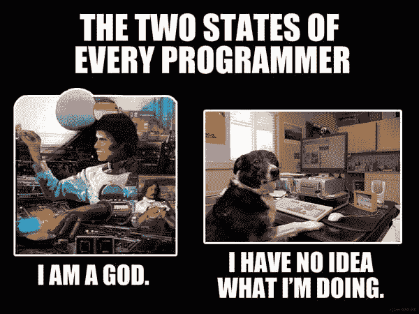

# 每周链接–9 月 16 日

> 原文：<https://dev.to/documentednerd/weekly-links-9-16-1cdo>

大家好，又是一周了。随着季度末的临近，我真的很忙。这周在一个已经拖延太久的项目上做了很多代码工作。所以真的很享受。

现在我们开始谈生意:

### 发展:

*   Visual Studio 现在包括了一个集成的终端:看到这个终端在 Visual Studio 中实现是我最喜欢的 vs 代码特性之一，感觉很酷。
*   [了解关于 Xamarin 的最新文档](https://devblogs.microsoft.com/xamarin/docs-whats-new-august-2019/):我对 Xamarin 的兴趣并不是秘密。看到这些信息的汇总真是太酷了。

### 云:

*   Azure Media Services 新的人工智能创新:动画角色识别非常棒。能够识别人是一回事，但是识别动画角色是非常棒的。现在，对于真正的细节，多语言语音和上下文的改进是相当惊人的。
*   Azure Government 继续扩大 FedRAMP 高覆盖率:这让政府客户或独立软件开发商兴奋不已。FedRAMP 服务的数量增加了。包括认知服务。
*   用 Azure 和 HashiCorp 构建云原生应用:另一个我明确表示非常喜欢的工具是 Terraform。一个关于 HashiCorp 为 Azure 提供的一些服务的好博客，以支持您的云原生应用程序。

### 音频/视频:

*   为 Azure 函数创建定制绑定:真正能够将你的函数直接连接到你的应用钩子是非常强大的。
*   [Azure Kubernetes 服务(AKS)中的多节点池](https://channel9.msdn.com/Shows/Azure-Friday/Multiple-node-pools-in-Azure-Kubernetes-Service-AKS):关于使用多节点池的酷酷视频，它确实有助于管理使用不同大小机器的集群。如果没有此选项，您必须管理单独的集群。很高兴看到。
*   [与 Jeff Fritz 一起从 Web Forms 迁移到 Blazor](https://www.dotnetrocks.com/default.aspx?ShowNum=1652):我不再用 Blazor 这样的工具做很多工作，但我一直在阅读和深入研究它，这是一个很好的总结。

### 好玩的玩意儿:

正如我上次所说的，我是一个游戏玩家，正如这幅漫画所指出的，我是一个有据可查的书呆子。最近我发现自己又回到了桌面游戏，特别是龙与地下城，并且玩得很好(我们每月玩一次，现在我们已经玩了 8 次)。所以随着我对此的深入，不断有新的东西公布，新的就是出土的 Arcana，基本上是游戏的“Beta”内容，供玩家使用。

最新的是两个新的子类:异常心灵术士和深层术士的潜伏者。