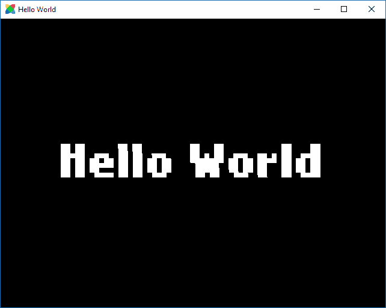

# 考虑从网页开发转向游戏开发？试试 HaxeFlixel。

> 原文：<https://dev.to/richardbray/thinking-of-moving-from-web-dev-to-game-dev-try-haxeflixel-1b07>

在过去的几个月里，我一直在用 HaxeFlixel 开发一款游戏，它非常棒。这是我用过的第一个真正的游戏引擎，虽然它有一个小社区，但如果答案不在堆栈溢出上，总会有人在线提供帮助。

如果您是一名 web 开发人员(最好是使用 Javascript 的开发人员)，并且想要开发自己的游戏，并且可以在桌面和控制台上运行，那么 Haxeflixel 绝对是一个不错的起点。如果你读过我之前的帖子，什么是 [Haxe，我为什么要关心它](https://dev.to/richardbray/what-is-haxe-and-should-i-care-about-it-4f5n)，你就会知道 Haxe 和 Javascript 有多相似，很好的类型脚本，所以从网页到游戏开发是一个非常平稳的过渡。

## 什么是 HaxeFlixel？

[](https://res.cloudinary.com/practicaldev/image/fetch/s--SrRHW_bK--/c_limit%2Cf_auto%2Cfl_progressive%2Cq_auto%2Cw_880/https://haxeflixel.cimg/haxeflixel.svg)

HaxeFlixel 是一种奇怪的游戏引擎。它最初是用 Actionscript 3 (AS3)编写的一个流行的 Flash 引擎，名为 [Flixel](http://www.flixel.org/) 。但是随着 Flash 受欢迎程度的下降，Flixel 也是如此。由于 Haxe 在语法方面非常接近 AS3，并且可以导出到流行的 flash 语言中，所以将 Flixel 迁移到 Haxe 是有意义的，但是它并不仅仅是一个简单的 Haxe。HaxeFlixel 建立在一个叫做 [OpenFL](https://www.openfl.org/) 的东西之上，这使得它可以将游戏或应用程序原生导出到控制台、桌面和移动设备(以及网络浏览器)。

### 什么是 OpenFL？

[](https://res.cloudinary.com/practicaldev/image/fetch/s--XW_6HzmF--/c_limit%2Cf_auto%2Cfl_progressive%2Cq_auto%2Cw_880/https://www.openfl.oimg/logo.png)

OpenFL 是一个用于创建游戏和应用程序的开源框架。它是完全镜像 Flash API 的，这意味着它支持使用它导出到的平台的图形硬件轻松渲染和动画矢量图像、位图和文本。OpenFL 有更多的特性，你可以在这里阅读。与 Typescript/Javascript 版本相反，对于 OpenFL 的 Haxe 版本，它附带了一个叫做 Lime 的东西。

### 什么是石灰？

[](https://res.cloudinary.com/practicaldev/image/fetch/s--maylkDfC--/c_limit%2Cf_auto%2Cfl_progressive%2Cq_auto%2Cw_880/https://lime.software/img/logonav.png)

Lime 被描述为“一个灵活的、轻量级的、面向跨平台开发者的层”。它基本上负责将软件导出到目标平台。例如，如果我想将一个游戏导出到 Mac，它会处理输入、音频、窗口、网络访问等..它对 Windows、Linux、HTML5、Android iOS 和控制台也是如此。跟跑步一样简单:

`lime build windows`

在您的终端(或命令提示符)中，一旦您安装了 HaxeFlixel。

## 为什么要用 HaxeFlixel？

对于初学者来说，它安装起来非常简单快捷。如果你已经安装了 [VS 代码](https://code.visualstudio.com/)，从头开始运行只需要不到几分钟的时间(因为你的机器上没有 Haxe)。因为它是基于 Flash 的 API，所以不难理解，他们有很棒的[在线文档](https://haxeflixel.com/documentation/)，还有他们的源代码。

一段这样的代码:

```
package;

import flixel.FlxState;
import flixel.text.FlxText;

class HelloWorld extends FlxState {
    override public function create() {
        super.create();
        var text = new FlxText(0, 0, 0, "Hello World", 64);
        text.screenCenter();
        add(text);
    }

    override public function update(Elapsed:Float) {
        super.update(Elapsed);
    }
} 
```

<svg width="20px" height="20px" viewBox="0 0 24 24" class="highlight-action crayons-icon highlight-action--fullscreen-on"><title>Enter fullscreen mode</title></svg> <svg width="20px" height="20px" viewBox="0 0 24 24" class="highlight-action crayons-icon highlight-action--fullscreen-off"><title>Exit fullscreen mode</title></svg>

将在任何你想要的平台上以 60fps 的速度在一个窗口中显示“Hello World”。

```
lime test html5
lime test flash
lime test mac
lime test windows
lime test linux
lime test ios
lime test android 
```

<svg width="20px" height="20px" viewBox="0 0 24 24" class="highlight-action crayons-icon highlight-action--fullscreen-on"><title>Enter fullscreen mode</title></svg> <svg width="20px" height="20px" viewBox="0 0 24 24" class="highlight-action crayons-icon highlight-action--fullscreen-off"><title>Exit fullscreen mode</title></svg>

[](https://res.cloudinary.com/practicaldev/image/fetch/s--Jj-TbmOS--/c_limit%2Cf_auto%2Cfl_progressive%2Cq_auto%2Cw_880/https://haxeflixel.com/documentatiimg/00_getting_started/hello-world.png)

正如我在以前的帖子中提到的，语法与 Typescript/Javascript 非常相似，所以如果你是前端 web 开发人员，这是一个非常熟悉的领域。它也是免费的，不需要你学习一个新的图形用户界面，这对我来说是一个优势。

我计划写一个系列教程，向你展示如何运行一个简单的 HaxeFlixel 游戏，但是现在，享受开发游戏的乐趣吧。如果你有任何问题，请不要犹豫问我，或者 Haxe Discord 服务器中的任何人。