# #CamundaCon 2019

> 原文:[https://dev.to/salaboy/camundacon-2019-1cko](https://dev.to/salaboy/camundacon-2019-1cko)

上周，我和 600 多名与会者第一次体验了 CamundaCon。 [CamundaCon](http://camundacon.com) 是公司每年举行的大会，它是关于 BPM、合作伙伴、客户和公司创建的开源项目社区的大会。如果您想了解项目路线图、产品路线图以及社区中正在发生的事情，这是一个非常重要的地方。

这里的社区很棒，社区驱动的项目数量惊人，参与程度相当惊人。见到参与这些项目的人并了解他们为什么创建这些项目以及对他们来说可能的扩展点是什么真的很好。

在人群中，我发现很多 BPM 开源专家非常了解 Camunda 和其他相关项目的历史，所以我们分享了我们对这些项目未来发展的愿景。总的来说，我对公司的未来和他们所有开源项目的未来有一种非常积极的感觉。

大会上最大的公告是 [Camunda Cloud (SaaS)](https://camunda.com/products/cloud/) 的公开测试版，它基本上允许你运行一个 Zeebe 集群+ Camunda Operate 在 Kubernetes(GKE)之上，它为你提供了一种连接到集群的方式。这样，你就不需要担心管理 Zeebe 集群本身，Camunda Cloud 会帮你做到。您只需要编写您的业务流程和工作人员(服务任务实现)。我完全推荐你尝试一下，测试版是免费的，但你需要在这里注册:【https://camunda.com/products/cloud/

也很高兴看到 Camunda BPM 社区如何了解 Zeebe，提供反馈并询问关于其内部的真正深刻的问题。

以下是我每天的一些笔记和重点。

### 第 1 天

我的第一天过得非常愉快，会议分为三个部分，涵盖以下角度:

*   以开发者为中心
*   以业务为中心
*   行业聚焦

三个开场主题演讲很好地解释了为什么该公司正在走向云，并投资于用户协作、监控和业务流程的可视化。

*   [T2】](https://res.cloudinary.com/practicaldev/image/fetch/s--QL6Y310h--/c_limit%2Cf_auto%2Cfl_progressive%2Cq_auto%2Cw_880/https://salaboy.files.wordpress.com/2019/09/img_3319.png%3Fw%3D1024)

*   [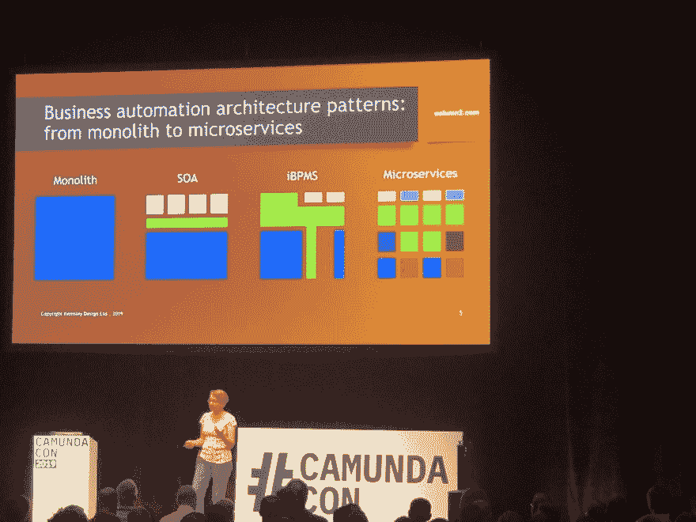T2】](https://res.cloudinary.com/practicaldev/image/fetch/s--nhyfEMGT--/c_limit%2Cf_auto%2Cfl_progressive%2Cq_auto%2Cw_880/https://salaboy.files.wordpress.com/2019/09/img_3328.png%3Fw%3D1024)

*   [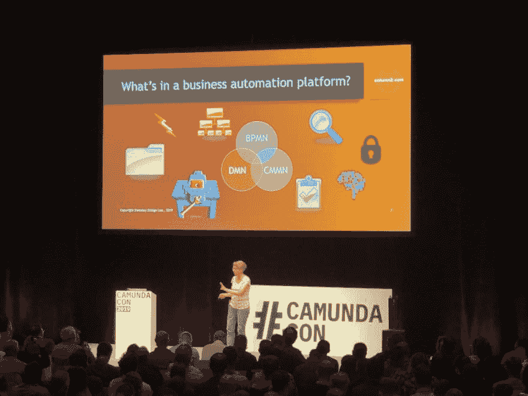T2】](https://res.cloudinary.com/practicaldev/image/fetch/s--7KoCwtX0--/c_limit%2Cf_auto%2Cfl_progressive%2Cq_auto%2Cw_880/https://salaboy.files.wordpress.com/2019/09/img_3332.png%3Fw%3D1024)

*   [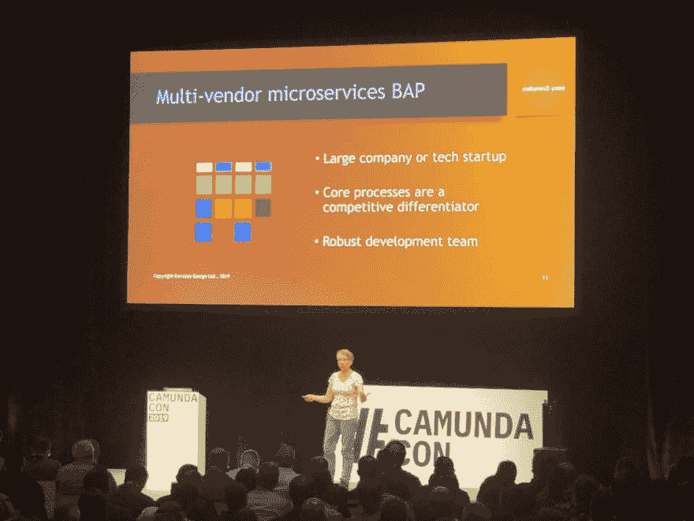T2】](https://res.cloudinary.com/practicaldev/image/fetch/s--QMFRx3cK--/c_limit%2Cf_auto%2Cfl_progressive%2Cq_auto%2Cw_880/https://salaboy.files.wordpress.com/2019/09/img_1028.png%3Fw%3D1024)

*   [T2】](https://res.cloudinary.com/practicaldev/image/fetch/s--y4bFXyWK--/c_limit%2Cf_auto%2Cfl_progressive%2Cq_auto%2Cw_880/https://salaboy.files.wordpress.com/2019/09/img_2572.png%3Fw%3D768)

*   [T2】](https://res.cloudinary.com/practicaldev/image/fetch/s--HqlOllx1--/c_limit%2Cf_auto%2Cfl_progressive%2Cq_auto%2Cw_880/https://salaboy.files.wordpress.com/2019/09/img_4826.png%3Fw%3D1024)

*   [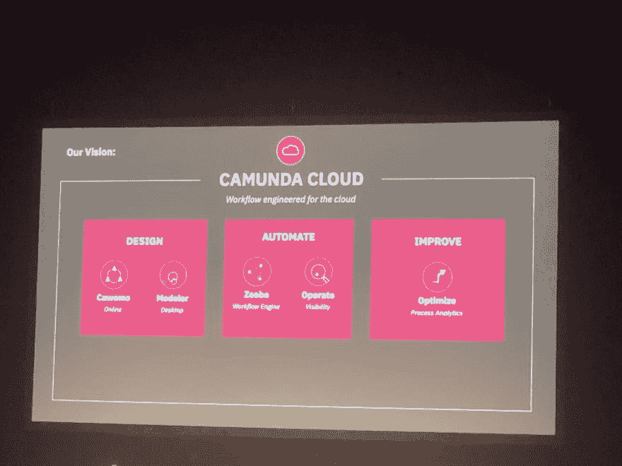T2】](https://res.cloudinary.com/practicaldev/image/fetch/s---dKvA6nN--/c_limit%2Cf_auto%2Cfl_progressive%2Cq_auto%2Cw_880/https://salaboy.files.wordpress.com/2019/09/img_4050.png%3Fw%3D1024)

*   [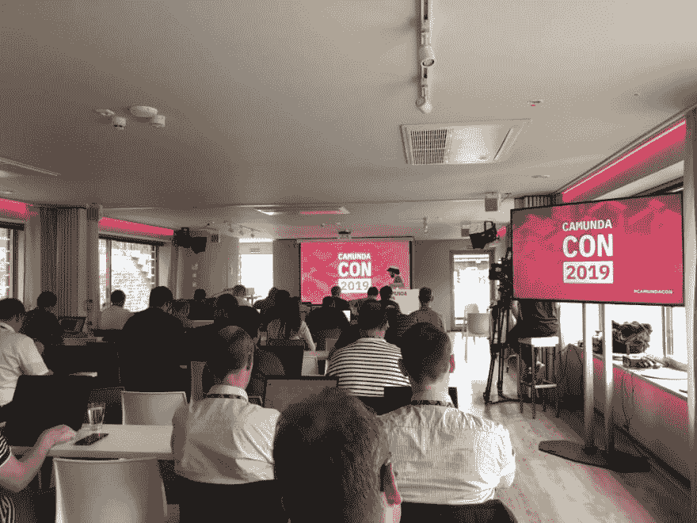T2】](https://res.cloudinary.com/practicaldev/image/fetch/s--Vv5_zYyq--/c_limit%2Cf_auto%2Cfl_progressive%2Cq_auto%2Cw_880/https://salaboy.files.wordpress.com/2019/09/img_4531.png%3Fw%3D1024)

注意事项:

*   雅各布首席执行官主题演讲

    *   广泛的使用案例
    *   关键客户
    *   大型组织
    *   创业公司
    *   国营部分
    *   对可能性的整体理解
    *   如何成为数字化企业
    *   以客户为中心
    *   让所有利益相关者参与流程自动化设计
    *   实时提供“更广泛、更深入”的可见性
    *   允许高吞吐量和大规模的业务自动化
    *   最大限度地减少操作障碍
    *   三个主要使用案例
    *   以人为基础的工作流程–每月 1000 个实例
    *   业务自动化 E2E，快乐之路在很大程度上是自动化的。系统到系统协调每年 1 亿次交易。
    *   超高频技术用例每天 8000 万次交易
    *   数字自动化平台作为所有这些用例的联合解决方案
*   桑迪·肯斯利

    *   业务自动化平台
    *   企业需要敏捷性(以创新)——长期而言
    *   业务需要可扩展性(为了生存)–短期
    *   一个完整的平台应该具备
        *   处理
        *   规则/决定
        *   案例管理
        *   事件
        *   安全性
        *   搜索
        *   内容
        *   组织映射
        *   AI/ML
        *   创建应用程序的组件
*   丹尼尔首席技术官主题演讲

    *   涵盖了 Jakob 详细讨论的要点，并提供了示例和演示
    *   宣布卡蒙达云 SaaS 测试访问
        *   基于 Zeebe，由 GKE 主持
    *   [Cawemo](https://cawemo.com/) 面向商业用户的协同模型编辑器 SaaS
    *   针对可视化和分析进行优化
    *   [Zeebe](http://zeebe.io) 用于高通量和大规模

在主题演讲之后，我们与 Spring Boot 召开了一个关于 Camunda BPM 的研讨会，进行得非常顺利。好的一面是，你可以在这里按照自己的步调学习这个课程:[https://github.com/camundacon2019/uber-jar](https://github.com/camundacon2019/uber-jar)

后来。来自 [Babylon Health UK](https://www.babylonhealth.com) 的 Doogal 分享了他使用 Camunda 进行 ClinOps(临床手术)并在不到 6 个月的时间内将其从 PoC 投入生产的经验。该演示非常棒，因为它强调了使用 BPMS 解决现实生活中的问题(人工编排)的优势，还展示了他的团队在如此短的时间内完成这项工作所面临的所有挑战。

## 第二天

*   Susanne Kaiser–微服务之旅
    *   这是一个很好的概述，介绍了转向微服务是多么困难，以及我们需要如何做好准备来集成/委派/使用，而不是为非我们核心竞争力的组件构建内部解决方案。很高兴看到演示中解释的大多数挑战都在开源社区(如 Kubernetes 社区)中得到积极的解决和改进。
*   Bernd 主题演讲

    *   混沌和巨石之间的平衡
    *   在编排和编排之间，流程监控可以有所帮助，但不是最终的解决方案
    *   云第一，云在这里停留
*   [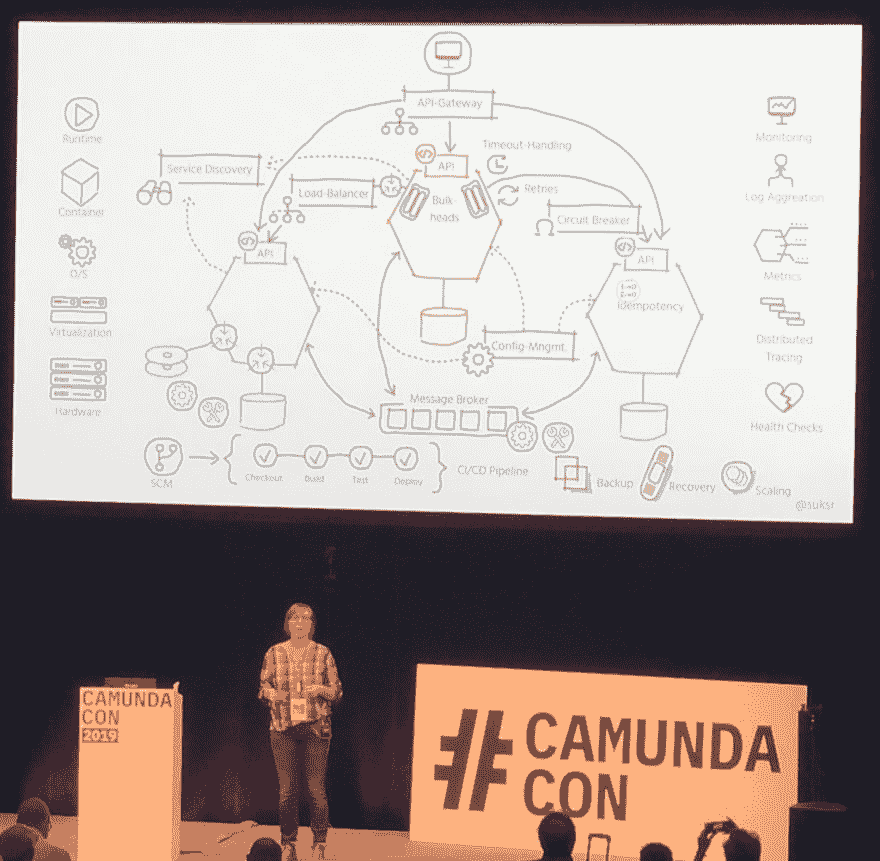T2】](https://res.cloudinary.com/practicaldev/image/fetch/s--dJaVIliJ--/c_limit%2Cf_auto%2Cfl_progressive%2Cq_auto%2Cw_880/https://salaboy.files.wordpress.com/2019/09/camundacon-uservices-journey.png%3Fw%3D1024)

*   [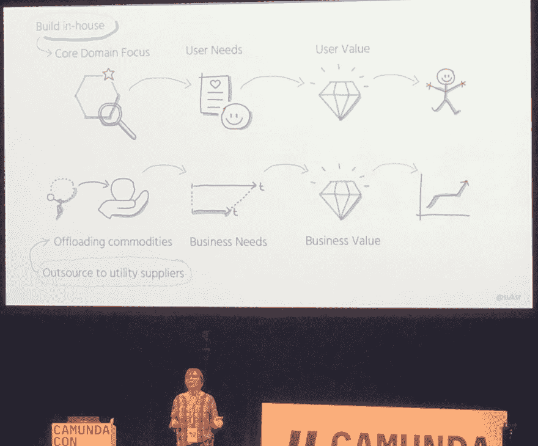T2】](https://res.cloudinary.com/practicaldev/image/fetch/s--UrA63by8--/c_limit%2Cf_auto%2Cfl_progressive%2Cq_auto%2Cw_880/https://salaboy.files.wordpress.com/2019/09/camundacon-delivervalue.png%3Fw%3D1024)

*   [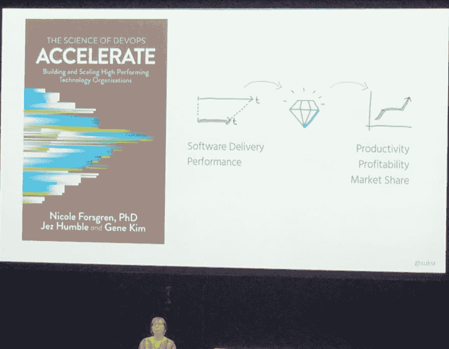T2】](https://res.cloudinary.com/practicaldev/image/fetch/s--4gMajVHd--/c_limit%2Cf_auto%2Cfl_progressive%2Cq_auto%2Cw_880/https://salaboy.files.wordpress.com/2019/09/camundacon-accelerate.png%3Fw%3D1024)

*   [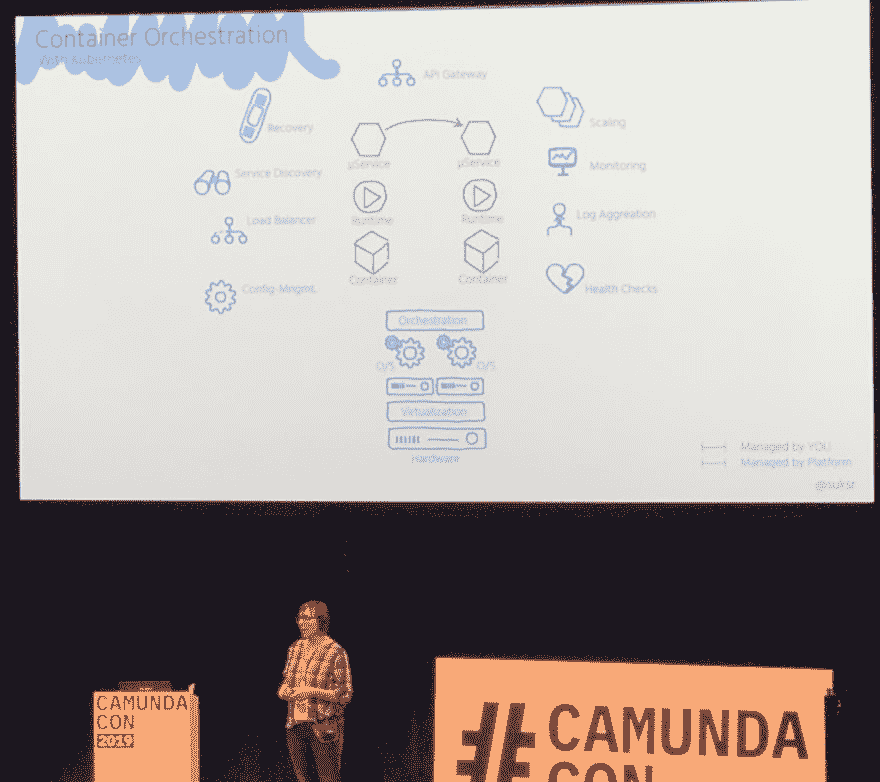T2】](https://res.cloudinary.com/practicaldev/image/fetch/s--JoTTthCb--/c_limit%2Cf_auto%2Cfl_progressive%2Cq_auto%2Cw_880/https://salaboy.files.wordpress.com/2019/09/camundacon-uservices1.png%3Fw%3D1024)

*   [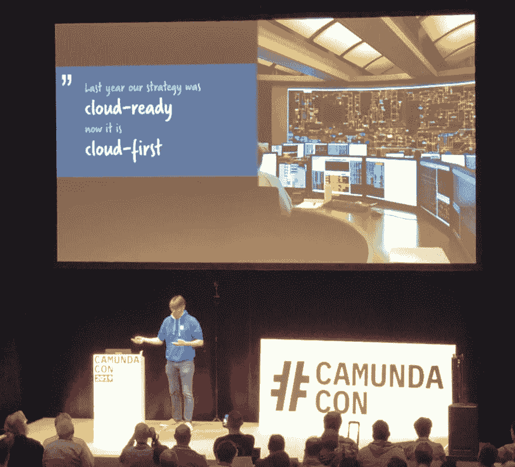T2】](https://res.cloudinary.com/practicaldev/image/fetch/s--n-Nsqn9q--/c_limit%2Cf_auto%2Cfl_progressive%2Cq_auto%2Cw_880/https://salaboy.files.wordpress.com/2019/09/camundacon-cloud-first.png%3Fw%3D1024)

*   [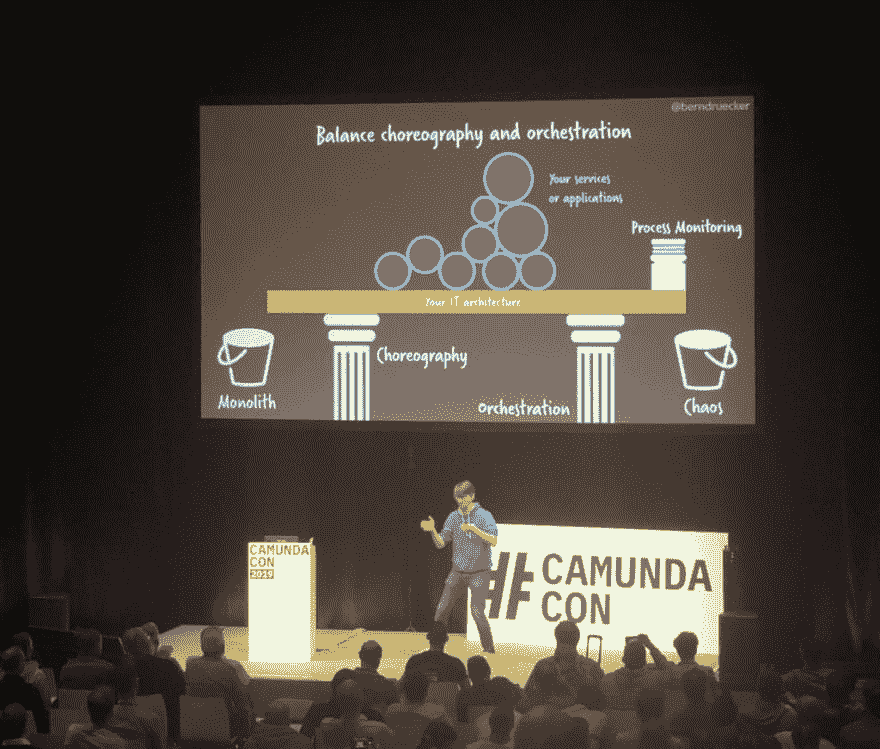T2】](https://res.cloudinary.com/practicaldev/image/fetch/s--uA90J1km--/c_limit%2Cf_auto%2Cfl_progressive%2Cq_auto%2Cw_880/https://salaboy.files.wordpress.com/2019/09/camundacon-bernd.png%3Fw%3D1024)

*   [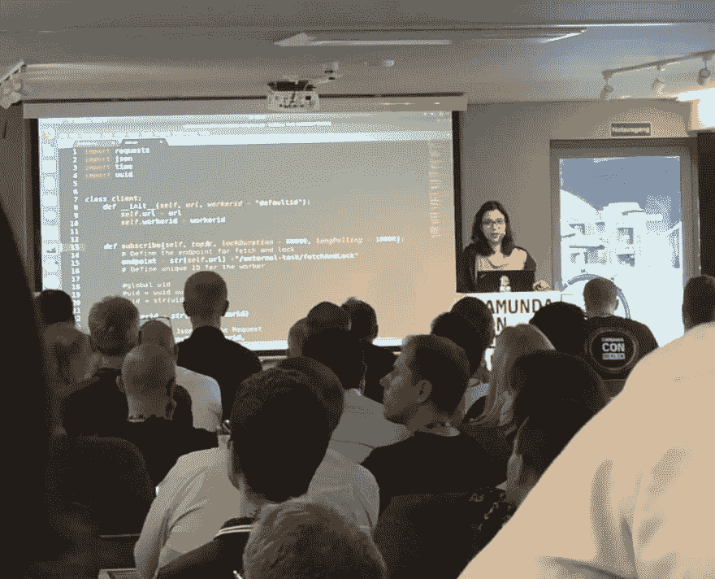T2】](https://res.cloudinary.com/practicaldev/image/fetch/s--3JDavSIZ--/c_limit%2Cf_auto%2Cfl_progressive%2Cq_auto%2Cw_880/https://salaboy.files.wordpress.com/2019/09/camundacon-external-tasks-py.png%3Fw%3D1024)

*   [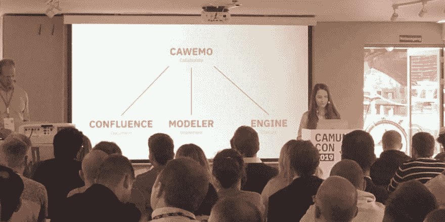T2】](https://res.cloudinary.com/practicaldev/image/fetch/s--EbR1OSp8--/c_limit%2Cf_auto%2Cfl_progressive%2Cq_auto%2Cw_880/https://salaboy.files.wordpress.com/2019/09/camundacon-cawemo.png%3Fw%3D1024)

*   [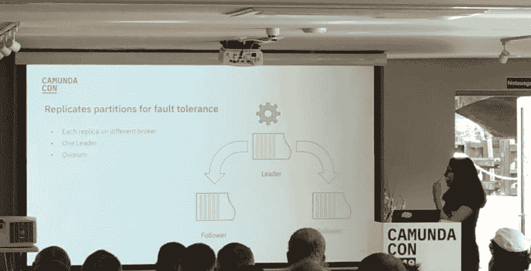T2】](https://res.cloudinary.com/practicaldev/image/fetch/s--ZwvxHKDR--/c_limit%2Cf_auto%2Cfl_progressive%2Cq_auto%2Cw_880/https://salaboy.files.wordpress.com/2019/09/camundacon-zeebe.png%3Fw%3D1024)

*   技术会议

    *   Python 中的外部任务..Nele Uhlemann 举了一个非常实际的例子
    *   用于开发人员和业务分析师之间的协作
    *   如果你还没有尝试过，那么促进合作总是好的尝试一下这里:[https://cawemo.com](https://cawemo.com/)
    *   扩展 BPMN.io 和建模体验工作坊由[https://github.com/nikku](https://github.com/nikku)
    *   维护模型的生态系统和定制非常重要
    *   查看车间，并在这里的指导下按照自己的节奏进行:[https://github.com/nikku/camunda-modeler-plugins-talk-2019](https://github.com/nikku/camunda-modeler-plugins-talk-2019)
    *   扩展分布式工作流引擎(Zeebe internals，作者[https://github.com/deepthidevaki](https://github.com/deepthidevaki)
    *   基于事件流工作的容错和可扩展引擎
    *   它创建分区，每个分区有一个处理器，并被复制到不同的代理中，这允许通过添加更多的代理来实现可伸缩性
    *   容错是通过复制数据并拥有一个主/从网络来实现的，该网络使用共识来选举领导者