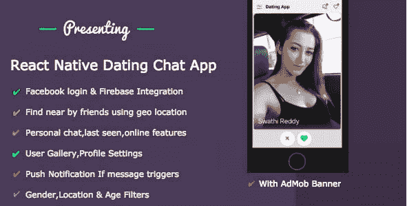
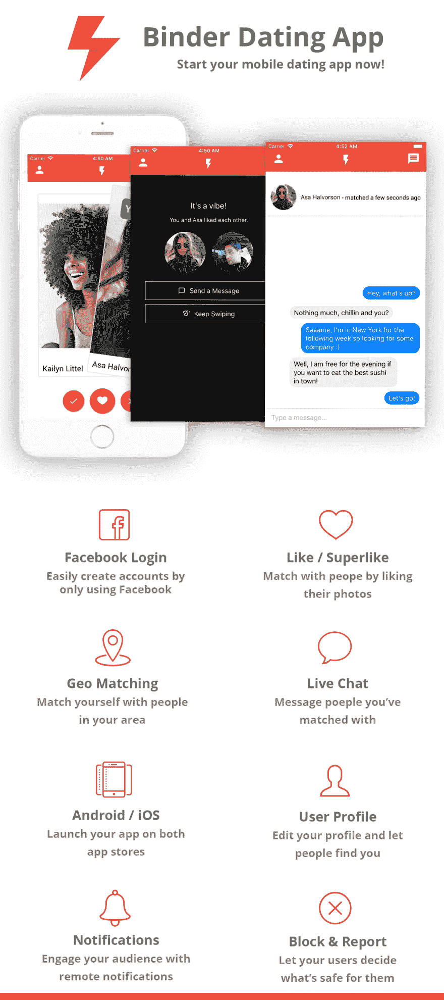
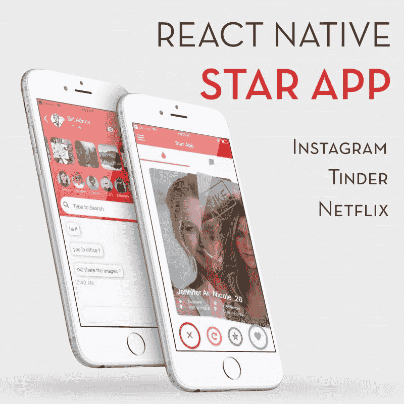

# react-本地约会应用程序模板| 5 个最佳高级 Tinder 克隆

> 原文:[https://dev . to/Kris/react-native-dating-app-templates-5-best-premium-tinder-clones-5fk 5](https://dev.to/kris/react-native-dating-app-templates-5-best-premium-tinder-clones-5fk5)

约会应用程序让我们能够做我们以前从未想过的事情。这些应用程序现在经常被开发以适应特定的社会或文化。根据最近的报道，像 <u>[Badoo](https://play.google.com/store/apps/details?id=com.badoo.mobile&hl=en)</u> 和 <u>[Tinder](https://play.google.com/store/apps/details?id=com.tinder&hl=en)</u> 这样的约会应用是全球最受欢迎的约会应用，Badoo 在 21 个国家排名第一，Tinder 在 18 个国家排名第一。Tinder 是第一款具有滑动机制的约会应用。Tinder 利用你的地理位置来寻找你附近的其他单身人士。因此，显示您的个人资料，其中包括一张照片，一个名字，年龄和距离。所以，你能够连接。这些应用程序正在成为人们联系和见面的一种正常方式。这就是为什么这篇文章通过提供强大的 React-Native 约会应用模板，让开发者更容易开发约会应用。

通过使用最强大、动态、高度模块化和可定制的 React 原生约会模板，实现您自己的 Tinder 克隆。这些模板为您提供了强大的功能，这些功能是任何约会应用程序的必备要求，并节省了快速交付产品的时间。

现在，事不宜迟，让我们来看看五个最好的 premium React 原生约会应用入门模板，你可以从中选择开发自己的 Tinder 克隆。

## React 原生约会手机 App——IOS&Android 带后端

[T2】](https://res.cloudinary.com/practicaldev/image/fetch/s--saGgxRP_--/c_limit%2Cf_auto%2Cfl_progressive%2Cq_auto%2Cw_880/https://kriss.io/wp-content/uploads/2019/09/img_5d838d9d4cc3f.png)

这个适用于 iOS 和 Android 的 <u>[React 原生约会移动应用](http://1.envato.market/zmJ3m)</u> 模板是最好的 React-原生约会应用模板之一，使用 React 原生包构建。它的特色是一个用于约会&的 React 原生应用，带有成熟的后端集成。它提供了类似 Tinder 的设计和滑动功能。

该模板的特点是脸书，谷歌登录和 firebase 数据库集成。该模板使用基于地理位置的 React 原生包来查找您最近的朋友。还有一个特点是一对一的个人信使。该模板为用户画廊、上传图像和个人资料设置提供了各种动态、微妙、干净的约会主题屏幕。此外，还有专门针对 messenger 中的消息的推送通知功能。基于性别、年龄、位置等的动态搜索功能。因此，如果你想使用 React Native 构建自己的约会应用程序，这款优化的、可定制的、强大的约会应用程序模板可供你使用。因此，它目前在市场上的价格是普通许可证 83.99 美元，扩展许可证 90 美元。

## React-自带后台的原生交友 App 模板【开发者版】2.0.0

[T2】](https://res.cloudinary.com/practicaldev/image/fetch/s--7gmGxnHk--/c_limit%2Cf_auto%2Cfl_progressive%2Cq_auto%2Cw_880/https://kriss.io/wp-content/uploads/2019/09/img_5d838dfcd2c5d.png)

这个使用 React Native 构建的 <u>[约会应用程序模板](https://market.nativebase.io/view/react-native-dating-app-with-backend?affiliate_code=38981822-KRI-614242)</u> 是一个理想的初学者工具包或应用程序脚本，可以用所有需要的 UI 元素构建您的 iOS 和 Android 约会应用程序。该模板带有 React Native、NativeBase、React Navigation、GraphCool 以及 admin dashboard。这是一种纯天然产品。

这个约会应用程序模板还具有类似 Tinder 的滑动功能，具有完全可定制的即用型屏幕。它促进了易于配置的应用程序设计和约会应用程序的正确用户体验。这款应用值得注意的功能包括脸书/Instagram 登录、账户设置和图片上传。此外，还有实时聊天功能，发现新朋友，个人资料屏幕，人对人匹配屏幕等。此外，它还具有一个用于分析的管理仪表板，其中包含所有注册用户的详细信息。因此，这个模板通过 React Native 提供了完美的原生外观和感觉，以及令人惊叹的流畅用户体验。因此，有一个后端数据库的集成，但只有用户界面部分可在 100 美元的价格。

## React 原生交友 app 模板

> #### [手机 React 自带后台的原生交友 App 下载| Instamobile](https://www.instamobile.io/app-templates/react-native-dating-app/)
> 
> 立即为 iOS 和 Android 制作一款热门的移动约会应用程序下载这款跨平台全功能 React 原生约会应用程序，只需几分钟即可制作一款类似 Tinder 的应用程序。我们华丽的 React 原生模板与 Firebase 后端集成，因此该应用程序正在端到端地工作，等待您发布它。

你可以从 [React 原生约会应用](https://www.instamobile.io/app-templates/react-native-dating-app/?ref=4094&campaign=dev.to)下载这个跨平台、功能齐全的约会应用模板，开发一个类似 Tinder 的应用。这个华丽的 React 原生模板带有 Firebase 后端。因此，应用程序是端到端工作的。设计结构和用户体验的灵感来自 Tinder 应用程序，该应用程序具有各种各样的功能，对于开发一个成功的约会应用程序至关重要。

这个约会模板提供了尖端的功能，供用户注册和登录，左右滑动来喜欢，不喜欢或超级喜欢其他人。此外，还可以在匹配的个人之间进行实时私人聊天。因此，这款功能强大、设备齐全的应用程序模板具有高度可定制的即用型屏幕、易于配置的应用程序设计，并针对用户增长进行了优化。因此，一些非常重要的功能包括动态匹配算法、Tinder-like swipe for like、位置过滤器、与 firebase 的实时聊天、令人惊叹的约会档案、照片上传、推送通知、脸书登录、用户管理、与 Firebase Auth、Firestore 和存储的完全后端集成等。话虽如此，这款动态高效的约会应用模板目前在市场上有两个包:

*   个人使用 149 美元
*   299 美元用于开发。

## 活页夹–React-原生交友应用模板

[T2】](https://res.cloudinary.com/practicaldev/image/fetch/s--JgGErg7s--/c_limit%2Cf_auto%2Cfl_progressive%2Cq_auto%2Cw_880/https://i.imgur.com/lDunmlG.png)

[T2】](https://res.cloudinary.com/practicaldev/image/fetch/s--bxC1F03M--/c_limit%2Cf_auto%2Cfl_progressive%2Cq_auto%2Cw_880/https://kriss.io/wp-content/uploads/2019/09/img_5d838f5528c12.png)

另一个约会应用模板使用 React Native 构建，灵感来自 Tinder 约会应用。 <u>[Binder](https://alkanyx.com/item/118/Binder---React-Native-Dating-App-Template)</u> app 模板内置在 React Native 中，使用基于 Laravel 的 web API，用 MySQL 数据库存储用户的数据和动作。此外，该模板还利用了 Google 的 Firebase live 数据库来支持 live messenger。

此外，该模板具有基于性别、年龄和位置范围的脸书登录和搜索过滤器。匹配的用户可以通过 app 模板本身内置的实时按摩器自动连接。此外，还有一个用户超级喜欢另一个用户的功能，这使得一个用户可以自动与该用户聊天。该应用程序模板还带有简单易用的管理面板。因此，它允许您可视化应用程序的不同方面，如用户、操作和报告。另一个伟大的特点是，这个模板已经准备好利用 Admob 集成和模板中包含的一个空间横幅来赚钱。这个使用 React Native 构建的简单优化的约会应用模板在市场上售价 120 美元。

## [React 原生 Tinder 网飞 insta gram——明星 app](https://store.enappd.com/product/react-native-tinder-netflix-whatsapp/?aff=7)

[T2】](https://res.cloudinary.com/practicaldev/image/fetch/s--rgJ0mxlZ--/c_limit%2Cf_auto%2Cfl_progressive%2Cq_auto%2Cw_880/https://store.enappd.com/wp-content/uploads/2019/05/square_2-800x800.jpg)

[T2】](https://res.cloudinary.com/practicaldev/image/fetch/s--ApS69mJW--/c_limit%2Cf_auto%2Cfl_progressive%2Cq_66%2Cw_880/https://kriss.io/wp-content/plugins/image-elevator/assets/admin/img/circle-preloader.gif)

最后但同样重要的是使用 React Native 构建的混合应用程序模板。混合是指这个应用程序模板结合了三个流行的应用程序，包括 Tinder、网飞和 Instagram。于是，这个 app 模板被称为 <u>[明星 app](https://store.enappd.com/product/react-native-tinder-netflix-whatsapp/?aff=7)</u> 。约会应用的设计和功能受到 Tinder 的启发，用户资料屏幕受到 Instagram 的启发，在线观看电影的功能受到网飞的启发。因此，这个应用程序模板是一个成熟的多功能强大的应用程序，你可以要求。有了这个模板，你将能够按照你的意愿构建具有多种功能的惊人的 React 原生应用程序。

而且在 Tinder 交友 app 端，这个模板的特色是 Tinder 卡片、聊天列表、实时聊天。在网飞电影应用程序方面，它具有系列屏幕，视频屏幕和季节列表。它在 Instagram 社交应用程序端，具有主屏幕、个人资料屏幕和关注功能。模板中提供的每个模块和组件互为补充。因此，三个应用程序的组合功能可以产生你自己的约会应用程序、视频流应用程序和照片共享应用程序。因此，这个模板在市场上仅售 69 美元。

## 结论

我们都知道，人们更多地生活在虚拟生活中，而不是互动的社会生活中。在虚拟环境的世界中，约会应用程序可以创建一个空间，人们可以根据他们的匹配虚拟连接，并实际见面。因此，许多流行的约会应用程序，如 Tinder，Happn 等。成了镇上的话题。因此，帮助许多用户连接。因此，上面提供的 react-native 约会应用程序模板列表可以让您创建类似的约会应用程序。他们完全具备的要求，可以满足一切你想在你的约会申请。有趣的是，模板是使用 React Native 开发的。因此，你可以使用相同的代码来为 android 和 iOS 构建应用程序。

### 交底

这篇文章包括附属链接；如果您从本文提供的不同链接购买
产品或服务，我可能会收到报酬。