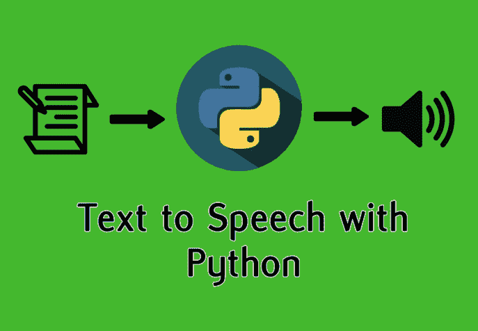
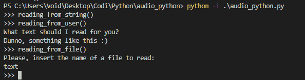

# 用 Python 和 gTTS 创建文本到语音转换

> 原文:[https://dev . to/davidmm 1707/creating-text-to-speech-with-python-and-gtts-22jk](https://dev.to/davidmm1707/creating-text-to-speech-with-python-and-gtts-22jk)

原始帖子[使用 Python 和 gTTS 创建文本到语音转换](https://letslearnabout.net/python/creating-text-to-speech-with-python-and-gtts/)

# [](#lets-learn-about-creating-texttospeech-with-python-and-gtts)让我们了解一下如何使用 Python 和 gTTS 创建文本到语音转换

[T2】](https://res.cloudinary.com/practicaldev/image/fetch/s--kDunxljK--/c_limit%2Cf_auto%2Cfl_progressive%2Cq_auto%2Cw_880/https://i2.wp.com/letslearnabout.net/wp-content/uploads/2019/09/text-to-speech.png%3Ffit%3D688%252C476%26ssl%3D1)

从孩提时代起，创建文本到语音的文件就一直是我们许多人的梦想。现在，有了 Python，这些梦想只需几行代码就能实现。让我们看看如何！

在本课中，您将学习如何:

*   从一串文本创建一个 mp3
*   向用户索要文本并创建一个 mp3
*   向用户索要一个文本文件，提取文本并创建一个 mp3
*   如何用 Python 播放 mp3？

[https://www.youtube.com/embed/tIFEe0W0BEA](https://www.youtube.com/embed/tIFEe0W0BEA)

* * *

### [](#preparation)准备

这一课最好是看，而不是读，因为你可以听我创建的文件:

但是如果你不能(或者不想)看视频，你也可以做，没有问题。

第一，营造环境。我用过 [pipenv](https://docs.pipenv.org/en/latest/) ，但是你也可以使用你选择的虚拟环境。

然后，我们只需要用'*pip install gTTS【T1]'安装 gTTS。*

一旦创建了虚拟环境并安装了 gTTS，就万事俱备了。我们将只使用这个和 Python 核心库。

啊，别忘了用*创建一个文本文件。txt* 分机

* * *

### [](#the-code)代码

老实说，代码非常简单，因为 gTTS 库完成了所有繁重的工作，所以我将给出代码块和简短的解释。

首先，创建一个文件，导入两个 Python 库，并设置我们的选项:

```
import os

from gtts import gTTS

# Options
text_to_read = "This is just a test using GTTS, a Python package library"
language = 'en'
slow_audio_speed = False
filename = 'my_file.mp3' 
```

#### [](#reading-from-a-string)从字符串中读取

现在，我们创建我们的第一个函数，它将从 *text_to_read* 中读取文本，使用*语言*语音和正常速度，因为 _ slow _ audio _ speed _ 为 false。

```
"""
 Reading from a string
"""

def reading_from_string():
    audio_created = gTTS(text=text_to_read, lang=language,
                         slow=slow_audio_speed)
    audio_created.save(filename)

    os.system(f'start {filename}') 
```

我们用我们在开始时创建的选项创建一个 gTTS 对象，我们将它保存到 *filename _(就是它，my_file.mp3)。现在我们完成了，但是我们想播放我们刚刚创建的文件。因此，我们使用 _os* 库来播放当前文件夹中名为 *filename* 的文件。

#### [](#reading-from-the-users-input)读取用户的输入

```
"""
 Reading from user input
"""

def reading_from_user():
    user_input = input("What text should I read for you?n")

    audio_created = gTTS(text=user_input, lang=language, slow=slow_audio_speed)
    audio_created.save(filename)

    os.system(f'start {filename}') 
```

和以前差不多。只有一点不同:现在我们要求用户引入一些文本，将其转换成音频文件。

#### [](#reading-from-a-file)从文件中读取

```
def reading_from_file():
    file_to_read = input("Please, insert the name of a file to read:n") + '.txt'
    f = open(file_to_read, 'r')
    file_text = f.read()
    f.close()

    audio_created = gTTS(text=file_text, lang=language, slow=slow_audio_speed)
    audio_created.save(filename)

    os.system(f'start {filename}') 
```

这是最复杂的函数，但仍然很容易理解。我们要求用户引入一个文件名，我们添加了*。txt* 扩展名，我们打开并阅读文本，并一如既往地创建 mp3。

#### [](#running-the-script)运行脚本

我们只需要在代码末尾声明我们将使用哪个函数:

```
if __name__ == '__main__':
    reading_from_string() 
```

您可以轻松地切换名为。

或者不设置任何函数运行 python 解释器，一直要求函数用“python–I NAME _ file . py”运行

[T2】](https://res.cloudinary.com/practicaldev/image/fetch/s--PZemvsgp--/c_limit%2Cf_auto%2Cfl_progressive%2Cq_auto%2Cw_880/https://i2.wp.com/letslearnabout.net/wp-content/uploads/2019/09/image-15.png%3Fw%3D688%26ssl%3D1)

* * *

### [](#conclusion)结论

这个周末我发现了 gTTS 库，我玩了一圈，玩得很开心，我想和你分享一下。这个库更深入，所以如果你想了解更多，这里有一些文档: [gTTS 文档。](https://gtts.readthedocs.io/en/latest/)

* * *

[我的 Youtube 教程视频](https://www.youtube.com/channel/UC9OLm6YFRzr4yjlw4xNWYvg?sub_confirmation=1)

[Github 上的最终代码](https://github.com/david1707/audio_python)

[在 Twitter 上联系我](https://twitter.com/DavidMM1707)

[阅读更多教程](https://letslearnabout.net/category/tutorial/)