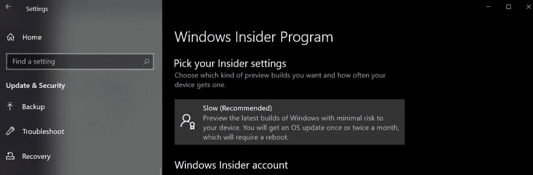
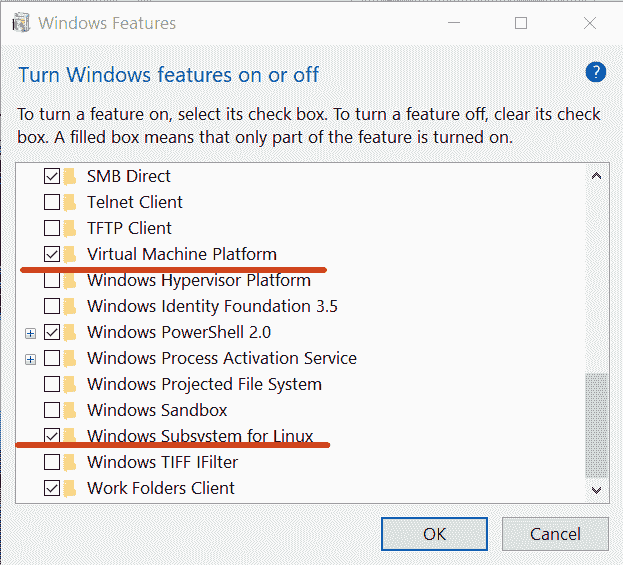
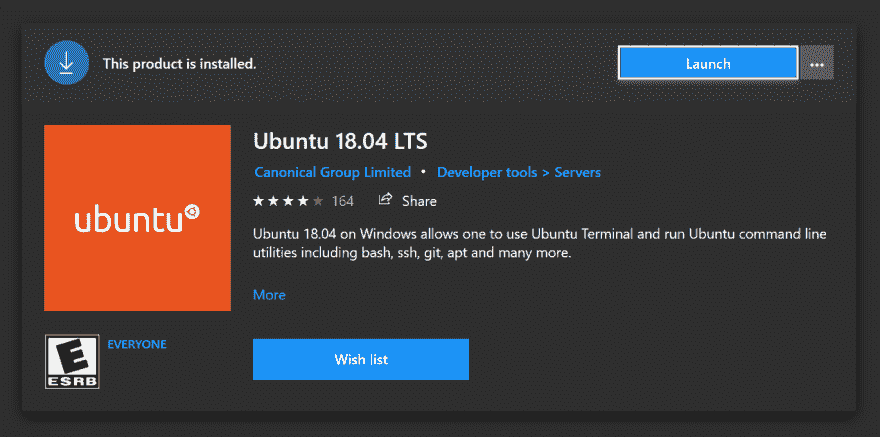
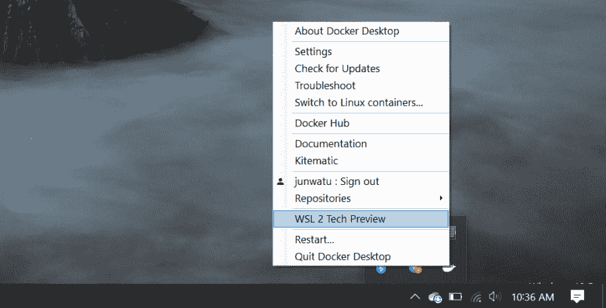
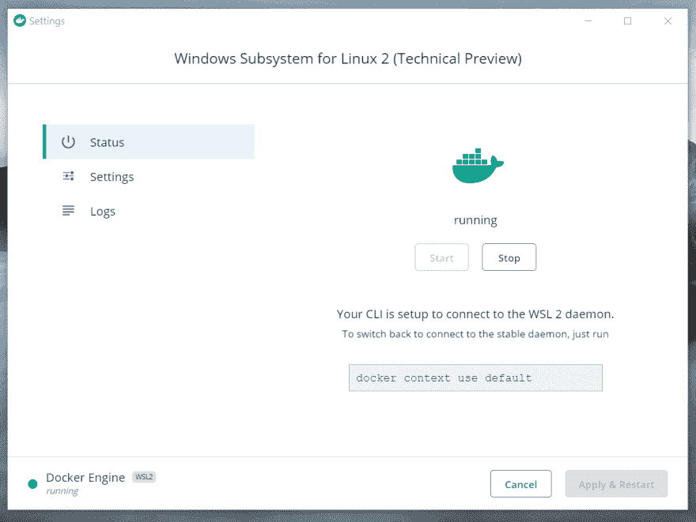
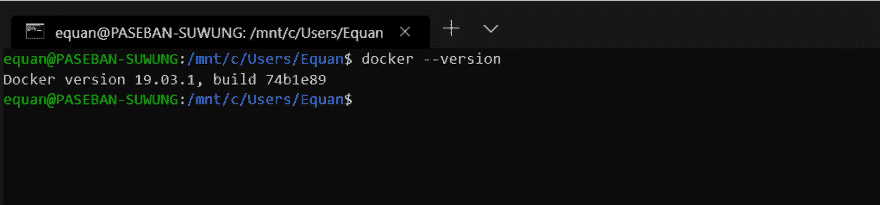
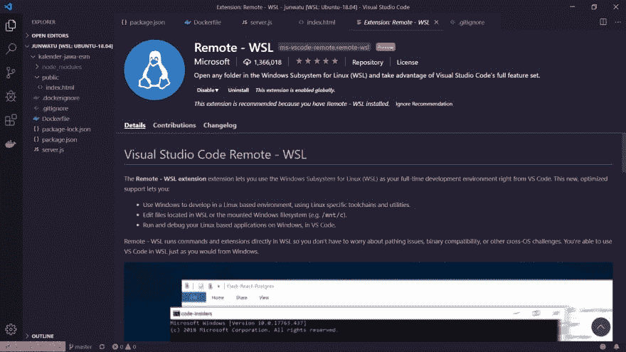
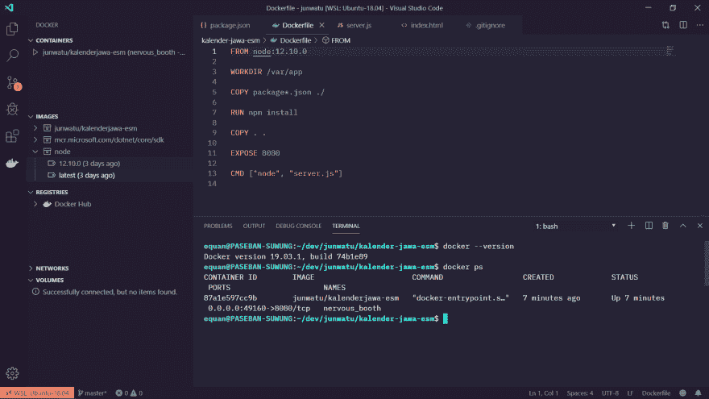

# WSL2 坞站

> 原文:# t0]https://dev . to/equan/docker-di-wsl 2-2nc 2

Kalau anda biasa memakai WSL (Windows Subsystem Linux) untuk pengembangan maka sekarang bisa saya katakan ada fitur upgrade gratis yaitu anda bisa memakai Docker, di WSL 2 tepatnya! 🌟

## WSL 2

Perbedaan terbesar dari WSL 2 dari yang sebelumnya adalah WSL 2 memakai kernel Linux tersendiri (forking-an kernel.org) sehingga pasti ada benefit seperti **peningkatan perfomansi** , **booting time yang lebih cepat** , **penggunaan resource yang lebih sedikit** dan **kemampuan full system call** sehingga memungkinkan software seperti Docker bisa di instal secara langsung 🚀.

## Windows 内幕程序

Pada saat tulisan ini dibuat untuk memakai WSL 2 anda perlu mengikuti [Windows Insider Program](https://insider.windows.com/en-us/for-developers/) .

### *"Sederhananya OS Windows 10 yang anda pakai harus merupakan edisi latest build"*

<figure>

<figcaption>Ada watermark "Windows Pro Evaluation Copy. Build 18980..."</figcaption>

</figure>

小贴士:

1.  Pada awalnya untuk mengupdate OS Windows 10 ke latest build, pastikan anda mengatur update OS ke tipe “fast” yaitu update dengan frekuensi yang sangat cepat (saran saya pake bandwith yang besar karena saat saya update ke latest build ukuran update bisa sebesar 6GB!).
2.  Setelah update ke “fast” ubah settingan update windows insider ke “slow”

<figure>

<figcaption>Settingan Windows Insider Program setelah update “fast”</figcaption>

</figure>

## Fitur Windows

Selanjutnya enable beberapa fitur windows yaitu `Virtual Machine Platform` dan `Windows Subsystem For Linux`

<figure>

<figcaption>Tekan tombol keyboard berlogo Windows dan ketik “windows feature”</figcaption>

</figure>

### *"Perlu di ingat bahwa anda memerlukan versi Windows 10 Pro untuk memakai fitur virtualisasi"*

## 配送 WSL

Anda bisa menginstall distro kesukaan anda di WSL tetapi disini saya pakai Ubuntu 18.04 LTS.

<figure>

<figcaption></figcaption>

</figure>

Secara default distro yang terinstal masih memakai WSL 1 sehingga untuk mengubahnya ke WSL 2, cek dahulu dengan perintah berikut

`wsl -l -v`

kemudian untuk mengubah distro supaya berjalan di WSL 2

`wsl --set-version Ubuntu-18.04 2`

> Jika memakai Ubuntu, pastikan anda menginstal versi "Ubuntu 18.04 LTS" bukan versi yang bernama "Ubuntu" saja, karena adanya bug di versi preview Docker Desktop — [https://github.com/docker/for-win/issues/4361](https://github.com/docker/for-win/issues/4361)

## wsl 2 坞站

Langkah kemudian instal Docker Desktop untuk Windows yang mendukung WSL 2.

> Pada saat tulisan ini dibuat Docker di WSL 2 masih dalam preview.
> [📥 Download](https://download.docker.com/win/edge/36883/Docker%20Desktop%20Installer.exe)

Sebelum instal Docker Desktop ini ada baiknya anda menjalankan Distro terlebih dahulu.

Setelah terinstal maka akan muncul menu “WSL 2 Tech Preview” seperti screenshot berikut

<figure>

<figcaption>Menu WSL 2 Tech Preview</figcaption>

</figure>

Untuk memulai Docker di WSL 2 klik menu tersebut maka kemudian akan muncul daemon WSL2 seperti pada gambar berikut

Jika memakai Docker WSL 2 anda tidak perlu menginstal secara manual docker di distro karena proses ini akan di atur oleh Docker Desktop, sehingga jika anda langsung mengecek versi docker melalui *command line*

## Visual Studio 代码+远程 WSL

Jika anda suka pengembangan web maka saya sarankan menginstal ekstensi Remote WSL untuk editor Visual Studio Code.

> Salah satu benefit melakukan pengembangan di WSL adalah terpusatnya kode pengembangan di satu tempat dibandingkan jika anda menginstal stack di Windows 10 secara langsung yang biasanya menurut pengalaman saya sangat morat-marit (alias berantakan!).

<figure>

<figcaption>VSC + Remote WSL 👏 👏 👏</figcaption>

</figure>

## Visual Studio 代码+ Docker

Pastikan menginstal ekstensi Docker di Visual Studio agar lebih mudah dalam penanganan dan pengawasan image/container.

Secara umum bisa dikatakan kita memakai Visual Studio Code di Windows 10 untuk mengembangkan aplikasi yang berada di lingkungan Linux dan semua itu terjadi pada satu mesin 😲 dan itu mungkin dengan adanya ekstensi seperti Remote WSL plus tambahan dukungan docker native di WSL 2.

### *Yaa Ini Namanya Upgrade!!*

Ok. Semangat koding man teman... 👨🏽‍💻

* * *

## 坞站枢纽

Kalau sempat anda bisa melihat docker hasil setup diatas 😄 di Docker Hub dengan link dibawah ini,

🐋[T2`Docker Kalender Jawa - Modul ES6`🐋](https://hub.docker.com/r/junwatu/kalenderjawa-esm)

装饰🙏

* * *

*   这篇文章也在❄️的媒体上发表

*   封面图片-由[奥马尔·拉纳](https://unsplash.com/@omerrana?utm_source=unsplash&utm_medium=referral&utm_content=creditCopyText)在 [Unsplash](https://unsplash.com/search/photos/indonesia?utm_source=unsplash&utm_medium=referral&utm_content=creditCopyText) 上拍摄