# 使用 React -4 创建抽动克隆

> 原文:[https://dev . to/nabe NDU 82/create-a-twitch-clone-using-react-4-21 F5](https://dev.to/nabendu82/create-a-twitch-clone-using-react-4-21f5)

欢迎来到本系列的第 4 部分。

我们将开始在我们的项目中实现流。

[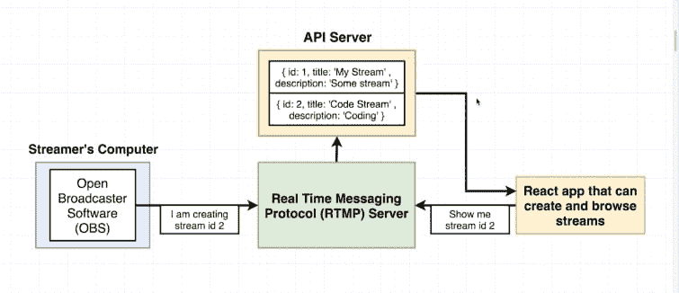 ](https://res.cloudinary.com/practicaldev/image/fetch/s--KdGDss6z--/c_limit%2Cf_auto%2Cfl_progressive%2Cq_auto%2Cw_880/https://cdn-images-1.medium.com/max/2000/1%2AuaJb0ZocZmi9oRnhkosk8Q.png) *我们的结构*

我们现在将设置 API 服务器。现在，打开终端，进入你的 **streams** 文件夹。在这里创建一个新的文件夹 **api** 并放入光盘。

[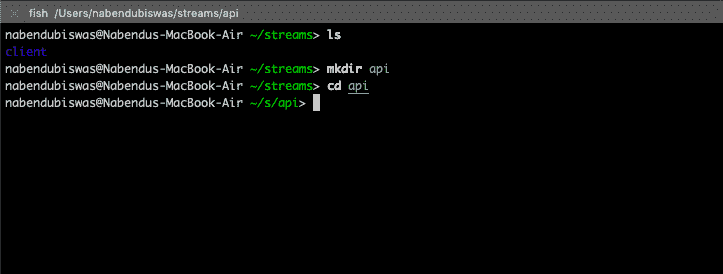 ](https://res.cloudinary.com/practicaldev/image/fetch/s--xxKw0H6a--/c_limit%2Cf_auto%2Cfl_progressive%2Cq_auto%2Cw_880/https://cdn-images-1.medium.com/max/2000/1%2Aizmv-E7V5Da1BwrpfuJvZQ.png) * api 文件夹*

现在在命令行中键入 **npm init** 。它会问你很多事情的细节。对每个选项按 enter 键。

[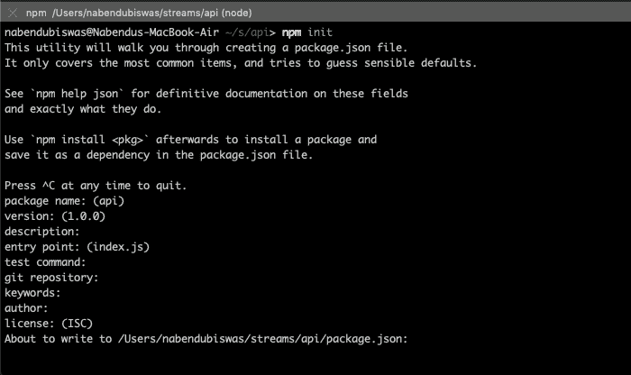 ](https://res.cloudinary.com/practicaldev/image/fetch/s--ROc16HD3--/c_limit%2Cf_auto%2Cfl_progressive%2Cq_auto%2Cw_880/https://cdn-images-1.medium.com/max/2000/1%2AOhkEVV79FF8jiVmRKse68w.png) * npm 初始化*

最后，它将显示 **package.json** 结构，并请求我们的许可。键入**是**在里面。

[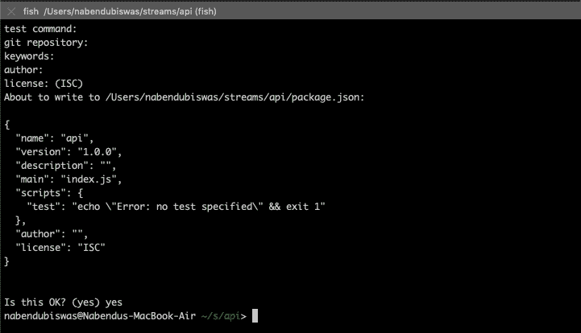 ](https://res.cloudinary.com/practicaldev/image/fetch/s--_QIg-rG4--/c_limit%2Cf_auto%2Cfl_progressive%2Cq_auto%2Cw_880/https://cdn-images-1.medium.com/max/2000/1%2AlxT9pQbpc4MrcZ23Qykkeg.png) *是*

现在，我们在 api 文件夹中有了一个 **package.json** 文件。现在，我们将安装 npm 包 **json-server** 。

[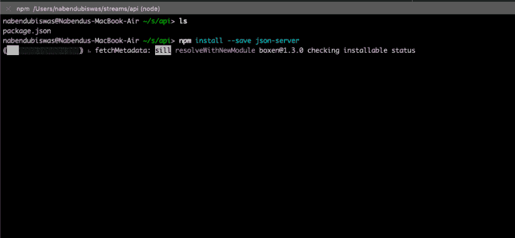](https://res.cloudinary.com/practicaldev/image/fetch/s--FROVpJtP--/c_limit%2Cf_auto%2Cfl_progressive%2Cq_auto%2Cw_880/https://cdn-images-1.medium.com/max/2000/1%2An-782nsBmxr6VFzfuuE8EA.png)T3】JSON-server

现在，打开 VSCode 中的 **api** 目录。在这里添加一个 **db.json** 文件和一个 **gitignore** 文件(如果你使用 github 的话)。

[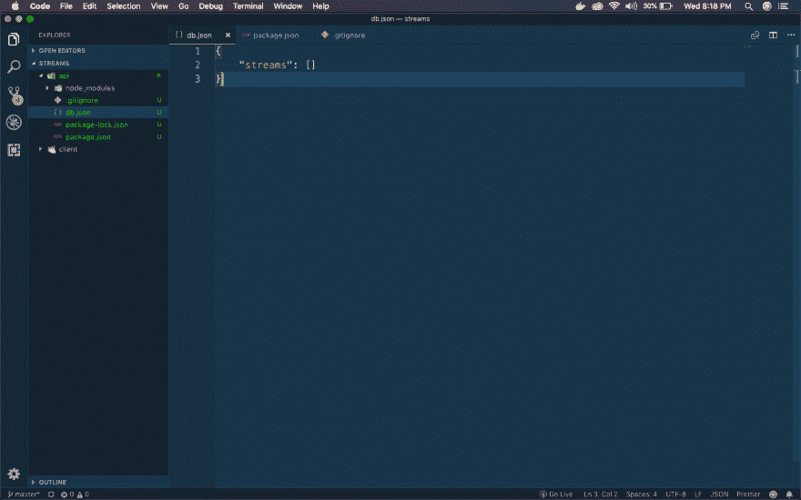 ](https://res.cloudinary.com/practicaldev/image/fetch/s--tZXGSjWN--/c_limit%2Cf_auto%2Cfl_progressive%2Cq_auto%2Cw_880/https://cdn-images-1.medium.com/max/2880/1%2AqyGJXuO_JONFrn7-X-qx3g.png) * api 文件夹*

在 **db.json** 文件中添加以下内容。

```
{
    "streams": []
} 
```

现在，在中添加以下内容。 **gitignore** 文件

```
# See https://help.github.com/articles/ignoring-files/ for more about ignoring files.

# dependencies
/node_modules
/.pnp
.pnp.js

# testing
/coverage

# production
/build

# misc
.DS_Store
.env.local
.env.development.local
.env.test.local
.env.production.local

npm-debug.log*
yarn-debug.log*
yarn-error.log* 
```

现在，打开 **package.json** 文件，更新启动脚本。

```
{
  "name": "api",
  "version": "1.0.0",
  "description": "",
  "main": "index.js",
  "scripts": {
    "start": "json-server -p 3001 -w db.json"
  },
  "author": "",
  "license": "ISC",
  "dependencies": {
    "json-server": "^0.14.2"
  }
} 
```

现在，转到终端中的 **api** 文件夹，执行一个 **npm 启动**。

[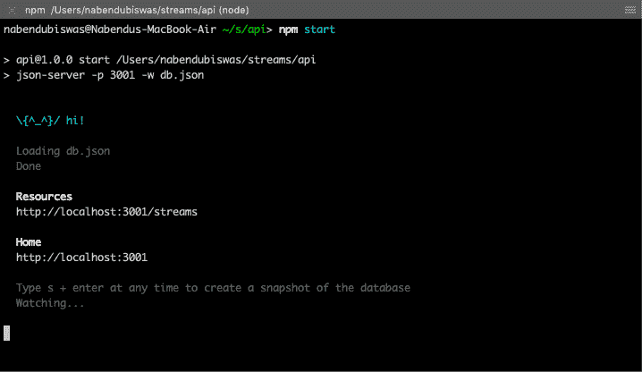](https://res.cloudinary.com/practicaldev/image/fetch/s--o3LfRjFO--/c_limit%2Cf_auto%2Cfl_progressive%2Cq_auto%2Cw_880/https://cdn-images-1.medium.com/max/2000/1%2Aoe8VIYQvKPYiiTtQ7xRHdw.png)T3】NPM 开始

现在，让我们再次转向我们的**客户端**代码。所以，打开客户端正在运行的终端并停止它(Ctrl+c)然后安装 **axios** 和 **redux-thunk。**安装后，不要忘记使用 **npm start** 启动客户端服务器。

[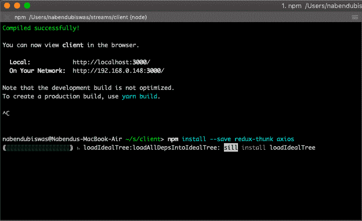 ](https://res.cloudinary.com/practicaldev/image/fetch/s--1PKzu7rI--/c_limit%2Cf_auto%2Cfl_progressive%2Cq_auto%2Cw_880/https://cdn-images-1.medium.com/max/2000/1%2AuzGUL-_G1VgqPkgDw7Vovw.png) * axios 和 thunk*

现在，在 **src** 中创建一个新文件夹**API**。在里面新建一个文件 **streams.js** 。

[](https://res.cloudinary.com/practicaldev/image/fetch/s--kD3HMalc--/c_limit%2Cf_auto%2Cfl_progressive%2Cq_auto%2Cw_880/https://cdn-images-1.medium.com/max/2880/1%2AeupBg585WdtyoevqX6y9vg.png)T3】streams . js

在 **streams.js** 中添加以下代码

```
import axios from 'axios';

export default axios.create({
    baseURL: 'http://localhost:3001'
}); 
```

现在，我们将在 **action** 文件夹内的 **index.js** 中创建我们的 action creator。在这里，我们首先导入我们的 axios 流。然后创建一个 action creator，用 **formValues** 对 **/streams** 端点进行 post 调用。

```
import { SIGN_IN, SIGN_OUT } from './types';
import streams from '../apis/streams';

export const signIn = (userId) => {
    return {
        type: SIGN_IN,
        payload: userId
    };
};

export const signOut = () => {
    return {
        type: SIGN_OUT
    };
};

export const createStream = formValues => async dispatch => {
    streams.post('/streams', formValues);
} 
```

现在，前往我们的 **StreamCreate.js** 来使用这个动作创建器。我们首先进口**连接**，我们的行动**创造流**。然后我们对文件末尾的 reduxForm 做了一点修改，加入了 connect。

最后，我们使用*中的**create stream**on submit form*()，将 **formValues** 发送给 action creator。

```
import React, {Fragment} from 'react';
import { Field, reduxForm } from 'redux-form';
import { connect } from 'react-redux';
import { createStream } from '../../actions';
import './formStyles.css';

class StreamCreate extends React.Component {
…
…

  onSubmitForm = (formValues) => {
    this.props.createStream(formValues);
  }

  render() {
    return (
      <form onSubmit={this.props.handleSubmit(this.onSubmitForm)} className="ui__form">
        <Field name="title" label="Enter Title" component={this.renderInputBox} />
        <Field name="description" label="Enter Description" component={this.renderInputBox} />
        <button>Submit</button>
      </form>
    )
  }
}

…
…

const formWrapped = reduxForm({form: 'streamCreate', validate})(StreamCreate);

export default connect(null, { createStream })(formWrapped); 
```

接下来，我们还必须在项目中包含 redux-thunk。我们通过转到我们的根 **index.js** 来做同样的事情，并添加用粗体标记的内容。

```
import React from 'react';
import ReactDOM from 'react-dom';
import App from './components/App';
import { Provider } from 'react-redux';
import { createStore, applyMiddleware, compose } from 'redux';
import reducers from './reducers';
import reduxThunk from 'redux-thunk';

const composeEnhancers = window.__REDUX_DEVTOOLS_EXTENSION_COMPOSE__ || compose;
const store = createStore(reducers, composeEnhancers(applyMiddleware(reduxThunk)));

ReactDOM.render(
<Provider store={store}><App /></Provider>, document.querySelector('#root')); 
```

现在，该检查我们的 POST 请求了。转到[http://localhost:3000/streams/create](http://localhost:3000/streams/create)，输入数据并点击提交按钮。此外，保持开发人员控制台中的“网络”选项卡打开。您可以看到 POST 请求已成功发出。

[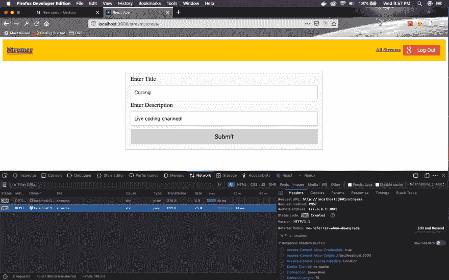 ](https://res.cloudinary.com/practicaldev/image/fetch/s--cRNYZIlm--/c_limit%2Cf_auto%2Cfl_progressive%2Cq_auto%2Cw_880/https://cdn-images-1.medium.com/max/2880/1%2AcOQZbVCrcAIsWHr9DdjB2Q.png) *职务请求*

我们还将打开 **db.json** 来验证 POST 请求是否已经完成。

[](https://res.cloudinary.com/practicaldev/image/fetch/s--uZa6CUUd--/c_limit%2Cf_auto%2Cfl_progressive%2Cq_auto%2Cw_880/https://cdn-images-1.medium.com/max/2880/1%2ADA5bqd4Jfjw6tHaFZAiKkA.png)T3】db . JSON

现在，我们将更新 **action** 文件夹内 **index.js** 中的 action creator。我们还将为其他 RESTful 项目添加动作创建器，如删除、编辑、获取。

首先将这些类型添加到**动作**文件夹中的 **types.js** 中。

```
export const SIGN_IN = 'SIGN_IN';
export const SIGN_OUT = 'SIGN_OUT';
export const CREATE_STREAM = 'CREATE_STREAM';
export const FETCH_STREAM = 'FETCH_STREAM';
export const FETCH_STREAMS = 'FETCH_STREAMS';
export const DELETE_STREAM = 'DELETE_STREAM';
export const EDIT_STREAM = 'EDIT_STREAM'; 
```

接下来，在**动作**文件夹内的 **index.js** 中为上述类型添加函数。

```
import { SIGN_IN, SIGN_OUT, CREATE_STREAM, FETCH_STREAM, FETCH_STREAMS, DELETE_STREAM, EDIT_STREAM } from './types';
import streams from '../apis/streams';

export const signIn = (userId) => {
    return {
        type: SIGN_IN,
        payload: userId
    };
};

export const signOut = () => {
    return {
        type: SIGN_OUT
    };
};

export const createStream = formValues => async dispatch => {
    const response = await streams.post('/streams', formValues);
    dispatch({ type: CREATE_STREAM, payload: response.data })
}

export const fetchStreams = () => async dispatch => {
    const response = await streams.get('/streams');
    dispatch({ type: FETCH_STREAMS, payload: response.data })
}

export const fetchStream = (id) => async dispatch => {
    const response = await streams.get(`/streams/${id}`);
    dispatch({ type: FETCH_STREAM, payload: response.data })
}

export const editStream = (id, formValues) => async dispatch => {
    const response = await streams.put(`/streams/${id}`, formValues);
    dispatch({ type: EDIT_STREAM, payload: response.data })
}

export const deleteStream = (id) => async dispatch => {
    await streams.delete(`/streams/${id}`);
    dispatch({ type: DELETE_STREAM, payload: id })
} 
```

我们现在将致力于我们的减速器，并把它一口气。在 **reducer** 文件夹下新建一个文件 **streamReducer.js** 。

[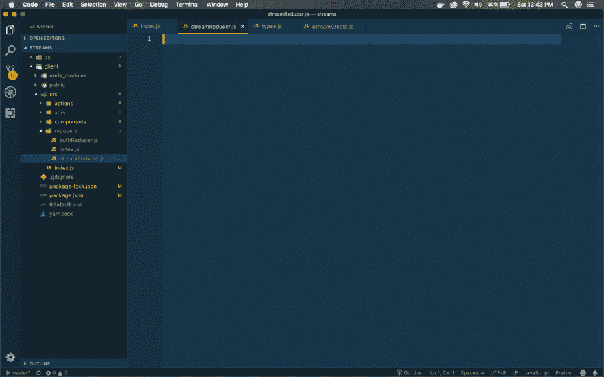](https://res.cloudinary.com/practicaldev/image/fetch/s--JUdRRXTN--/c_limit%2Cf_auto%2Cfl_progressive%2Cq_auto%2Cw_880/https://cdn-images-1.medium.com/max/2880/1%2AgSrVcTtu_dwflq8j5Ae3Kg.png)T3】stream reducer . js 文件

首先让我们在我们的 reducer 文件 **streamReducer.js** 中为 FETCH_STREAM、CREATE_STREAM 和 EDIT_STREAM 创建 case，因为它们是相似的。

```
import { CREATE_STREAM, FETCH_STREAM, FETCH_STREAMS, DELETE_STREAM, EDIT_STREAM } from '../actions/types';

export default (state={}, action) => {
    switch(action.type) {
        case FETCH_STREAM:
            return { ...state, [action.payload.id]: action.payload }
        case CREATE_STREAM:
            return { ...state, [action.payload.id]: action.payload }
        case EDIT_STREAM:
            return { ...state, [action.payload.id]: action.payload }
        default:
            return state;
    }
} 
```

现在，我们将创建 FETCH_STREAMS 和 DELETE_STREAM 案例。为此，我们将首先安装 **lodash** ，它有一个非常有用的省略功能。

[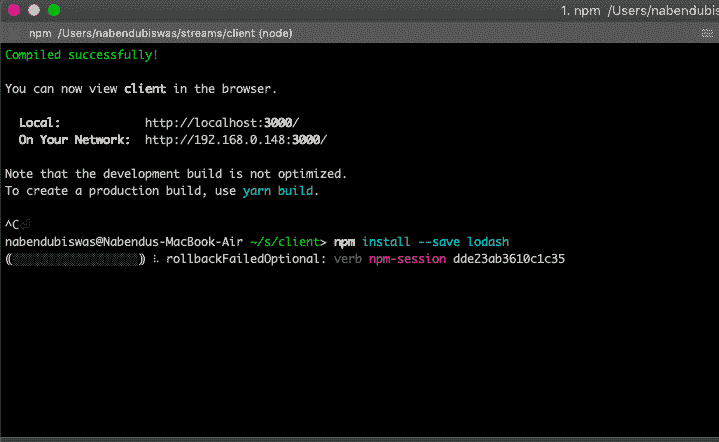 ](https://res.cloudinary.com/practicaldev/image/fetch/s--udS_rhH7--/c_limit%2Cf_auto%2Cfl_progressive%2Cq_auto%2Cw_880/https://cdn-images-1.medium.com/max/2000/1%2AtRl27pCv1XRV1rvLruNzAw.png) * npm 安装*

再次打开**减速器**文件夹内的 **streamReducer.js** 。

```
import { CREATE_STREAM, FETCH_STREAM, FETCH_STREAMS, DELETE_STREAM, EDIT_STREAM } from '../actions/types';
import _ from 'lodash';

export default (state={}, action) => {
    switch(action.type) {
       case FETCH_STREAMS:
            return { ...state, ..._.mapKeys(action.payload, 'id')};**
        case FETCH_STREAM:
            return { ...state, [action.payload.id]: action.payload };
        case CREATE_STREAM:
            return { ...state, [action.payload.id]: action.payload };
        case EDIT_STREAM:
            return { ...state, [action.payload.id]: action.payload };
        case DELETE_STREAM:
            return _.omit(state, action.payload);**
        default:
            return state;
    }
} 
```

接下来，我们将把这个新的渐缩管挂接到我们的根渐缩管上。所以，打开**减速器**文件夹内的 **index.js** 。

```
import { combineReducers } from 'redux';
import authReducer from './authReducer';
import streamReducer from './streamReducer';
import { reducer as formReducer } from 'redux-form';

export default combineReducers({
    auth: authReducer,
    form: formReducer,
    streams: streamReducer
}); 
```

我们现在将开始显示我们创建的流。打开**组件**->-**流**文件夹下的 **StreamList.js** ，挂接我们的动作创建者。

```
import React from 'react';
import { connect } from 'react-redux';
import { fetchStreams } from '../../actions';

class StreamList extends React.Component {
  componentDidMount() {
    this.props.fetchStreams();
  }

  render(){
    return (
    <div>
      StreamList
    </div>
  )
  }
}

export default connect(null, { fetchStreams })(StreamList); 
```

现在，进入 [http://localhost:3000/](http://localhost:3000/) 打开开发者控制台。转到 Redux 选项卡。你可以看到我们之前在这里创造的溪流。

[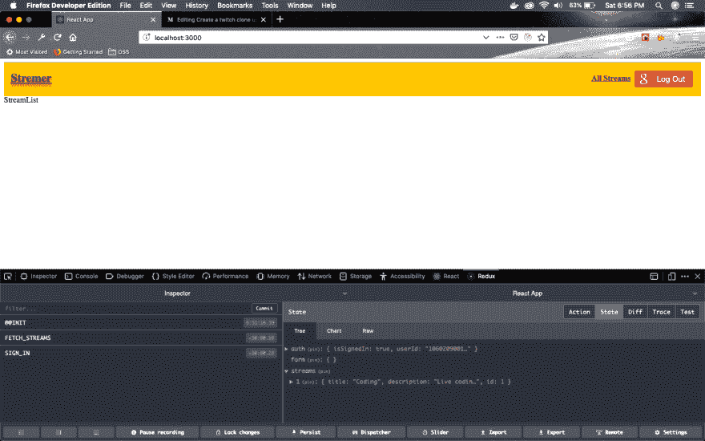 ](https://res.cloudinary.com/practicaldev/image/fetch/s--53t5MyzO--/c_limit%2Cf_auto%2Cfl_progressive%2Cq_auto%2Cw_880/https://cdn-images-1.medium.com/max/2880/1%2ArsYg9jbplz1r0YaqYcrIig.png) *激流勇进*

在继续之前，让我们创建另一个流，打开[http://localhost:3000/streams/create](http://localhost:3000/streams/create)并创建另一个流。

[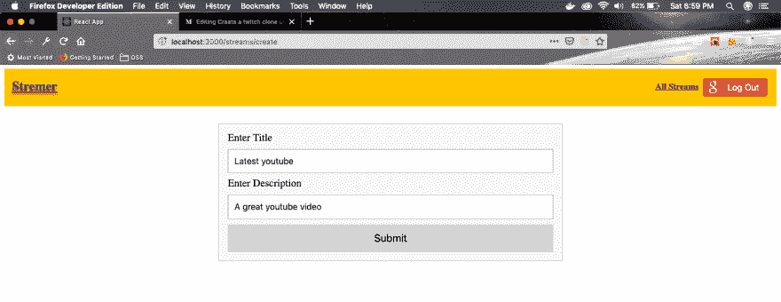 ](https://res.cloudinary.com/practicaldev/image/fetch/s--ZlWyidW7--/c_limit%2Cf_auto%2Cfl_progressive%2Cq_auto%2Cw_880/https://cdn-images-1.medium.com/max/2880/1%2ALLkwZ39GrrBbjc0nLNdsLw.png) *另一条小溪*

接下来，我们将在主页中显示这些流。所以，继续打开**组件** - > **流**文件夹内的 **StreamList.js** ，添加到下面。在这里，我们获取流对象中的数据。然后我们对它进行迭代，并通过 renderList 方法显示它。

```
import React from 'react';
import { connect } from 'react-redux';
import { fetchStreams } from '../../actions';

class StreamList extends React.Component {
  componentDidMount() {
    this.props.fetchStreams();
  }

 renderList() {
    return this.props.streams.map(stream => {
      return (
        <div className="item" key={stream.id}>
          <div className="content">{stream.title}</div>
          <div className="description">{stream.description}</div>
          <hr />
        </div>
      )
    })
  }

  render() {
    return (
      <div>
        <h2 className="header">Streams</h2>
        <div className="list">{this.renderList()}</div>
      </div>
    )
  }
}

const mapStateToProps = (state) => {
  return { streams: Object.values(state.streams) };
}

export default connect(mapStateToProps, { fetchStreams })(StreamList); 
```

现在，如果你看看我们的主页，列表已经显示，但没有风格。

[ ](https://res.cloudinary.com/practicaldev/image/fetch/s--r-xjMAGa--/c_limit%2Cf_auto%2Cfl_progressive%2Cq_auto%2Cw_880/https://cdn-images-1.medium.com/max/2880/1%2AOSaQShfpl2BIdlF4m7M3TA.png) *没什么风格*

接下来，我们将添加一些样式，使它看起来很好。在同一个**组件**->-**流**文件夹中新建一个文件 **StreamList.css** 。不要忘记先将其导入到我们的 **StreamList.js** 文件中。

```
import React from 'react';
import { connect } from 'react-redux';
import { fetchStreams } from '../../actions';
import './StreamList.css';
...
... 
```

现在在 **StreamList.css** 中添加以下代码。

```
.list{
    display: grid;
    grid-gap: 1.2rem;
}

.content{
    font-size:1.2rem;
    font-weight: bold;
    margin-bottom: 5px;
}

.description{
  font-size:1.1rem;
}

.header{
    background: #E6F2F5;
    padding: 10px;
} 
```

现在，我们的应用程序如下图所示。

[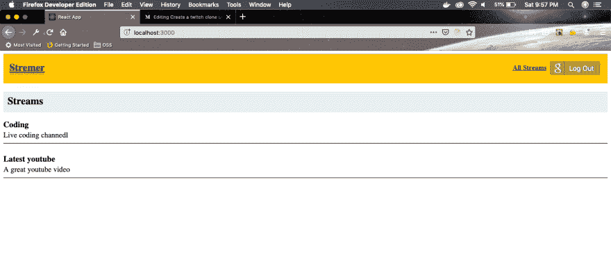 ](https://res.cloudinary.com/practicaldev/image/fetch/s--MTzWkSik--/c_limit%2Cf_auto%2Cfl_progressive%2Cq_auto%2Cw_880/https://cdn-images-1.medium.com/max/2880/1%2AILHK2g9PQFs61JSmUZB2Cw.png) *好看 app*

本系列的第 4 部分到此结束。你可以在这里找到到这个点[的代码。](https://github.com/nabendu82/streams)