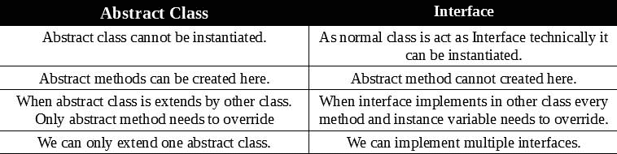

# Dart 中的抽象类和抽象方法

> 原文:[https://dev . to/Jay _ tillu/abstract-classes-and-abstract-methods-in-dart-4d gg](https://dev.to/jay_tillu/abstract-classes-and-abstract-methods-in-dart-4dgg)

*   抽象类是一种不能被直接实例化的类，这意味着不能从中创建对象。

*   抽象类不能被实例化，但是它们可以被子类化。

*   为了定义一个抽象类，我们使用 ***抽象*** 关键字。

#### [](#the-syntax-for-defining-abstract-class)定义抽象类的语法

```
abstract class class_name {
  // Body of abstract class
} 
```

<svg width="20px" height="20px" viewBox="0 0 24 24" class="highlight-action crayons-icon highlight-action--fullscreen-on"><title>Enter fullscreen mode</title></svg> <svg width="20px" height="20px" viewBox="0 0 24 24" class="highlight-action crayons-icon highlight-action--fullscreen-off"><title>Exit fullscreen mode</title></svg>

## [](#abstract-methods)抽象方法

* * *

*   抽象方法只能存在于抽象类中。
*   若要使方法抽象，请使用分号(；)而不是方法体。

```
void talk (); // Abstract method
void walk (); // Abstract method 
```

<svg width="20px" height="20px" viewBox="0 0 24 24" class="highlight-action crayons-icon highlight-action--fullscreen-on"><title>Enter fullscreen mode</title></svg> <svg width="20px" height="20px" viewBox="0 0 24 24" class="highlight-action crayons-icon highlight-action--fullscreen-off"><title>Exit fullscreen mode</title></svg>

*   普通类可以扩展抽象类，但是它们必须覆盖每个抽象方法。
*   您也可以在抽象类中创建普通方法。并不强制覆盖正常方法。
*   抽象类只会在你不重写抽象方法的时候抱怨。

#### [](#sample-code)样本代码

```
abstract class Person{
void walk();  //Abstract Method
  void talk();  //Abstract Method
}
class Jay extends Person{
  @override
  void walk() {
    print("Jay can walk");
  }
@override
  void talk() {
    print("Jay can talk");
  }
}
main(){
  Jay jay = new Jay();
jay.talk();
  jay.walk();
}

Output
Jay can talk
Jay can walk 
```

<svg width="20px" height="20px" viewBox="0 0 24 24" class="highlight-action crayons-icon highlight-action--fullscreen-on"><title>Enter fullscreen mode</title></svg> <svg width="20px" height="20px" viewBox="0 0 24 24" class="highlight-action crayons-icon highlight-action--fullscreen-off"><title>Exit fullscreen mode</title></svg>

## [](#difference-between-abstract-class-and-interface)抽象类和接口的区别

* * *

*   所以现在看了抽象类和接口之后。你可能会问，从技术上讲，它们看起来是一样的。是的，他们确实是近亲。但是他们并不完全一样。先来了解一下两者的基本区别。

[T2】](https://res.cloudinary.com/practicaldev/image/fetch/s--a_dR6-_y--/c_limit%2Cf_auto%2Cfl_progressive%2Cq_auto%2Cw_880/https://miro.medium.com/max/758/1%2A1MKQuaHFnM8n_ZfHu6rEbQ.jpeg)

所以，伙计们，抽象类到此为止。如果我错过了什么，请随时告诉我，我很乐意向你学习。直到那时，继续爱，继续编码。和往常一样，我将在下一篇文章中介绍您。

记住没有老师，没有书，没有视频教程，也没有博客能教会你一切。有人说，学习是一个旅程，旅程永无止境。只是从这里那里收集一些数据，读一读，学一学，练一练，试着去应用。不要因为做不到或者不知道这个概念或者那个概念而犹豫。记住，每个程序员都是从你现在走的这条路上走过的。记住每个大师都曾经是初学者。努力工作，全力以赴。

### [](#for-more-information-please-visit-following-links)欲了解更多信息，请访问以下链接

*   [Fuchsia OS 官方网站](https://fuchsia.dev/)
*   [Dart 官方网站](https://dart.dev/)
*   [颤振官方网站](https://flutter.dev/)

> 想和我联系吗？以下是链接。我很乐意成为你的朋友。😊
> [Twitter](https://twitter.com/jay_tillu)
> [脸书](https://www.facebook.com/jaytillu.1314/)
> [insta gram](https://www.instagram.com/jay.tillu/)
> [Medium](https://medium.com/jay-tillu)
> 或者直接在[jayviveki13@gmail.com](mailto:jayviveki13@gmail.com)给我发邮件