# 使用 React -2 创建抽动克隆

> 原文：<https://dev.to/nabendu82/create-a-twitch-clone-using-react-2-2j4k>

欢迎来到本系列的第 2 部分。在这一部分中，我们将创建登录应用程序的身份验证。

我们将使用 google OAuth 认证。所以，去 https://console.developers.google.com/

一旦你用你的谷歌帐户登录，你会发现一个仪表板已经打开。当您已经有一些使用 Google APIs 的项目时，就会发生这种情况。我已经有一些项目了。所以，我需要点击左上角附近的项目名称(我的是 vue-calendar)。它将打开一个弹出窗口，我将在其中单击**新项目**按钮。

[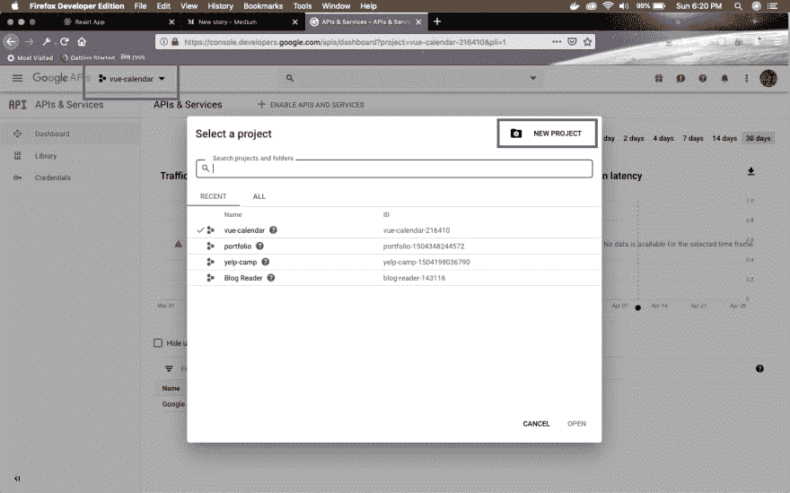 ](https://res.cloudinary.com/practicaldev/image/fetch/s--UdAHVs7O--/c_limit%2Cf_auto%2Cfl_progressive%2Cq_auto%2Cw_880/https://cdn-images-1.medium.com/max/2880/1%2AtOJJzBb8oAm79ideQJlZPQ.png) *已经有项目*

如果您是新用户，您将直接获得**新项目**按钮。在如下截图所示的下一页中，为项目输入一个合适的名称，然后点击**创建**按钮。

[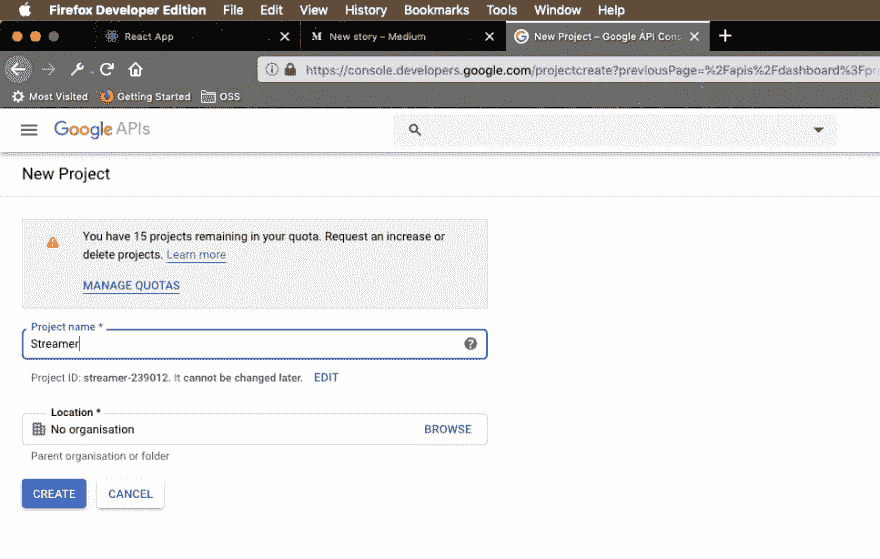 ](https://res.cloudinary.com/practicaldev/image/fetch/s--0a3-PvHs--/c_limit%2Cf_auto%2Cfl_progressive%2Cq_auto%2Cw_880/https://cdn-images-1.medium.com/max/2000/1%2AhdKElb1Jf6Vr5K7e2Jv_Fw.png) *创建流光项目*

创建您的项目需要 30-40 秒。您将被带到第一个屏幕，在右上角附近会出现一个通知。

[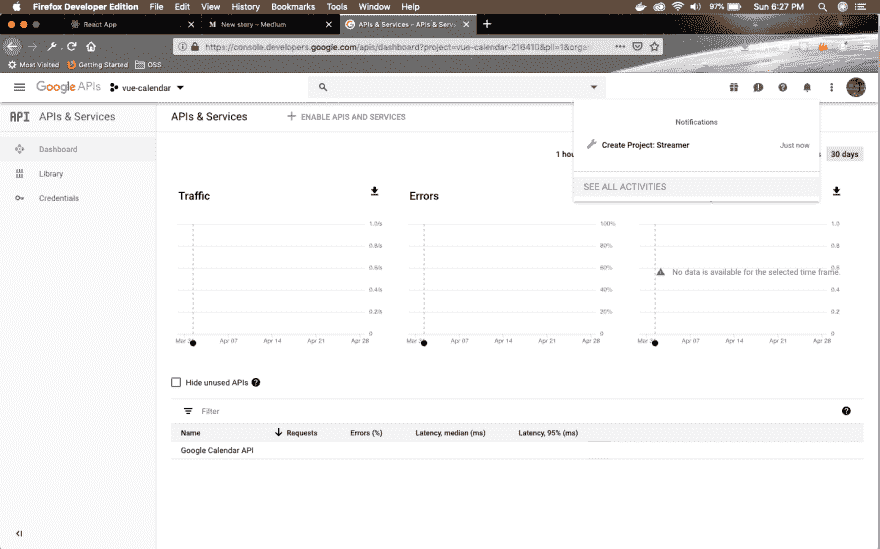 ](https://res.cloudinary.com/practicaldev/image/fetch/s---HwgKYqV--/c_limit%2Cf_auto%2Cfl_progressive%2Cq_auto%2Cw_880/https://cdn-images-1.medium.com/max/2880/1%2A9Q1EsMbmU5ZvvyQ-HNMWdQ.png) *流光成功创建*

再次点击左上角的项目名称(我的是 vue-calendar)。它将打开一个弹出窗口，在其中单击新创建的项目。我的是**流光**。

[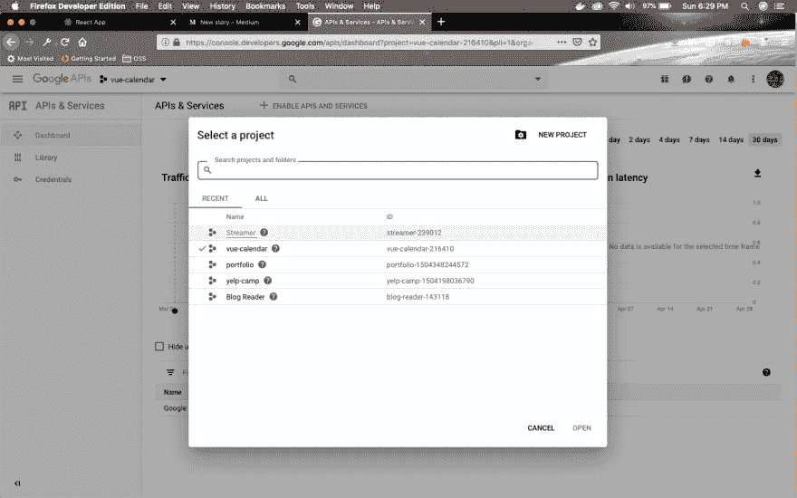](https://res.cloudinary.com/practicaldev/image/fetch/s--9fhQxwAx--/c_limit%2Cf_auto%2Cfl_progressive%2Cq_auto%2Cw_880/https://cdn-images-1.medium.com/max/2880/1%2A8pIrOZ23Jsy1NYh8-seXiw.png)T3】流光

现在，在应用程序屏幕中，点击标签**凭证**和 **OAuth 同意屏幕**

[ ](https://res.cloudinary.com/practicaldev/image/fetch/s--ZqOogRlx--/c_limit%2Cf_auto%2Cfl_progressive%2Cq_auto%2Cw_880/https://cdn-images-1.medium.com/max/2880/1%2ANaGcl-clhH--XzQbDzLIUQ.png) *同意屏幕*

在此给出**应用程序名称**，向下滚动并点击**保存**按钮。

[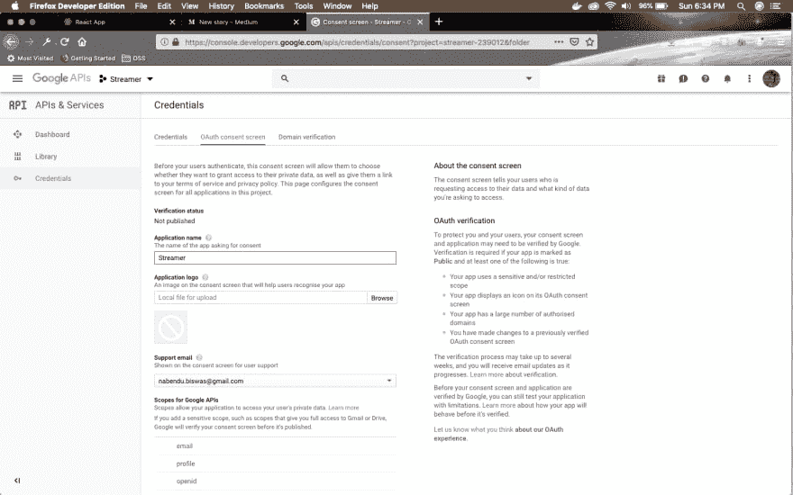 ](https://res.cloudinary.com/practicaldev/image/fetch/s--TaM4eVsN--/c_limit%2Cf_auto%2Cfl_progressive%2Cq_auto%2Cw_880/https://cdn-images-1.medium.com/max/2880/1%2ADkUNtTpG3H2t0yEGWNBeyw.png) *再申请名称*

保存后，您将被带到**凭证**选项卡中的**凭证**页面，如下图所示。点击**创建凭证**选择栏。在其中点击 **OAuth 客户端 ID** 。

[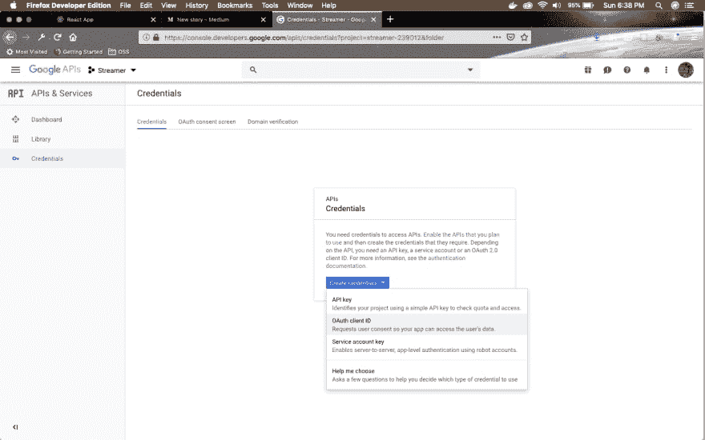 ](https://res.cloudinary.com/practicaldev/image/fetch/s--6cBSlAYB--/c_limit%2Cf_auto%2Cfl_progressive%2Cq_auto%2Cw_880/https://cdn-images-1.medium.com/max/2880/1%2AgYQx4lBod5gDHkQJQRUX1Q.png) *国书*

在下一页中，选择 Web 应用程序单选按钮，然后在**授权的 JavaScript 源**中给出 [http://localhost:3000](http://localhost:3000/) 。然后点击**创建**按钮。

[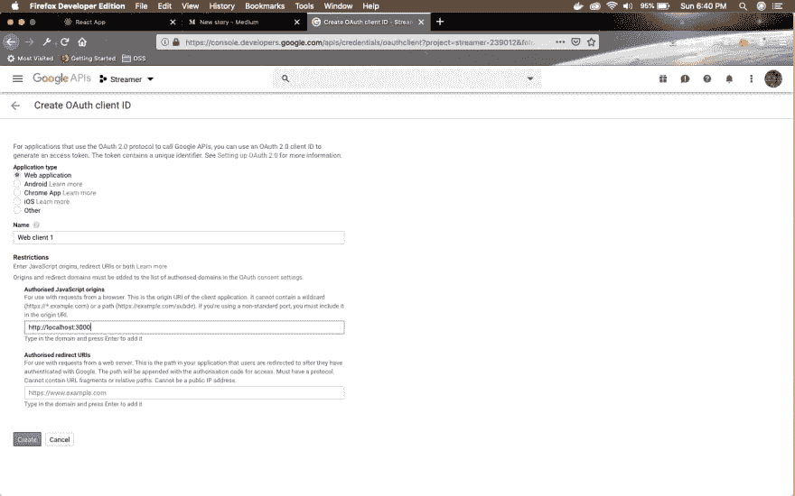 ](https://res.cloudinary.com/practicaldev/image/fetch/s--kjH7sJdt--/c_limit%2Cf_auto%2Cfl_progressive%2Cq_auto%2Cw_880/https://cdn-images-1.medium.com/max/2880/1%2AHhE5YMUHQfOJPy4V-Y0t9w.png) *本地主机*

弹出的 **OAuth 客户端**会显示你的**客户端 ID** 和**客户端密码**。我们将使用**客户端 ID** ，因此将它复制到某个地方。

[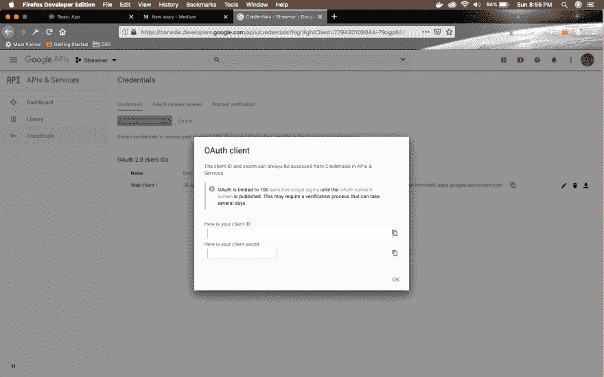 ](https://res.cloudinary.com/practicaldev/image/fetch/s--PziPx3qn--/c_limit%2Cf_auto%2Cfl_progressive%2Cq_auto%2Cw_880/https://cdn-images-1.medium.com/max/2880/1%2AasryAhF7qg1PJllkbNvfcw.png) * OAuth 客户端*

我们现在将在我们的项目中包括谷歌认证。第一步是去我们的**index.html**文件和里面的

tag add the following line.

```
<script src="https://apis.google.com/js/api.js"></script> 
```

[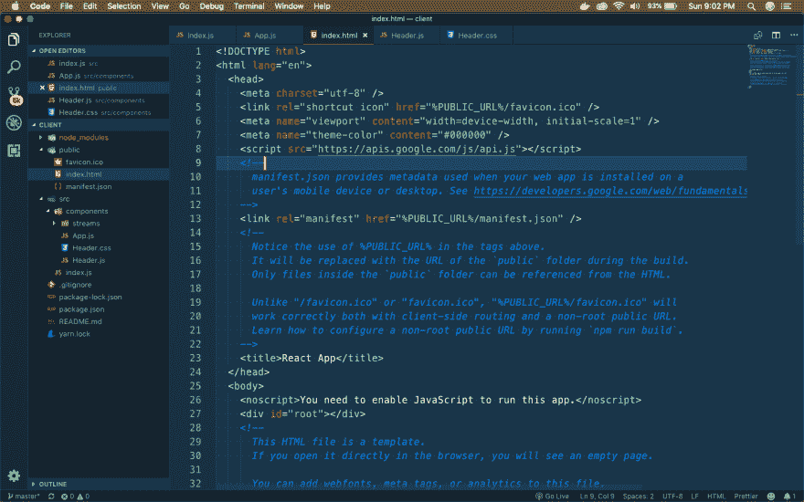](https://res.cloudinary.com/practicaldev/image/fetch/s--TRAl4Azc--/c_limit%2Cf_auto%2Cfl_progressive%2Cq_auto%2Cw_880/https://cdn-images-1.medium.com/max/2880/1%2AzSjUppg36J49RihnZWrS2w.png)*index.html*

接下来在我们的**组件**目录中创建一个 **GoogleAuth.js** 文件。在其中添加下面的代码。其中大部分是标准代码，需要添加谷歌认证到我们的网络应用程序。代替 **YOUR_CLIENT_ID** ，放上你在创建应用程序时得到的客户端 ID。

```
import React, { Component } from 'react'

class GoogleAuth extends Component {
  componentDidMount() {
    window.gapi.load('client:auth2', () => {
        window.gapi.client.init({
            clientId: '**YOUR_CLIENT_ID**',
            scope: 'email'
        });
    });
  }

  render() {
    return (
      <div>
        Google Auth
      </div>
    )
  }
}

export default GoogleAuth; 
```

接下来，我们将它添加到我们的 **Header.js** 文件中。

```
import React from 'react';
import { Link } from 'react-router-dom';
import './Header.css';
import GoogleAuth from './GoogleAuth';

const Header = () => {
    return (
        <div className="headerWrapper">
            <div className="headerTitle">
                <Link to="/">Stremer</Link>
            </div>
            <div className="otherLinks">
                <Link to="/">All Streams</Link>
                <GoogleAuth />
            </div>
        </div>
    )
}

export default Header; 
```

我们还需要在我们的 **Header.css** 文件中有更多的样式来正确显示它。

```
...
...
.otherLinks {
    font-size: 16px;
    font-weight: bold;
    line-height: 1.25;
    color: #333333;
    display: flex;
    align-items:center;
}

.otherLinks > * {
    margin-left:4px;
} 
```

现在，我们将返回到 **GoogleAuth.js** 文件来完成我们的认证逻辑。在此，我们附上。然后()对我们的 API 调用 google。然后我们得到认证实例。

我们有一个本地状态变量 **isSignedIn** ，我们将它设置为 get()。如果用户已登录，则返回 true，否则返回 false。

我们还向 isSignedIn 添加了一个事件侦听器，如果它触发，那么再次改变状态。

```
import React, { Component } from 'react';
import './GoogleAuth.css';

class GoogleAuth extends Component {
  state = { isSignedIn: null };

  componentDidMount() {
    window.gapi.load('client:auth2', () => {
        window.gapi.client.init({
            clientId: 'YOUR_CLIENT_ID',
            scope: 'email'
        }).then(() => {
            this.auth = window.gapi.auth2.getAuthInstance();
            this.setState({ isSignedIn: this.auth.isSignedIn.get()    });
            this.auth.isSignedIn.listen(this.onAuthChange);
        });
    });
  }

  onAuthChange = () => {
    this.setState({ isSignedIn: this.auth.isSignedIn.get() });
  }

  onSignInClick = () => {
      this.auth.signIn();
  }

  onSignOutClick = () => {
    this.auth.signOut();
  }

  renderAuthButton() {
      if(this.state.isSignedIn === null){
          return null;
      } else if(this.state.isSignedIn) {
        return (
            <button
                className="loginBtn loginBtn--google"
                onClick={this.onSignOutClick}>Log Out</button>
        )
      } else {
        return (
            <button
                className="loginBtn loginBtn--google"
                onClick={this.onSignInClick}>Login With Google</button>
        )
      }
  }

  render() {
    return (
      <div>
        {this.renderAuthButton()}
      </div>
    )
  }
}

export default GoogleAuth; 
```

最后，还有一个函数 **renderAuthButton** ()，它检查用户的状态并显示注销或登录按钮。

最后，在 components 目录中添加了一个包含按钮样式的 **GoogleAuth.css** 文件。这些是我从[这本](https://codepen.io/davidelrizzo/pen/vEYvyv)密码本上找到的。

```
.loginBtn {
    box-sizing: border-box;
    position: relative;
    /* width: 13em;  - apply for fixed size */
    margin: 0.2em;
    padding: 0 15px 0 46px;
    border: none;
    text-align: left;
    line-height: 34px;
    white-space: nowrap;
    border-radius: 0.2em;
    font-size: 16px;
    color: #FFF;
  }
  .loginBtn:before {
    content: "";
    box-sizing: border-box;
    position: absolute;
    top: 0;
    left: 0;
    width: 34px;
    height: 100%;
  }
  .loginBtn:focus {
    outline: none;
  }
  .loginBtn:active {
    box-shadow: inset 0 0 0 32px rgba(0,0,0,0.1);
  }

  .loginBtn--google {
    /*font-family: "Roboto", Roboto, arial, sans-serif;*/
    background: #DD4B39;
  }
  .loginBtn--google:before {
    border-right: #BB3F30 1px solid;
    background: url('https://s3-us-west-2.amazonaws.com/s.cdpn.io/14082/icon_google.png') 6px 6px no-repeat;
  }
  .loginBtn--google:hover,
  .loginBtn--google:focus {
    background: #E74B37;
  } 
```

结果是一个漂亮的和完全工作的谷歌按钮**登录。**

[ ](https://res.cloudinary.com/practicaldev/image/fetch/s--6Sy3AyF_--/c_limit%2Cf_auto%2Cfl_progressive%2Cq_auto%2Cw_880/https://cdn-images-1.medium.com/max/2880/1%2ApbY8BxsWUT75P0fy8zjybQ.png) *登录谷歌*

点击它，它会要求您批准认证。

[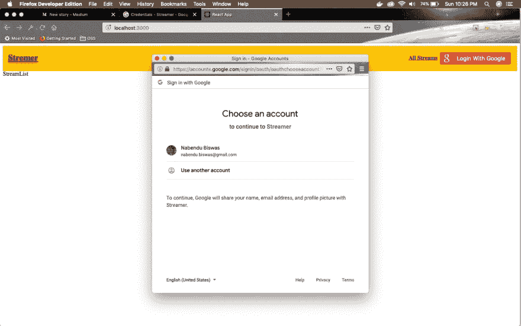 ](https://res.cloudinary.com/practicaldev/image/fetch/s--1UaSJZzI--/c_limit%2Cf_auto%2Cfl_progressive%2Cq_auto%2Cw_880/https://cdn-images-1.medium.com/max/2880/1%2ADOAbwFYJGoqhOfqU0NPjiQ.png) *审批认证*

批准它，您将登录并获得注销按钮。

[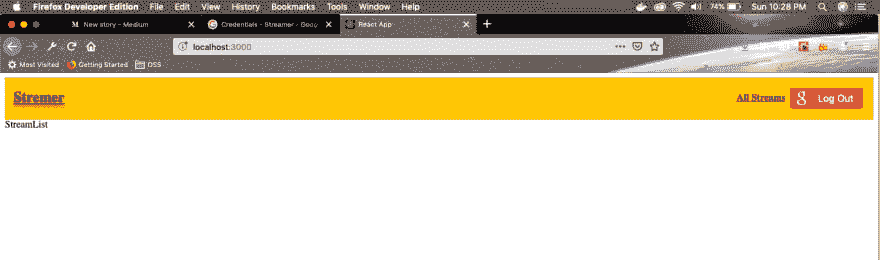 ](https://res.cloudinary.com/practicaldev/image/fetch/s--sM0-MUEc--/c_limit%2Cf_auto%2Cfl_progressive%2Cq_auto%2Cw_880/https://cdn-images-1.medium.com/max/2880/1%2A0lx2CJ_H1WF583BRScHagw.png) *注销按钮*

接下来，我们将把一些认证逻辑转移到 Redux。因此，打开您的终端并停止服务器的运行实例。然后将 redux 和 react-redux 安装到您的项目中。

[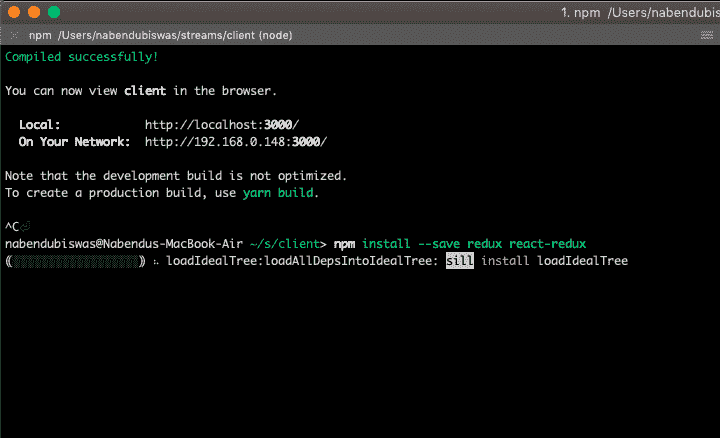 ](https://res.cloudinary.com/practicaldev/image/fetch/s--DDKt3Wca--/c_limit%2Cf_auto%2Cfl_progressive%2Cq_auto%2Cw_880/https://cdn-images-1.medium.com/max/2000/1%2ApgXz4jrarbWU0xvlo5037A.png) * redux 和 react-redux*

一旦安装成功，再次执行 **npm start** 来启动您的本地服务器。

让我们从 redux 设置开始。在我们的 **src** 目录中添加**动作**和**减速器**文件夹。在每个文件中添加一个 **index.js** 文件。在 reducer 的 **index.js** 文件中，添加样板代码。我们将很快用真正的减速器取代它。

[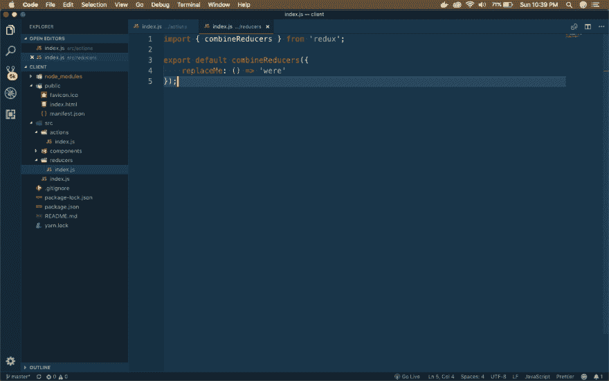 ](https://res.cloudinary.com/practicaldev/image/fetch/s--TTX0Mbpu--/c_limit%2Cf_auto%2Cfl_progressive%2Cq_auto%2Cw_880/https://cdn-images-1.medium.com/max/2880/1%2ACvbhYjqoZjoN5Xk2fqxvBw.png) *增补为 Redux*

接下来，打开 root index.js 并将其更改为包含 redux。更改以粗体突出显示。

```
import React from 'react';
import ReactDOM from 'react-dom';
import App from './components/App';
import { Provider } from 'react-redux';
import { createStore } from 'redux';
import reducers from './reducers';

const store = createStore(reducers);

ReactDOM.render(
<Provider store={store}><App /></Provider>, document.querySelector('#root')); 
```

现在，让我们创建我们的行动创造者。转到**动作**文件夹中的 **index.js** 文件，创建两个简单的函数。

```
export const signIn = () => {
    return {
        type: 'SIGN_IN'
    };
};

export const signOut = () => {
    return {
        type: 'SIGN_OUT'
    };
}; 
```

现在，我们将通过使用 react-redux connect 在我们的 **GoogleAuth.js** 中使用这些函数。Do， **GoogleAuth.js.** 中的这些变化我们正在改变函数 **onAuthChange** ()并添加连接 Redux 动作的东西。

```
import React, { Component } from 'react';
import './GoogleAuth.css';
import { connect } from 'react-redux';
import { signIn, signOut } from '../actions';

class GoogleAuth extends Component {
  state = { isSignedIn: null };

…
…
  onAuthChange = (isSignedIn) => {
    if(isSignedIn) {
      this.props.signIn();
    } else {
      this.props.signOut();
    }
  }

  onSignInClick = () => {
      this.auth.signIn();
  }

…

  render() {
    return (
      <div>
        {this.renderAuthButton()}
      </div>
    )
  }
}

export default connect(null, { signIn, signOut })(GoogleAuth); 
```

现在，是时候制造减速器了。在 **reducers** 文件夹下创建一个文件 **authReducer.js** 。在里面输入下面的代码。在这里，我们使用从 action creator 获得的 SIGN_IN 和 SIGN_OUT 来更新我们的状态。

```
const INITIAL_STATE = {
    isSignedIn: null
};

export default (state = INITIAL_STATE, action) => {
    switch(action.type) {
        case 'SIGN_IN' :
            return {...state, isSignedIn: true};
        case 'SIGN_OUT':
            return {...state, isSignedIn: false};
        default:
            return state;
    }
} 
```

接下来，将该减速器挂在**减速器**文件夹中的 **index.js** 处的联合收割机减速器上。

```
import { combineReducers } from 'redux';
import authReducer from './authReducer';

export default combineReducers({
    auth: authReducer
}); 
```

现在，是时候在 **GoogleAuth.js** 文件中挂钩这些更改，并完全去掉本地状态逻辑了。更改用粗体标出。我们基本上引入了 **mapStateToProps** 来从我们的 reducer 获得 **auth** 。

```
import React, { Component } from 'react';
import './GoogleAuth.css';
import { connect } from 'react-redux';
import { signIn, signOut } from '../actions';

class GoogleAuth extends Component {

  componentDidMount() {
    window.gapi.load('client:auth2', () => {
        window.gapi.client.init({
            clientId: ‘YOUR_CLIENT_ID’,
            scope: 'email'
        }).then(() => {
            this.auth = window.gapi.auth2.getAuthInstance();
            this.onAuthChange(this.auth.isSignedIn.get());
            this.auth.isSignedIn.listen(this.onAuthChange);
        });
    });
  }

  onAuthChange = (isSignedIn) => {
    if(isSignedIn) {
      this.props.signIn();
    } else {
      this.props.signOut();
    }
  }

  onSignInClick = () => {
      this.auth.signIn();
  }

  onSignOutClick = () => {
    this.auth.signOut();
  }

  renderAuthButton() {
      if(this.props.isSignedIn === null){
          return null;
      } else if(this.props.isSignedIn) {
        return (
            <button
                className="loginBtn loginBtn--google"
                onClick={this.onSignOutClick}>Log Out</button>
        )
      } else {
        return (
            <button
                className="loginBtn loginBtn--google"
                onClick={this.onSignInClick}>Login With Google</button>
        )
      }
  }

  render() {
    return (
      <div>
        {this.renderAuthButton()}
      </div>
    )
  }
}

const mapStateToProps = (state) => {
  return { isSignedIn: state.auth.isSignedIn };
}

export default connect(mapStateToProps, { signIn, signOut })(GoogleAuth); 
```

我们完成了身份验证。你可以去本地主机检查一下。但是我们将在我们的代码库中做一个小的重构。在 Redux 中，这种重构通常被认为是很好实践。

在**动作**文件夹下创建一个文件 **types.js** 。在其中键入以下代码。

```
export const SIGN_IN = 'SIGN_IN';
export const SIGN_OUT = 'SIGN_OUT'; 
```

现在，使用这些变量代替 **authReducer.js** 中的字符串

```
import { SIGN_IN, SIGN_OUT } from '../actions/types';

const INITIAL_STATE = {
    isSignedIn: null
};

export default (state = INITIAL_STATE, action) => {
    switch(action.type) {
        case SIGN_IN :
            return {...state, isSignedIn: true};
        case SIGN_OUT:
            return {...state, isSignedIn: false};
        default:
            return state;
    }
} 
```

同样，在**动作**的 **index.js** 中做类似的改变

```
import { SIGN_IN, SIGN_OUT } from './types';

export const signIn = () => {
    return {
        type: SIGN_IN
    };
};

export const signOut = () => {
    return {
        type: SIGN_OUT
    };
}; 
```

我们会互相重构。这是以后用的。前往 **GoogleAuth.js** 并更改 **onAuthChange()** 中的以下内容

```
onAuthChange = (isSignedIn) => {
    if(isSignedIn) {
      this.props.signIn(this.auth.currentUser.get().getId());
    } else {
      this.props.signOut();
    }
  } 
```

现在，在**动作**文件夹的 **index.js** 中使用这个 **userId** 。

```
import { SIGN_IN, SIGN_OUT } from './types';

export const signIn = (userId) => {
    return {
        type: SIGN_IN,
        payload: userId
    };
};

export const signOut = () => {
    return {
        type: SIGN_OUT
    };
}; 
```

现在，我们将对 **authReducer.js** 进行修改

```
import { SIGN_IN, SIGN_OUT } from '../actions/types';

const INITIAL_STATE = {
    isSignedIn: null,
    userId: null
};

export default (state = INITIAL_STATE, action) => {
    switch(action.type) {
        case SIGN_IN :
            return {...state, isSignedIn: true, userId: action.payload};
        case SIGN_OUT:
            return {...state, isSignedIn: false, userId: null};
        default:
            return state;
    }
} 
```

最后，前往 localhost 检查是否一切正常。

[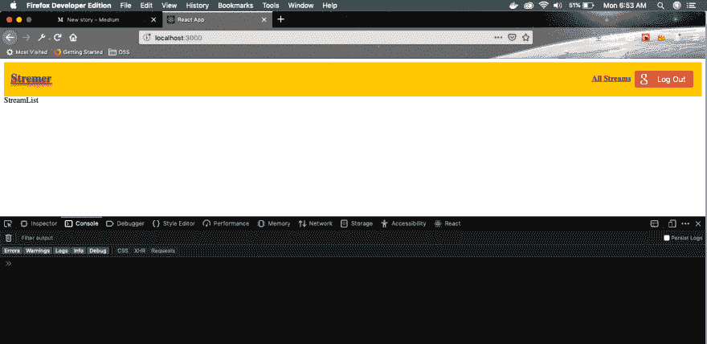 ](https://res.cloudinary.com/practicaldev/image/fetch/s--6jANjWm8--/c_limit%2Cf_auto%2Cfl_progressive%2Cq_auto%2Cw_880/https://cdn-images-1.medium.com/max/2880/1%2ATMLENFEf7a_-7d1YJsVVJw.png) *一切顺利*

这就结束了我们相当长的第 2 部分，其中我们完成了认证。你可以在我的 github [链接](https://github.com/nabendu82/streams)中找到代码。