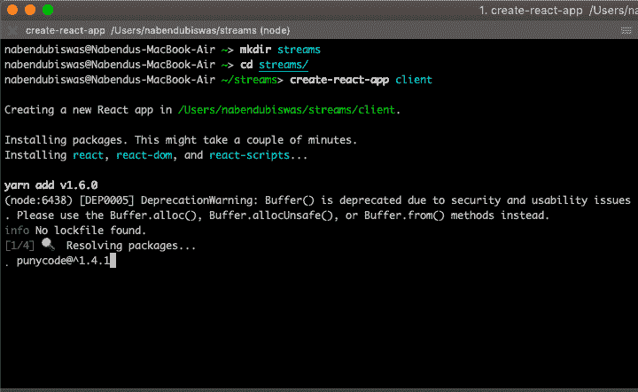
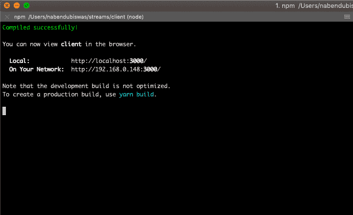
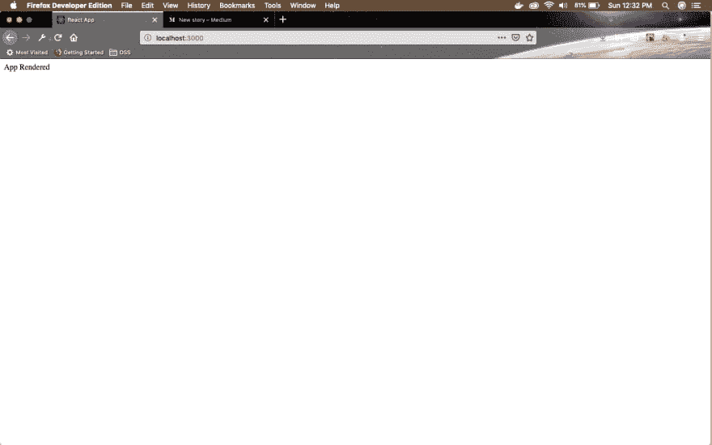
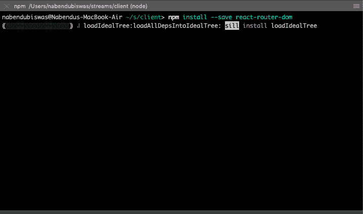
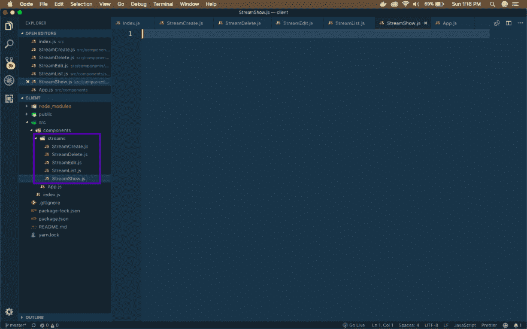
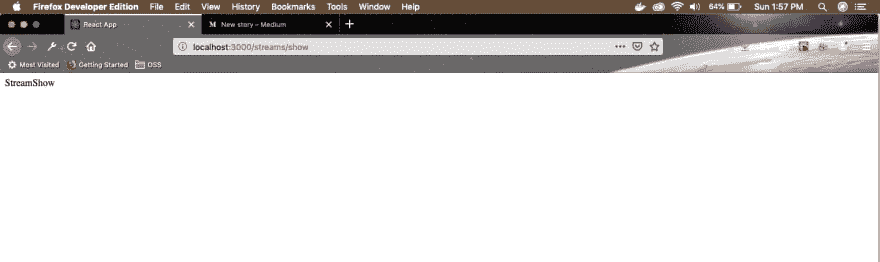
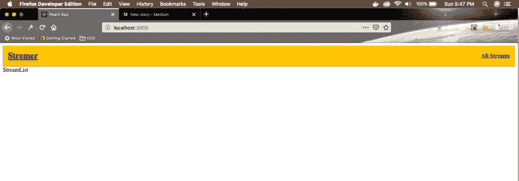

# 使用 React -1 创建抽动克隆

> 原文:[https://dev . to/nabe NDU 82/create-a-twitch-clone-using-react-1-371 a](https://dev.to/nabendu82/create-a-twitch-clone-using-react-1-371a)

欢迎来到全新系列。这里，我们将使用 ReactJS 创建一个流行的流媒体服务[https://www.twitch.tv/](https://www.twitch.tv/)的克隆。

这一系列的灵感来自于斯蒂芬·格里德在 udemy 的“现代反应与还原”系列。

让我们现在开始设置。我们将有反应代码和流代码也。所以，创建一个文件夹 **streams** 。通过使用 *create-react-app client* 为 react 生成一个新文件夹 **client** 。

[ ](https://res.cloudinary.com/practicaldev/image/fetch/s--znP4F50J--/c_limit%2Cf_auto%2Cfl_progressive%2Cq_auto%2Cw_880/https://cdn-images-1.medium.com/max/2000/1%2AEm-MKF_IA2e4R9m_cbWXHg.png) *初始设置*

现在，进入**客户端**目录，通过**NPM starter**启动您的项目。之后你会看到下面的屏幕。

[ ](https://res.cloudinary.com/practicaldev/image/fetch/s--rlEJ5FDG--/c_limit%2Cf_auto%2Cfl_progressive%2Cq_auto%2Cw_880/https://cdn-images-1.medium.com/max/2000/1%2AJjaf294PeBQNu-GOW7UNQA.png) *开始于本地主机*

现在，在 VSCode 中打开您的项目(客户端目录),进入 **src** 并删除所有内容。

[ ](https://res.cloudinary.com/practicaldev/image/fetch/s--R7kTL4N7--/c_limit%2Cf_auto%2Cfl_progressive%2Cq_auto%2Cw_880/https://cdn-images-1.medium.com/max/2880/1%2AKNAXm3oinF6nwV9D6EKGCA.png) *删除一切*

现在，在 **src** 中创建一个文件 **index.js** 并编写下面的基本 React 样板文件。

```
import React from 'react';
import ReactDOM from 'react-dom';
import App from './components/App';

ReactDOM.render(<App />, document.querySelector('#root')); 
```

现在，在 src 中创建一个组件目录，并在其中创建一个文件 **App.js**

```
import React from 'react';

const App = () => {
    return (
        <div>App Rendered</div>
    );
}

export default App; 
```

如果现在输入错误，我们将看到**应用程序在我们的本地主机上呈现**。

[ ](https://res.cloudinary.com/practicaldev/image/fetch/s--GZtamcjQ--/c_limit%2Cf_auto%2Cfl_progressive%2Cq_auto%2Cw_880/https://cdn-images-1.medium.com/max/2880/1%2AX1QQjBNgv6lVB1BaHt4SQQ.png) ** * App 渲染***

我们将在我们的应用程序中有不同的页面，所以我们将在项目中使用 React-router。因此，继续停止正在运行的 localhost 实例，并在终端中键入* * NPM install—save react-router-DOM * *。

[ ](https://res.cloudinary.com/practicaldev/image/fetch/s--N89R8yya--/c_limit%2Cf_auto%2Cfl_progressive%2Cq_auto%2Cw_880/https://cdn-images-1.medium.com/max/2000/1%2A9RlMwrwpx52EyBWWmkTacA.png) * npm 安装*

一旦安装完毕，通过 **npm start** 启动您的应用程序。接下来，我们将首先创建不同的组件文件。在**组件**目录下创建**流**目录，并在其中创建 5 个文件。

[ ](https://res.cloudinary.com/practicaldev/image/fetch/s--4KcKJsLV--/c_limit%2Cf_auto%2Cfl_progressive%2Cq_auto%2Cw_880/https://cdn-images-1.medium.com/max/2880/1%2AQPny-FZnfs0srdnzfCXlwA.png) *五流文件*

我们将快速添加以下样板代码到所有五个文件中。将下面的内容添加到 **StreamCreate.js**

```
import React from 'react';

const StreamCreate = () => {
  return (
    <div>
      StreamCreate
    </div>
  )
}

export default StreamCreate; 
```

将下面的内容添加到 **StreamDelete.js**

```
import React from 'react';

const StreamDelete = () => {
  return (
    <div>
      StreamDelete
    </div>
  )
}

export default StreamDelete; 
```

与其他 3 个文件类似。现在，打开 **App.js** ，从 *react-router-dom* 导入这 5 个文件以及三个组件 *BrowserRouter，Route，Link* 。我们正在创建 5 条不同的路线，并将它们包装在 *BrowserRouter 中。*

```
import React from 'react';
import { BrowserRouter, Route } from 'react-router-dom';
import StreamCreate from './streams/StreamCreate';
import StreamEdit from './streams/StreamEdit';
import StreamDelete from './streams/StreamDelete';
import StreamList from './streams/StreamList';
import StreamShow from './streams/StreamShow';**

const App = () => {
    return (
        <div>
            <BrowserRouter>
             <div>
                <Route path="/" exact component={StreamList} />
                <Route path="/streams/create" exact component={StreamCreate} />
                <Route path="/streams/edit" exact component={StreamEdit} />
                <Route path="/streams/delete" exact component={StreamDelete} />
                <Route path="/streams/show" exact component={StreamShow} />
             </div>
            </BrowserRouter>
        </div>
    );
}

export default App; 
```

现在，一旦检查所有的路线都是正确的本地路线。

[ ](https://res.cloudinary.com/practicaldev/image/fetch/s--x2FFSn9X--/c_limit%2Cf_auto%2Cfl_progressive%2Cq_auto%2Cw_880/https://cdn-images-1.medium.com/max/2880/1%2AZ34KjkcOxqnKdr5G5hhKZA.png) *路线检查*

我们现在将创建我们的头组件。标题将在我们访问的所有页面中可见。因此，继续在**组件**目录下创建一个 **Header.js** 文件。

这里我们将使用来自 *react-router-dom* 的*链接*标签。我们现在正在创建两个链接——一个用于徽标，另一个用于所有流。两者都将把我们带到根 url。

```
import React from 'react';
import { Link } from 'react-router-dom';
import './Header.css';

const Header = () => {
    return (
        <div className="headerWrapper">
            <div className="headerTitle">
                <Link to="/">Stremer</Link>
            </div>
            <div className="otherLinks">
                <Link to="/">All Streams</Link>
            </div>
        </div>
    )
}

export default Header; 
```

您可能已经注意到，我们给 div 指定了一些类名。这是因为我们接下来要设计页眉的样式。在同一个目录下创建一个 **Header.css** 文件。现在，在其中编写下面的代码。这是一个带有 Flexbox 和一些样式的简单 CSS。

```
.headerWrapper{
    background: #ffc600 ;
    height: 5%;
    padding: 1%;
    display: flex;
    align-items: center;
    justify-content: space-between;
}

.headerTitle{
    font-size: 1.5rem;
    font-weight: bold;
    line-height: 1.25;
    color: #333333;
    text-shadow: 0px 4px 3px rgba(0,0,0,0.4),
                 0px 8px 13px rgba(0,0,0,0.1),
                 0px 18px 23px rgba(0,0,0,0.1);
}

.otherLinks {
    font-size: 16px;
    font-weight: bold;
    line-height: 1.25;
    color: #333333;
} 
```

现在，将 Header 包含在我们的 App.js 中，如下所示。

```
import Header from './Header';

const App = () => {
    return (
        <div>
            <BrowserRouter>
                <div>
                    <Header />
                    <Route path="/" exact component={StreamList} />
                    <Route path="/streams/create" exact component={StreamCreate} />
                    <Route path="/streams/edit" exact component={StreamEdit} />
                    <Route path="/streams/delete" exact component={StreamDelete} />
                    <Route path="/streams/show" exact component={StreamShow} />
                </div>
            </BrowserRouter>
        </div>
    );
}

export default App; 
```

现在，前往本地主机，你可以看到我们美丽的标题完成。

[](https://res.cloudinary.com/practicaldev/image/fetch/s--5Tin77eQ--/c_limit%2Cf_auto%2Cfl_progressive%2Cq_auto%2Cw_880/https://cdn-images-1.medium.com/max/2880/1%2ABJWNFFYqbzDyN1rbyCfGzQ.png)T3】漂亮的头球

本系列的第 1 部分到此结束。