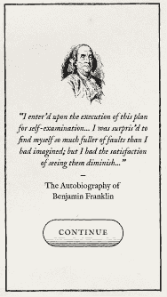

# 每天做好事第四天

> 原文:[https://dev.to/swlkr/do-good-daily-day-4-3cl9](https://dev.to/swlkr/do-good-daily-day-4-3cl9)

📅2019 年 9 月 15 日
🔥连续 4 天
📱每日行善
💰0.99 美元的价格
🤑0 销售
⌚️花了 3.5 个小时
💻修改了 8 个文件，增加了 53 个(+)，删除了 9 个(-)
✅今天的目标:写这篇博文

## 我的照片今天做了一些史诗般的设计

和一个设计师在一个兼职项目团队中最棒的事情是，即使当你把车道上的石头铲到手推车上，然后把它们扔到你的后院，让你的妻子高兴，他仍然可以在应用程序上完成工作👍

这就是今天发生的事情。我会与你分享这些设计，因为它们真的很好，但我会等到我在 swiftUI 中实现它们，因为这是 dev.to 而不是 figma.to。

好吧，我在这里展示一个，因为这个帖子有点轻

[T2】](https://res.cloudinary.com/practicaldev/image/fetch/s--dWe5G7PI--/c_limit%2Cf_auto%2Cfl_progressive%2Cq_auto%2Cw_880/https://thepracticaldev.s3.amazonaws.com/i/5wcym9ktfv1vbqhbevs0.png)

这个设计不同于 app store 上的大多数应用程序，它实际上让我有点兴奋，想把它拿出来，看看它是否能帮助除了我们两个人以外的任何人。

下周是决一死战的时刻，要么取得很大进展，要么这个东西不会在 9 月 30 日发布。希望我明天一大早就开始工作，在一个小时内完成这些伟大的设计😅

敬请关注明天的帖子。