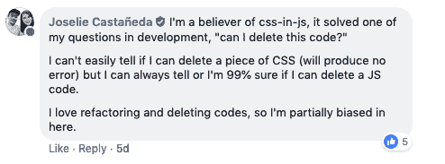
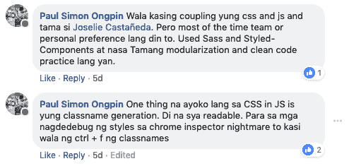

# 我对使用样式化组件的最初想法

> 原文:[https://dev . to/drailanjohngss/my-initial-thoughts-about-using-styled-components-458m](https://dev.to/drailanjohngss/my-initial-thoughts-about-using-styled-components-458m)

javascript 中的 CSS 对我来说是一个新概念。做了将近 2 年的 web 开发人员，我只知道 CSS 和一些预处理程序。

但是现在有了一项新技术，像幽灵一样悄悄潜入。玩笑归玩笑，我一直在 freecodecamp 和 dev.to 上阅读关于风格化组件的东西，老实说，直到我开始为 Farmgoat 工作之前，我还不知道它的真正潜力。老实说，我还没有掌握它的基础知识，但我对它的功能有一个清晰简洁的概念。

基本上，根据我目前的理解，Syled-components 是一个让我们编写拥有自己封装风格的组件的工具。

那么这意味着什么呢？对我来说，理解这是什么的第一步，是放下你所知道的关于写传统 css 的东西。如果你以前使用过 React，那么基本上，它可以让你直接创建一个包含样式的组件，你可以在你的代码库中使用它。这样，就消除了样式和组件之间的映射。

当创建样式化组件时，你必须考虑到你不是命名类，而是直接命名一个组件。名字应该照字面理解。

我的第一反应是，那到底是什么？这是没有意义的，为什么我们要直接设计这些组件，根据 W3C 编写 css 的标准方式是把它放在一个外部 css 文件中。关注点应该分离。

但是当我问我的同事、同事和朋友谁使用样式组件时，我问他们样式组件真正解决了什么问题？关于我读过的这篇有争议的媒体文章。

以下是他们的最佳答案:

[T2】](https://res.cloudinary.com/practicaldev/image/fetch/s--1baAzFFe--/c_limit%2Cf_auto%2Cfl_progressive%2Cq_auto%2Cw_880/https://djtechblog.netlify.com/static/8fc13771bd8fea63c8cf782e1ad11ccf/fbb21/answer1.png)

[T2】](https://res.cloudinary.com/practicaldev/image/fetch/s--lvwg9yZx--/c_limit%2Cf_auto%2Cfl_progressive%2Cq_auto%2Cw_880/https://djtechblog.netlify.com/static/28dfa0a653935622256026478ed65d41/fbb21/answer2.png)

现在说得通了！维护超过 2000 行的 CSS 代码是一场噩梦，所有这些媒体查询和重复的代码。很难仅通过查看来判断是否可以删除此代码。这是样式化组件可以做的一件很棒的事情，当然，因为它是用 JS 编写的，你可以很容易地传递道具，实现主题和布局。

就是这样，目前我仍在探索它，到目前为止，我开始欣赏它的力量和能力。现在，我确信我会在未来的项目中使用样式化组件。