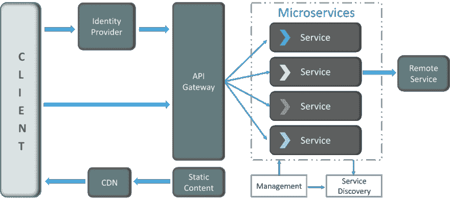
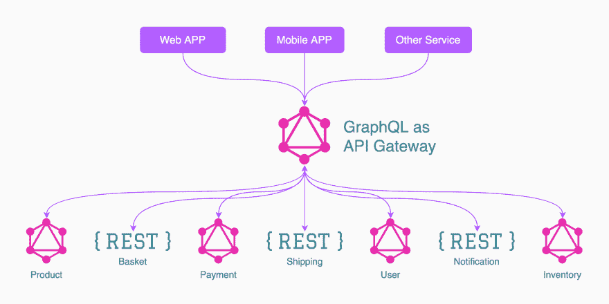
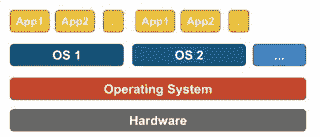
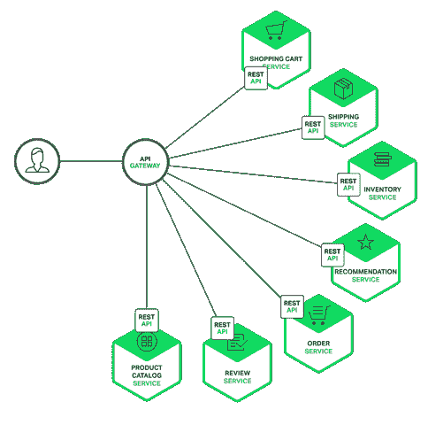
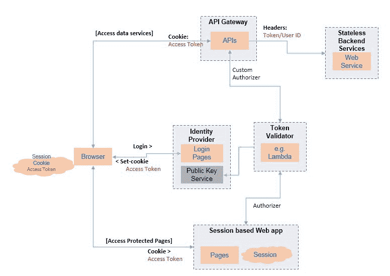

# 你最有可能回答不了的 35 个微服务面试问题

> 原文：<https://dev.to/fullstackcafe/35-microservices-interview-questions-you-most-likely-can-t-answer-2eoc>

Nginx 的一项调查显示，目前有 36%的企业在使用微服务，另有 26%的企业正在研究如何实现微服务。通读以更新您对一些重要微服务面试问题的了解，这些问题您很可能不知道如何回答。

> 🔴最初发表于 [FullStack。咖啡馆-杀死你的技术&编码面试](https://www.fullstack.cafe/?utm_source=dev&utm_medium=blog)

### Q1:什么是持续集成？

> 题目:**devo PS**T2】难度:⭐

*持续集成(CI)* 是一种开发实践，要求开发人员一天数次将代码集成到共享存储库中。然后，每个签入都由一个自动构建来验证，允许团队尽早发现问题。

🔗**来源:**【edureka.co】T2

### Q2:Docker 是什么？

> 主题:坞站
> 难点:□

*   Docker 是一个容器化平台，它以容器的形式将你的应用程序及其所有依赖项打包在一起，以确保你的应用程序可以在任何环境下无缝工作，无论是开发、测试还是生产。
*   Docker 容器将一个软件包装在一个完整的文件系统中，该文件系统包含运行所需的一切:代码、运行时、系统工具、系统库等。任何可以安装在服务器上的东西。
*   这保证了软件将总是相同地运行，而不管其环境如何。

🔗**来源:**【edureka.co】T2

### Q3:集装箱化是什么意思？

> 题目:**devo PS**T2】难度:⭐⭐

*容器化*是一种*虚拟化*策略，作为传统的基于虚拟机管理程序的虚拟化的替代方案出现。

在容器化中，操作系统由不同的容器共享，而不是为每个虚拟机克隆。例如，Docker 提供了一个容器虚拟化平台，作为基于管理程序的安排的一个很好的替代方案。

🔗**来源:**【linoxide.com】T2

### Q4:定义微服务架构

> 主题:**微服务**
> 难度:⭐⭐

**微服务**，又名 ***微服务架构*** ，是一种架构风格，将应用程序构建为小型自治服务的集合，围绕**业务领域建模。**

🔗**来源:**【lambdatest.com】T2

### Q5:解释蓝绿部署技术

> 题目:**devo PS**T2】难度:⭐⭐⭐

**蓝绿部署**是一种通过运行两个相同的生产环境(蓝绿环境)来减少停机时间和风险的技术。在任何时候，只有一个环境是实时的，实时环境为所有生产流量提供服务。对于这个例子，蓝色当前是活动的，绿色是空闲的。

当您准备一个新版本的软件时，部署和测试的最后阶段发生在非实时环境中:在这个例子中，是绿色的。一旦您以绿色部署并全面测试了软件，您就可以切换路由器，使所有传入的请求都变为绿色，而不是蓝色。绿色现在是活的，蓝色是闲的。

这种技术可以消除由于应用程序部署而导致的停机时间。此外，蓝绿色部署降低了风险:如果您的新版本在绿色上发生了意外，您可以通过切换回蓝色立即回滚到上一个版本。

🔗**来源:**【cloudfoundry.org】T2

### Q6:蓝/绿部署和滚动部署有什么区别？

> 题目:**devo PS**T2】难度:⭐⭐⭐

*   在**蓝绿色部署**中，你有两个完整的环境。
    一个是正在运行的蓝色环境，一个是要升级到的绿色环境。一旦您将环境从蓝色切换到绿色，流量就会被引导到新的绿色环境。您可以删除或保存旧的蓝色环境进行备份，直到绿色环境稳定下来。

*   在**滚动部署**中，你只有一个完整的环境。代码部署在同一环境的实例子集中，并在完成后移动到另一个子集。

🔗**来源:**【stackoverflow.com】T2

### Q7:持续集成、持续交付、持续部署有什么区别？

> 题目:**devo PS**T2】难度:⭐⭐⭐

*   实践**持续集成**的开发人员尽可能频繁地将他们的变更合并回主分支。通过这样做，您避免了当人们等待发布日将他们的变更合并到发布分支时通常发生的集成地狱。
*   **持续交付**是持续集成的扩展，以确保您能够以可持续的方式快速向客户发布新的变更。这意味着除了自动化您的测试之外，您还自动化了您的发布过程，并且您可以通过点击一个按钮在任何时间点部署您的应用程序。
*   **持续部署**比持续交付更进一步。通过这种实践，通过生产管道所有阶段的每一个变更都会发布给客户。没有人工干预，只有失败的测试才会阻止新的变更被部署到生产中。

🔗**来源:**【atlassian.com】T2

### Q8:你对无服务器模式了解多少？

> 题目:**devo PS**T2】难度:⭐⭐⭐

**无服务器**指的是一种对开发者隐藏服务器存在的模式。这意味着您不再需要处理容量、部署、扩展、容错和操作系统。这将从本质上减少维护工作，并允许开发人员快速专注于开发代码。

例如:

*   亚马逊 AWS Lambda
*   Azure 函数

🔗**来源:**【linoxide.com】T2

### Q9:微服务有什么特点？

> 主题:**微服务**
> 难度:⭐⭐⭐

*   **解耦**–系统内的服务在很大程度上是解耦的。因此，应用程序作为一个整体可以很容易地构建、修改和扩展
*   **组件化**–微服务被视为独立的组件，可以轻松替换和升级
*   **业务能力**–微服务非常简单，专注于单一能力
*   **自主性**–开发人员和团队可以彼此独立工作，从而提高速度
*   **连续** **交付**–通过软件创建、测试和批准的系统化自动化，允许软件的频繁发布
*   **责任**–微服务不把应用作为项目来关注。相反，他们将应用程序视为他们负责的产品
*   **去中心化治理**–重点是为正确的工作使用正确的工具。这意味着没有标准化的模式或任何技术模式。开发人员可以自由选择最有用的工具来解决他们的问题
*   **敏捷**–微服务支持敏捷开发。任何新功能都可以快速开发并再次丢弃

🔗**来源:**【lambdatest.com】T2

### Q10:微服务架构如何工作？

> 主题:**微服务**
> 难度:⭐⭐⭐

*   **客户端**–来自不同设备的不同用户发送请求。
*   **身份提供者**–验证用户或客户端身份并颁发安全令牌。
*   **API 网关**–处理客户端请求。
*   **静态内容**–包含系统的所有内容。
*   **管理**–平衡节点上的服务并识别故障。
*   **服务发现**——寻找微服务间通信路径的指南。
*   **内容交付网络**–代理服务器及其数据中心的分布式网络。
*   **远程服务**–支持远程访问驻留在 IT 设备网络上的信息。

🔗**来源:**【edureka.co】T2

### Q11:单片、SOA、微服务架构有什么区别？

> 主题:**微服务**
> 难度:⭐⭐⭐

*   **单片架构**类似于一个大容器，其中应用程序的所有软件组件被组装在一起并紧密打包。
*   一个**面向服务的架构**是互相通信的服务的集合。通信可以包括简单的数据传递，也可以包括两个或多个协调某些活动的服务。
*   **微服务架构**是一种架构风格，它将应用程序构建为小型自治服务的集合，围绕业务领域进行建模。

🔗**来源:**【edureka.co】T2

### Q12:微服务和单片架构的主要区别是什么？

> 主题:**微服务**
> 难度:⭐⭐⭐

**微服务**

*   服务启动速度很快
*   微服务是松散耦合的架构。
*   在单个数据模型中进行的更改不会影响其他微服务。
*   微服务关注的是产品，而不是项目

**单片架构**

*   服务启动需要时间
*   整体架构大多是紧密耦合的。
*   数据模型中的任何变化都会影响整个数据库
*   整体强调整个项目

🔗**来源:**【edureka.co】T2

### Q13:编排微服务的标准模式有哪些？

> 主题:**微服务**
> 难度:⭐⭐⭐

当我们开始对越来越复杂的逻辑建模时，我们必须处理管理跨越单个服务边界的业务流程的问题。

*   通过**编排**，我们依靠一个中央大脑来引导和驱动这个过程，就像管弦乐队中的指挥一样。编排风格更符合编排/任务服务的 SOA 理念。例如，我们可以将业务流包装在它自己的服务中。其中代理协调微服务之间的交互，如下图所示。

*   通过**编舞**，我们告知系统的每个部分它的工作，并让它解决细节，就像芭蕾舞中的舞者都找到自己的方式并对周围的人做出反应。编排风格对应于 Martin Fowler 的。这种方法也被称为**域方法**，使用域事件，每个服务发布关于已经发生的事件，其他服务可以订阅这些事件。

🔗**来源:**【stackoverflow.com】T2

### Q14:什么是智能端点和哑管道？

> 主题:**微服务**
> 难度:⭐⭐⭐

*   **智能端点**仅仅意味着实际的业务规则和任何其他验证发生在这些端点之后，这些端点的消费者看不到任何人，他们认为这是一个真正神奇的地方。

*   **哑管道**是指任何不进行进一步操作(如验证)的通信方式，它只是通过特定通道传输数据，如果需要，它也可以是可替换的。选择的基础设施通常是哑的(哑的，因为仅充当消息路由器)。这只是意味着路由是管道应该做的唯一功能。

🔗**来源:**【stackoverflow.com】T2

### 问题 15:您是否认为 GraphQL 非常适合设计微服务架构？

> 主题:**微服务**
> 难度:⭐⭐⭐

*GraphQL 和微服务是完美的组合*，因为 GraphQL 对客户端隐藏了你拥有微服务架构的事实。从后端的角度来看，您希望将所有东西都分成微服务，但是从前端的角度来看，您希望所有数据都来自单个 API。使用 GraphQL 是我所知道的能让你做到这两点的最好方法。它允许您将后端拆分为微服务，同时仍然为所有应用程序提供单个 API，并允许来自不同服务的数据连接。

🔗**来源:**【stackoverflow.com】T2

### Q16:容器和虚拟机有什么不同？

> 题目:**devo PS**T2】难度:⭐⭐⭐⭐

*   与虚拟机不同，容器不需要引导操作系统内核，因此可以在不到一秒的时间内创建容器。这个特性使得基于容器的虚拟化比其他虚拟化方法更独特、更受欢迎。
*   因为基于容器的虚拟化很少或不增加主机的开销，所以基于容器的虚拟化具有接近本机的性能
*   与其他虚拟化不同，基于容器的虚拟化不需要额外的软件。
*   主机上的所有容器共享主机的调度程序，节省了额外的资源需求。
*   与虚拟机映像相比，容器状态(Docker 或 LXC 映像)的大小较小，因此容器映像易于分发。
*   容器中的资源管理是通过 cgroups 实现的。Cgroups 不允许容器消耗多于分配给它们的资源。

🔗**来源:**【stackoverflow.com】T2

### Q17:虚拟化在底层如何工作？

> 主题:坞站
> 难点:□

VM manager 接管 CPU ring 0(或较新的 CPU 中的“根模式”)，并拦截来宾操作系统发出的所有特权调用，以制造来宾操作系统拥有自己的硬件的假象。有趣的事实:在 1998 年之前，人们认为在 x86 架构中实现这一点是不可能的，因为没有办法实现这种拦截。VMWare 的人是第一个想到为客户操作系统的特权调用重写内存中的可执行字节来实现这一点的人。

实际效果是，虚拟化允许您在相同的硬件上运行两个完全不同的操作系统。每个客户操作系统都要经历引导、加载内核等过程。你可以有非常严格的安全性，例如，客户操作系统不能完全访问主机操作系统或其他客户操作系统，把事情弄糟。

🔗**来源:**【stackoverflow.com】T2

### Q18:什么是半虚拟化？

> 主题:坞站
> 难点:□

**半虚拟化**，也称为第 1 类虚拟机管理程序，直接在硬件或“裸机”上运行，并直接向在其上运行的虚拟机提供虚拟化服务。它有助于操作系统、虚拟化硬件和真实硬件协作以实现最佳性能。这些虚拟机管理程序通常占用空间很小，本身不需要大量资源。

这一类的例子包括 Xen、KVM 等。

🔗**来源:**【stackoverflow.com】T2

### Q19:什么是幂等？

> 主题:**微服务**
> 难度:⭐⭐⭐⭐

**等幂**指的是你重复执行一项任务，但最终结果保持不变或相似的场景。

🔗**来源:**【lambdatest.com】T2

### Q20:微服务架构有哪些利弊？

> 主题:**微服务**
> 难度:⭐⭐⭐⭐

**优点**:

*   使用不同技术的自由
*   每个微服务侧重于单一功能
*   支持单个可部署单元
*   允许频繁的软件发布
*   确保每个服务的安全性
*   多个服务被并行开发和部署

**缺点**:

*   增加了故障排除的挑战
*   由于远程呼叫增加了延迟
*   加大配置和其他操作的力度
*   难以维护交易安全
*   难以跨越各种界限跟踪数据
*   难以在服务之间编码

🔗**来源:**【edureka.co】T2

### Q21:你对契约测试的理解是什么？

> 主题:**微服务**
> 难度:⭐⭐⭐⭐

根据 Martin Flower 的说法，**契约测试**是在外部服务的边界上进行的测试，它验证它是否满足消费服务所期望的契约。

此外，契约测试没有深入测试服务的行为。相反，它测试服务调用的输入和输出是否包含所需的属性，以及响应延迟和吞吐量是否在允许的范围内。

🔗**来源:**【edureka.co】T2

### Q22:架构师在微服务架构中的作用是什么？

> 主题:**微服务**
> 难度:⭐⭐⭐⭐

微服务架构中的架构师扮演以下角色:

*   决定整个软件系统的布局。
*   有助于决定组件的分区。因此，他们确保组件是相互内聚的，而不是紧密耦合的。
*   与开发人员一起编写代码，了解日常生活中面临的挑战。
*   向开发微服务的团队推荐某些工具和技术。
*   提供技术治理，以便团队在其技术开发中遵循微服务的原则。

🔗**来源:**【edureka.co】T2

### Q23:解释什么是 API 网关模式

> 主题:**微服务**
> 难度:⭐⭐⭐⭐

一个 **API 网关**是一个服务器，它是系统的单一入口点。它类似于面向对象设计中的 Facade 模式。API 网关封装了内部系统架构，并提供了针对每个客户端定制的 API。它可能还有其他职责，如身份验证、监控、负载平衡、缓存、请求整形和管理以及静态响应处理。

使用 API 网关的一个主要好处是它封装了应用程序的内部结构。客户端只需与网关对话，而不必调用特定的服务。

🔗**来源:**【nginx.com】T2

### Q24:提及 API 网关的一些优点和缺点

> 主题:**微服务**
> 难度:⭐⭐⭐⭐

有一些:

*   使用 API 网关的一个主要好处是它封装了应用程序的内部结构。客户端只需与网关对话，而不必调用特定的服务。
*   这是另一个必须开发、部署和管理的高可用性组件。还存在 API 网关成为开发瓶颈的风险。
*   开发人员必须更新 API 网关，以公开每个微服务的端点。

🔗**来源:**【nginx.com】T2

### Q25:什么是物化视图模式，什么时候会用到？

> 主题:**微服务**
> 难度:⭐⭐⭐⭐

**物化视图模式**是聚合来自多个微服务的数据的解决方案，当我们需要实现从多个微服务检索数据的查询时，使用*。在这种方法中，我们预先生成(在实际查询发生之前准备反规范化的数据)，一个包含多个微服务拥有的数据的只读表。该表的格式适合客户端应用程序或 API 网关的需求。*

关键的一点是，物化视图及其包含的数据是完全可处置的，因为它可以完全从源数据存储中重建。

这种方法不仅解决了*如何跨微服务*查询和连接的问题，而且与复杂的连接相比，它还显著提高了性能，因为在查询表中已经有了应用程序需要的数据。

🔗**来源:**【microsoft.com】T2

### Q26:金丝雀在释放什么？

> 题目:**devo PS**T2】难度:⭐⭐⭐⭐⭐

金丝雀发布是一种降低在生产中引入新软件版本风险的技术。这是通过在将变更发布给整个基础设施之前，将变更缓慢地推广给一小部分用户来实现的，也就是说，让每个人都可以使用它。

🔗**来源:**【edureka.co】T2

### Q27:梅尔文·康威陈述的定律暗示了什么？

> 主题:**微服务**
> 难度:⭐⭐⭐⭐⭐

康威定律适用于模块化软件系统，它指出:

“任何设计系统(这里的定义比信息系统更广泛)的组织将不可避免地产生一种设计，其结构是组织的通信结构的复制”。

🔗**来源:**【lambdatest.com】T2

### Q28:说出 SOA 和微服务的主要区别？

> 主题:**微服务**
> 难度:⭐⭐⭐⭐⭐

*   SOA 使用企业服务总线进行通信，而微服务使用简单得多的消息传递系统。
*   每个微服务独立存储数据，而在 SOA 中，组件共享相同的存储。
*   对于微服务，通常使用云，而对于 SOA 应用服务器则更常见。
*   SOA 仍然是一个整体，为了做出改变，你需要改变整个架构。
*   SOA 只使用重量级的技术和协议(如 SOAP 等)，而微服务是更精简、更有效、更敏捷的方法(REST/GraphQL)。

🔗**来源:**【quora.com】T2

### Q29:内聚和耦合有什么区别？

> 主题:**微服务**
> 难度:⭐⭐⭐⭐⭐

**内聚**是指类(或模块)能做什么。低内聚意味着这个类做了各种各样的动作——它很宽泛，没有关注它应该做什么。高内聚意味着类专注于它应该做的事情，即只关注与类的意图相关的方法。

至于**耦合**，指的是两个类/模块之间的相关或依赖程度。对于低耦合的类，在一个类中改变一些主要的东西不应该影响另一个。高耦合性会使更改和维护代码变得困难；因为类是紧密结合在一起的，所以做出改变可能需要整个系统的改造。

好的软件设计有**高内聚**和**低耦合**。

🔗**来源:**【edureka.co】T2

### Q30:什么是消费者驱动的契约(CDC)？

> 主题:**微服务**
> 难度:⭐⭐⭐⭐⭐

这基本上是一种开发微服务的模式，以便外部系统可以使用它们。当我们从事微服务时，有一个特定的提供商在构建它，有一个或多个消费者在使用微服务。

通常，提供者在 XML 文档中指定接口。但是在消费者驱动的契约中，服务的每个消费者都传达了提供者所期望的接口。

🔗**来源:**【edureka.co】T2

### Q31:微服务中有哪些反应式扩展？

> 主题:**微服务**
> 难度:⭐⭐⭐⭐⭐

**反应式延伸**也被称为 Rx。在这种设计方法中，我们通过调用多个服务来收集结果，然后编译一个组合响应。这些调用可以是同步的或异步的，阻塞的或非阻塞的。Rx 是分布式系统中一个非常流行的工具，它的工作原理与传统流程相反。

🔗**来源:**【edureka.co】T2

### Q32:微服务最被接受的交易策略是什么

> 主题:**微服务**
> 难度:⭐⭐⭐⭐⭐

微服务引入了最终的一致性问题，因为它们值得称赞地坚持分散的数据管理。使用 monolith，您可以在单个事务中一起更新一堆东西。微服务需要多个资源来更新，分布式事务是不被认可的(理由很充分)。所以现在，开发人员需要意识到一致性问题，并在做任何代码会后悔的事情之前，想出如何检测出什么时候事情不同步。

考虑事务是如何发生的，以及哪种事务对您的服务有意义。然后，您可以实现一个回滚机制，取消原始操作，或者实现一个两阶段提交系统，保留原始操作，直到被告知真正提交。

金融服务一直在做这种事情——如果我想把钱从我的银行转移到你的银行，没有像数据库中那样的单笔交易。您不知道这两家银行都在运行什么系统，因此必须像对待您的微服务一样有效地对待它们。在这种情况下，我银行会把我的钱从我的账户转移到一个持有账户，然后告诉你的银行他们有一些钱，如果发送失败，我的银行会把他们试图发送的钱退还给我的账户。

🔗**来源:**【softwareengineering.stackexchange.com】T2

### Q33:为什么一个人会在 2PC 以上使用传奇，反之亦然？

> 主题:**微服务**
> 难度:⭐⭐⭐⭐⭐

我知道有两种方法可以用来实现分布式事务:

*   两阶段提交(2PC)
*   萨迦

2PC 是一个协议，在平台的支持下，应用程序可以透明地利用全局 ACID 事务。据我所知，它嵌入在平台中，对业务逻辑和应用程序代码是透明的。

另一方面，Sagas 是一系列本地事务，其中每个本地事务都会发生变化，并保存实体以及一些指示全局事务阶段的标志，并提交更改。换句话说，事务的状态是域模型的一部分。回滚就是提交一系列“反向”事务。在任一情况下，服务发出的事件都会触发这些本地事务。

*   通常，2PC 用于*即时*交易。
*   通常情况下，传奇是针对*长期运行的*事务的。

我个人认为 Saga 能够做 2PC 能做的事情，但是他们有实现重做机制的开销。相反并不准确。我认为 Sagas 是通用的，而 2PC 涉及平台/厂商锁定，缺乏平台独立性。

🔗**来源:**【stackoverflow.com】T2

### Q34:提供“智能管道”和“哑端点”的示例

> 主题:**微服务**
> 难度:⭐⭐⭐⭐⭐

系统中的组件使用“管道”(HTTP/S、队列等...)互相交流。通常，这些管道流经 ESB(企业服务总线), ESB 对组件之间传递的消息做许多事情。

它可能会:

*   安全检查
*   按指定路线发送
*   业务流程/验证
*   转换

一旦完成这些任务，消息将被转发到“端点”组件。这是“智能管道”的一个例子，因为许多逻辑和处理驻留在 ESB 中(“管道”系统的一部分)。端点可以是“哑的”,因为 ESB 已经完成了所有工作。

“智能端点和哑管道”提倡相反的场景。通信通道应该从业务处理和逻辑中剥离出来，只在组件之间分发消息。然后是组件本身进行处理/逻辑/验证等...在那些信息上。

🔗**来源:**【stackoverflow.com】T2

### Q35:你会如何为微服务架构实现 SSO？

> 主题:**微服务**
> 难度:⭐⭐⭐⭐⭐

添加身份服务并使用令牌通过它授权服务访问。任何具有受保护资源的服务都将与身份服务对话，以确保其拥有的凭据(令牌)有效。如果不是，它将重定向用户进行身份验证。一旦令牌被验证，它就可以被保存在会话中，这样用户会话中的后续调用就不必进行额外的调用。如果需要在该会话中刷新令牌，您也可以创建计划作业。

解决这个问题的一个好方法是使用 OAuth 2 协议。在这种情况下，您可以使用 OAuth 2.0 端点进行身份验证，令牌将被添加到 HTTP 头中，用于对您的域的调用。所有的服务都应该从该域路由，这样您就可以从 HTTP 头中获得令牌。

🔗**来源:**【stackoverflow.com】T2

> 谢谢🙌阅读，祝你面试好运！
> *如果你喜欢这篇文章，请分享给你的开发者伙伴！*
> *查看更多全栈面试问题&答案上👉[www . full stack . cafe](https://www.fullstack.cafe)T9】*