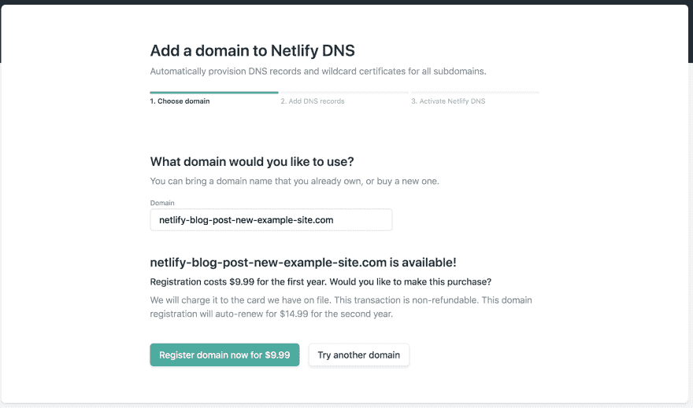
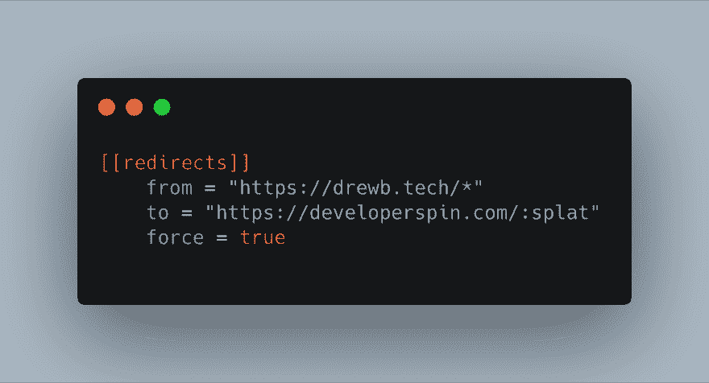
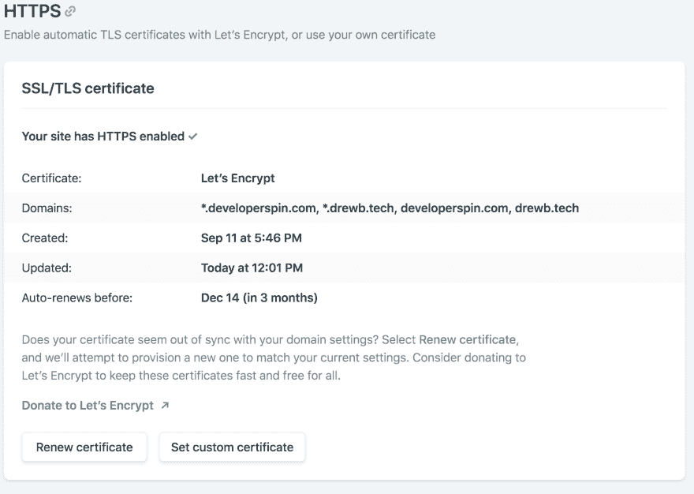

# 如何在 Netlify 上更改域

> 原文：<https://dev.to/dbredvick/how-to-change-domains-on-netlify-596j>

我买了太多域名。一旦你开始购买它们，就很难停下来。每一个新的伟大的想法(或者我是这么认为的)都应该在网络上有一个停车位。域名并不贵——每年只需 10 美元。我花在两杯咖啡上的钱比这多。

> 如果有人想出了同样的主意，先买了域名怎么办？-我，凌晨 3 点

我最初认为 https://drewb.tech 是存放我博客的绝佳地点。我把它命名为“技术内容”,然后开始写内容。原来“科技产品”并不是一个好名字。它也没有涵盖我所谈论的广泛话题。*sooo...*

## 我又买了一个域名。

我的新域名[developerspin.com](https://developerspin.com)，听起来更好。它还具有品牌潜力，我可能会想出一个非常恶心的标志(在我富有创造力的女朋友的帮助下)。我在[网上买的，第一年 9.99 美元。](https://netlify.com)

## 切换域的时间

通常，处理所有这些域名 DNS 设置是一件痛苦的事情。通常，你必须在你的 DNS 主机上设置一堆记录，并希望你做的事情是正确的。

有了 Netlify，这一切就简单多了。

### 购买新域名

我强烈推荐在 Netlify 上购买你的域名。是的，从长远来看可能会贵一点，但是一切都很好。前往 Netlify 上的**域名**标签，搜索你想要的域名。我通常在 domains.google.com 的[上浏览域名，然后在找到我想要的域名后在 Netlify 上购买。](https://domains.google.com) 

### 更改站点设置

转到您想要更改的新站点，在**域管理**下的**设置**选项卡中添加域名别名。完成后，点击**设为主域**。

### 添加转发规则

这部分很重要。如果你不这样做，你的流量**将不会**被转发到新域。添加 301 重定向对于 SEO 也是超级重要的。谷歌需要知道你的网站改变了域名；否则，你失去了你所有的搜索引擎优化辛勤工作。在 Netlify 上，你可以用几种方法设置[重定向规则](https://www.netlify.com/docs/redirects/)。我推荐`netlify.toml`方法。将以下部分添加到文件中:

### HTTPS

让我们面对它；每个站点都需要 HTTPS。Netlify 默认附带免费的通配符证书，使用[让我们加密](https://letsencrypt.org)，这让我们的生活变得非常简单。切换域后，只需点击**更新证书**按钮。就这么简单。

### 测试出来

等待几分钟(大约最多 15 分钟)，打开几个不同的浏览器，检查以确保 HTTPS 和重定向都工作正常。恭喜你迁移域名！

## 有问题？

在 Twitter 上关注我，给我发推文或 DM，我会帮你解决问题。
[发推文到@dbredvick](https://twitter.com/intent/tweet?screen_name=dbredvick&ref_src=twsrc%5Etfw)

*最初发布于*[developer spin . com/posts/2019-09-15-moving-domains-on-net lify/](https://developerspin.com/posts/2019-09-15-moving-domains-on-netlify/)