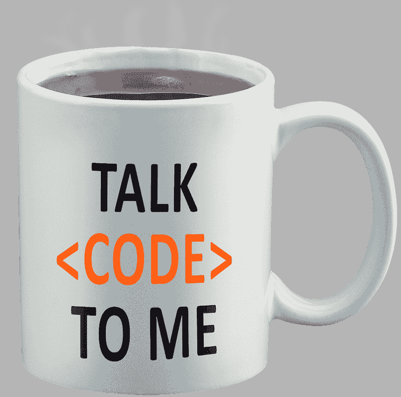
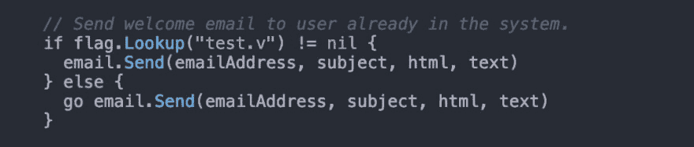

# Spicer 关于如何以及何时测试你的代码的规则

> 原文：<https://dev.to/cloudmanic/spicer-s-rules-on-how-and-when-to-test-your-code-hh6>

我刚刚度过了我作为一名专业软件开发人员的第 20 个年头——这意味着我在 20 年前收到了我写代码的第一份薪水。我不得不承认，这是一次成功、失败、疯狂想法和巨大学习的狂野之旅。在整个旅程中，[单元测试](http://softwaretestingfundamentals.com/unit-testing/)的主题，或者任何类型的测试，对我来说都是最重要的。这个话题引发了无数的酒吧辩论，甚至更多的 [IRC](https://en.wikipedia.org/wiki/Internet_Relay_Chat) 争斗——是的，在这里显示我的年龄。经过一些思考，我认为我已经最终确定了如何以及何时通过业务目标的视角进行单元测试的规则。

作为旁注，这篇文章的灵感来自我最近听的一个播客: [103:代码质量和平衡 TDD](https://artofproductpodcast.com/episode-103) 。共同主持人[本·奥伦斯坦](https://www.benorenstein.com/)，据说有着非常成功的软件开发生涯，最近他成为了他的新公司 [Tuple](https://tuple.app) 的首席执行官。在播客中，他描述了过去作为一名软件开发人员，他是如何严格遵守单元测试规则的，总是坚持对他参与的任何项目执行强有力的测试政策。他现在提到，他是一名 CEO，正在平衡时间、预算和进度，并且他对单元测试采取了更加主观的方法。虽然他没有详细说明，但这个话题我已经思考了一段时间了。这个播客鼓励我写下我对如何通过代码测试平衡好的软件开发原则和商业目标的想法。

规则#1:如果你有金钱、时间和热情，单元测试就是一切。

“测试一切”阵营中的人的说教总是让我回想起我的大学时代，听一位教授每次在软件开发中教你“应该”做什么。我的许多教授告诉我，总是毫无例外地 100%覆盖测试所有东西是正确的做法。是啊，在一本很有意义的教科书里。教授们经常会指出，你会写出更少的错误软件，因此，你的用户会更高兴。我在 3 个条件下同意这些概念。

*   你正在开发的软件没有时间限制。测试一切都需要时间。如果你想要全面和完整的覆盖面，这不仅仅是这里和那里的几分钟。
*   你的项目预算很大。时间和金钱往往相伴而行。如果你想要匹配集成测试的真正 100%覆盖，准备好花钱雇佣高薪开发人员。
*   *对测试的热情。*这是一个谈得不多的话题。如果你是一个软件经理，你在测试中是不可忽视的，你的团队因为写一些琐碎的东西而有点精疲力竭，那么你的团队将会被解雇，或者这将导致你公司的旋转门。打击有才华的软件开发人员的积极性比没有 100%的覆盖率要糟糕得多。

如果你有无限的时间和金钱，并且你的团队热衷于测试，我说去吧！如果没有，继续规则#2:)。

我承认有些软件应该 100%测试。可能 200%测试过。运行自动驾驶汽车或卫星的软件无论如何都应该进行测试，因为错误会导致昂贵或致命的错误。只是要小心，不要让自己相信你的小 SaaS 应用程序和自动驾驶汽车软件一样重要。

规则 2:如果你有一个庞大团队的整体应用，投资测试。

如果您的软件应用程序范围很大，并且被设计成一个经过多年开发的整体应用程序，那么测试就变得很重要。如果你有一个大的开发团队，测试变得更加重要。对于一些开发人员来说，仅仅因为他们没有回忆起功能的原始需求，就很容易在不知不觉中破坏一些特性。

非常简单的规则:更多的人+更大的代码库=需要更多的测试。

也就是说，依我看，单片应用程序是相当老派的。是的，一个大的单片应用程序有一些优点，但是在一个大团队中工作也有很多缺点。杰夫·贝索斯有 [2 比萨饼规则](https://www.rd.com/food/fun/two-pizza-rule-work-hack/)，我认为这是建立软件团队时要考虑的一个很好的概念。

如果你有一个由很多开发者构建的大应用，可以考虑微服务。将单一的应用程序分解成更小的模块或独立的应用程序。鉴于代码库的较小性质，测试可能会放松。通常，经理可能会决定投资测试更重要的微服务，并放松对不太重要的服务。对于单一的应用程序，当涉及到设置测试策略时，我们倾向于过度概括。

规则#3:测试驱动的开发是一个伟大的双赢。

测试驱动开发(TDD)是先写测试再写代码的过程。每个人的做法都不一样。在我的世界里，我认为 TDD 改变了你的开发方式，你可以使用单元测试来帮助开发你的代码。

也许我的 TDD 方法在一个例子中描述得更好。假设您正在构建一个 web 应用程序。传统上，你会写一些代码，编译你的应用程序，然后在浏览器中点击刷新，看看你的代码是否工作。重新编译和刷新的过程可能非常耗时。一种不同的方法可能是编写一些测试，编写一些代码，然后运行测试。您可以在开发过程中使用该测试来调试某些东西，为您提供与浏览器刷新相同级别的验证。

使用测试驱动开发，一个 3 步的开发过程可以减少到 2 步。结果可能是你浪费在编译和刷新上的时间可能会反映出编写单元测试所花费的时间。在一天结束的时候，你已经花了同样多的时间进行开发，但是使用 TDD，你还会得到单元测试，你可以永远运行它来验证你的应用程序是否继续按计划工作。

> "使用测试驱动开发，一个 3 步的开发过程可以减少到 2 步."

通过使用 TDD 方法，你很可能不用花费任何额外的时间就能写出大量的测试。密切关注时间表和预算的经理喜欢这种方法。这是一个伟大的杂交。

规则 4:不要浪费时间去测试那些很难测试的东西。

有些编程语言很难考，看你 Javascript！在像 Javascript 这样的语言中，我发现我在规则#3 中提到的 TDD 方法根本不起作用。没有办法使用你的测试来支持你的开发。我发现开发软件是一项不同的任务，而编写测试是另一项不同的任务。这通常会使开发时间加倍。

通常这些难以测试的语言，如 Javascript，往往是基于用户界面的。从 HTML 到 CSS 再到 Javascript 逻辑，要测试的东西太多了，几乎不可能 100%覆盖所有可能的结果。测试会导致一种错误的安全感，代价是开发时间加倍。对我来说，这不值得。

进行一些测试总是好的。所以对于前端开发，我经常建议[集成测试](http://softwaretestingfundamentals.com/integration-testing/) vs [单元测试](http://softwaretestingfundamentals.com/unit-testing/)。测试最终产品，而不是每种方法。是的，我完全知道教授会告诉你两者都要做，但这归结于时间和金钱。我倾向于从“物有所值”的角度思考。

最后，我不认为单元测试设计糟糕的语言是你永远不应该做的事情。我倾向于认为你应该在修复 bug 或进行小的调整时加入单元测试。我提倡在核心特性开发期间跳过单元测试。更多信息请参见规则 5。

规则 5:当你打开一个文件的时候，一定要让它变得更好。

我想最初是大卫·海涅梅尔·汉森给我灌输了这个想法。每次你打开一个文件，你应该让它变得更好。开发一个核心特性，部署该特性，然后在几周或几个月后回来，需要对原始代码进行修改，这是非常常见的。可能出现了一个 bug，或者该特性需要调整。大卫建议说，每次打开一个文件，都会使它变得更好。

> "每次你打开一个文件，你应该让它变得更好."

当你把一个文件做得更好时，你可能会检查代码的风格，更好的注释，或者从未完成的待办事项。比起核心的代码审查过程，我更喜欢这种方法。在最初开发特性时，纠结于样式这样的小事会偏离核心工程任务。我将在另一篇博文中发表更多关于代码评审的想法。目前，总是使文件更好的概念也适用于测试。

每当你回头添加小功能或修复 bug 时，你的计划就少了，这意味着当你从头开始构建一个功能时，有很多事情要考虑，而当你修复一个小 bug 时，需要管理的事情就少了。既然您要做的事情不多，为什么不多花几分钟时间增加一些测试呢(或者对于 Javascript，编写您的第一个测试)？

我的一般原则是，当一个 bug 被报告，或者一个特性需要一个小的调整时，我会花额外的时间来添加一个测试。只是为了确保这个错误不会再发生。

这种在一天结束时增加测试覆盖率的增量方法可能与一次完成测试花费相同，但是从现金流的角度来考虑。当你是一家初创企业时，你只想走出大门，这样你就可以让一些客户付钱给你。如果你能更快地走出大门并获得收入，你就可以将这些收入再投资到这些增量变化中。通常，当决定投资测试覆盖时，时间是很重要的，优秀的软件经理总是会考虑到这一点。

> “这种在一天结束时增加测试覆盖率的增量方法可能与一次性完成测试的成本相同，但从现金流的角度来考虑它。”

**规则#6:使用您在生产中使用的服务进行测试**

一个单元测试狂热者会告诉你每个测试都是它自己的“东西”，不应该依赖于其他东西。当然，这是一个很好的非主观的单元测试方法，但是它经常导致额外的工作来支持。

一个很好的例子是，许多人在单元测试时将 SQLite 用作数据库，而在生产中使用 MySql 数据库。这个想法是你可以快速启动 SQLite，因为它只是一个文件，而不是启动一个 MySql 数据库。是的，这隔离了没有其他依赖的测试，但是我看到它有更多的问题。

如果您在生产中使用 MySql，您应该针对 MySql 运行您的单元测试。SQLite 不同于 MySql，细微的差别会困扰你，并增加开发过程的时间。如今，有了 docker 容器，您几乎总能找到一个接近“纯”单元测试的解决方案，并与您在生产中运行的相匹配。

规则 7:不要成为单元测试的纯粹主义者

外面的单元测试纯粹主义者会在这一点上对我指手画脚，但我完全不同意。不要害怕把“如果测试”代码放到你的核心代码库中。当然，你不应该经常这样做，但是如果你是一个判断力很好的高级软件开发人员，那就去做吧。

最好用一个例子来解释这一点。在 [Golang](https://golang.org/) 中，你可以通过在一个函数前面加上关键字“ [go](https://pragmacoders.com/blog/multithreading-in-go-a-tutorial) 来启动一个 goroutine(或多或少是一个[线程](https://stackoverflow.com/questions/5201852/what-is-a-thread-really))。这对于在后台发送一封[交易邮件](https://www.mailgun.com/transactional-email)非常方便(因为用户不需要等待邮件通过)。问题是单元测试可能会在线程完成之前完成，并且您无法测试事务性电子邮件是否有问题。我认为简单地在它前面放一个“if testing”语句是可以的，而且当我们进行单元测试时，我们不会在不同的线程中运行这个方法。很小，但是它节省了仅仅为了使代码更易测试而编写难看的代码。

当然，如果您的团队中有许多初级开发人员，那么最好有一些关于测试代码的不太主观的硬性规则。判断失误会很快失控。

教科书会争辩说应该如何进行单元测试是有规则的。如果这些规则对你和你的项目有更好的商业意义，不要害怕打破它们。

我要提醒你,“测试之书”是很久以前写的。当时运输代码很贵，而且不可能即时发生。这些纯粹主义者的规则在当时是更聪明的，因为如果发布了有问题的软件，反响会更大。在现代网络时代，如果出现错误，它可以很快得到修复。因此，将单元测试的教科书规则转化为纯粹的建议，并运用你自己的判断，可以在成本和时间方面获得巨大的回报。

规则 8:采用自上而下的方法进行测试。

测试呆子会说我描述的是集成测试，不是单元测试，好的开发人员两者都做。不管你怎么称呼它，一天只有这么几个小时，我认为你应该先把注意力放在容易摘到的水果上。

我最近开发的大多数应用都是 REST API 后端。这意味着前端应用程序调用一些 HTTP 端点并返回 JSON 数据。通常，每个端点都会调用应用程序的许多部分。例如，可能会调用以下功能:身份验证、控制器、模型、数据库、助手库、用户分析等等。您可以对一个 HTTP 端点请求中调用的每个方法进行单元测试，但我认为这很麻烦。

使用一种不太麻烦的方法，您可以编写调用端点并验证它返回什么的测试。默认情况下，上面提到的所有功能都会被测试。如果其中任何一个失败，端点将不会返回预期的结果。

我可以告诉你，通过采用这种方法，你给你的应用程序提供了大量的测试覆盖率。然而，你的测试覆盖工具会告诉你覆盖率低，你的纯粹主义单元测试朋友会告诉你你得到了一种错误的安全感。我认为你得到了巨大的回报。如果你的目标是开发赚钱的软件，这是一个省钱的好地方。

我在规则 5 中的观点。我确实认为您应该以一种更加隔离的方式在堆栈的更下方添加单元测试。随着时间的推移去做。当你有时间的时候，回头再做更新，添加更多的独立测试，这不会有什么坏处。我只是不认为你第一天就需要它们。

## 摘要

许多读到这里的人可能会说我是个业余爱好者，声称我放松的测试方法不是真正的开发人员所做的。根据我在规则 1 中的观点，如果你的商业案例支持所有形式的测试，那很好。我同意这是最好的。就我个人而言，我从来没有做过这样的项目，它不会从应用一些判断和坚持严格的规则中受益。

我从未在谷歌或苹果这样的大公司工作过。我知道这些公司倾向于照章办事，几乎没有例外。也许就他们的规模而言，这是必要的，但作为一个局外人来看，他们的创新似乎从早期就已经慢了很多。然而，像亚马逊这样以快速创新而闻名的公司，仍在不减当年。我认为亚马逊在构建软件时会跳出框框思考。我不知道亚马逊的单元测试政策是什么，(我确信他们相当好)，我认为他们尽可能优化他们的开发团队，为他们的商业目标抛弃标准规则并建立自定义规则。

我在这里的主要观点是，虽然使用测试来说明，但是软件开发应该与业务目标一起进行。通常，软件开发人员的意识形态和商业目标是相互冲突的，我认为它们应该是同步的。测试只是同步很重要的一个方面。