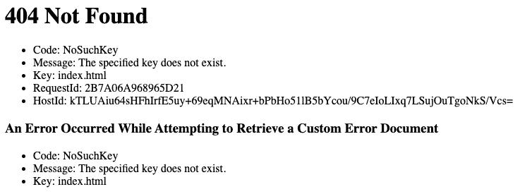

# 部署到 AWS -帮助

> 原文：<https://dev.to/sofiajonsson/deploying-to-aws-help-2556>

几个月前，在我的熨斗时代，我决定创建一个将你的应用程序部署到 Heroku 的指南:[https://dev . to/sofiajonsson/deploying-your-app-to-Heroku-ob6](https://dev.to/sofiajonsson/deploying-your-app-to-heroku-ob6)Heroku 是一个很棒的免费平台，但你花钱买的不是一个快速响应的网站。

我正在使用 S3 和 route 53 通过 Amazon Web Services (AWS)上传我的投资组合网站，在让我的静态端点显示上传的应用程序时遇到了一个问题。我花了几个小时浏览博客帖子和 StackOverflow，有些事情我不明白。我看到的不是我的网站，而是 404 NoSuchKey 错误:

我一直关注的 YouTube 教程建议将我的端点设置为 index.html，但这不起作用，我认为这是因为该文件嵌套在我的其他 React.js 文件中？我还尝试使用 index.js，因为这样更有意义，但是遇到了同样的问题。当我试图提供一个直接的位置，如“src/index.js”或“public/index.html”时，我会得到以下错误:

从我收集的信息来看，AWS 非常适合托管静态站点，并建议使用普通的 JS，那么这可能是问题吗？

我很想听听你使用 S3 和 53 号公路上传到 AWS 的经历，以及你可能有的任何提示或技巧。我将继续致力于此，并希望在其他人遇到这个问题的情况下，继续发布一个概述的帖子。