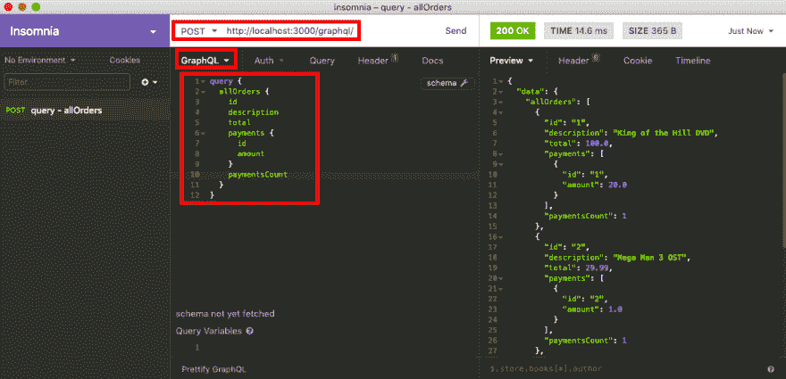
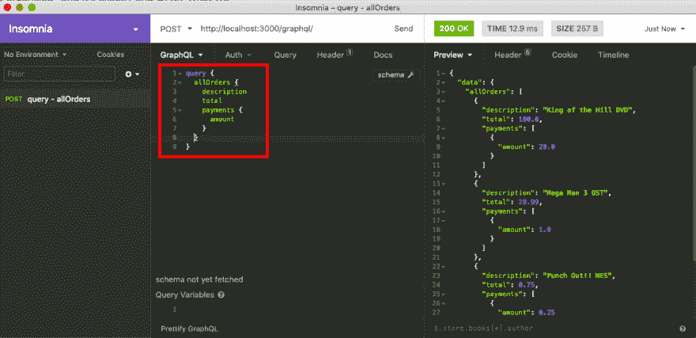

# Ruby on Rails GraphQL API 教程:从“rails new”到首次查询

> 原文：<https://dev.to/isalevine/ruby-on-rails-graphql-api-tutorial-from-rails-new-to-first-query-76h>

本周，我一直在做一个带回家的技术挑战，要求我深入研究 GraphQL 并创建一个简单的 API。我以前从未使用过 GraphQL，所以我选择继续使用 Ruby on Rails 来学习它。

本教程旨在逐步介绍使用 Ruby on Rails 和[Ruby gem‘graph QL’](https://graphql-ruby.org/)创建 GraphQL API 的步骤。

它很大程度上改编自马特·博尔特 的[这本令人惊叹的教程，有一些显著的不同:](https://mattboldt.com/2019/01/07/rails-and-graphql/)

*   我将使用[失眠休息客户端](https://insomnia.rest/)进行 API 调用，而不是[的“图形语言”IDE](https://github.com/graphql/graphiql) - *如果你还没有安装，现在就开始安装吧！*

*   我将从简单的`Order`和`Payment`模型开始，但是最终(在以后的文章中)会扩展到更复杂的关系(并且实现一些特性，比如直接在模型和`has_many`声明上使用定制方法过滤对象)

*   我将探索 GraphQL 中的**【幂等】**作为突变的一部分(在以后的文章中)，使用 Todd Jefferson 的这篇优秀文章中提到的策略

# 概述

在第一篇文章中，我们将逐步完成以下任务:

*   创建一个 Rails API
*   添加一些模型
*   添加图表 QL
*   编写并执行我们的第一个 GraphQL 查询

GraphQL 有两种与数据库交互的方式

1.  **查询**——这允许我们获取数据(CRUD 中的“读取”)
2.  **突变**——这允许我们改变信息，包括添加、更新或删除数据(CRUD 中的“创建”、“更新”、“销毁”)

我们将继续关注 API 的运行，并理解我们的第一个简单查询。

让我们开始吧！

# 什么是 GraphQL？

GraphQL 是一种查询语言，我们可以用它来获取和改变数据库中的数据。通过指定要返回的特定模型和字段，用户可以在很大程度上控制要返回的数据。它也是强类型的，所以你确切地知道你正在接收什么样的数据！

在项目网站上阅读更多关于 GraphQL 的信息。

GraphQL 是独立于语言的，所以我们将使用的 Ruby 实现是[Ruby gem‘graph QL’](https://graphql-ruby.org/)。这为我们提供了一个特定的文件结构和一些命令行工具，可以轻松地将 GraphQL 功能添加到我们的 Rails API 中。

# 创建 Rails 应用

### 【rails new】

在终端中运行以下命令，创建一个名为 **devto-graphql-ruby-api** 的新 Rails 项目。您可以随意省略这些跳过标志，但是它们都不会被使用:

`$ rails new devto-graphql-ruby-api --skip-yarn --skip-action-mailer --skip-action-cable --skip-sprockets --skip-coffee --skip-javascript --skip-turbolinks --api`

### 生成模型

在目录中，让我们创建我们的`Order`和`Payment`模型:

```
$ rails g model Order description:string total:float
$ rails g model Payment order_id:integer amount:float 
```

我更喜欢手动设置我的 has _ many _ belong _ to 关系，所以让`Payment` s 属于一个`Order` :

```
# app/models/order.rb
class Order < ApplicationRecord
    has_many :payments
end 
```

```
# app/models/payment.rb
class Payment < ApplicationRecord
    belongs_to :order
end 
```

### 创建数据库

运行`$ rails db:create`创建(默认)SQLite3 开发数据库。

### 运行迁移

运行`$ rails db:migrate`将我们的模型添加到数据库中。

### 添加种子数据

添加几个示例对象作为我们数据库的种子:

```
# db/seeds.rb
order1 = Order.create(description: "King of the Hill DVD", total: 100.00)
order2 = Order.create(description: "Mega Man 3 OST", total: 29.99)
order3 = Order.create(description: "Punch Out!! NES", total: 0.75)

payment1 = Payment.create(order_id: order1.id, amount: 20.00)
payment2 = Payment.create(order_id: order2.id, amount: 1.00)
payment3 = Payment.create(order_id: order3.id, amount: 0.25) 
```

然后运行`$ rails db:seed`将数据添加到数据库中。

现在我们准备开始在我们的模型上添加 GraphQL 了！

# 添加 GraphQL

### 将‘graph QL’gem 添加到 Gemfile

```
# Gemfile
gem 'graphql' 
```

然后运行`$ bundle install`在 app 中安装 gem。

### 用‘rails generate’安装 GraphQL

运行`$ rails generate graphql:install`。这将把`/graphql/`目录添加到应用程序的主目录中，同时在`/controllers/graphql_controller.rb`添加一个 GraphQL 特定的控制器。

### 为模型添加 GraphQL 对象

我们现在需要创建 GraphQL 对象来匹配我们的模型:

`$ rails generate graphql:object order`
T1】

# 填写新的 GraphQL 文件

好了，我们现在有了构建第一个查询所需的所有文件和目录！但是，其中一些文件仍然需要更多的代码。

### 定义 GraphQL 类型及其字段

GraphQL 类型是用告诉我们可以从中获得什么数据的字段定义的:

```
# app/graphql/types/payment_type.rb
module Types
    class PaymentType < Types::BaseObject
        field :id, ID, null: false
        field :amount, Float, null: false
    end
end 
```

这允许我们检索包含一个`id`字段(带有一个特殊的 ID 主键)和一个将是浮点型的`amount`字段的`PaymentType`对象。因为两者都被设置为`null: false`，所以在任一字段中接收到带有`nil`的查询响应都会抛出一个错误。

我们的 GraphQL 对象继承自 Types::BaseObject。因此，当我们定义我们的`class PaymentType < Types::BaseObject`时，我们现在有一个`Types::PaymentType`可用。我们可以使用这些自定义类型来定义从每个字段中获取的内容。

让我们来看看如何在`OrderType` :
中使用`Types::PaymentType`

```
# app/graphql/types/order_type.rb
module Types
    class OrderType < Types::BaseObject
        field :id, ID, null: false
        field :description, String, null: false
        field :total, Float, null: false
        field :payments, [Types::PaymentType], null: false
        field :payments_count, Integer, null: false

        def payments_count
            object.payments.size
        end
    end
end 
```

这里需要注意几件事:

*   因为`Order`模型有`id`、`description`和`total`的列，我们可以简单地为它们创建一个字段并检索它们的数据。
*   由于我们的 has _ many-belong _ to 关系，我们还可以创建一个`payments`字段来返回属于每个`Order`的所有`Types::PaymentType`对象。
*   然而，`Order`没有`payments_count`列——所以我们定义了一个`payments_count()`方法来返回一个长度为`payments`数组的整数。
    *   注意:在这些自定义字段方法中，我们需要通过 **`object.payments`** 访问`Order`的`payments`——不要忘记关键的`object`！

### 在 QueryType 上定义字段

我们几乎已经准备好编写第一个查询了，但是首先，我们需要告诉主 QueryType 可以预期它。当 GraphQL 接收到一个查询请求(与突变请求相反)时，它将被路由到 QueryType 类。与上面的类型一样，我们将通过字段定义可能的查询方法。

我们的第一个查询将只是检索数据库中的所有`Order`。在`class QueryType`声明中，我们将添加一个返回数组`Types::OrderType` :
的字段

```
# app/graphql/types/query_type.rb
module Types
    class QueryType < Types::BaseObject
        field :all_orders, [Types::OrderType], null: false

        def all_orders
            Order.all
        end
    end
end 
```

如上所述，我们在同名字段下定义了我们的`all_orders()`方法，并告诉它隐式返回所有的`Order`。

一切都准备好了！我们可以打开失眠症，编写我们的第一个查询，从数据库中取回所有的`Order`。

# 编写我们的第一个查询

### [图 QL 查询格式](#graphql-query-format)

下面是我们的第一个查询:

```
query  {  allOrders  {  id  description  total  payments  {  id  amount  }  paymentsCount  }  } 
```

在顶部，我们将请求定义为一个`query {}`。

在查询内部，我们通过`allOrders {}`调用查询类型的`all_orders`。是的，别忘了从蛇皮包换成骆驼皮包！

在`allOrders {}`中，我们从`Order`模型中选择想要返回的字段。这些是我们在`app/graphql/types/order_type.rb`中定义的相同字段。你可以挑选你想收到的！

注意，对于我们的`payments {}`字段，我们还必须定义我们想要接收的来自`Types::PaymentType`的字段。可用的字段是我们在`app/graphql/types/payment_type.rb`中定义的字段。

`paymentsCount`字段将在`Types::OrderType`上运行`payments_count`方法，并返回适当的值。

让我们把这个查询放到失眠症中，并测试我们的 API！

### 执行失眠查询

运行`$ rails s`在[http://localhost:3000/graph QL](http://localhost:3000/graphql)启动 Rails API 服务器。

打开失眠症，并创建一个新的帖子请求。在请求文本编辑器的左上角，确保 POST 请求的格式设置为“GraphQL Query”。

继续添加上面`query`中的代码。然后发送它，看看它会返回什么:

[](https://res.cloudinary.com/practicaldev/image/fetch/s--58HM_nme--/c_limit%2Cf_auto%2Cfl_progressive%2Cq_auto%2Cw_880/https://thepracticaldev.s3.amazonaws.com/i/p57k51mvolx8j1ezvpj6.png)

呜！我们的数据都很好，很有条理——这正是我们所要求的！

让我们运行一个类似的查询，但是使用更少的字段:

```
query  {  allOrders  {  description  total  payments  {  amount  }  }  } 
```

结果:

[](https://res.cloudinary.com/practicaldev/image/fetch/s--V0NypNuH--/c_limit%2Cf_auto%2Cfl_progressive%2Cq_auto%2Cw_880/https://thepracticaldev.s3.amazonaws.com/i/cf1vcwra6ofmt3yph6k9.png)

完美！如果我们不需要`id`或`paymentsCount`，那么根本不需要在查询中包含它们！

# 结论

我们现在有了一个非常简单的 API 来使用 GraphQL 从数据库中查询数据！然而，由于 GraphQL 查询只能*检索*数据，我们不能使用当前代码对数据库进行任何*更改*。

这就是突变出现的原因！我们将在下一期文章中讨论这个问题。；)

[这也是本文中代码的回购。请随意修改它！](https://github.com/isalevine/devto-graphql-ruby-api)

再次感谢 ***马特·博尔特*** 和[他令人敬畏的 Rails GraphQL 教程](https://mattboldt.com/2019/01/07/rails-and-graphql/)帮助我走到这一步！< 3

对于在 Rails 中使用 GraphQL，或者一般情况下使用 GraphQL，有什么技巧或建议吗？欢迎在下面投稿！