# 嵌套的群集，包括火烈鸟、火烈鸟、容器、小孩和牧场主…

> 原文:# t0]https://dev . to/deep 75/des-cluster-kublanks-with-ignite fire cracker-container d-child-and-ranch-3k7

[T2】](https://res.cloudinary.com/practicaldev/image/fetch/s--HVxjaw2v--/c_limit%2Cf_auto%2Cfl_progressive%2Cq_auto%2Cw_880/https://cdn-images-1.medium.com/max/2314/1%2A49EQymfT3_G9k3dN8kbRCw.jpeg)

我以前在一篇文章中说过，燃烧的武器和脚镣不断发展:

[**在 Scaleway 中点燃并穿脚镣:当虚拟机认为自己是…**
*Weave 在 Firecracker 的基础上发展了点火装置，它作为坞站管理 runC 容器。点火装置…*medium.com](https://medium.com/@abenahmed1/weave-ignite-et-weave-footloose-dans-scaleway-quand-les-machines-virtuelles-se-prennent-pour-des-e28f5312a59f)

现在，一个新版本的点火装置取代了 Containerd 和 CNI 的 Docker 引擎:

[**Ignite 文档- Ignite 文档**
*在此文件夹中，您可以阅读有关如何使用 Ignite 及其工作原理的更多信息:*ignite.readthedocs.io](https://ignite.readthedocs.io/en/stable/index.html)

[](https://res.cloudinary.com/practicaldev/image/fetch/s--iBzBE7rk--/c_limit%2Cf_auto%2Cfl_progressive%2Cq_auto%2Cw_880/https://cdn-images-1.medium.com/max/2000/0%2Ag_xmwUgw-R5PH_o-.png) 
[**用 Weave 点燃你的虚拟机**
*生日快乐 Weaveworks！今天我们五岁了！感觉我们老了:创业岁月有点像狗年……* www . weave . works](https://www.weave.works/blog/fire-up-your-vms-with-weave-ignite)

关注此新版本，开始在 Ubuntu 18.04 lt 运行的 Scaleway 中启动 C2L 裸机实例:

[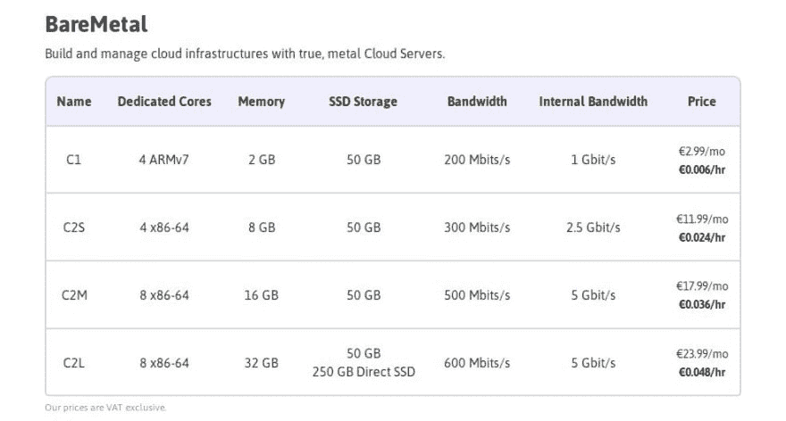T2】](https://res.cloudinary.com/practicaldev/image/fetch/s--mYY6VDZ4--/c_limit%2Cf_auto%2Cfl_progressive%2Cq_auto%2Cw_880/https://cdn-images-1.medium.com/max/2000/1%2ArCsGshDXuIoawYPxTxy-nQ.jpeg)

[T2】](https://res.cloudinary.com/practicaldev/image/fetch/s--C8Qplm7q--/c_limit%2Cf_auto%2Cfl_progressive%2Cq_auto%2Cw_880/https://cdn-images-1.medium.com/max/2688/1%2A3oan_n94XecAFj8BOsSnZQ.jpeg)

> 请注意，Scaleway 还允许您测试专用箱服务器，并按常规实例按小时收费:

[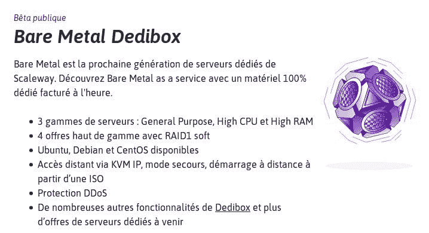T2】](https://res.cloudinary.com/practicaldev/image/fetch/s--IxquZ9vM--/c_limit%2Cf_auto%2Cfl_progressive%2Cq_auto%2Cw_880/https://cdn-images-1.medium.com/max/2000/1%2AJtc5fuMaEZD0Stxv4A0xTg.jpeg)

我将使用第二个 250 go 磁盘为 Containerd 引擎创建一个装载点。需要的虚拟化扩展已激活:

[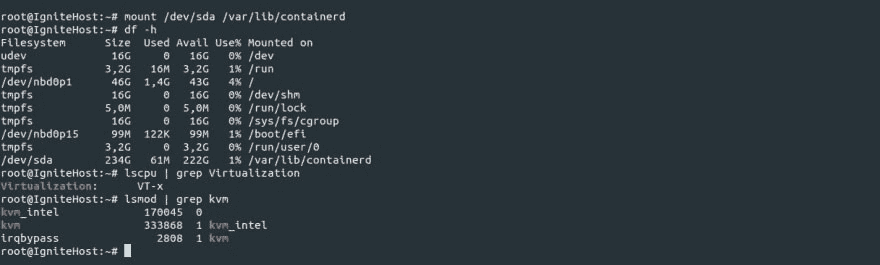T2】](https://res.cloudinary.com/practicaldev/image/fetch/s--pvRgZpvo--/c_limit%2Cf_auto%2Cfl_progressive%2Cq_auto%2Cw_880/https://cdn-images-1.medium.com/max/2434/1%2AI1hs5LiZ0FM5vqRPR2nS2w.jpeg)

在 Scaleway 的此实例上，我将安装所需的依赖项:

```
$ apt-get update && apt-get install -y --no-install-recommends containerd dmsetup openssh-client git binutils 
```

[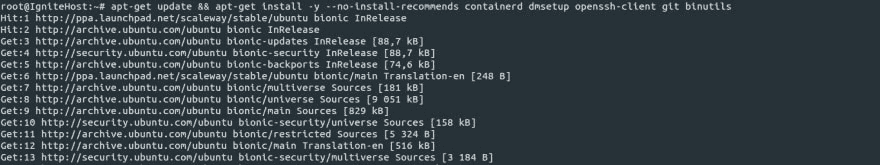T2】](https://res.cloudinary.com/practicaldev/image/fetch/s--IqhneqLG--/c_limit%2Cf_auto%2Cfl_progressive%2Cq_auto%2Cw_880/https://cdn-images-1.medium.com/max/2730/1%2Ag4dmaOH3CDu3Q8Vl5Sa9Qw.jpeg)

然后是 CNI 所需的二进制文件:

```
$ export CNI_VERSION=v0.8.2
$ export ARCH=$([ $(uname -m) = "x86_64" ] && echo amd64 || echo arm64)
$ mkdir -p /opt/cni/bin

$ curl -sSL https://github.com/containernetworking/plugins/releases/download/${CNI_VERSION}/cni-plugins-linux-${ARCH}-${CNI_VERSION}.tgz | tar -xz -C /opt/cni/bin 
```

点火跟踪:

```
$ for binary in ignite ignited; do
    echo "Installing ${binary}..."
    curl -sfLo ${binary} [https://github.com/weaveworks/ignite/releases/download/${VERSION}/${binary}-${GOARCH](https://github.com/weaveworks/ignite/releases/download/${VERSION}/${binary}-${GOARCH)}
    chmod +x ${binary}
    mv ${binary} /usr/bin
done 
```

[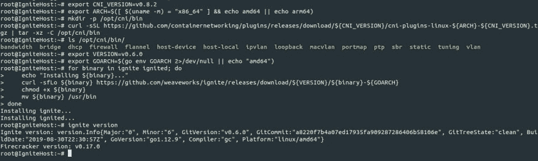T2】](https://res.cloudinary.com/practicaldev/image/fetch/s--sgkuiVE_--/c_limit%2Cf_auto%2Cfl_progressive%2Cq_auto%2Cw_880/https://cdn-images-1.medium.com/max/2722/1%2AkIOWsVsSyoyzc7orTYk-bQ.jpeg)

Weave Ignite 是一个开源虚拟机(VM)管理器，具有一个 UX 容器和集成的 GitOps 管理。Ignite 将 fire cracker micro 与 Docker / OCI 映像结合起来，以统一容器和虚拟机。Ignite 可以自动和显式地管理 VM，如 kubernetes 和 Terraform。

[**鞭炮**
*鞭炮是一种开源虚拟化技术，专门用于创建和管理安全……*鞭炮-microvm.github.io](https://firecracker-microvm.github.io/)

请记住，Firecracker 是 AWS 的开放原始码 KVM 实作，针对安全性、隔离性、速度和低资源消耗进行最佳化。AWS 将其用作其无服务器产品(AWS Lambda 和 Fargate)的基础，这些产品几乎需要立即加载，同时保持用户的隔离(多位置)。Firecracker 已经证明它能够在同一台主机上运行 4000 个虚拟机！……

[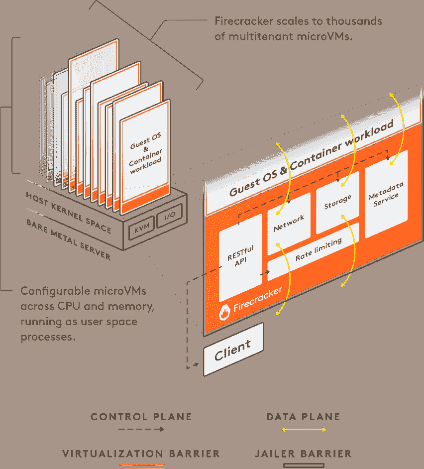T2】](https://res.cloudinary.com/practicaldev/image/fetch/s--O9-SxeyX--/c_limit%2Cf_auto%2Cfl_progressive%2Cq_auto%2Cw_880/https://cdn-images-1.medium.com/max/2000/0%2A9CNwSy82DkTCCOm6.png)

[T2】](https://res.cloudinary.com/practicaldev/image/fetch/s--Tdy4snCl--/c_limit%2Cf_auto%2Cfl_progressive%2Cq_auto%2Cw_880/https://cdn-images-1.medium.com/max/2000/0%2Az0NQsi87UyrDsS7k.jpg)

我将使用坞站集线器中 Weaveworks 提供的 Ubuntu 映像来启动第一个微型虚拟机** *但不使用坞站** *(仅含点火、容器和 CNI 插件) :

```
$ ignite run weaveworks/ignite-ubuntu \
    --cpus 2 \
    --memory 8GB \
    --ssh \
    --size 50GB \
    --name k8s1 
```

[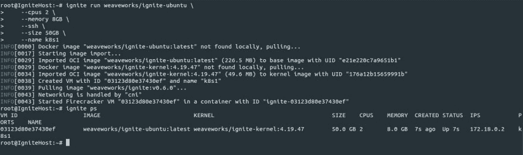T2】](https://res.cloudinary.com/practicaldev/image/fetch/s--n1TIx3S1--/c_limit%2Cf_auto%2Cfl_progressive%2Cq_auto%2Cw_880/https://cdn-images-1.medium.com/max/2726/1%2AcNVnAcj7NQrYqlvCm5BUKQ.jpeg)

我可以通过 SSH 直接连接到:

[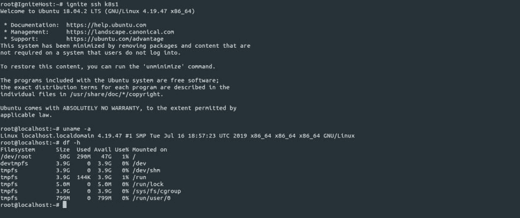T2】](https://res.cloudinary.com/practicaldev/image/fetch/s--eaVMd7rs--/c_limit%2Cf_auto%2Cfl_progressive%2Cq_auto%2Cw_880/https://cdn-images-1.medium.com/max/2694/1%2AgczUvQwrESVFouqB8Il8xQ.jpeg)

我将正确的 DNS 条目(例如使用 Google 的 DNS 条目)放在文件“*”/etc/resolv . conf“*”中:

[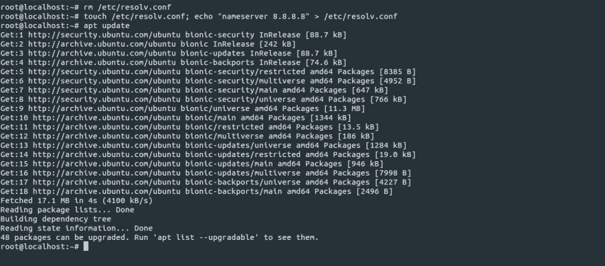T2】](https://res.cloudinary.com/practicaldev/image/fetch/s--fFjO6Taq--/c_limit%2Cf_auto%2Cfl_progressive%2Cq_auto%2Cw_880/https://cdn-images-1.medium.com/max/2358/1%2Ak7jWI1-Hy0z5czZz3H0LYQ.jpeg)

为了安装子引擎，我在这台微型机器上安装了对接引擎:

```
$ curl -fsSL [https://get.docker.com](https://get.docker.com) -o get-docker.sh; sh get-docker.sh; systemctl enable docker; systemctl start docker 
```

[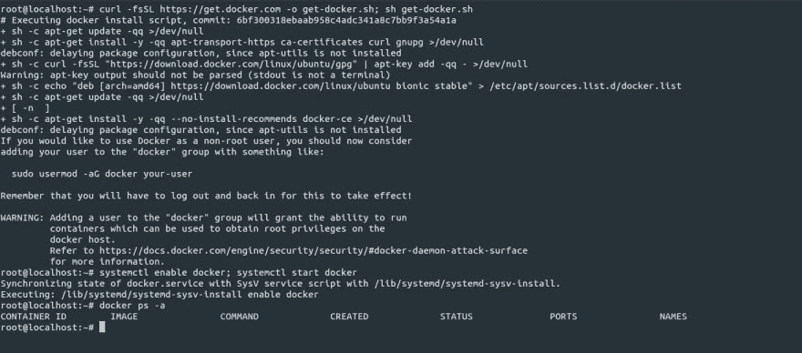T2】](https://res.cloudinary.com/practicaldev/image/fetch/s--UPWN8hYI--/c_limit%2Cf_auto%2Cfl_progressive%2Cq_auto%2Cw_880/https://cdn-images-1.medium.com/max/2628/1%2APylDn3r-eFr9HhAlQQ4gKA.jpeg)

然后，我可以从孩子在 Github 上的仓库中取出孩子…

[**kind**
*如果您想开始使用 kind，请查看我们的用户指南。在这里，您将找到让您开始工作的所有细节……* kind . sigs . k8s . io](https://kind.sigs.k8s.io/docs)
[**kubernetes-sigs/kind**
*此时您无法执行该操作。您已使用另一个标签页或窗口登录。您已在另一个标签页或…*github.com](https://github.com/kubernetes-sigs/kind/releases) 中注销

[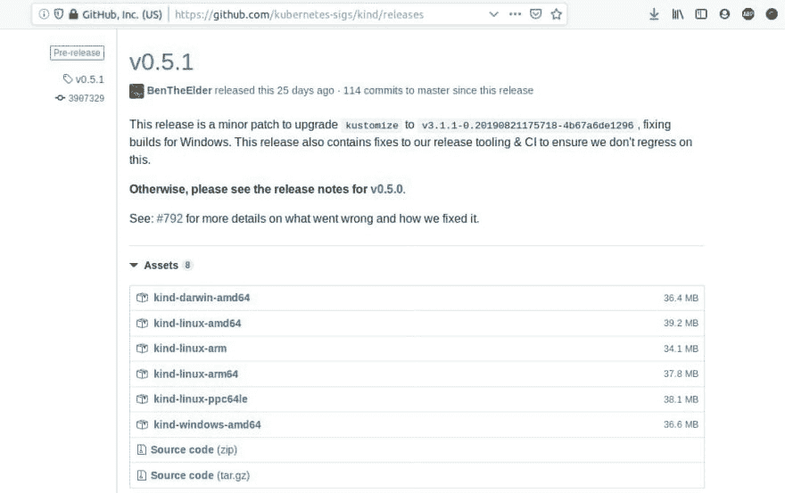T2】](https://res.cloudinary.com/practicaldev/image/fetch/s--Wk2hUa-i--/c_limit%2Cf_auto%2Cfl_progressive%2Cq_auto%2Cw_880/https://cdn-images-1.medium.com/max/2136/1%2AWlUbCx3XdnsZRc3W3Q6zUQ.jpeg)

部署它...

[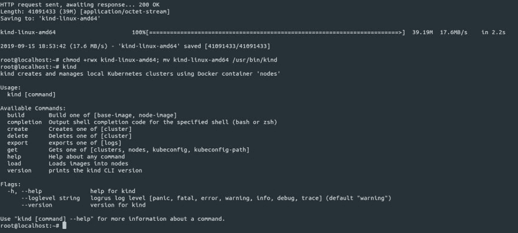T2】](https://res.cloudinary.com/practicaldev/image/fetch/s--sDyCyY8r--/c_limit%2Cf_auto%2Cfl_progressive%2Cq_auto%2Cw_880/https://cdn-images-1.medium.com/max/2694/1%2A5Wd4dhnA4tF-HDMGSBnSwQ.jpeg)

> child(dock 中的库项目)是一种工具，可让您使用容器形式的「节点」来执行本机库项目丛集。kind 最初的设计主要是为了测试 kubi net 1.11 和更高版本，包括合规性测试。

要重新调用，请执行以下操作:

*   kind 支持多节点群集(包括 HA)

*   child 除了预先发布的构建外，还支持从源“
    ”生成/ bash / docker 或 bazel。

*   子是用 GB 写的，可以用作图书馆，并且有稳定的版本

*   kind 除了 MacOS 和 Linux 之外还支持 Windows

*   kind 是一个经过 CNCF 认证的 kublers 安装程序

我将使用以下 YAML 配置文件创建一个包含三个节点(一个主节点和两个工作节点)的子群集:

[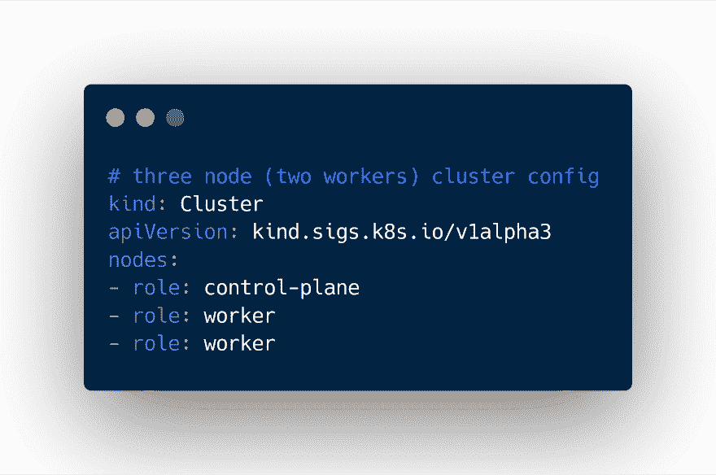T2】](https://res.cloudinary.com/practicaldev/image/fetch/s--Zq5ibrAx--/c_limit%2Cf_auto%2Cfl_progressive%2Cq_auto%2Cw_880/https://cdn-images-1.medium.com/max/3824/1%2Ab975W-e9KdgBqKc91tHeJA.png)

```
$ kind create cluster --config config.yaml 
```

[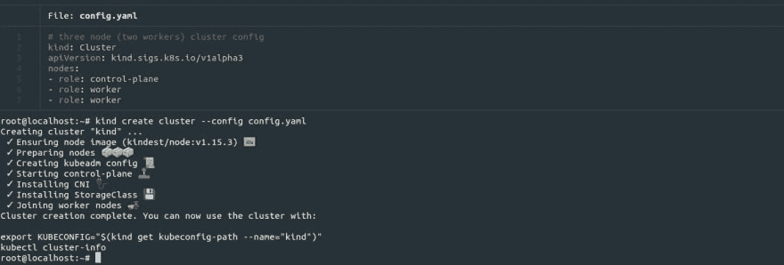T2】](https://res.cloudinary.com/practicaldev/image/fetch/s--Y-4LHYFd--/c_limit%2Cf_auto%2Cfl_progressive%2Cq_auto%2Cw_880/https://cdn-images-1.medium.com/max/2676/1%2A0VhNryoGiAUryJ5t1D1-yw.jpeg)

群集处于活动状态，我将安装 kubectl 客户端以与它交互:

```
$ curl -LO [https://storage.googleapis.com/kubernetes-release/release/v1.15.3/bin/linux/amd64/kubectl](https://storage.googleapis.com/kubernetes-release/release/v1.15.3/bin/linux/amd64/kubectl); chmod +rwx kubectl; mv kubectl /usr/bin

$ export KUBECONFIG="$(kind get kubeconfig-path --name="kind")" 
```

[T2】](https://res.cloudinary.com/practicaldev/image/fetch/s--2JD0-gEd--/c_limit%2Cf_auto%2Cfl_progressive%2Cq_auto%2Cw_880/https://cdn-images-1.medium.com/max/2722/1%2AkH0rmbU4FGnh4tyNbRvtdQ.jpeg)

我第一次测试所需的带小孩金属部署:

[**将 MetalLb 与 kind 一起使用**
*序言:将 metallb 与 Kind 一起使用时，我们将在 l2 模式下部署它。这意味着我们需要能够…* maui lion . dev](https://mauilion.dev/posts/kind-metallb/)
[**metal lb**
* metal lb 是裸机 Kubernetes 集群的负载平衡器实现，使用标准路由协议。metal lb…* metal lb . universe . TF](https://metallb.universe.tf/)

```
$ kubectl apply -f https://raw.githubusercontent.com/google/metallb/v0.8.1/manifests/metallb.yaml 
```

使用此内部寻址计划配置 172.17.0.0/16:

[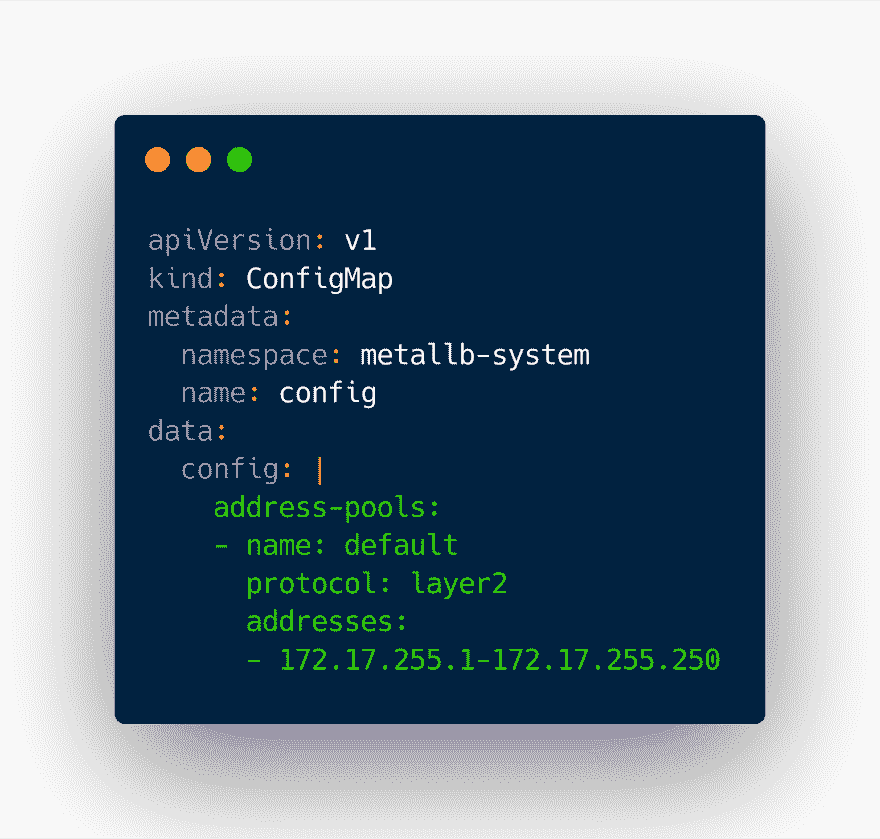T2】](https://res.cloudinary.com/practicaldev/image/fetch/s--coJF23ut--/c_limit%2Cf_auto%2Cfl_progressive%2Cq_auto%2Cw_880/https://cdn-images-1.medium.com/max/3440/1%2AOXTvJFPLTP4sd0xEpb8W1A.png)

现在，我可以使用传统的 FC 演示程序:

[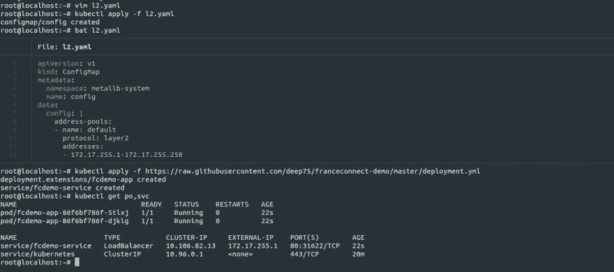T2】](https://res.cloudinary.com/practicaldev/image/fetch/s--45_qh1YK--/c_limit%2Cf_auto%2Cfl_progressive%2Cq_auto%2Cw_880/https://cdn-images-1.medium.com/max/2670/1%2AYHZ38B48D1lVIYEvqffjWg.jpeg)

[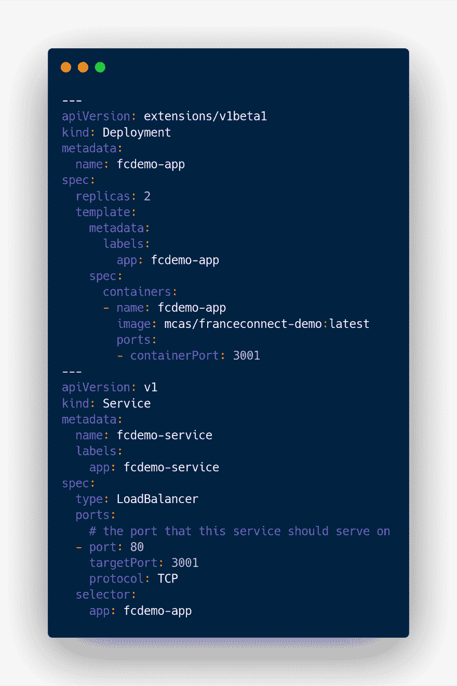T2】](https://res.cloudinary.com/practicaldev/image/fetch/s--Yb7SRxfe--/c_limit%2Cf_auto%2Cfl_progressive%2Cq_auto%2Cw_880/https://cdn-images-1.medium.com/max/2136/1%2ALDPabaFN8NKyRyacSNWxlw.png)

metallb 为 FC 演示程序指定了 IP 地址:

[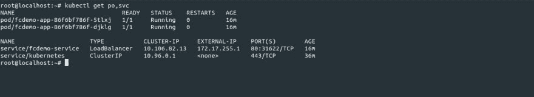T2】](https://res.cloudinary.com/practicaldev/image/fetch/s--9ScuWwMY--/c_limit%2Cf_auto%2Cfl_progressive%2Cq_auto%2Cw_880/https://cdn-images-1.medium.com/max/2686/1%2Ajq_7j1YVp3alIyJKSn164g.jpeg)

重复使用子丛集中的可用、开放原始码、最小化负载平衡器和反向代理:

[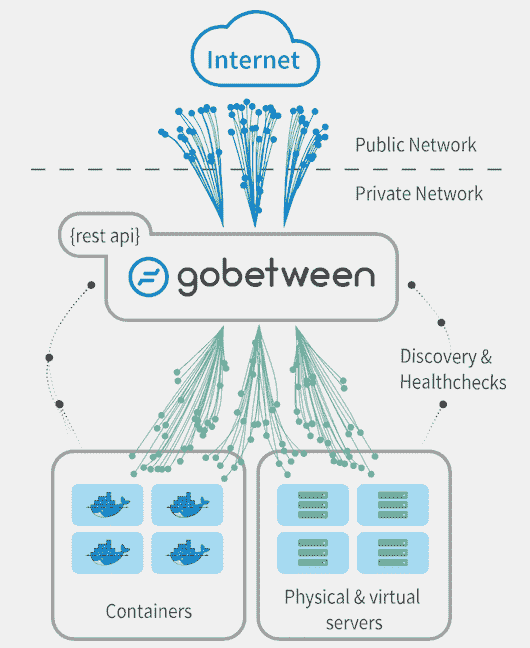T2】](https://res.cloudinary.com/practicaldev/image/fetch/s--mSWSb9gQ--/c_limit%2Cf_auto%2Cfl_progressive%2Cq_auto%2Cw_880/https://cdn-images-1.medium.com/max/2000/0%2AyyLxfuAF7ipMu7Jz.png)

```
$ curl -s https://api.github.com/repos/yyyar/gobetween/releases | grep browser_download_url | grep linux_amd64 | cut -d '"' -f 4 | head -n 1 | wget -i - 
```

[**gobetween - modern &极简 L4 负载平衡器**
*gobetween 是免费、开源的现代&极简 L4 负载平衡器，是云时代的反向代理。玩得不错……* gobetween . io](http://gobetween.io/index.html)

它将用于允许我通过 metallb 指定的内部 IP 地址从外部访问演示程序。为此，我使用以下 gobetween 的 TOML 配置:

[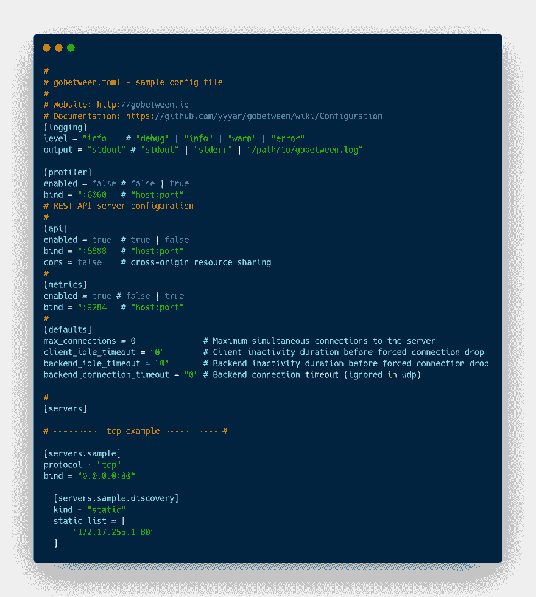T2】](https://res.cloudinary.com/practicaldev/image/fetch/s--E6tCf89a--/c_limit%2Cf_auto%2Cfl_progressive%2Cq_auto%2Cw_880/https://cdn-images-1.medium.com/max/3544/1%2Afa4I8tk0_FK-SUGR4CAVsQ.png)

我可以用这个配置启动 gotbetween:

```
$ gobetween -c config/gobetween.toml 
```

[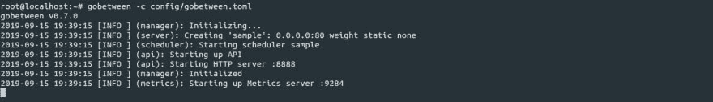T2】](https://res.cloudinary.com/practicaldev/image/fetch/s--QcXU2M5d--/c_limit%2Cf_auto%2Cfl_progressive%2Cq_auto%2Cw_880/https://cdn-images-1.medium.com/max/2654/1%2AKzpEGXBSeXqboajf1ZQAXA.jpeg)

我还将这台微型机器连接到零级网络，这样我就可以从浏览器访问演示程序:

[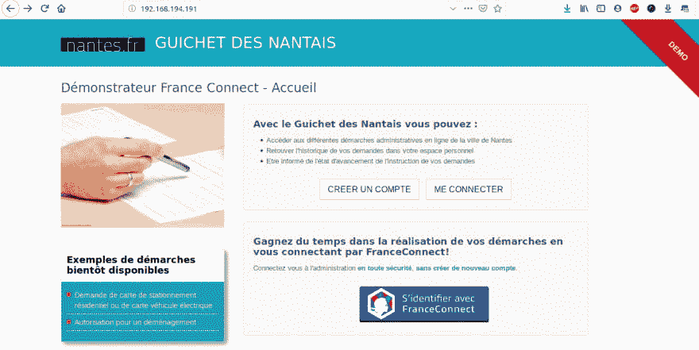T2】](https://res.cloudinary.com/practicaldev/image/fetch/s--s-xJeIIE--/c_limit%2Cf_auto%2Cfl_progressive%2Cq_auto%2Cw_880/https://cdn-images-1.medium.com/max/2666/1%2Avl_B4Mq10IssIqYECaaGhQ.jpeg)

> gobetween 可以激活其 peut 风格的 API 以获取更多信息:

[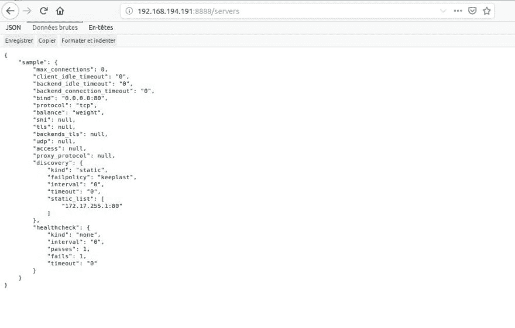T2】](https://res.cloudinary.com/practicaldev/image/fetch/s--rwQVYvfQ--/c_limit%2Cf_auto%2Cfl_progressive%2Cq_auto%2Cw_880/https://cdn-images-1.medium.com/max/2008/1%2AIqOfpqdLZVlzOo1g3BNF4Q.jpeg)

启动第二个微 VM，用于承载第二个带子群集:

[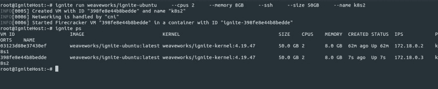T2】](https://res.cloudinary.com/practicaldev/image/fetch/s--uELKUqhS--/c_limit%2Cf_auto%2Cfl_progressive%2Cq_auto%2Cw_880/https://cdn-images-1.medium.com/max/2720/1%2ARK7DgVfP3wSI0L3R4EKAEQ.jpeg)

[T2】](https://res.cloudinary.com/practicaldev/image/fetch/s--MEK3-DWN--/c_limit%2Cf_auto%2Cfl_progressive%2Cq_auto%2Cw_880/https://cdn-images-1.medium.com/max/2000/0%2AOKotEgdkDHZgIR29.jpg)

到三个节点(一个主节点和两个工作节点) :

[T2】](https://res.cloudinary.com/practicaldev/image/fetch/s--Zq5ibrAx--/c_limit%2Cf_auto%2Cfl_progressive%2Cq_auto%2Cw_880/https://cdn-images-1.medium.com/max/3824/1%2Ab975W-e9KdgBqKc91tHeJA.png)

[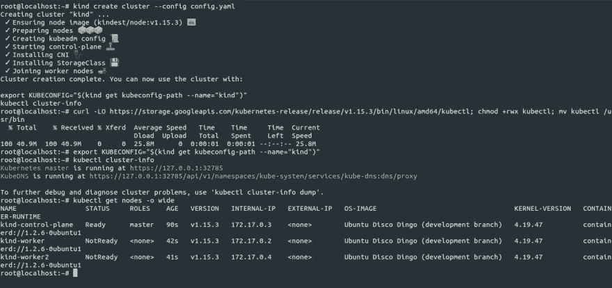T2】](https://res.cloudinary.com/practicaldev/image/fetch/s--HFZXPDRj--/c_limit%2Cf_auto%2Cfl_progressive%2Cq_auto%2Cw_880/https://cdn-images-1.medium.com/max/2722/1%2Aq4YBNuNzGyxuKhgl1xU6EQ.jpeg)

再加上金属:

[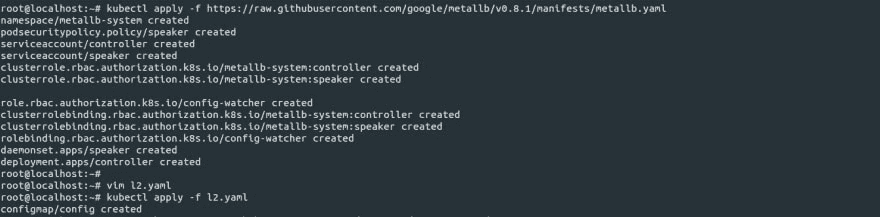T2】](https://res.cloudinary.com/practicaldev/image/fetch/s--_Q6u_dkf--/c_limit%2Cf_auto%2Cfl_progressive%2Cq_auto%2Cw_880/https://cdn-images-1.medium.com/max/2688/1%2AZKOdbHUbhpim4UoU19ZgQQ.jpeg)

这一次，我们部署了第二个 FC 演示程序:

[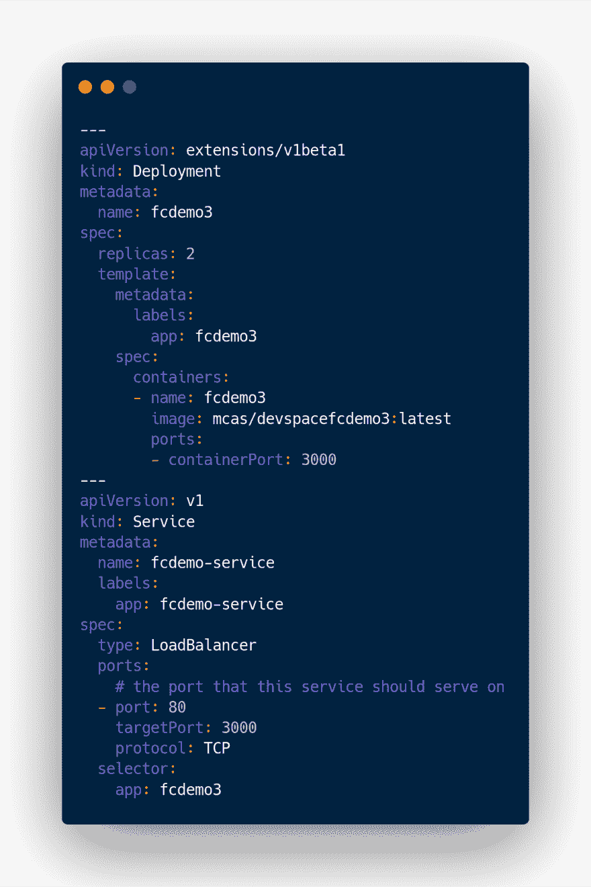T2】](https://res.cloudinary.com/practicaldev/image/fetch/s--XoA2s8ev--/c_limit%2Cf_auto%2Cfl_progressive%2Cq_auto%2Cw_880/https://cdn-images-1.medium.com/max/2136/1%2As_ezqVKKjjwG8BZR88VJUA.png)

金属提供内部 IP 地址以访问演示程序:

[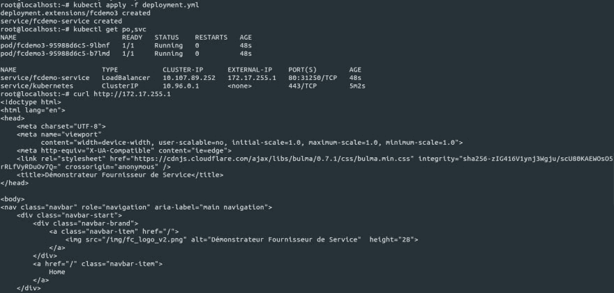T2】](https://res.cloudinary.com/practicaldev/image/fetch/s--6tIj8QyB--/c_limit%2Cf_auto%2Cfl_progressive%2Cq_auto%2Cw_880/https://cdn-images-1.medium.com/max/2724/1%2AFQFgrMg_EDA-7tMw_j3eqQ.jpeg)

与以前一样，我将 gobetween 与 ZeroTier 链接的微 VM 重复使用:

[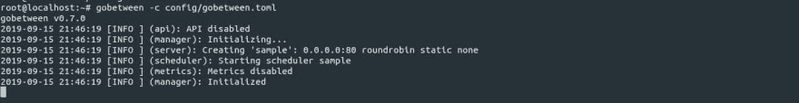T2】](https://res.cloudinary.com/practicaldev/image/fetch/s--id6sVdeK--/c_limit%2Cf_auto%2Cfl_progressive%2Cq_auto%2Cw_880/https://cdn-images-1.medium.com/max/2708/1%2A-gm9u8BX8p1DPhQcUcsT0Q.jpeg)

使用此 TOML 配置(与上一个配置非常相似) :

[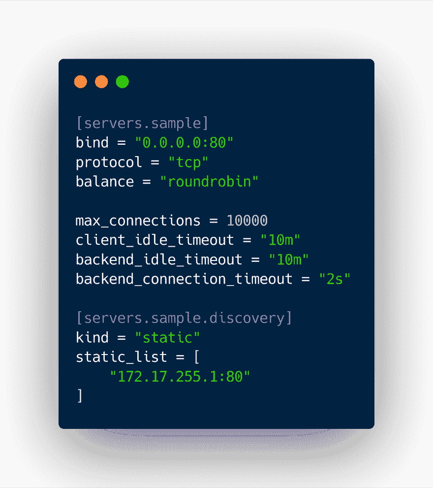T2】](https://res.cloudinary.com/practicaldev/image/fetch/s--X_pZYjza--/c_limit%2Cf_auto%2Cfl_progressive%2Cq_auto%2Cw_880/https://cdn-images-1.medium.com/max/3312/1%2A36NaFNf6h3j5b87jz7L8uA.png)

此第二个演示程序可通过在 ZeroTier 中预先配置的网络地址从浏览器访问:

[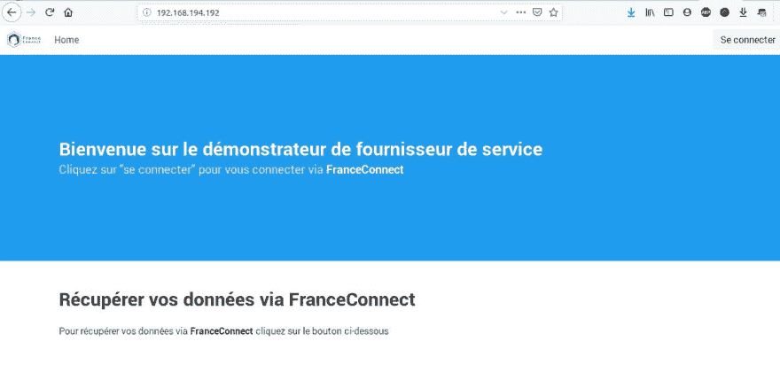T2】](https://res.cloudinary.com/practicaldev/image/fetch/s--aGXq4Fm9--/c_limit%2Cf_auto%2Cfl_progressive%2Cq_auto%2Cw_880/https://cdn-images-1.medium.com/max/2674/1%2ALZsZzsoSLTB5bKdO49XjLQ.jpeg)

启动最后一个虚拟机，用于托管牧场服务器:

[T2】](https://res.cloudinary.com/practicaldev/image/fetch/s--vWa4A14H--/c_limit%2Cf_auto%2Cfl_progressive%2Cq_auto%2Cw_880/https://cdn-images-1.medium.com/max/2672/1%2AnXhbCdiEqjFQ82gk0oTFLQ.jpeg)

安装 docker 引擎和 Rancher 服务器:

```
$ curl -fsSL [https://get.docker.com](https://get.docker.com) -o get-docker.sh; sh get-docker.sh; systemctl enable docker; systemctl start docker; docker run -d --restart=unless-stopped -p 80:80 -p 443:443 -v /opt/rancher:/var/lib/rancher rancher/rancher:latest 
```

[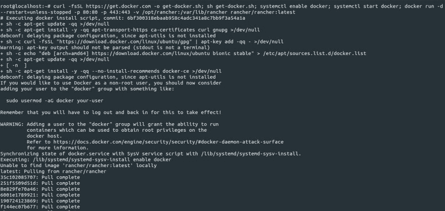T2】](https://res.cloudinary.com/practicaldev/image/fetch/s--QHREAHjM--/c_limit%2Cf_auto%2Cfl_progressive%2Cq_auto%2Cw_880/https://cdn-images-1.medium.com/max/2714/1%2At1Hm8LNQ7vcZoxDuwd_Yrg.jpeg)

然后，我可以导入我的两个库邦克群集，这两个库邦克群集是在兰彻的孩子的帮助下构建的。导入第一个 k8s1 群集:

[T2】](https://res.cloudinary.com/practicaldev/image/fetch/s--BSDGBrPs--/c_limit%2Cf_auto%2Cfl_progressive%2Cq_auto%2Cw_880/https://cdn-images-1.medium.com/max/2632/1%2AcxlTg6-LaUh32FNrkvFhNQ.jpeg)

[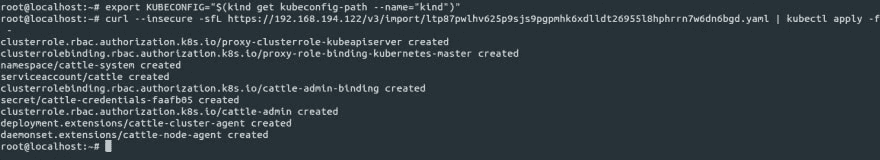T2】](https://res.cloudinary.com/practicaldev/image/fetch/s--MrfFSySm--/c_limit%2Cf_auto%2Cfl_progressive%2Cq_auto%2Cw_880/https://cdn-images-1.medium.com/max/2720/1%2AO0ykyiNP7TATfPhK6JM3ww.jpeg)

然后是名为 k8s2 的第二个群集:

[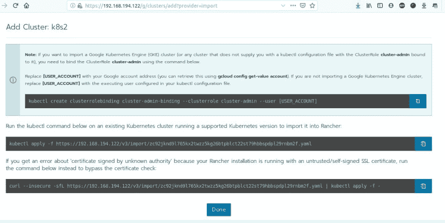T2】](https://res.cloudinary.com/practicaldev/image/fetch/s--XBiMqf7q--/c_limit%2Cf_auto%2Cfl_progressive%2Cq_auto%2Cw_880/https://cdn-images-1.medium.com/max/2590/1%2A-gfh-WScSGZWzLk8ygQmLw.jpeg)

[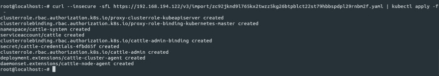T2】](https://res.cloudinary.com/practicaldev/image/fetch/s--6LynMenF--/c_limit%2Cf_auto%2Cfl_progressive%2Cq_auto%2Cw_880/https://cdn-images-1.medium.com/max/2724/1%2AD0wRFayKEtwFFwl2pOUAYA.jpeg)

所有群集都导入到蓝丘:

[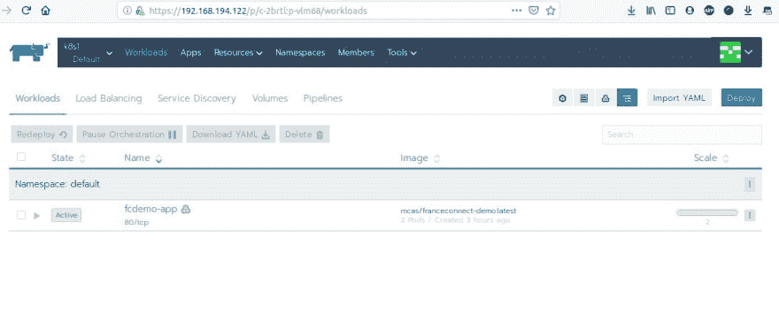T2】](https://res.cloudinary.com/practicaldev/image/fetch/s--9KJWquJR--/c_limit%2Cf_auto%2Cfl_progressive%2Cq_auto%2Cw_880/https://cdn-images-1.medium.com/max/2566/1%2AsgCcIEc2JInPXywCK9vZXQ.jpeg)

[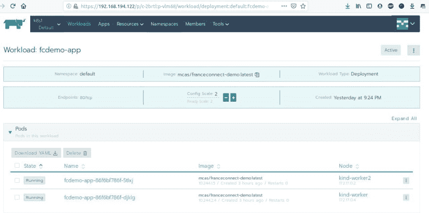T2】](https://res.cloudinary.com/practicaldev/image/fetch/s--_dWVm0gY--/c_limit%2Cf_auto%2Cfl_progressive%2Cq_auto%2Cw_880/https://cdn-images-1.medium.com/max/2554/1%2Ag1KoeOo3aAeyXJccWBkWZg.jpeg)

[T2】](https://res.cloudinary.com/practicaldev/image/fetch/s--Zb9TjXi---/c_limit%2Cf_auto%2Cfl_progressive%2Cq_auto%2Cw_880/https://cdn-images-1.medium.com/max/2640/1%2AHpO7MvTj_P8qBEH6p5Z5QQ.jpeg)

[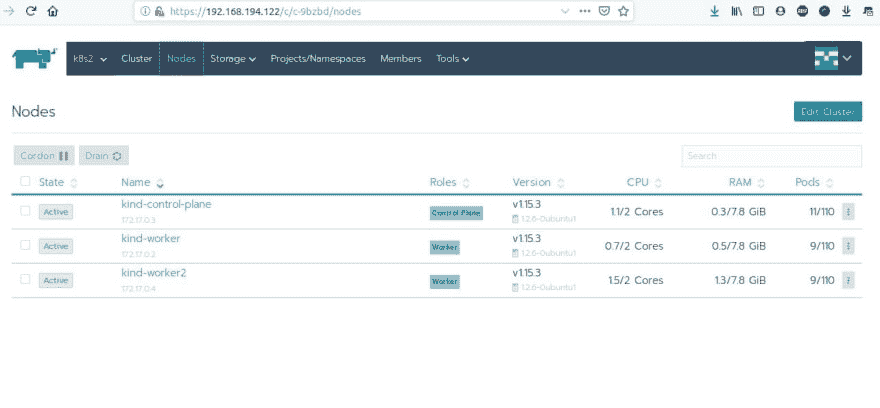T2】](https://res.cloudinary.com/practicaldev/image/fetch/s--X6Mw9y5w--/c_limit%2Cf_auto%2Cfl_progressive%2Cq_auto%2Cw_880/https://cdn-images-1.medium.com/max/2566/1%2AZUDBcY9YYsAF-Zf8Ze2BcA.jpeg)

[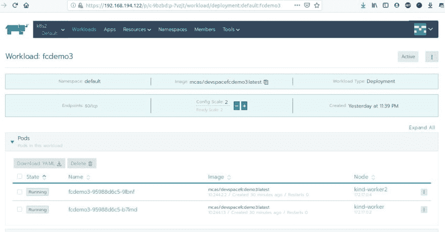T2】](https://res.cloudinary.com/practicaldev/image/fetch/s--1yaF-A8r--/c_limit%2Cf_auto%2Cfl_progressive%2Cq_auto%2Cw_880/https://cdn-images-1.medium.com/max/2548/1%2AH4GMQOKEUDdeuDJC-T-uzA.jpeg)

[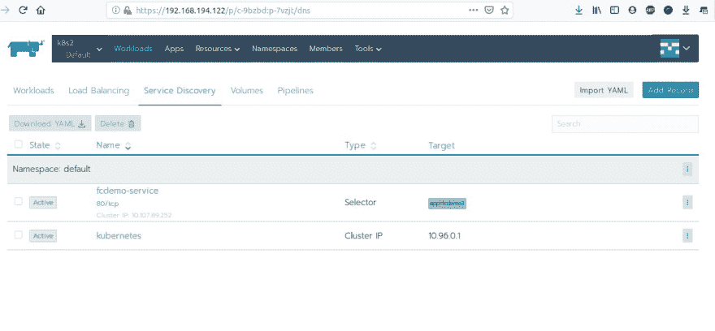T2】](https://res.cloudinary.com/practicaldev/image/fetch/s--EN7h47Da--/c_limit%2Cf_auto%2Cfl_progressive%2Cq_auto%2Cw_880/https://cdn-images-1.medium.com/max/2564/1%2ARIgyV5WY26KcCN66_m7dUQ.jpeg)

在主机服务器 C2L 上，我连接到 ZeroTier:

[T2】](https://res.cloudinary.com/practicaldev/image/fetch/s--_UumLWFM--/c_limit%2Cf_auto%2Cfl_progressive%2Cq_auto%2Cw_880/https://cdn-images-1.medium.com/max/2598/1%2A7u9ipLcdMlP08Zn2y7C33g.jpeg)

在此模式配置结束时获取:

[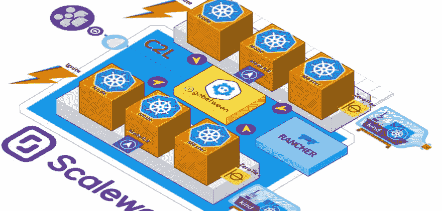T2】](https://res.cloudinary.com/practicaldev/image/fetch/s--26NIVfRR--/c_limit%2Cf_auto%2Cfl_progressive%2Cq_auto%2Cw_880/https://cdn-images-1.medium.com/max/2594/1%2AsoxMuiNH9FzQNddktdvUqw.jpeg)

我最后一次重复使用 goetdine，使用 TOML 配置，该配置将虚拟机的 IP 地址复制到 ZeroTier:

[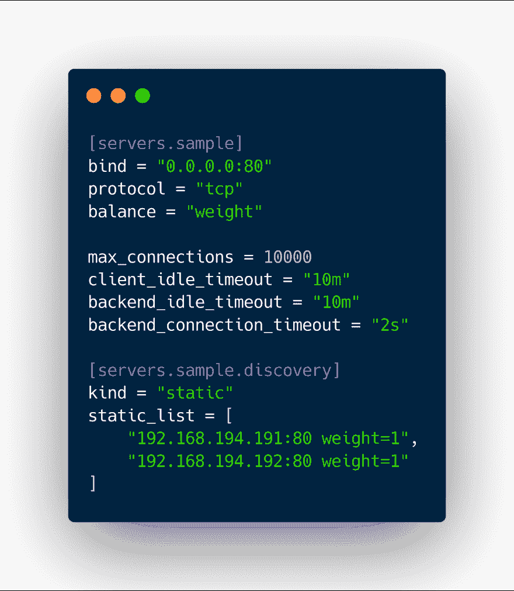T2】](https://res.cloudinary.com/practicaldev/image/fetch/s---iEq6Oeq--/c_limit%2Cf_auto%2Cfl_progressive%2Cq_auto%2Cw_880/https://cdn-images-1.medium.com/max/3376/1%2AxeIfqeAiHHqtGk8jHnOUkw.png)

[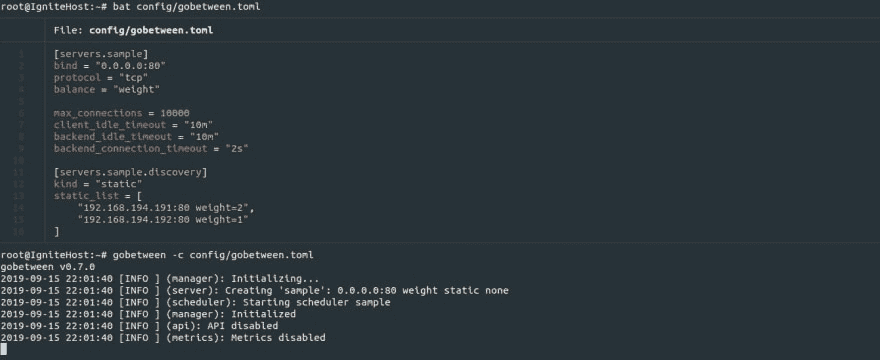T2】](https://res.cloudinary.com/practicaldev/image/fetch/s--lM9-_PPP--/c_limit%2Cf_auto%2Cfl_progressive%2Cq_auto%2Cw_880/https://cdn-images-1.medium.com/max/2680/1%2AYv_v28nh_W8o2E_FEZav3w.jpeg)

在此，我使用 gobetween 中的权重，通过 Scaleway 中 C2L 服务器的公共 IP 地址，使用 FC 演示程序的两个不同版本模拟一种 A/B 测试:

[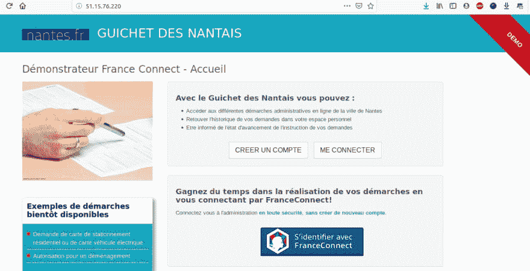T2】](https://res.cloudinary.com/practicaldev/image/fetch/s--VZ-ktJSM--/c_limit%2Cf_auto%2Cfl_progressive%2Cq_auto%2Cw_880/https://cdn-images-1.medium.com/max/2534/1%2AZ1p7eWr7lTEWQSg-rj3Bxg.jpeg)

[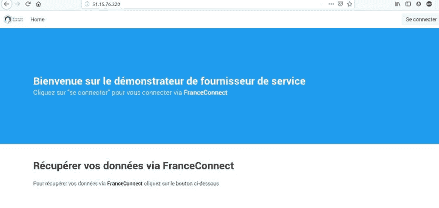T2】](https://res.cloudinary.com/practicaldev/image/fetch/s--9Uj_4idg--/c_limit%2Cf_auto%2Cfl_progressive%2Cq_auto%2Cw_880/https://cdn-images-1.medium.com/max/2672/1%2AFM6MSF41SAgqtbABRhH5fg.jpeg)

两个库服务器群集的监控由兰彻服务器通过 Prometheus 和 Grafana 进行:

[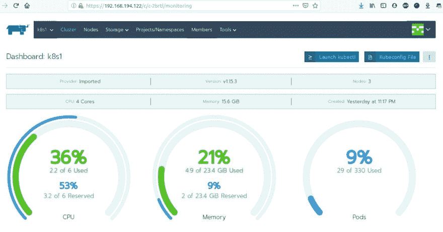T2】](https://res.cloudinary.com/practicaldev/image/fetch/s--kx9NuW98--/c_limit%2Cf_auto%2Cfl_progressive%2Cq_auto%2Cw_880/https://cdn-images-1.medium.com/max/2558/1%2AXfMVpw0VkCoKF2AfReNbLQ.jpeg)

[T2】](https://res.cloudinary.com/practicaldev/image/fetch/s--HKeJvZXJ--/c_limit%2Cf_auto%2Cfl_progressive%2Cq_auto%2Cw_880/https://cdn-images-1.medium.com/max/2568/1%2AEhl8gChO4etIdBjPbyH3LQ.jpeg)

[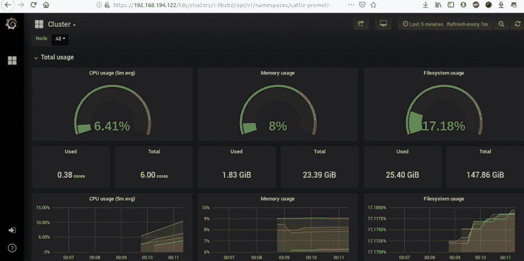T2】](https://res.cloudinary.com/practicaldev/image/fetch/s--PdtX5db_--/c_limit%2Cf_auto%2Cfl_progressive%2Cq_auto%2Cw_880/https://cdn-images-1.medium.com/max/2664/1%2A1vvuEDWdK0Rv61KcSinlbQ.jpeg)

[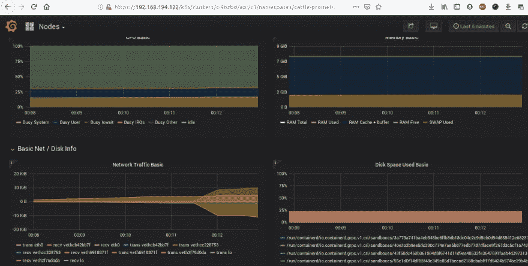T2】](https://res.cloudinary.com/practicaldev/image/fetch/s--jnlD-x81--/c_limit%2Cf_auto%2Cfl_progressive%2Cq_auto%2Cw_880/https://cdn-images-1.medium.com/max/2648/1%2AIihSv2cFhKkR9cuNXqmLHg.jpeg)

[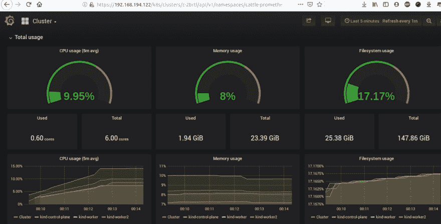T2】](https://res.cloudinary.com/practicaldev/image/fetch/s--3Id6I6eT--/c_limit%2Cf_auto%2Cfl_progressive%2Cq_auto%2Cw_880/https://cdn-images-1.medium.com/max/2620/1%2AorX_4V1osA8G1vhkE6vcjA.jpeg)

[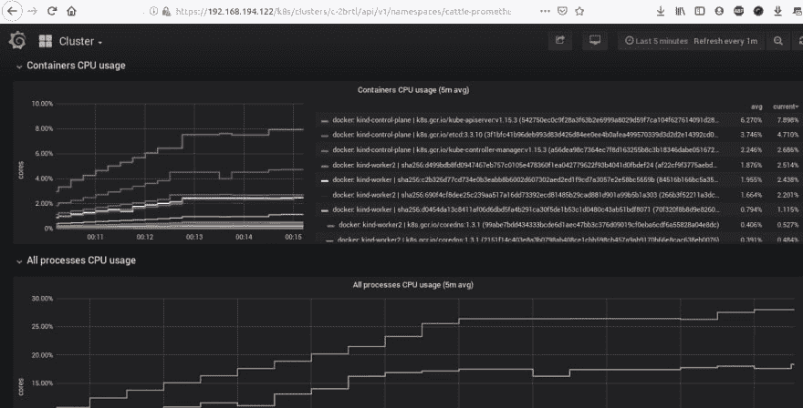T2】](https://res.cloudinary.com/practicaldev/image/fetch/s--7OgISinb--/c_limit%2Cf_auto%2Cfl_progressive%2Cq_auto%2Cw_880/https://cdn-images-1.medium.com/max/2630/1%2AoqQ2EQi0iQ1FyfInI-NCDQ.jpeg)

Ignite 使用内部工具箱来执行其 GitOps 功能，从最新版本开始，您也可以轻松地使用这些功能！

[**weaver works/Ignite**
* Ignite 是一个“GitOps-first”项目，使用 ignited gitops 命令即可支持 GitOps。此前……* github . com](https://github.com/weaveworks/ignite/blob/master/docs/gitops.md)
[**weaver works/gitops-toolkit**
*此时不能执行那个动作。您已使用另一个标签页或窗口登录。您已在另一个标签页或…*github.com](https://github.com/weaveworks/gitops-toolkit) 中注销

[T2】](https://res.cloudinary.com/practicaldev/image/fetch/s--uRwR8oEQ--/c_limit%2Cf_auto%2Cfl_progressive%2Cq_auto%2Cw_880/https://cdn-images-1.medium.com/max/2000/0%2A4GQ-nqsgkQBMSHIW.jpg)

下一个！