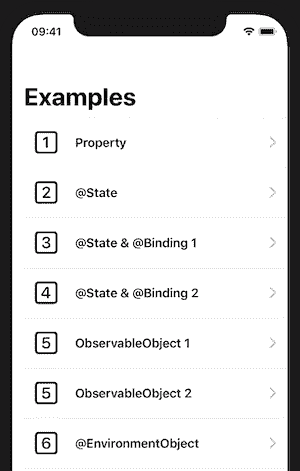
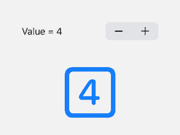
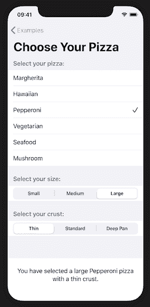
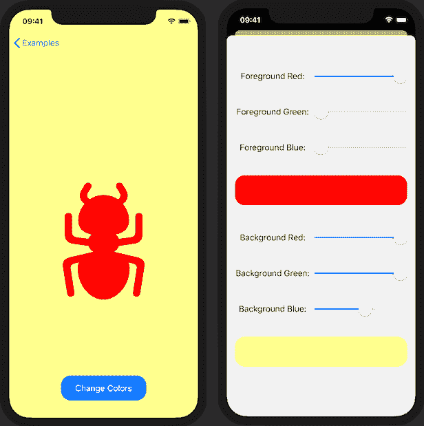
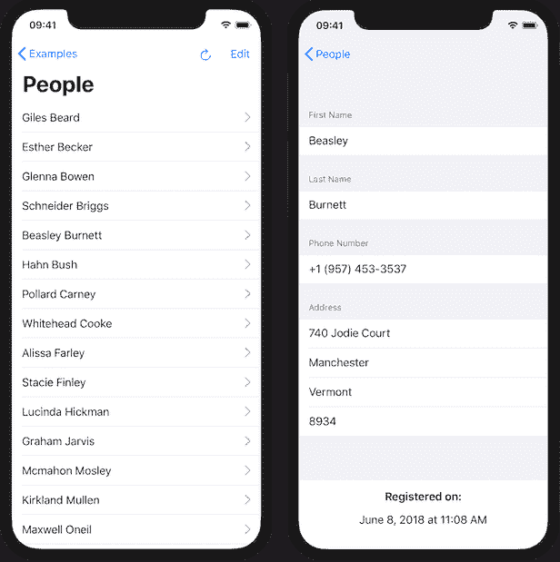
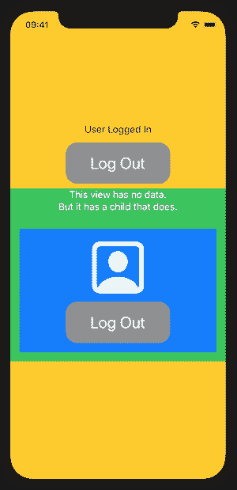

# SwiftUI 数据流

> 原文:[https://dev.to/trozware/swiftui-data-flow-591o](https://dev.to/trozware/swiftui-data-flow-591o)

SwiftUI 为我们提供了一种全新的方式，以声明性和响应性的方式来设计用户界面。您的数据决定了显示的内容。但这导致了一个新的问题——数据模型应该如何构建，以及它们如何在组成应用程序的各种视图之间传递？

在这篇文章中，我打算用例子来讨论这种可能性。

如果你在 2019 年 11 月 18 日之前读到这篇文章，请再次查看[observable object&@ observed object-Part 2](#observable2)，因为它已经经历了几次迭代，这些都是为了比较而显示的。

-

在 WWDC 2019 上，一些苹果工程师通过 SwiftUI 做了一个关于[数据流的精彩演示，我强烈推荐观看该视频。但是你需要看两遍。先看一遍，这样你就可以开始了，然后，当你觉得这一切都太复杂时，再看一遍，它就会开始到位了。那时和现在唯一真正的区别是 BindableObject 变成了 ObservableObject。](https://developer.apple.com/videos/play/wwdc2019/226/)

我想我可以就此打住，但是我将用代码示例来说明我的想法，我希望这样会让事情更清楚。有些例子是为了说明一个观点而设计的，但是样本代码中也包含了其他 SwiftUI 例子，我希望这些例子会有用。

[从 GitHub](https://github.com/trozware/swiftui-data-flow/tree/master) 下载示例项目，并在 Xcode 中打开。转到 ContentView.swift 并确保画布已打开。单击继续以显示视图。然后单击实时预览按钮，等待视图变为活动状态。我建议单击画布左下角的大头针按钮，这样您就可以研究代码示例，同时仍然在主导航中工作。

## [](#data-flow-options)数据流选项

SwiftUI 中有 5 种指定数据的方式:

*   财产
*   @州
*   @绑定
*   ObservableObject & @ observed object
*   @环境对象

[T2】](https://res.cloudinary.com/practicaldev/image/fetch/s--oF1_AiaG--/c_limit%2Cf_auto%2Cfl_progressive%2Cq_auto%2Cw_880/https://troz.nimg/ContentView.png)

## [](#property)属性

```
struct Property: View {
    // Property
    let greeting = "Hello from SwiftUI!"

    var body: some View {
        // Using property directly
         Text(greeting)
             .font(.title)
    }
} 
```

在这个例子中，视图中使用了`greeting`属性。`greeting`是静态的，因此视图不需要监视它的变化。这可能看起来是一个简单而明显的例子，但是将它分离出来考虑到了本地化或可重用性。

该属性也可以由父视图提供，这是一个非常有用的属性特性。父视图可以有一些动态数据，可以用来设置子视图中的属性，子视图只需要静态显示数据。该数据将随着父视图的改变而改变，但是子视图将不能改变父视图中的数据。

重要的是要记住，并不是所有的东西都需要用这些新的属性包装器来设置。

## @状态

这就是 SwiftUI 世界中事情变得非常有趣的地方。SwiftUI 视图包含在结构中，因此是不可变的。此外，每次数据发生变化时，视图都会重新创建，因此所有属性也会重新创建。通过用`@State`属性包装器标记一个属性，您告诉 SwiftUI 您希望它将这个数据保存在内存的一个单独部分，允许它发生变异，并在视图刷新期间保留当前值。

```
struct UsingState: View {
    @State private var toggleValue = true

    var body: some View {
        // Using state with 2-way binding
         Toggle(isOn: $toggleValue) {
             Text("Toggle is \(self.toggleValue ? "ON" : "OFF")")
         }
         .padding(50)
    }
} 
```

在这个例子中，`toggleValue`被声明为一个属性包装为`@State`的`Bool`。在`Toggle`内部，`isOn`值被前导`$`绑定到`toggleValue`。这允许变量设置开关，开关设置变量-双向绑定。

[T2】](https://res.cloudinary.com/practicaldev/image/fetch/s--Io1Cdi4---/c_limit%2Cf_auto%2Cfl_progressive%2Cq_auto%2Cw_880/https://troz.nimg/Toggle.png)

`@State`变量总是值类型，并且通常对于它们的视图来说是局部的，所以苹果建议将它们标记为`private`。

## @绑定

构建 SwiftUI 视图的一个问题是，当您在视图中嵌入视图时，很容易形成一个巨大的厄运金字塔。解决方案是提取子视图，但是您需要一种方法将数据传递给子视图。

这就是`@Binding`的用武之地，因为它允许你告诉一个视图，一个属性的数据实际上来自一个父视图，但是子视图被允许改变那个属性，并且那个改变将流回父视图的数据。

```
struct Numbers: View {
    @State private var stepperValue = 0

    var body: some View {
        NumberChooser(stepperValue: $stepperValue)
    }
}

struct NumberChooser: View {
    // Using state from parent with 2-way binding
    @Binding var stepperValue: Int

    var body: some View {
        ZStack {
            VStack {
                Stepper(value: $stepperValue, in: 0...20) {
                    Text("Value = \(stepperValue)")
                }

                NumberBlock(stepperValue: stepperValue)
            }
        }
    }
}

struct NumberBlock: View {
    // As this view never changes the value, there is no need to bind it
    var stepperValue: Int

    var body: some View {
        Image(systemName: "\(stepperValue).square")
    }
} 
```

在这个例子中，我声明了一个`stepperValue`属性并用`@State`标记它。

该接口已经被提取到一个名为`NumberChooser`的子视图中，`stepperValue`属性的`Binding`已经使用`$`前缀传递给了`NumberChooser`，这将确保对值的更改可以返回。在`NumberChooser`内部，该属性被包装在`@Binding`属性包装器中，以表明它来自另一个源，并且将返回更改。

`NumberChooser`本身有一个名为`NumberBlock`的子视图，但它只是一个显示视图，不会改变值本身，所以`stepperValue`只是作为一个属性传递给这个子视图，没有前缀`$`。当数据被包含在具有`@State`属性的视图中时，它仍然会在每次数据改变时被更新。

[T2】](https://res.cloudinary.com/practicaldev/image/fetch/s--Ywcv3M40--/c_limit%2Cf_auto%2Cfl_progressive%2Cq_auto%2Cw_880/https://troz.nimg/NumberChooser.png)

## @状态&@绑定-第二部分

到目前为止，示例已经为@State 属性使用了原始数据类型，但是假设`@State`属性是值类型，那么可以使用任何结构。在下一个示例中，我使用一个结构来保存披萨订单的属性，并使用一个 SwiftUI 表单来允许选择。

```
struct PizzaView: View {
    // Using @State for a struct
    @State private var pizza = Pizza()

    var body: some View {
            VStack {
                Form {
                    // Using 2-way binding but each component
                    // only needs 1 property from the struct
                    PizzaNamePicker(selectedPizzaName: $pizza.name)
                    PizzaSizePicker(selectedPizzaSize: $pizza.size)
                    PizzaCrustPicker(selectedPizzaCrust: $pizza.crust)
                }

                // Text representation to prove that the
                // subviews are modifying the parent struct
                Text(pizza.pizzaSelection)
             }
            .navigationBarTitle("Choose Your Pizza")
    }
} 
```

每个子视图使用`@Binding` :
获得它需要的属性

```
struct PizzaNamePicker: View {
    @Binding var selectedPizzaName: PizzaName

    var body: some View {
      // see the GitHub project for more details
    } 
```

该表单由 3 个子视图组成——每个子视图用于选择披萨、大小和外壳。Pizza 结构包含所有三个属性，但是每个子视图只需要一个指向它所控制的属性的`Binding`。表单后的文本视图是为了证明所有的选择都返回到父表单。

[T2】](https://res.cloudinary.com/practicaldev/image/fetch/s--EB7iF2hU--/c_limit%2Cf_auto%2Cfl_progressive%2Cq_auto%2Cw_880/https://troz.nimg/PizzaView.png)

## [](#observableobject-amp-observedobject-part-1)【观察对象】&@观察对象-第 1 部分

如果您的数据模型是一个类，并且您希望使用基于引用的数据而不是结构的基于值的系统，则使用这些。

要建立一个可观察的数据模型，它必须符合`ObservableObject`协议，任何需要观察的属性都应该有`@Published`属性包装器。这确保了每当这个属性改变时，观察这个数据模型实例的所有视图都将被通知执行 UI 更新。

对于这个例子，我有一个 ColorSet 类，它有六个颜色组件，用于组合两种 RGB 颜色。

```
class ColorSet: ObservableObject {
    // ObservableObject
    // The 6 color components are marked as @Published so any changes
    // get published to the views that are observing

    @Published var foregroundRed = 0.0
    @Published var foregroundGreen = 0.0
    @Published var foregroundBlue = 0.0

    @Published var backgroundRed = 1.0
    @Published var backgroundGreen = 1.0
    @Published var backgroundBlue = 1.0
} 
```

在主视图中，我将这个类的一个实例设置为一个`@ObservedObject`。

```
struct ColorSetView: View {
    @ObservedObject private var colorSet = ColorSet()
} 
```

使用这些颜色设置视图的背景和系统图像的前景。一个按钮显示一个带有滑块的表单，允许编辑这些颜色。`colorSet`像这样传递给工作表:

```
 .sheet(isPresented: $showChooser) {
      // notice that this does not use $ as the ColorChooser
      // will get a reference to the ColorSet object
      ColorChooser(colorSet: self.colorSet)
  }

struct ColorChooser: View {
    @ObservedObject var colorSet: ColorSet

    var body: some View {
        // ...
    }
} 
```

工作表并不是呈现使用滑块进行编辑的视图的理想方式，但是我想演示改变滑块会立即改变父视图和子视图的`@ObservedObject`值。编辑背景颜色组件会在工作表顶部的后面显示新的背景颜色。

`ColorChooser`本身使用 2 个子视图，它们以同样的方式获得对`ColorSet`的引用。

[T2】](https://res.cloudinary.com/practicaldev/image/fetch/s--OJiCm-g---/c_limit%2Cf_auto%2Cfl_progressive%2Cq_auto%2Cw_880/https://troz.nimg/ColorChooser.png)

## [](#observableobject-amp-observedobject-part-2)

在编写示例应用程序时，这一部分给我带来了最大麻烦。我想显示一个数据列表，让每个条目链接到一个可编辑的细节视图，编辑内容返回到父列表。

列表中数据的最初显示是直接的，然后我可以让列表行导航到每个条目的详细视图。问题是将编辑过的数据放回父列表。

基本的数据模型是一个发布一组`PersonViewModel`对象的`ObservableObject`。

```
class PersonListModel: ObservableObject {
    @Published var persons: [PersonViewModel] = []

    func fetchData() {
        // get data from web ...

        DispatchQueue.main.async {
            self.persons = newData
        }
    }
} 
```

由于该数据将在后台网络调用后触发 UI 更新，因此将对`@Published`属性的更改切换到主线程非常重要。

`PersonViewModel`也需要是可编辑属性标记为`@Published`的`Observable`。

```
class PersonViewModel: Identifiable, ObservableObject {
    // Even though this is not observed directly,
    // it must be an ObservableObject for the data flow to work

    var id = UUID()
    @Published var first: String = ""
    @Published var last: String = ""
    @Published var phone: String = ""
} 
```

奇怪的是我必须将数据传递给细节视图的方式。这是我最初尝试的:

```
 List {
      ForEach(personList.persons) { person in
          NavigationLink(destination:
              PersonDetailView(person: person)
          ) {
              Text("\(person.first)  \(person.last)")
          }
      }
  } 
```

并且在`PersonDetailView` :

```
 @ObservedObject var person: PersonViewModel 
```

这几乎成功了。正确的数据被传递到细节视图，并且数据编辑改变了数据，但是父列表从未被重新绘制。如果我更改了记录的名字，然后返回列表，更改不会显示。但是，如果我随后返回到同一记录的详细视图，我的编辑就在那里，所以我可以知道数据正在正确地更改。问题是如何以这样一种方式改变它，即父视图被通知到改变。

试图将`person`与`PersonDetailView(person: $person)`绑定产生了错误`Use of unresolved identifier '$person'`，所以`ForEach`枚举没有提供到`personList`对象的直接连接。

我想到的解决方案是切换到在`ForEach`中通过索引进行枚举，并将父列表数据的直接成员传递给细节视图。并将`PersonDetailView`切换到使用`@Binding var person: PersonViewModel`。

```
 ForEach(0 ..< personList.persons.count, id: \.self) { index in
      NavigationLink(destination:
          PersonDetailView(person: self.$personList.persons[index])
      ) {
          Text("\(self.personList.persons[index].first)  \(self.personList.persons[index].last)")
      }
  } 
```

这是可行的，但是除了难以阅读之外，它还有一个主要的缺陷。表中的行通过它们的行号来标识，而不是通过数据中的任何东西来标识，比如`person.id`。这可能会影响 SwiftUI 处理列表的方式，以及它如何知道哪些行已经更改，需要重新呈现。通过每一行中数据的唯一性来标识行是很重要的，这样 SwiftUI 就知道您已经删除了 ID 为“abcd-1234”的行，而不是第 7 行。因为如果您删除行 ID“ABCD-1234 ”,就不再有行 ID“ABCD-1234 ”,但是如果您删除行#7，现在就有不同的行#7，任何事情都可能发生。

**更新 1:** [@StewartLynch](https://twitter.com/StewartLynch) 联系我，建议用一种更简洁的方式将个人数据传递给 PersonDetailView，方法是使用一个函数为每个显示的`person`获取一个`Binding<PersonViewModel>`。这工作得非常完美，并且使代码看起来更加整洁。谢谢斯图尔特。

```
var body: some View {
    List {
        ForEach(personList.persons) { person in
            NavigationLink(destination:
                PersonDetailView(person: self.selectedPerson(id: person.id))
            ) {
                Text("\(person.first)  \(person.last)")
            }
        }
    }
}

func selectedPerson(id: UUID) -> Binding<PersonViewModel> {
    guard let index = self.personList.persons.firstIndex(where: { $0.id == id }) else {
        fatalError("This person does not exist.")
    }
    return self.$personList.persons[index]
} 
```

如果你想看看 Stewart 的解决方案，请在 GitHub 上查看[这个提交。](https://github.com/trozware/swiftui-data-flow/tree/57f48ea28d1e987566398800e74f12e339eac231)

**更新 2:** [@vadimshpakovski](https://twitter.com/vadimshpakovski) 说为每个`person`对象创建一个绑定是低效的，创建这个绑定的函数会减慢速度。他建议使用`onReceive`对`person`的变化做出反应，并触发`personList`的更新。在这种情况下，`PersonDetailView`使用`@ObservedObject var person: PersonViewModel`。这个也很好用。

```
 ForEach(personList.persons) { person in
      NavigationLink(destination:
          PersonDetailView(person: person)
              .onReceive(person.objectWillChange) { _ in
                  self.personList.objectWillChange.send()
              }
      ) {
          Text("\(person.first)  \(person.last)")
      }
  } 
```

如果你想看看 Vadim 的解决方案，请在 GitHub 上查看[这个提交。](https://github.com/trozware/swiftui-data-flow/tree/093810bab93a984292c4a7b8bf29316a830e9f50)

**更新 3:** 来自社区的更多建议(感谢所有做出贡献的人)已经向我指出，虽然 Vadim 的解决方案确实解决了很多问题，但这意味着每次编辑单个`Person`时，都必须重新计算整个`ForEach`以检查更改。而且它还在视图代码中插入了模型管理代码，这并不是很棒。

所以我的下一个尝试是在`PersonDetailView`中使用`@Binding var person: PersonViewModel`，但是`PersonListModel`没有一个`PersonViewModels`数组，而是有一个`UUIDs`数组和一个`UUID: PersonListModel`字典。这样做的好处是 UUIDs 可以在`ForEach`中使用，因为它们对于每一行都是唯一的，并且字典可以用于为每一个`UUID`提供到`person`的绑定。

这通过唯一地识别每一行而消除了我的原始解决方案的问题，它回到了 Stewart 的解决方案，但是消除了为匹配的人创建绑定的潜在的缓慢功能，并且从 Vadim 的建议中消除了完整重绘和视图内部模型管理的问题。

但是这并不完全直接，因为通过键从字典中获取值会返回一个可选的。起初，我认为可以使用新的`default`字典语法来获得一个非可选的绑定值，但是由于某种原因，它不能用于创建一个`Binding`。

答案是用一个返回非可选值或给出致命错误的`subscript`函数在 Dictionary 上编写一个扩展。由于我控制着数据并为每个 UUID 设置了匹配的 PersonViewModel，所以这并不危险。

这就是我们现在拥有的:

```
class PersonListModel: ObservableObject {
    // Main list view model
    // ObservableObject so that updates are detected

    @Published var ids: [UUID] = []
    @Published var persons: [UUID : PersonViewModel] = [:]

    func fetchData() {
        // get data from web ...

        DispatchQueue.main.async {
          let personViewModels = dataArray.map { PersonViewModel(with: $0) }.sorted() {
              $0.last + $0.first < $1.last + $1.first
          }
          self.ids = personViewModels.map { $0.id }
          self.persons = Dictionary(
              uniqueKeysWithValues: personViewModels.map { ($0.id, $0) }
          )
        }
 } 
```

在提取 UUIDs 和创建字典之前，传入的数据被映射到一个排序的数组`PersonViewModels`。这意味着 UUIDs 数组在`ForEach`中使用的排序顺序是正确的。

下面是字典扩展:

```
extension Dictionary where Key == UUID, Value == PersonViewModel {
    subscript(unchecked key: Key) -> Value {
        get {
            guard let result = self[key] else {
                fatalError("This person does not exist.")
            }
            return result
        }
        set {
            self[key] = newValue
        }
    }
} 
```

这些结合在一起可以实现:

```
ForEach(personList.ids, id: \.self) { id in
    NavigationLink(
        destination: PersonDetailView(person: self.$personList.persons[unchecked: id])
    ) {
        Text("\(self.personList.persons[unchecked: id].first)") +
            Text(" \(self.personList.persons[unchecked: id].last)")
    }
} 
```

[T2】](https://res.cloudinary.com/practicaldev/image/fetch/s--hPYedIOA--/c_limit%2Cf_auto%2Cfl_progressive%2Cq_auto%2Cw_880/https://troz.nimg/PersonListView.png)

这比我最初的想法要复杂一点，但我认为它现在是很好的 SwiftUI，避免了早期解决方案中的一些问题。

感谢 [JSON 生成器](https://next.json-generator.com)提供的样本数据。如果有人对这个问题有任何其他解决方案，我很乐意听听。

## @环境对象

把 EnvironmentObject 想象成一种状态，一旦被引入，它可以被任何视图或视图的任何后代使用。使用过 React 或任何类似 web 开发技术的人都会熟悉全局状态的概念，这与此类似，尽管不是真正的全局。

设置一个类作为环境对象模型，就像设置一个 ObservableObject 一样，具有相同的协议一致性，并使用`@Published`属性包装器来标记其更改将触发 UI 更新的属性。这是一个非常简单的例子，只有一个属性。

```
class UserSettings: ObservableObject {
    @Published var isLoggedIn: Bool = false
} 
```

[T2】](https://res.cloudinary.com/practicaldev/image/fetch/s--BorlB1EM--/c_limit%2Cf_auto%2Cfl_progressive%2Cq_auto%2Cw_880/https://troz.nimg/NestedViews.png)

在这个例子中，黄色视图是父视图——不同的视图有不同的亮色背景，以便于区分。黄色视图可以像这样访问`UserSettings`:

```
struct NestingViews: View {
    @EnvironmentObject var userSettings: UserSettings

    var body: some View {
        ZStack {
            Color.yellow.edgesIgnoringSafeArea(.all)

            VStack {
                // UI omitted for space reasons

                // display first nested view
                ChildView()
            }
        }
    }
} 
```

包含在这个父视图(绿色视图)中的`ChildView`不需要访问这个数据，因此没有`@EnvironmentObject`属性。但是`ChildView`包含了另一个子视图——蓝色的。这个`GrandChildView`——蓝色视图——确实需要访问`UserSettings`，因此它具有与父视图完全相同的`@EnvironmentObject var userSettings: UserSettings`属性。

如果使用的是`@ObservedObject`，那么数据必须通过一个完整链中的每个视图传递，即使`ChildView`不需要这些数据。通过使用`@EnvironmentObject`，这个链可以被打破，但是任何需要的视图都可以访问和改变这个数据。在本例中，黄色和蓝色视图都显示和编辑相同的数据，当按下任一按钮时，两个视图都进行更新。

关于在画布中使用`@EnvironmentObject`要记住的一个关键点是，每个使用它的视图，或者包含使用它的视图，都需要在使用`.environmentObject()`的预览中提供`ObservableObject`。

```
struct NestingViews_Previews: PreviewProvider {
    static var previews: some View {
        NestingViews()
            .environmentObject(UserSettings())
    }
} 
```

在应用程序本身中，只有第一个访问`@EnvironmentObject`的视图需要设置它。在这个例子中，这是在`NavigationLink`中完成的，它将转到`NestingViews`例子中。

```
 NavigationLink(destination: NestingViews().environmentObject(UserSettings())) {
        ListContents(title: "@EnvironmentObject", imageNumber: 6)
    } 
```

## [](#summary)总结

或者什么时候该用什么？

*   对于基于值的数据模型或数据原语，使用`@State`。
*   对于基于参考的数据，使用`ObservableObject`。
*   对于你的应用中很多视图需要的数据，使用`@EnvironmentObject`。
*   使用`@Binding`或`@ObservedObject`将数据传递给一个可以改变数据的视图。

最后一个提示:在从头开始创建视图时，对样本、硬编码数据使用`@State`。一旦你有了你想要的界面，然后放入链接给它真实的数据。

我确信人们会发展他们自己的理论和他们自己使用 SwiftUI 的方式，但这些是我现在打算遵循的指导方针。如果你有不同的观点，并想讨论它们，请与我联系。