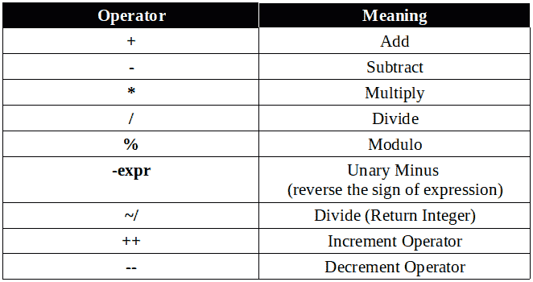
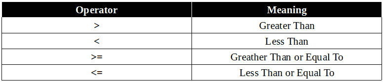
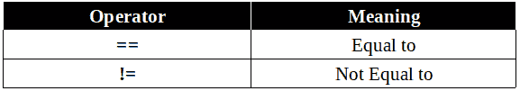
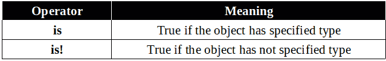
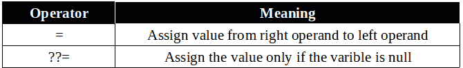
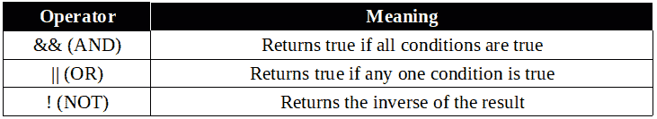

# Dart 中的运算符

> 原文：<https://dev.to/jay_tillu/operators-in-dart-3gdb>

> ***表达式是一种特殊的语句，其计算结果为单个值。*T3】**

每个表达式都由两部分组成:

1.  ***操作数*** —它们代表数据。
2.  ***运算符*** —运算符是一个符号，告诉编译器执行特定的数学、关系或逻辑运算，并产生最终结果。

*   例如，A + B，其中
*   这里 **A** 和 **B** 是操作数，+是运算符。

## Dart 中操作符的类型

* * *

*   Dart 中共有八种类型的操作员。

1.  算术运算符
2.  赋值运算符
3.  按位运算符
4.  等式运算符
5.  逻辑算子
6.  关系运算子
7.  短路操作员
8.  类型测试操作员

### 算术运算符

* * *

*   dart 中有九种算术运算符。

[](https://res.cloudinary.com/practicaldev/image/fetch/s--CRRdxayx--/c_limit%2Cf_auto%2Cfl_progressive%2Cq_auto%2Cw_880/https://miro.medium.com/max/662/1%2A9Fy4F4aw773v-IrqUwTsKA.png)

### 关系运算符

* * *

*   关系运算符显示了两个操作数之间的关系。
*   关系运算符只能有两个值:真值*或假值**。***
**   这里有四个关系运算符。*

 *[](https://res.cloudinary.com/practicaldev/image/fetch/s--3g-XuUxl--/c_limit%2Cf_auto%2Cfl_progressive%2Cq_auto%2Cw_880/https://miro.medium.com/max/776/1%2ANsKARNlGePT-etFB96wfLg.png)

### 相等运算符

* * *

*   相等运算符检查两个对象是否相等。
*   与关系运算符相同，它们包含布尔值 ***真*** 或 ***假*** 。
*   这里有两个等式运算符。

[](https://res.cloudinary.com/practicaldev/image/fetch/s--0gD8f29Z--/c_limit%2Cf_auto%2Cfl_progressive%2Cq_auto%2Cw_880/https://miro.medium.com/max/577/1%2A-jnIgLm0n4TFEhIReTe8Cg.png)

*   这里请记住，只有当两个字符串包含相同的字符序列时，它们才是等价的。这里字符的顺序比字符的数量更重要。

```
void main() {
 var a = "Jay";
 var b = "Jya"; //If here value is Jay then this is true
 print(a == b);
}

Output
false 
```

<svg width="20px" height="20px" viewBox="0 0 24 24" class="highlight-action crayons-icon highlight-action--fullscreen-on"><title>Enter fullscreen mode</title></svg> <svg width="20px" height="20px" viewBox="0 0 24 24" class="highlight-action crayons-icon highlight-action--fullscreen-off"><title>Exit fullscreen mode</title></svg>

### 类型测试操作员

* * *

*   类型测试运算符用于检查数据类型。

[](https://res.cloudinary.com/practicaldev/image/fetch/s--57EArIzn--/c_limit%2Cf_auto%2Cfl_progressive%2Cq_auto%2Cw_880/https://miro.medium.com/max/639/1%2AqTStvdSm8Zwts4P6cHMzUA.png)

### 赋值运算符

* * *

*   Dart 有两个主要的赋值运算符。

[](https://res.cloudinary.com/practicaldev/image/fetch/s--L5NQAFKG--/c_limit%2Cf_auto%2Cfl_progressive%2Cq_auto%2Cw_880/https://miro.medium.com/max/670/1%2Akl79sd_O6nS_XMFWpV3Y3A.png)

*   这里注意(+=，-=，*=，/=)也是一种赋值运算符。但因为它们只是一条捷径。我没有提到他们。

### 逻辑运算符

* * *

*   逻辑运算符用于组合两个或多个条件。
*   逻辑运算符返回布尔值 true 或 false。
*   这里有三个逻辑运算符:

[](https://res.cloudinary.com/practicaldev/image/fetch/s--Y6zgJY5t--/c_limit%2Cf_auto%2Cfl_progressive%2Cq_auto%2Cw_880/https://miro.medium.com/max/731/1%2Ad5LYKUDgVNB7xP5hos2BoA.png)

### 条件表达式

* * *

*   Dart 有两个特殊的运算符，可以帮助您计算可能需要整个 if-else 语句的小表达式。

#### 条件？表达式 1:表达式 2

* * *

*   这里，如果条件为真，则**表达式 1** 被求值并返回其值。否则， **expr2** 被求值并返回值。

```
void main() {
  var a = 25;
  var res = a > 15 ? "value greater than 15" : "value lesser than or equal to 15";
  print(res);
}

Output
value greater than 15 
```

<svg width="20px" height="20px" viewBox="0 0 24 24" class="highlight-action crayons-icon highlight-action--fullscreen-on"><title>Enter fullscreen mode</title></svg> <svg width="20px" height="20px" viewBox="0 0 24 24" class="highlight-action crayons-icon highlight-action--fullscreen-off"><title>Exit fullscreen mode</title></svg>

#### expr1？？expr2

* * *

*   这里如果 **expr1** 非空，返回它的值。否则，评估并返回 **expr2** 的值。

```
void main() {
  var a = 15;
  var b = null;
  var res = a ?? b;
  print ( res );
}

Output
15 
```

<svg width="20px" height="20px" viewBox="0 0 24 24" class="highlight-action crayons-icon highlight-action--fullscreen-on"><title>Enter fullscreen mode</title></svg> <svg width="20px" height="20px" viewBox="0 0 24 24" class="highlight-action crayons-icon highlight-action--fullscreen-off"><title>Exit fullscreen mode</title></svg>

所以，伙计们，这就是你们需要知道的关于 dart 操作员的一切。这里也有短路和按位运算符。但是因为他们很少被使用，所以我没有在这里提到他们。但是如果你需要的话，请随意探索。另外，如果我错过了什么，请随时告诉我。我很乐意向你学习。

直到那时，继续爱，继续编码。我一定会在另一篇精彩的文章中向您介绍。

记住没有老师，没有书，没有视频教程，也没有博客能教会你一切。有人说，学习是一个旅程，旅程永无止境。只是从这里那里收集一些数据，读一读，学一学，练一练，试着去应用。不要因为做不到或者不知道这个概念或者那个概念而犹豫。记住，每个程序员都是从你现在走的这条路上走过的。记住每个大师都曾经是初学者。努力工作，全力以赴。

### 欲了解更多信息，请访问以下链接

*   [Fuchsia OS 官方网站](https://fuchsia.dev/)
*   [Dart 官方网站](https://dart.dev/)
*   [颤振官方网站](https://flutter.dev/)

> 想和我联系吗？以下是链接。我很乐意成为你的朋友。😊
> [Twitter](https://twitter.com/jay_tillu)
> [脸书](https://www.facebook.com/jaytillu.1314/)
> [insta gram](https://www.instagram.com/jay.tillu/)
> [Medium](https://medium.com/jay-tillu)
> 或者直接在[jayviveki13@gmail.com](mailto:jayviveki13@gmail.com)给我发邮件*