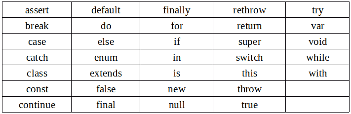
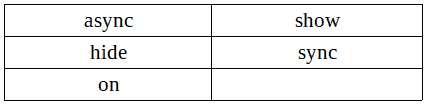
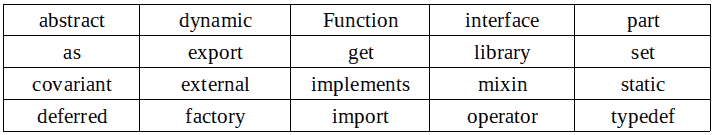

# Dart 中的关键字

> 原文:[https://dev.to/jay_tillu/keywords-in-dart-39jo](https://dev.to/jay_tillu/keywords-in-dart-39jo)

关于关键词的知识也很重要。因为我们不能用它作为标识符*(虽然在某些情况下我们可以。但是让我们遵循最佳实践)*。

关键字在语言中有特殊的含义。

## 保留字

*   以下是 dart 中的保留字。这些保留字不能用作标识符。

[T2】](https://res.cloudinary.com/practicaldev/image/fetch/s--uaqI1v3G--/c_limit%2Cf_auto%2Cfl_progressive%2Cq_auto%2Cw_880/https://miro.medium.com/max/711/1%2AfuXiAo4Xn7egoRHpWUjyyA.png)

## 上下文关键字

*   这些关键字只有在特定的地方才有意义。在其他地方，它们是有效的标识符。

[T2】](https://res.cloudinary.com/practicaldev/image/fetch/s--byD3FXIv--/c_limit%2Cf_auto%2Cfl_progressive%2Cq_auto%2Cw_880/https://miro.medium.com/max/427/1%2AoVPdfcXAEIGOKftZQ4MqBw.png)

## 内置标识符

*   这些关键字在大多数情况下都是有效的标识符，但是它们不能用作类名或类型名，也不能用作导入前缀。

[T2】](https://res.cloudinary.com/practicaldev/image/fetch/s--XCSn_22i--/c_limit%2Cf_auto%2Cfl_progressive%2Cq_auto%2Cw_880/https://miro.medium.com/max/716/1%2ARcesjDtXZ3xZCkyp7aqWOA.png)

> *   **Waiting** **Giving in** is a new word added after the release of Dart 1.0\. And cannot be used as an identifier in any function body marked with async, async* or sync*.

这些都是飞镖的关键词。作为开发者你需要知道的。不要使用这些中的任何一个作为标识符(虽然你可以。就当是我个人的 tip☺️吧)

如果我错过了什么，请随时告诉我。我一定会在下一篇文章中介绍您。

在那之前，继续编码，继续爱。

记住没有老师，没有书，没有视频教程，也没有博客能教会你一切。有人说，学习是一个旅程，旅程永无止境。只是从这里那里收集一些数据，读一读，学一学，练一练，试着去应用。不要因为做不到或者不知道这个概念或者那个概念而犹豫。记住，每个程序员都是从你现在走的这条路上走过的。记住每个大师都曾经是初学者。努力工作，全力以赴。

### 欲了解更多信息，请访问以下链接

*   [Fuchsia OS 官方网站](https://fuchsia.dev/)
*   [Dart 官方网站](https://dart.dev/)
*   [颤振官方网站](https://flutter.dev/)

> 想和我联系吗？以下是链接。我很乐意成为你的朋友。😊
> [Twitter](https://twitter.com/jay_tillu)
> [脸书](https://www.facebook.com/jaytillu.1314/)
> [insta gram](https://www.instagram.com/jay.tillu/)
> [Medium](https://medium.com/jay-tillu)
> 或者直接在[jayviveki13@gmail.com](mailto:jayviveki13@gmail.com)给我发邮件