# 点击按钮时浏览器间的行为不一致

> 原文:[https://dev . to/zellwk/consistent-behavior-inter-browsers-when-clicking-on-buttons-2k MC](https://dev.to/zellwk/inconsistent-behavior-among-browsers-when-clicking-on-buttons-2kmc)

我注意到浏览器在处理点击`<button>`时不一致。一些浏览器选择关注按钮。有些浏览器没有。

在这篇文章中，我想向你展示我的测试和发现。然后，我想谈谈克服这些不一致的方法。

## [](#the-test)测试

测试很简单。我们正在测试当我们点击一个`<button>`时会发生什么。具体来说，我们想知道:

1.  点击按钮会聚焦吗？
2.  单击后，按键是否源自按钮？
3.  单击后，我们可以跳转到下一个元素吗？
4.  单击后，我们可以按 shift-tab 键切换到前一个元素吗？

下面是我们在测试中使用的 HTML:

```
<div tabindex="0">Placeholder for testing tab</div>
<button>Button</button>
<div tabindex="0">Placeholder for testing tab</div> 
```

这些`<div>`是为了让我们容易地测试 tab 和 shift-tab。

如果你想继续测试，这里有一个代码笔给你。

参见 [CodePen](https://codepen.io) 上 Zell Liew ( [@zellwk](https://codepen.io/zellwk) )的笔[按钮和链接焦点测试](https://codepen.io/zellwk/pen/WVMMvy/)。

### [](#testing-for-focus)测试焦点

我们可以通过视觉测试焦点。如果按钮获得焦点，按钮周围应该有默认的视觉光晕。

我们也可以通过编程来测试焦点。在 JavaScript 中，可以用`document.activeElement`获得聚焦的元素。当我们点击一个按钮时，我们可以记录聚焦的元素。

```
const button = document.querySelector("button");
button.addEventListener("click", event => {
  console.log("Click:", document.activeElement);
}); 
```

注意:如果你使用的是 Chrome，可以使用 Live Expression 工具(所以不需要记录`document.activeElement`)。

### [](#testing-for-keypress)按键测试

在这里，我们可以向文档添加一个`keydown`事件监听器。这里，我们希望记录是什么元素触发了事件。我们可以用`event.target`来分辨元素。

```
document.addEventListener("keydown", event => {
  console.log(`Keydown:`, event.target);
}); 
```

### [](#testing-for-tab-and-shifttab)测试 Tab 和 Shift-tab

点击一个按钮后，Tab 键会转到下一个可聚焦的元素吗？如果它转到下一个可聚焦的元素，该元素应该得到一个聚焦轮廓。

同样，`Shift` + `Tab`是否会转到前一个可聚焦的元素？如果它转到前一个可聚焦的元素，该元素也应该得到一个聚焦轮廓。

我没有记录`document.activeElement`，因为对焦辉光已经足够了。

## [](#results)结果

### [](#safari-mac)Safari (Mac)

当您在 Safari (12.1.1)中点按按钮时，按钮不会获得焦点。文档反而获得焦点。我们知道这一点是因为:

1.  按钮上没有焦点发光。
2.  `document.activeElement`指向`<body>`。

[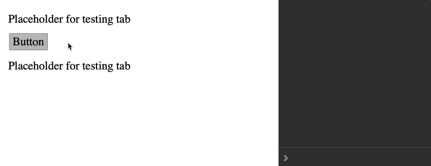T2】](https://res.cloudinary.com/practicaldev/image/fetch/s--lGuc-M8i--/c_limit%2Cf_auto%2Cfl_progressive%2Cq_66%2Cw_880/https://zellwk.cimg/2019/inconsistent-button-behavior/safari-click.gif)

由于`<body>`获得焦点，任何进一步的按键都来自于`<body>`。

[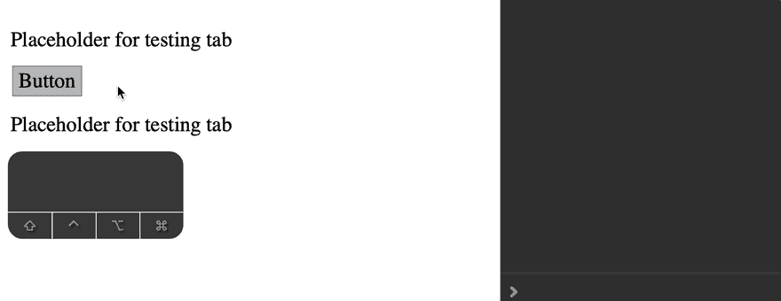T2】](https://res.cloudinary.com/practicaldev/image/fetch/s--4SfZSGGe--/c_limit%2Cf_auto%2Cfl_progressive%2Cq_66%2Cw_880/https://zellwk.cimg/2019/inconsistent-button-behavior/safari-keydown.gif)

跳转到下一个元素会像预期的那样工作。下一个元素获得焦点。

[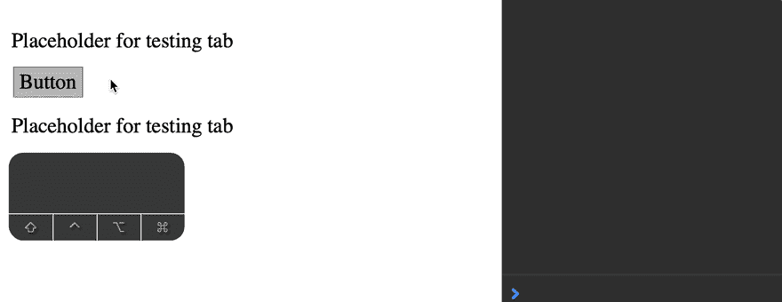T2】](https://res.cloudinary.com/practicaldev/image/fetch/s--QFPikdDN--/c_limit%2Cf_auto%2Cfl_progressive%2Cq_66%2Cw_880/https://zellwk.cimg/2019/inconsistent-button-behavior/safari-tab.gif)

`Shift` + `Tab`不像我预期的那样工作。我期望前一个元素获得焦点，但是`<button>`反而获得焦点。

[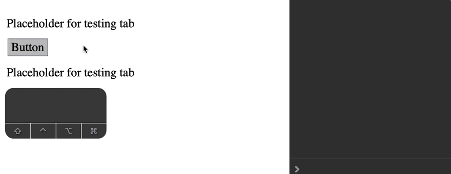T2】](https://res.cloudinary.com/practicaldev/image/fetch/s--_V5tfkvP--/c_limit%2Cf_auto%2Cfl_progressive%2Cq_66%2Cw_880/https://zellwk.cimg/2019/inconsistent-button-behavior/safari-shift-tab.gif)

### [](#firefox-mac)火狐(Mac)

当你点击 Firefox (Nightly 70.0a1)中的一个按钮时，这个按钮不会获得焦点。文档反而获得焦点。

[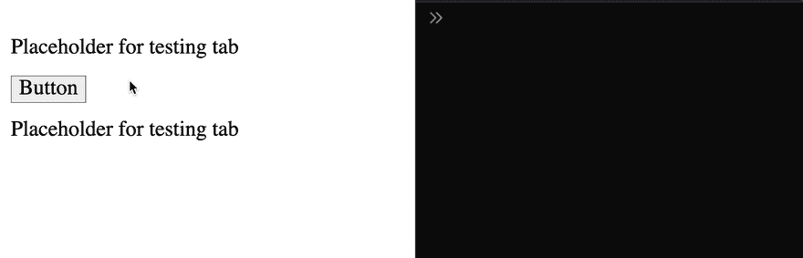T2】](https://res.cloudinary.com/practicaldev/image/fetch/s--Z1FY12GT--/c_limit%2Cf_auto%2Cfl_progressive%2Cq_66%2Cw_880/https://zellwk.cimg/2019/inconsistent-button-behavior/firefox-click.gif)

任何进一步的按键都源于`<body>`。

[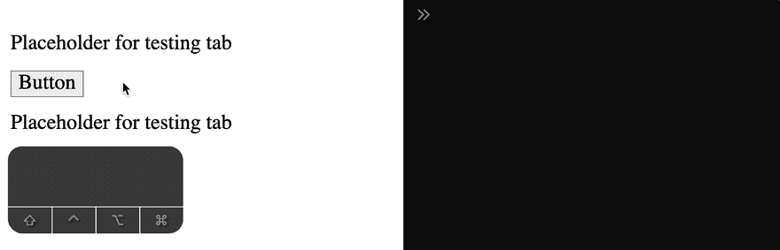T2】](https://res.cloudinary.com/practicaldev/image/fetch/s--NeZJ0tt7--/c_limit%2Cf_auto%2Cfl_progressive%2Cq_66%2Cw_880/https://zellwk.cimg/2019/inconsistent-button-behavior/firefox-keydown.gif)

`Tab`不按预期工作。当你按下`Tab`时，Firefox 聚焦于文档中的第一个元素。

[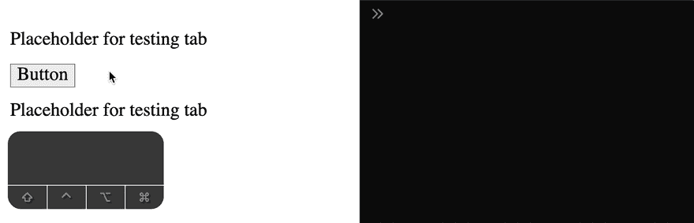T2】](https://res.cloudinary.com/practicaldev/image/fetch/s--qOeSLeF2--/c_limit%2Cf_auto%2Cfl_progressive%2Cq_66%2Cw_880/https://zellwk.cimg/2019/inconsistent-button-behavior/firefox-tab.gif)

`Shift` + `Tab`搞笑。如果`<button>`是你点击的第一个东西，Firefox 会聚焦于文档中最后一个可聚焦的元素。如果你在点击按钮之前聚焦在一个元素上，Firefox 会聚焦这个元素。

[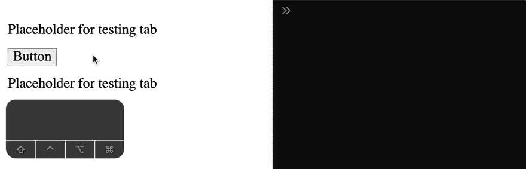T2】](https://res.cloudinary.com/practicaldev/image/fetch/s--yxZaJIhT--/c_limit%2Cf_auto%2Cfl_progressive%2Cq_66%2Cw_880/https://zellwk.cimg/2019/inconsistent-button-behavior/firefox-shift-tab.gif)

火狐和按钮的问题至少可以追溯到火狐 63。MDN 有一个关于这个的章节:

[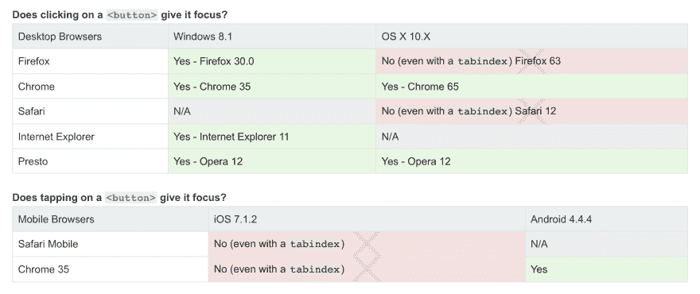T2】](https://res.cloudinary.com/practicaldev/image/fetch/s--GIG7n14J--/c_limit%2Cf_auto%2Cfl_progressive%2Cq_auto%2Cw_880/https://zellwk.cimg/2019/inconsistent-button-behavior/mdn.png)

### [](#firefox-windows)火狐(Windows)

当你点击 Firefox (Quantum 68.0.1，Windows 版本)中的一个按钮时，按钮获得焦点，但焦点辉光不显示。

[T2】](https://res.cloudinary.com/practicaldev/image/fetch/s--1_LPpqZV--/c_limit%2Cf_auto%2Cfl_progressive%2Cq_66%2Cw_880/https://zellwk.cimg/2019/inconsistent-button-behavior/firefox-windows-click.gif)

进一步的按键来自`<button>`。

[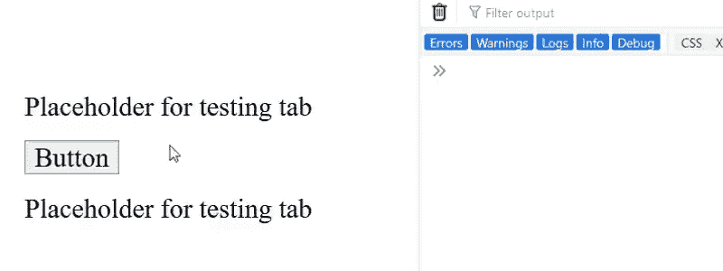T2】](https://res.cloudinary.com/practicaldev/image/fetch/s--5YU9rqL7--/c_limit%2Cf_auto%2Cfl_progressive%2Cq_66%2Cw_880/https://zellwk.cimg/2019/inconsistent-button-behavior/firefox-windows-keydown.gif)

选项卡按预期工作。下一项成为焦点。

[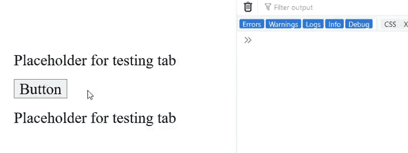T2】](https://res.cloudinary.com/practicaldev/image/fetch/s--LEC11423--/c_limit%2Cf_auto%2Cfl_progressive%2Cq_66%2Cw_880/https://zellwk.cimg/2019/inconsistent-button-behavior/firefox-windows-tab.gif)

`Shift` + `Tab`按预期工作。前一项获得焦点。

[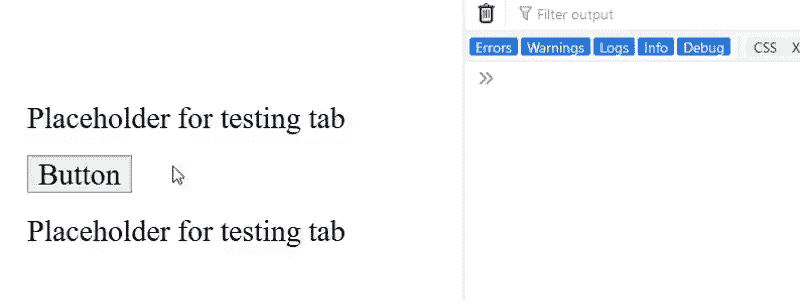T2】](https://res.cloudinary.com/practicaldev/image/fetch/s--ISbxqs8v--/c_limit%2Cf_auto%2Cfl_progressive%2Cq_66%2Cw_880/https://zellwk.cimg/2019/inconsistent-button-behavior/firefox-windows-shift-tab.gif)

### [](#chrome-mac)Chrome (Mac)

当你点击 Chrome (Canary 78.0)中的一个按钮时，这个按钮就会获得焦点。这个实现不同于 Safari 和 Firefox。

[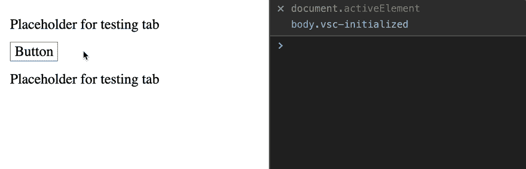T2】](https://res.cloudinary.com/practicaldev/image/fetch/s--Idb2uz3s--/c_limit%2Cf_auto%2Cfl_progressive%2Cq_66%2Cw_880/https://zellwk.cimg/2019/inconsistent-button-behavior/chrome-click.gif)

下一次按键来自`<button>`。这是意料之中的，因为`<button>`是焦点元素。

[T2】](https://res.cloudinary.com/practicaldev/image/fetch/s--vChFhaa8--/c_limit%2Cf_auto%2Cfl_progressive%2Cq_66%2Cw_880/https://zellwk.cimg/2019/inconsistent-button-behavior/chrome-keydown.gif)

`Tab`果然奏效。下一个元素获得焦点。

[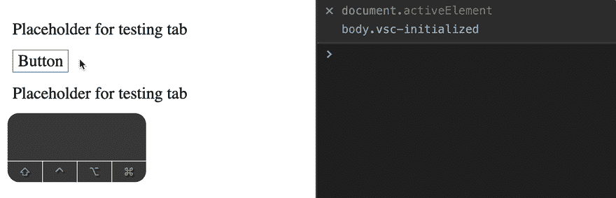T2】](https://res.cloudinary.com/practicaldev/image/fetch/s--7yq-nf1N--/c_limit%2Cf_auto%2Cfl_progressive%2Cq_66%2Cw_880/https://zellwk.cimg/2019/inconsistent-button-behavior/chrome-tab.gif)

`Shift` + `Tab`按预期工作。前一个元素获得焦点。

[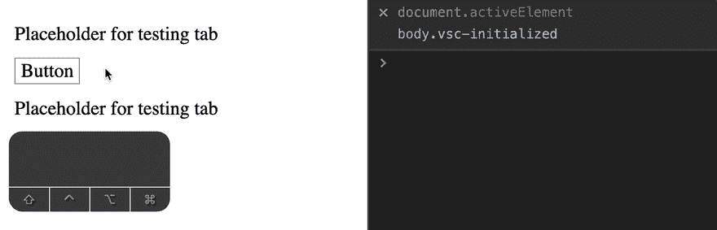T2】](https://res.cloudinary.com/practicaldev/image/fetch/s--Q2jojCAa--/c_limit%2Cf_auto%2Cfl_progressive%2Cq_66%2Cw_880/https://zellwk.cimg/2019/inconsistent-button-behavior/chrome-shift-tab.gif)

### [](#chrome-windows)Chrome (Windows)

当你点击 Chrome (Chrome 75.0)中的一个按钮时，这个按钮就会获得焦点。

[T2】](https://res.cloudinary.com/practicaldev/image/fetch/s--s_lEQ60Y--/c_limit%2Cf_auto%2Cfl_progressive%2Cq_66%2Cw_880/https://zellwk.cimg/2019/inconsistent-button-behavior/chrome-windows-click.gif)

下一次按键来自`<button>`。

[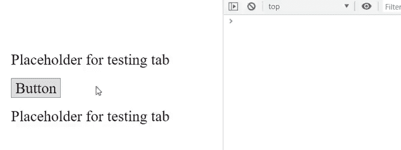T2】](https://res.cloudinary.com/practicaldev/image/fetch/s--U4D59fBU--/c_limit%2Cf_auto%2Cfl_progressive%2Cq_66%2Cw_880/https://zellwk.cimg/2019/inconsistent-button-behavior/chrome-windows-keydown.gif)

`Tab`果然奏效。下一个元素获得焦点。

[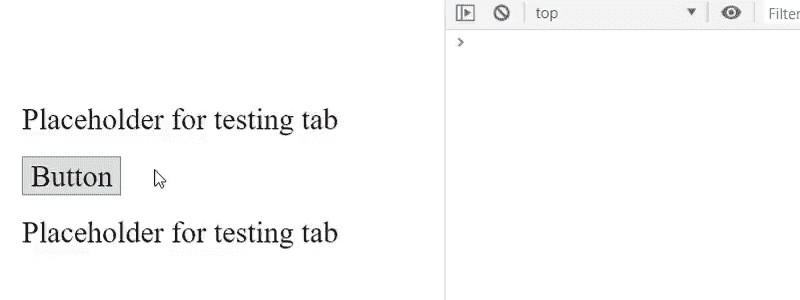T2】](https://res.cloudinary.com/practicaldev/image/fetch/s--yHB1U2KN--/c_limit%2Cf_auto%2Cfl_progressive%2Cq_66%2Cw_880/https://zellwk.cimg/2019/inconsistent-button-behavior/chrome-windows-tab.gif)

`Shift` + `Tab`按预期工作。前一个元素获得焦点。

[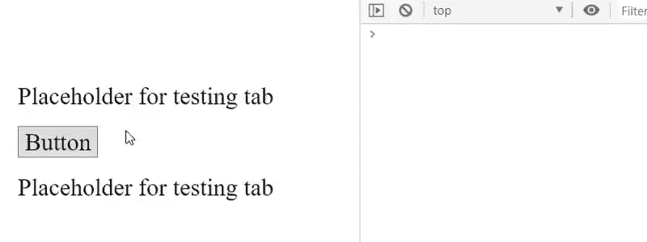T2】](https://res.cloudinary.com/practicaldev/image/fetch/s--5yEptp3G--/c_limit%2Cf_auto%2Cfl_progressive%2Cq_66%2Cw_880/https://zellwk.cimg/2019/inconsistent-button-behavior/chrome-windows-shift-tab.gif)

### [](#edge-windows)(视窗边缘)

当你点击 Edge (Edge 17)中的一个按钮时，按钮获得焦点，但是焦点环没有出现。

[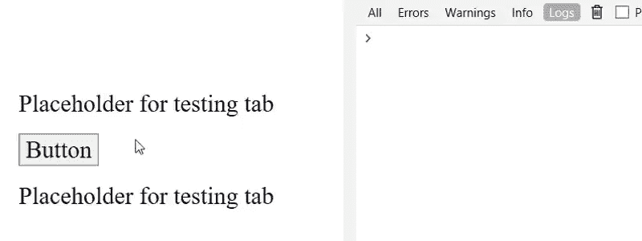T2】](https://res.cloudinary.com/practicaldev/image/fetch/s--LEMcmGfU--/c_limit%2Cf_auto%2Cfl_progressive%2Cq_66%2Cw_880/https://zellwk.cimg/2019/inconsistent-button-behavior/edge-click.gif)

下一次按键来自`<button>`。

[T2】](https://res.cloudinary.com/practicaldev/image/fetch/s--fvyDktdD--/c_limit%2Cf_auto%2Cfl_progressive%2Cq_66%2Cw_880/https://zellwk.cimg/2019/inconsistent-button-behavior/edge-keydown.gif)

`Tab`果然奏效。下一个元素获得焦点。

[T2】](https://res.cloudinary.com/practicaldev/image/fetch/s--w4LrD0IL--/c_limit%2Cf_auto%2Cfl_progressive%2Cq_66%2Cw_880/https://zellwk.cimg/2019/inconsistent-button-behavior/edge-tab.gif)

`Shift` + `Tab`按预期工作。前一个元素获得焦点。

[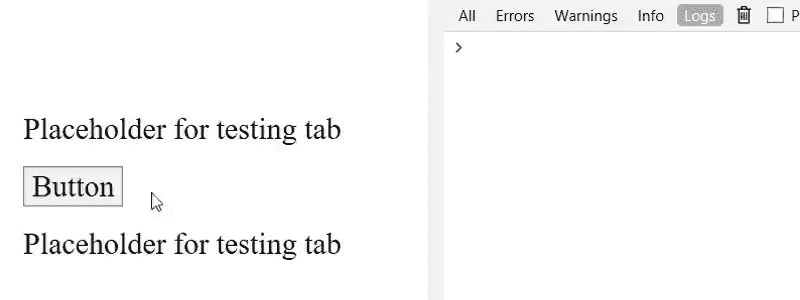T2】](https://res.cloudinary.com/practicaldev/image/fetch/s--VtVN9fWA--/c_limit%2Cf_auto%2Cfl_progressive%2Cq_66%2Cw_880/https://zellwk.cimg/2019/inconsistent-button-behavior/edge-shift-tab.gif)

## [](#summary-of-the-results)汇总结果

我们在通用浏览器上测试了四种东西:

1.  点击按钮会聚焦吗？
2.  单击后，按键是否源于按钮？
3.  单击后，我们可以跳转到下一个元素吗？
4.  单击后，我们可以按 shift-tab 键切换到前一个元素吗？

以下是表格形式的结果。

| 试验 | 旅行队 | Firefox(∞) | 火狐浏览器(⊞) | 铬(∞) | 铬合金(⊞) | 边缘(⊞) |
| --- | --- | --- | --- | --- | --- | --- |
| 聚焦元素 | `<body>` | `<body>` | `<button>`(但没有焦点发光) | `<button>` | `<button>` | `<button>`(但没有焦点发光) |
| 下一次按键来自: | `<body>` | `<body>` | `<button>` | `<button>` | `<button>` | `<button>` |
| 选项卡转到: | 下一个元素 | 文档中的第一个元素 | 下一个元素 | 下一个元素 | 下一个元素 | 下一个元素 |
| Shift + Tab 转到: | `<button>` | 先前聚焦的元素(如果有) | 前一元素 | 前一元素 | 前一元素 | 前一元素 |

你可以看到这里的不一致。一清二楚。主要的不一致之处是:

1.  Mac 上的 Firefox 简直太怪异了。一切似乎都不对劲。
2.  有些浏览器在点击按钮时并不关注它。
3.  有些浏览器在点击按钮时没有焦点发光。

HTML 规范没有说明用户点击按钮后浏览器应该做什么。所以*没有浏览器因为不一致的行为而犯错*。

## [](#heres-a-potential-fix)这里有一个潜在的修正

我认为 Chrome 的实现(Mac 和 Windows)是最有意义的。

1.  当你点击一个按钮时，焦点应该在按钮上。
2.  按钮应该有焦点发光。
3.  当你点击一个按钮后按下`Tab`时，下一个元素应该获得焦点。
4.  当你点击一个按钮后按下`Shift` + `Tab`时，前一个元素应该获得焦点。

注意:如果你是那种讨厌默认对焦风格的人，你可以重新设计对焦环(或者你可以等待`:focus-visible`得到广泛支持)。

如果你想让其他浏览器的行为与 Chrome 的实现保持一致，有一个快速解决办法。您所要做的就是将这段代码添加到 JavaScript 的顶部。

```
document.addEventListener('click', event => {
  if (event.target.matches('button') {
    event.target.focus()
  }
}) 
```

当您单击按钮时，此代码会关注它。这也确保了:

1.  出现焦点光晕。
2.  Tab 键转到下一个元素。
3.  Shift-Tab 转到上一个元素

**重要提示:**您希望将这段代码放在 JavaScript 文件的顶部。它之所以有效，是因为事件侦听器是按照声明的顺序被调用的。焦点将总是首先指向按钮。如果需要，您可以将焦点重定向到其他元素。

**重要提示#2:** 我还没有在所有设备上彻底测试过这段代码。(仅限 Mac 版 Safari、Firefox 和 Chrome)。如果你能帮忙进行一些测试，我将不胜感激。如果我错了，请告诉我。谢了。

如果你想知道我为什么做这些测试:当我为 [Learn JavaScript](https://learnjavascript.today) 编写键盘部分时，我意识到了不一致的行为。我做这些测试是因为我想教我的学生处理按钮和焦点的正确方法(这是可访问性的一大部分！).

* * *

感谢阅读。这篇文章最初发表在我的博客上。如果你想要更多的文章来帮助你成为一个更好的前端开发人员，请注册我的时事通讯。