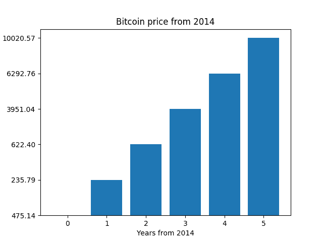

# Python:使用 Matplotlib 的比特币价格趋势

> 原文:[https://dev . to/codesharedot/python-bit coin-price-trend-with-matplotlib-575d](https://dev.to/codesharedot/python-bitcoin-price-trend-with-matplotlib-575d)

如果你是一个长期交易者，你不会对每日汇率感兴趣。可以得到比特币按年的历史价格。

我选择 Python 是因为这是我快速编写脚本的首选语言。

## [](#collect-data)收集数据

您可以获取 JSON 格式的数据，并将其解析成 Python 列表。在下面的代码中，我们使用请求模块来完成这项工作。

我们只对每年的同一天感兴趣，其他一切都是噪音。我选了 9 月 10 日。数据本身是从 2014 年开始的，你不能再往前追溯，因为他们没有那个数据。

```
#!/usr/bin/python3
import json
import requests
from bs4 import BeautifulSoup
import csv
import sys
from time import sleep
from time import gmtime, strftime
import matplotlib.pyplot as plt
import seaborn as sns

enddate = strftime("%Y%m%d", gmtime()) 
r  = requests.get("https://coinmarketcap.com/currencies/bitcoin/historical-data/?start=20140101&end={0}".format(enddate))
data = r.text

soup = BeautifulSoup(data, "html.parser")
table = soup.find('table', attrs={ "class" : "table"})

prices = []

for row in table.find_all('tr'):
    addPrice = False
    tag = row.findAll('td')
    for val in tag:
        value = val.text

        if "Sep 10" in value:
            print(value)
            addPrice = True

    if addPrice == True:
        prices.append( tag[3].text )

# flip list, months are in reverse order
prices = prices[::-1]
print(prices) 
```

我们翻转价格数据，因为月份开始以相反的顺序返回。

```
Sep 10, 2019
Sep 10, 2018
Sep 10, 2017
Sep 10, 2016
Sep 10, 2015
Sep 10, 2014 
```

## [](#create-plot)创建情节

好了，现在你有了价格数据，你可以创建图表了。

```
x = list(range(0, len(prices)))

plt.title('Bitcoin price from 2014')
plt.ylabel('Price in USD')
plt.xlabel('Years from 2014')
plt.bar(x, prices)
plt.show() 
```

这给了我们:

[T2】](https://res.cloudinary.com/practicaldev/image/fetch/s--mFrvBZeq--/c_limit%2Cf_auto%2Cfl_progressive%2Cq_auto%2Cw_880/https://thepracticaldev.s3.amazonaws.com/i/277mcbqcufuh7p812xri.png)

那么这是一个好的投资吗？这由你决定，这不是财务建议。

相关链接:

*   [比特币价格正常图表](https://coinmarketcap.com/currencies/bitcoin/#charts)
*   [学习 Python 编程](https://pythonbasics.org/)
*   [github 上的代码](https://github.com/codesharedot/bitcoin-price-trend)