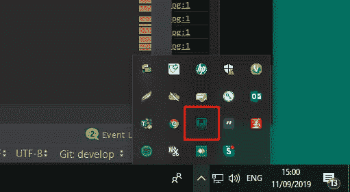
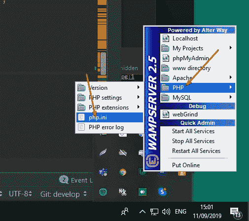
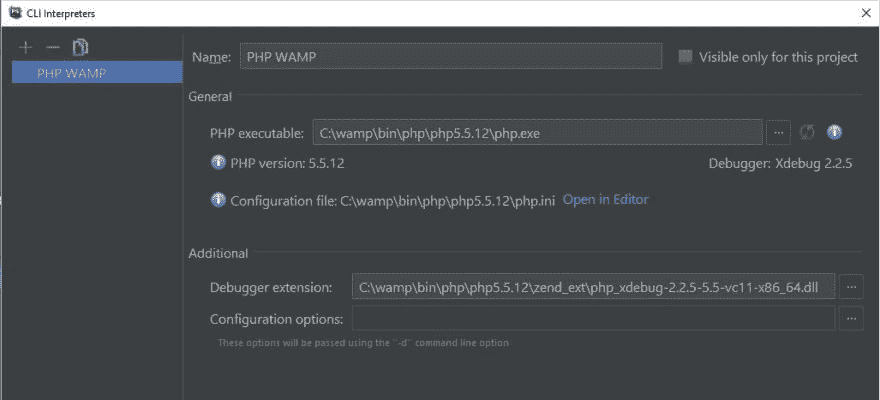
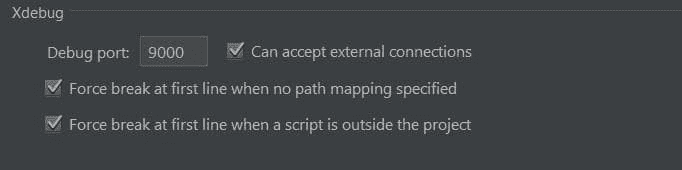
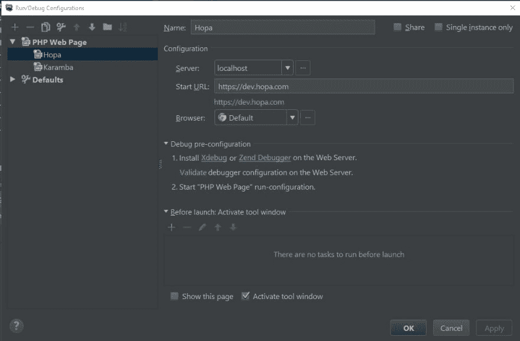

# 为虚拟对象在 PHPStorm 上安装 Xdebug

> 原文：<https://dev.to/orivolfo/installing-xdebug-on-phpstorm-for-dummies-4k8a>

当我被要求在我的工作环境中安装 Xdebug 时，我在网上找到了多个指南。没有一个是我真正需要的。
在我的工作场所，我们使用 *PHPStorm* 作为 IDE，我们的本地环境是 *Wamp* (标题说**用于假人**)。

所以，在从多个向导那里搜集信息后，我终于让它发挥作用了，并把它写在一个文档中给我的队友。

你真幸运，我喜欢分享！

## 循序渐进:

1.  转到 *php.ini* 文件，确保 **xdebug.remote_enable = 1** 。
    如果你不确定你的 *php.ini* 文件在哪里，而你使用的是 Wamp，你可以从任务栏中找到快捷方式:
     
    然后:
    

2.  在 PHPStorm 中，进入**文件|设置|语言&框架| PHP** 和
    选择:

    *   PHP 水平=> 5.5 我的情况。如果您不知道您的 PHP 版本，请回显 [phpinfo()](https://www.php.net/manual/en/function.phpinfo.php) 。
    *   CLI 解释器= >使用以下定义从本地路径添加一个新的解释器:如果您使用的是 *Wamp* ，我假设您像我一样在 Wamp 文件夹中有那个文件。
3.  在**文件|设置|语言&框架| PHP |调试**
    中，确保 Xdebug 定义如下:
    

4.  进入**运行|编辑配置**，添加一个新的 *PHP 网页*
    配置，定义如下:
    

    *   如果需要，定义一个本地主机服务器
    *   *开始 URL* 是您想要开始调试的页面的地址。
5.  进入**运行| Web 服务器调试验证**并确保
    调试器配置正确:
    

6.  最后，开始调试:

    *   按下**开始监听 PHP 调试**连接:
    *   按下**调试**按钮，或者 **Shift + F9** 

调试愉快！