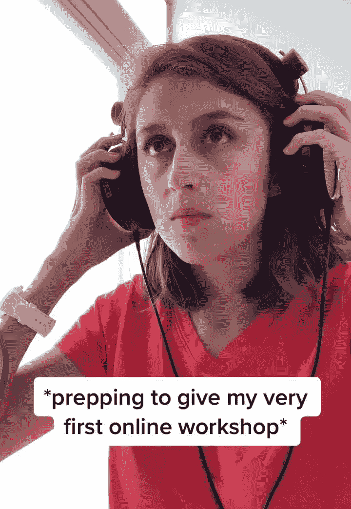
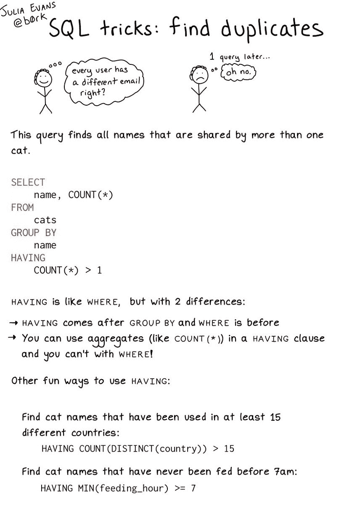

# 有哪些好的技术人员可以在 Twitter 上关注酷/有趣的东西？

> 原文:[https://dev . to/_ big blind/who ' s-some-some-some-good technies-to-follow-on-Twitter-for-cool-fun-ny-stuff-5dk 0](https://dev.to/_bigblind/who-are-some-good-techies-to-follow-on-twitter-for-cool-fun-ny-stuff-5dk0)

我相信我在 Twitter 上关注着一群相当多样化的人。这样，它有助于我理解社区中不同人的观点。但最近我觉得 twitter 只是向我展示了什么是坏的和不公正的。

因此，我想关注一些经常发布酷或有趣的东西的人，让我的推特变得更亮一些。

一些例子:

卡西迪·威廉姆斯每隔一段时间就会发布这些精彩的小视频:

> <video loop="" controls=""><source src="https://video.twimg.com/ext_tw_video/1172569974046482433/pu/vid/360x522/7XZ-gxfXeyPnJ-ew.mp4?tag=10" type="video/mp4"></video>卡西迪·威廉姆斯[@卡西杜](https://dev.to/cassidoo)我做了一个噩梦，梦见我的第一个工作坊就这样进行了，所以你可以想象我现在正在热情地准备🙃2019 年 9 月 13 日下午 17:572403051

朱莉娅·埃文斯制作了这些解释性的漫画，以一种快速、直观的方式教我新东西

> T6】🔎朱莉娅·埃文斯🔍@ b0rkSQL 窍门:查找重复项2019 年 9 月 14 日下午 14:008534295