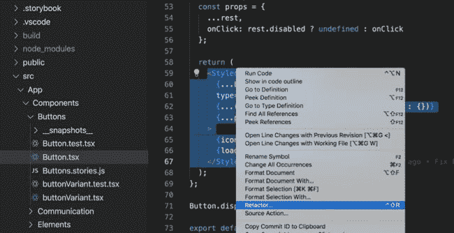

# 让你想测试你的代码的首要原因

> 原文：<https://dev.to/reactgraphqlacademy/the-number-one-reason-that-will-make-you-want-to-test-your-code-3j3n>

目录:

*   编写软件很复杂，[转到规范章节](https://www.reactgraphql.academy/blog/the-number-one-reason-that-will-make-you-want-to-test-your-code#writing_software_is_complex)
*   编写测试让每个人都更开心，[转到规范部分](https://www.reactgraphql.academy/blog/the-number-one-reason-that-will-make-you-want-to-test-your-code#writing_tests_makes_everyone_happier)

## 编写软件很复杂

我给来自世界各地的专业开发人员教授高级编码，令我惊讶的是，很多开发人员很少为他们构建的软件编写测试。这有很多原因，我不是在这里指出任何人，相反，我想与你分享我发现的让我在实践中想要测试我构建的软件的首要原因。

首先，让我告诉你一些关于我的事情，我是一个有 15 年经验的软件工程师，我非常好，我非常非常好…在第一次尝试写糟糕的代码时。但我想我并不孤单。

[看看推文。](https://twitter.com/user/status/314785735171518464)

为什么第一次尝试就构建它如此困难，所以我们需要迭代？好消息是这不是因为我们这些开发者:)，而是因为构建软件的本质。构建软件是一个复杂的问题。

在本文的上下文中，我将把复杂性定义为“未知的未知”，意思是因果关系只能通过回顾来推断。换句话说，当我们构建软件时，人类相信有一个问题需要解决。这个问题需要被定义并向其他人解释(除非它是由一个人构建和使用的)。然后，其他人设计并实现问题的正确解决方案。最后，即使前面的所有步骤都完美地执行了，也有可能问题实际上并不是问题，或者在正确的解决方案实施之前，问题发生了变化。由于软件的复杂性，构建软件是一个探索性的过程。这就是我们迭代构建它的原因。

## 编写测试让每个人都更开心

似乎我们写的测试越多，我们就越能迭代。让我们列出编写测试将帮助我们更多迭代的主要原因，以及将从中直接受益的人:

*   测试自动化。这意味着更快的部署和更少的错误。可靠的产品，更快乐的用户。

*   适应变化。我们可以更快地添加新功能或更改现有功能。这让我认识的所有产品所有者和利益相关者都更开心了。

*   理解和记录代码。这有利于新开发人员的入职。现在我们有了更快乐的同事，因为更容易理解他们将要工作的新代码库。

*   最后但并非最不重要的一点是，有一个原因可能会让实现该特性的开发人员更开心。代码重构。

#### 代码重构

代码重构用非常简单的话来说，就是在不改变现有功能的情况下，将现有功能做得更好。我不知道你是怎么想的，但是每当我能够改进我以前建造的东西时，我都会感到一种极度的快乐。

我们迭代得越多，就越接近最优解。目标不是得到最优解，而是在不同的时间点足够好。

在我看来，高级开发人员了解我们工作的复杂性，所以现在就为成功的未来变更制定计划，以最小化未知变更的成本。经验可以定义为你需要后学到的知识。编写测试是帮助你完成这个过程的关键工具。

如果你想用 JavaScript 来提高你的单元测试技能，看看这篇关于用 JavaScript 解释单元测试的文章。如果你想关注 React 中的单元测试和集成测试，你也可以阅读另一篇关于测试 React 应用的[文章](https://www.reactgraphql.academy/react/testing-react-applications/)。