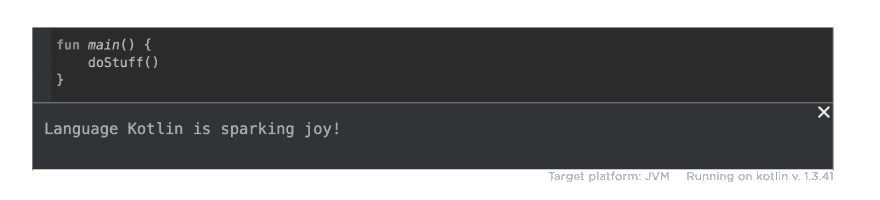

# with(config object){ " Language $ kot Lin "。isSparkingJoy() }

> 原文：<https://dev.to/jmfayard/with-configobject-language-kotlin-issparkingjoy-ic4>

我使用[科特林](https://kotlinlang.org/docs/reference/)，因为*特质*是一个东西。然而，它继续让我感到惊讶，通常当我发现两种熟悉的语言结构是如何更好地结合在一起的。

今天我将与你分享这样一个最近的发现。我不知道这个模式已经有了名字，所以我称它为`with(ConfigObject)`模式。

```
with(ConfigObject) { 
     "Language $KOTLIN".isSparkingJoy() 
} 
```

<svg width="20px" height="20px" viewBox="0 0 24 24" class="highlight-action crayons-icon highlight-action--fullscreen-on"><title>Enter fullscreen mode</title></svg> <svg width="20px" height="20px" viewBox="0 0 24 24" class="highlight-action crayons-icon highlight-action--fullscreen-off"><title>Exit fullscreen mode</title></svg>

但首先我要坦白一件事:

# 那个傻逼的初稿

当我开始做一个项目或一个功能时，我最初的代码是**凌乱的**。

它有一些不应该硬编码东西。它到处都有顶级属性和函数。有时会执行两次。应该提取却没有提取的东西。以一种没有真正意义的方式提取出来的东西。通常有一个不好的名字。

最初混乱的代码服务于重要的目的。使用和学习新的 API。确认在一个想法上投入时间是有意义的。更重要的是，这是对完美主义的补救。在这一点上，我同意作家安妮·拉莫特的观点

> 完美主义是压迫者的声音，是人民的敌人。它会让你的整个生活变得局促和疯狂，这是你和糟糕的初稿之间的主要障碍。完美主义是一种卑鄙、僵化的理想主义，而混乱是艺术家真正的朋友。当我们还是孩子的时候，人们不知何故(我敢肯定是无意中)忘记提到的是，我们需要制造混乱来找出我们是谁，为什么我们会在这里——并且，推而广之，我们应该写些什么。

# 重构时间

然而，时候到了，就该收拾残局了。

是时候[重构](https://refactoring.com/)了。

假设我们有这样一段混乱的代码:

```
fun doStuff() {
    val feeling = "is sparking joy"
    println("Language $language " + feeling + "!")
}

val language = "Kotlin" 
```

<svg width="20px" height="20px" viewBox="0 0 24 24" class="highlight-action crayons-icon highlight-action--fullscreen-on"><title>Enter fullscreen mode</title></svg> <svg width="20px" height="20px" viewBox="0 0 24 24" class="highlight-action crayons-icon highlight-action--fullscreen-off"><title>Exit fullscreen mode</title></svg>

这里的模式是

*   创建一个包含所有提取的常量的`Config`单例，这样就不会在包中到处都是
*   使用[范围函数`with`](https://kotlinlang.org/docs/reference/scope-functions.html#with) ，导入`Config`的所有属性和扩展函数

它工作了。相信我！

不，实际上，相信我，但是通过点击这个嵌入片段的**运行▶️** 按钮来**验证**:

[https://pl.kotl.in/ZCSpfZtsF?theme=darcula&from=1&to=8](https://pl.kotl.in/ZCSpfZtsF?theme=darcula&from=1&to=8)

你可能不得不**向下滚动**kot Lin 片段，因为[practical dev/dev . to # 4011 Iframe resizing](https://github.com/thepracticaldev/dev.to/issues/4011)。但它确实有效:

[](https://res.cloudinary.com/practicaldev/image/fetch/s--u0qxgAnk--/c_limit%2Cf_auto%2Cfl_progressive%2Cq_auto%2Cw_880/https://user-images.githubusercontent.com/459464/64924565-72cd0700-d7e6-11e9-9950-5202ac482c4d.png)

# 结论

我不确定这种模式是否已经有了名字。它使用熟悉构件。当你使用 Kotlin 构建领域特定语言 DSL 时，你可以做类似的、更复杂的事情。

但是 DSL 是一个相当高级的话题，而这是一个简单问题的简单解决方案，值得强调。

显然，这个例子是为了配合我的帖子的标题而设计的。

关于真实世界的例子，请看我在 [PluginConfig](https://github.com/jmfayard/buildSrcVersions/blob/07fec637833d1a63bb6ed61241ba76ff9d49e3cb/plugin/src/main/kotlin/de/fayard/internal/PluginConfig.kt#L12-L49) 的开源项目及其用法 [`with(PluginConfig) { ... }`](https://github.com/jmfayard/buildSrcVersions/blob/07fec637833d1a63bb6ed61241ba76ff9d49e3cb/plugin/src/main/kotlin/de/fayard/BuildSrcVersionsPlugin.kt#L26-L50)

值得指出的一点是，它不仅适用于常量，也适用于函数，更重要的是[扩展函数](https://kotlinlang.org/docs/reference/extensions.html#extensions)！我不喜欢为`String`增加扩展功能。那会污染所有的琴弦。但是`ConfigObject`为它提供了一个范围。

试着去发现整理的改变生活的魔力吧！

# 你好，科特林周刊

很多游客。发生了什么事？哦，我上了科特林周刊？

欢迎来到 dev.to！

我将邀请您在这里创建一个帐户。这是一个由读者和作家组成的友好的开发者社区。
这里有一个很好的总结，你可以在这里发表，或者在 Medium.com 上发表

[](/devteam) [## Medium 从来就不是开发者生态系统的一部分

### 开发团队的 Ben Halpern 月 3 日 195 分钟阅读

#meta](/devteam/medium-was-never-meant-to-be-a-part-of-the-developer-ecosystem-25a0)

您可以关注 Kotlin 内容:

## # [科特林](https://dev.to/t/kotlin) <button name="button" type="button" data-info="{&quot;className&quot;:&quot;Tag&quot;,&quot;style&quot;:&quot;full&quot;,&quot;id&quot;:234,&quot;name&quot;:&quot;kotlin&quot;}" class="crayons-btn follow-action-button whitespace-nowrap c-btn--secondary fs-base " aria-label="Follow tag: kotlin" aria-pressed="false">跟随</button>

a cross-platform, statically typed, general-purpose programming language with type inference

如果你愿意，你也可以跟着我

[](/jmfayard)

## [让-米歇尔·法耶德](/jmfayard) <button name="button" type="button" data-info="{&quot;className&quot;:&quot;User&quot;,&quot;style&quot;:&quot;full&quot;,&quot;id&quot;:17066,&quot;name&quot;:&quot;Jean-Michel Fayard 🇫🇷🇩🇪🇬🇧🇪🇸🇨🇴&quot;}" class="crayons-btn follow-action-button whitespace-nowrap c-btn--secondary fs-base " aria-label="Follow user: Jean-Michel Fayard 🇫🇷🇩🇪🇬🇧🇪🇸🇨🇴" aria-pressed="false">跟着</button>

[Laziness, Impatience and Hubris](/jmfayard)