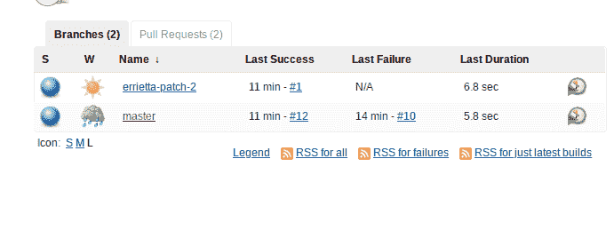
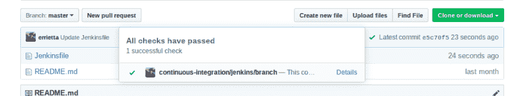
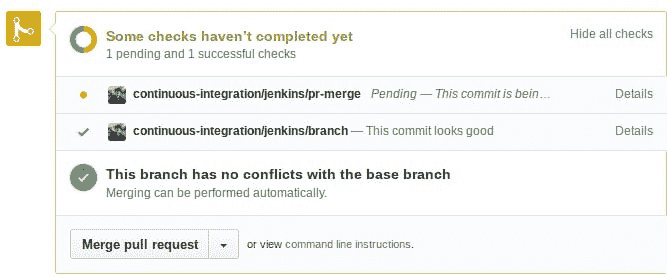

# 让詹金斯行为 2:电动布加洛

> 原文:[https://dev . to/errietta/making-Jenkins-behave-2-electric-布加洛-12l0](https://dev.to/errietta/making-jenkins-behave-2-electric-boogaloo-12l0)

[T2】](https://res.cloudinary.com/practicaldev/image/fetch/s--a5PrVFMa--/c_limit%2Cf_auto%2Cfl_progressive%2Cq_auto%2Cw_880/https://thepracticaldev.s3.amazonaws.com/i/aav0j907623wnqa3oquk.png)

没错，正如承诺的那样，我要用 Jenkins 再折磨自己一些，这次是用多分支管道！

如果你错过了，我最近写了一篇博文，解释了如何将 Jenkins 和 Github 与 freestyle jobs 整合。在那篇文章中，我规定，如果我能够使用多分支管道，我的生活会轻松得多。嗯，是真的。算是吧。多分支管道，**一旦你让他们工作**比自由式工作好得多。正如你可能已经猜到的，问题是初始设置**，因为詹金斯有令人难以置信的神秘错误信息。**谢谢各位朋友。

反正我已经想明白了，你就不用了，那我们开始吧！

你要做的第一件事就是设置你的 github 用户账户和存储库，甚至在你接触 Jenkins 之前。不像上次，事情的顺序并不重要，这一次，如果你想一切顺利，这是极其重要的。

在 Github 上导航到您的[个人访问令牌设置](//github.com/settings/tokens)。您希望创建一个具有以下权限的令牌:
*`admin:org_hook, admin:repo_hook, repo, user:email`*
它们比上一次更强大一些，但这并不意味着 Jenkins 可以为您设置回购挂钩，因此您不必这么做。

现在转到您的存储库并创建一个 Jenkinsfile。没错，我们甚至在接触 Jenkins 之前就已经创建了 CI/CD 渠道。这是因为如果 Jenkins 找不到 Jenkinsfile，它会假装你的证书是错误的，让你徒劳无功，即使他们绝对没问题。因此，只需选择一个 [hello world 示例](//jenkins.io/doc/pipeline/tour/hello-world/)——这真的不重要，它们所做的只是显示一个版本字符串，但是您真的想要一个有效的 Jenkinsfile。

现在转到 Jenkins，点击**创建新工作**或**新项目**，选择**多分支管道**。巧合的是，如果这是你第一次运行 Jenkins，你可能会得到一个无限的加载屏幕。如果发生这种情况，只需关闭它，然后再打开。

<figure> 

<figcaption>“你好，它，你有没有试过关机再开机？”</figcaption>

</figure>

*   点击“添加源”下拉菜单并选择 Github。
*   在凭据中，单击“添加”并选择“Jenkins”。
*   保持用户名和密码的一致性。
*   作为用户名，输入您的 github 用户名
*   作为密码，输入之前的访问令牌。如果你失去了它，像我一样，你可以再生它，只要它不在其他地方被使用。
*   在“存储库 https url”下，输入您的存储库的 url，它可以是私有存储库。

现在如果你点击应用并保存，你的 github repo 应该有一个新的 webhook！

如果到目前为止还有效，你可能会想点击“立即扫描存储库”。坏主意。没用，还会把你搞糊涂。

您实际需要做的是将更改提交给 master(或任何具有 Jenkinsfile 的分支)。如果你这样做，等一下，它应该会自动建立！

<figure> 

<figcaption>詹金斯露出树枝</figcaption>

</figure>

Github 上的提交也将被更新以显示成功或失败。

<figure> 

<figcaption>Github 提交更新</figcaption>

</figure>

你还会看到公关状态！

<figure> 

<figcaption>PR 状态显示为</figcaption>

</figure>

如您所见，多分支管道已经非常容易使用了！我只是希望 Jenkins 不要这么神秘——我浪费了太多时间去想它没有工作，因为我要么没有给它足够的权限，要么我认为扫描应该是工作的。

希望你已经发现这信息！也许下次我会更深入地研究多分支管道，并构建一些很酷的东西！