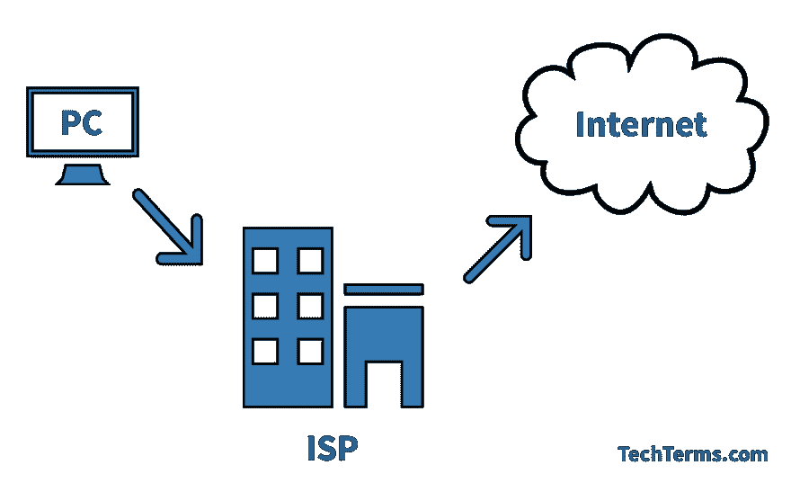
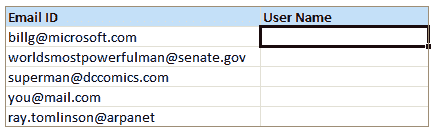
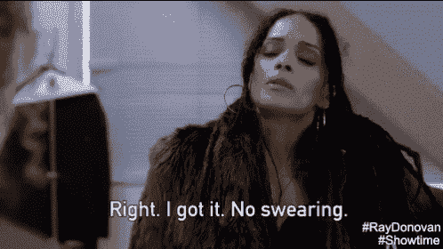

# 从过去学习#3 -互联网帐户！

> 原文:[https://dev . to/just sharkie/learning-from-the-past-3-internet-accounts-1p 34](https://dev.to/justsharkie/learning-from-the-past-3-internet-accounts-1p34)

围过来，我给你们讲个故事。充满了冒险、混乱、老派技术，最重要的是...互联网账户。

是的，访问互联网的帐户。或者，更重要的是，单一账户。来访问整个互联网。

请屏住呼吸。让我们从头开始。

# 第 2 章——一天一美元让互联网远离你

这本书喜欢以引用开始章节，我们不妨分享一下！

> “‘那就来吧！’王后吼道，爱丽丝也加入了队伍，她非常想知道接下来会发生什么。
> 爱丽丝梦游仙境

为什么引用这句话？我不知道！可能是因为互联网刚刚开始出现，而这本书正试图让人们来凑凑热闹？我假设就是这样，因为对此没有其他好的解释。

## 所以你想加入互联网

你如何着手做这件事？嗯，我们有 40 页教科书详细描述了所有的选项，所以我向上帝祈祷，在这结束的时候，我们对如何在互联网上获得一个帐户有了一个很好的想法。

“但是鲨鱼，”你说。“你已经提过几次了。比如说，互联网账户和开发账户有什么不同？”

亲爱的读者。互联网帐户可以让服务提供商确认您可以访问互联网。它还允许他们给你开账单，并帮助他们记账。所以没什么不同，除了它让你可以访问所有的互联网。

但是你实际上需要三样东西来连接——一个账户，合适的设备，和一个连接。

回到 90 年代，合适的设备包括电话(yay 拨号)、终端、个人电脑、调制解调器或通信程序等。所有这些东西的某种组合将使你起床并连接到互联网，以及电话线或以太网连接。

你也很有可能需要学习一点 UNIX。记住，这本书是 90 年代出版的。时下？我是一名开发人员，我不能自信地说我了解很多 UNIX。但那时候，你就是这么操作电脑的。这就是你做事的方式。但是我们要到第 12 章才会深入研究 UNIX，所以我们不要纠结于这个事实。

让我们进入真正的，深刻的，值得绝望的信息。

## 你要给谁打电话？

根据这本书，“我如何在互联网上获得一个帐户？”以及“我该打电话给谁加入？”是一些关于互联网最常被问到的问题。后者也是(几乎)关于《捉鬼敢死队》最常见的问题。去想想。

答案？"想上网的人应该打电话给 InterNIC . "这是来自史蒂夫·沃尔夫，国家科学基金会网络部主任。我们有电话号码！1-800-444-4325.

所以，如果我不给你所有的信息，我就不是一个很好的博客作者。为了给你所有的信息，我不得不冒险。我必须搜索所有可用的信息。

所以我打了这个电话。我不知道我期待的是什么-我期待在互联网上获得 InterNIC 和帐户吗？但是我得到的更好...

或者不是。这是南卡罗来纳州的蓝十字和蓝盾。特别是联邦雇员办公室。这是一条自动留言，警告我如果有紧急情况，请拨打 911。

这就是我挂了电话，咯咯笑了太多的地方。我会坚持下去，等待一个真正的人，但我没有那么大的勇气。此外，我可能会在整个谈话过程中咯咯地笑。

所以。如果你想获得一个互联网帐户，这个号码是不行的。真可惜。我们需要更多的选择。

## 选项 2

这本书引用了一位匿名网络用户的话:“如果你在网络社区中连一个人都不认识，你可能就不会想要访问——所以打电话给那个人！”而且，因为我们现在都在互联网上，我假装没有互联网，我把电话打给你-你好，网友们！我如何在互联网上获得一个帐户？

我等待你的答复。

## 别开玩笑了，这是正经事

“但是，就像选择汽车或长途运营商一样，如果你是互联网新手，你可能需要在做出最终选择之前进行研究和思考。”

[T2】](https://i.giphy.com/media/xUA7b5UlQ68VRfDTfG/giphy.gif)

你不会想一头扎进去的。你知道，这是一个很大的承诺。一天整整一块钱！你可以花那么多钱买一杯咖啡和一份早报。

但是严肃地说，思考是一件好事。重要的是要知道你在做什么，你花了多少钱。从大宗采购到小额采购，它在任何事情上都很重要。

切线时间，不过我是做零售的(具体是营销，不过我也是收银员)。我也是一个永远不会想归还东西的人。出于任何原因。那不是我做的事。

但是，把冲动购买的东西带回来的人多得令人疯狂。说真的，当你知道有多少人回来说“好吧，我不需要这个”时，你会感到震惊。能退吗？”这一切都可以通过思考物品，思考它的价格，然后决定你是否真的需要它来避免。

好吧，回到网上。

这是一种承诺。确实是。你需要确保你得到的正是你想要的和你需要的。所以想想吧。

但是不用担心！你总是可以得到一个新的帐户-只要打电话号码-哦。没错。那已经不管用了。

嗯嗯嗯。

好吧。某处可能有办法。

## IAP

欢迎上台，互联网接入提供商！

是的，那些可爱的老伙计。我们甚至还有它们！现代和过去的碰撞创造了一些华丽的东西。

那个漂亮的东西....是 IAP 的列表。

[T2】](https://res.cloudinary.com/practicaldev/image/fetch/s--xVIakxxO--/c_limit%2Cf_auto%2Cfl_progressive%2Cq_auto%2Cw_880/https://techterms.com/img/lg/isp_71.png)

*TechTerms.com 提供的照片*

良好的.....好吧。也许我们现在称他们为互联网服务提供商(ISP)。但在过去的好时光里，他们是小混混，而且为数不多。现在，他们有很多人。

根据这本书，90 年代的所有个人行动计划本身就能写满一本书。我试着搜索一个在线列表，但是什么都没有。因此...这可能仍然是一个谜。

酪在过去的好日子里，他们确实有名单！你也可以通过有趣的方式获得它们，比如“语音电话”，电子邮件(但是获得这个列表的目的不就是为了能够访问电子邮件吗？)、调制解调器、传真，还有“连寄一封信”。这难道不是一种有趣的、现代的获取互联网提供商列表的方法吗？

## 时间就是金钱

但是这个过程需要多久呢？好像永远都是，我很不耐烦。

嗯，正如在这一章的这一页中几次提到的，这个过程可以简单，也可以复杂。想投入大量的研究吗？还要一会儿。想快速简单地完成吗？可能需要一个小时才能让你启动并运行，然后你就可以走了。这都是你的选择，真的。你想花多少时间上网？

# 但是鲨鱼...我为什么需要互联网？

为什么不需要互联网？互联网是一个华丽而奇妙的东西，对爱好者和休闲者来说，它充满了信息。

telnet、ftp、Gopher、WorldWideWeb 和诸如 archie's list(充满公共领域文件和文档)之类的互联网服务怎么样？电子邮件怎么样？网络接力聊天怎么样？

那是...关于它。但那是很多东西，好吗？

这引出了一个问题...什么是“阿奇的名单”？现在还有吗？

答案是否定的。不，不是的。

# 好的，但是为什么我需要一个计算机系统的账户呢？

哇哇哇哇，电脑系统账号？！我们还没有谈到这些。

但是，是的，你肯定需要一个。尤其是如果你想上网的话。但这开启了一个全新的可能性世界，比如:

*   应用程序——想想文本编辑器、文字处理程序、电子表格(我喜欢自己做好的电子表格)、电子邮件、你自己编写的软件和“在线光盘”。

*   文件系统中用于存储上述所有内容的空间。

*   使用打印机、调制解调器和...其他设备。

但是...你需要放弃什么样的信息才能得到这些账户？因为很明显这是私人恩怨。你不可能像我们现在这样在网上匿名。

朋友们，这就是用户名的诞生。

[T2】](https://res.cloudinary.com/practicaldev/image/fetch/s--Ht-hItCx--/c_limit%2Cf_auto%2Cfl_progressive%2Cq_66%2Cw_880/http://chandoo.org/img/f/get-username-from-email-tutorial.gif)

*Chandoo.org 提供的照片*

是的朋友，用户名。我们都有多个。大概吧。我的是 justsharkie，很高兴见到你，很高兴我们能有这次聊天。

但是回到 90 年代，用户名是什么样的呢？写一个好用户名的标准是什么？

谢天谢地，这本书给了我们答案。

“您的用户名通常由您的名、姓和首字母组合而成。对爱丽丝梦游仙境来说，应该是:

*   姓氏，全部或最多八个字母:wonderla，wonderla
*   名字的首字母加姓氏:一个奇妙的世界，一个奇妙的世界，一个奇妙的爱丽丝
*   名加姓的首字母:alicew，alice_w
*   首字母:anw
*   名字和姓氏:爱丽丝奇迹，爱丽丝奇迹"

有创意。

我更喜欢鲨鱼。

请确保您没有添加空格！

# 每一个伟大的用户名都伴随着伟大的密码

自古以来，密码就是一个东西。说真的。T.Rex69 必须有某种方法来保证他的 twitter 账户的安全。

有些地方会分配密码，有些地方会让您选择，但是如果密码太短或者不包含%$&@#符号，将会一直存在的方法是拒绝您的选择。

[T2】](https://res.cloudinary.com/practicaldev/image/fetch/s--tcTVfsNi--/c_limit%2Cf_auto%2Cfl_progressive%2Cq_auto%2Cw_880/https://media.tenor.img/b531fcefb582e156b994a6765ee47dc7/raw)

不不不，那只是特殊字符。抱歉，我知道这很混乱。

他们可能也不会让你说脏话。

# 容易，不贵...那么为什么不拿 2 呢？

所以在这一点上，你很可能在互联网上没有一个帐户。现在是 2019 年，不是 1990 年。我们在互联网上有很多账户。

但是如果你想要另一个呢？我是说，为什么不呢？我们双启动计算机，以便在一台机器上同时运行 Linux 和 Windows/Mac。这不是与众不同。

但是，你会给出什么理由要求另一个帐户呢？

*   你的活期账户是通过工作/学校的，不合适的东西要私人的。例如——发送个人邮件(具体来说是求职)、参加讨论组、检索与工作无关的文件(wink wink)以及参与多用户互动游戏(比如象棋或桥牌)。

是的，我需要我的新网络帐户来下棋。性感，性感的象棋。

*   很快就要过去了。有道理。

这是这本书给出的唯一两个选择。所以这可能是唯一的两个原因。

我不制定规则。这本书有。

# 个人互联网账户

最后，我们可以学习如何获得一个帐户...哦，等等，先做些决定。

所以我们几乎没谈过涉及的钱。互联网并不便宜，我们都知道这一点，我们都支付我们的网络账单，有时还会为此哭泣。或者至少...我愿意...

一些需要考虑的问题——你想按小时付费吗？每月固定的费用？你住在哪里肯定会有影响。

让我们进入一些数字。

## 所以你要支付每小时:

根据这本书，价格可以从每小时 1 美元到 2 美元不等。所以如果你不打算一个月花太多时间上网，这可能是适合你的计划。

但是如果你一个月使用它超过几个小时，那就要开始累积了。50 小时= 50 美元，虽然在 1990 年你可能不会使用互联网那么长时间，但它仍然是值得考虑的事情。

## 所以你要支付一个固定的月利率:

一般来说，固定价格从 15 美元到 50 美元不等，这取决于你想要什么样的访问。

如今，翻了一倍。然后再补充一些。然后再加一点...

## 所以你住在荒郊野外。

你好，我不知名的伙伴们。外面的天气怎么样？这里有点多云，奶牛在哞哞叫，好像没有明天一样。

农村地区的互联网接入一直落后于城市地区。直到 2000 年末，我一直使用拨号上网，因为没有其他选择。

所以在 1990 年，你甚至可以在你的农村地区上网，而且价格不菲。它不会很棒。

这本书没有给农村互联网一个大概的估计，因为作者没有线索。所以它将永远保持-未解之谜。

# 那么我们学到了什么...

迄今为止...这一章并没有说太多。我还没有学到那么多，或者如何根据我的需要选择完美的互联网账户。但是不要着急，还有很多信息需要处理。非常喜欢。我还剩下很多便利贴。

但是，为了消化和获取#内容，我们将把这一章分成多个博客帖子。没错，伙计们，这已经成为 3.1.0.1 号了。

回头见。