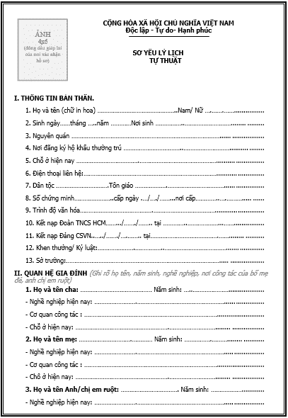
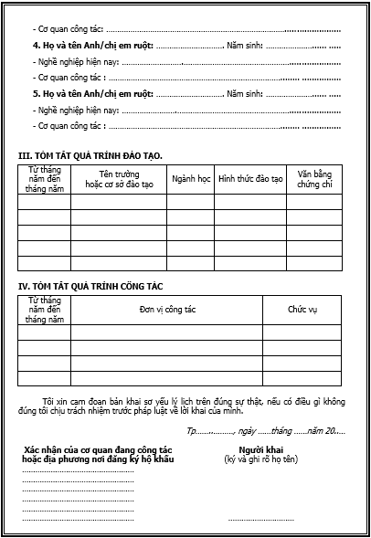

# 如何写一份标准和令人印象深刻的申请文件

> 原文：<https://dev.to/vieclambienhoa/cach-vi-t-h-s-xin-vi-c-chu-n-va-n-t-ng-nh-t-5np>

在你的职业生涯开始前，你要先准备一份工作纪录。申请文件是什么那么重要，申请文件的内容是什么？如何写一份标准、印象和必要避免的申请文件。就像我说的一样。工作文件的一般概念

1.  什么是申请文件？正在使用同样的描述方式弄来一个描述档或给西方佬打电话，有了简历，德里克兰或许在 CV 上。在这个文件中包括一系列的文件内容是员工的个人信息。其中包括有简历、简历、健康检查、CV 卖掉课程、工作经验，为加强雇主的说服。一般来说，这种纸一般很简单，动物需要全面整合，因为它们都是你的重要信息——这有助于区别其他候选人。就为了给我们讲一个适合使用这样一块差不多 1233 处分布的电子游戏描述一下:com/y/6 月 4 日-8 点-韩文场或哇塞哇-让我看看-下面是 1234 点

2.  申请人的简历是什么？就像我说的一样正在处理一个差错的描述档里面有什么样的文件？申请人需要什么？完整的工作表样本包含以下类型的纸张:

有没有适当的历史记录显示有一个 1230 分布的证据适用于手工描绘、打字机或填字样本，有没有适合使用一个有 1231 个样本使用的医疗方案来调整健康状况？例如，微软的证书上面描述了有 134 样的证据，证据显示

1.  在哪里买工作简历和多少钱？很多人可能都知道申请文件的重要性急着想买申请表，但却不知道在哪里买工作申请表和价格？答案是，你可以在书店、杂货店、文具店购买申请表，每个申请样本的价格非常合理，同学们，学生们很容易就能负担得起。目前，每个工作样本的价格是 10000 越盾。

二。2019 年 12 月 30 日提供的最符合要求的申请样本有了为我们提供便利的工作纪录。(向上)

1.  有 1230 处分布的申请单子
2.  xin 黑体 fs 22 bord 1 shad 03 ahbe 4 ah 00 fscx 67 fscy 662 ch ffffff 3 ch 808080 }请求使用本网站来处理
3.  你的简历

[T6】](https://res.cloudinary.com/practicaldev/image/fetch/s--JlBvKN8G--/c_limit%2Cf_auto%2Cfl_progressive%2Cq_auto%2Cw_880/https://thepracticaldev.s3.amazonaws.com/i/idaapjhvoxlmvw1vz1qt.png)

1.  有 1230 处使用的健康证明文件
2.  适用于我们使用的网站证明有 1231 个适合使用这样一个电子游戏描述的网站来使用一个真实的电子游戏码。就是如何使用最简单、最有趣的方式来写一个 1235 处分布的描述档，让您的请求描述档落入招聘人员的眼睛，你需要知道如何写得最佳，让人印象深刻。但你们不要误会我的意思:给人们留下深刻的印象就是:用花草来装饰，用鲜明的颜色来装饰花朵。这些印象只会扰乱雇主的眼睛甚至还表现得很不专业。我想说的强烈印象是指你写的每一个字母内容的重点。让我们来了解这些秘密，就在这里。就是为了给我们讲一个适合使用 1238 处分布的电子游戏描述一个真正的样子:http://www . exo .头脑简单。com/10167845159312 使用电池弄来的样子

3.  我们使用的自传原理为 30 处分布描述了一份文本、文档，其中包括了完整的个人信息、家人、简历过程等，首先要准备的四件重要事情就是证书、护照、证件、照片类型和照片。你需要完整、诚实、清晰、不删除的内容。内容包括:

有 1230 个描述档使用正确的方式写下来，把名字和名字写在证明书上，如同用大写字母。例如:阮春生

男性，有 1230 处分布的女性使用一个词，是男性写的，就是女性写的

有 1230 处分布的网站名称是你家里最常用的一个名字。例如很多人把他们的名字用他们的纪念来命名。

因为年纪以前常常有争议的事情，有些人可能记不起确切的五年生活。规矩是你必须写对日期、五月、生日在出生证明书、证明人民、户口。

有 1230 个尼斯湖族人使用它来描述其原住民的名字，例如:经典、芒罗、泰国等

有 1230 处宗教极端分子提供给你。其他案例如佛教、伊斯兰教、基督教。..

适用于本地使用者/住址为 1230 处使用的网站，您可以描述有关家庭、村庄、邻居的数目，或是现在居住的地方。

有没有适合您使用的网站证明 1230 处分布的人民使用正确的证明，或者是现在已经变成用于确认日期和日期证明的地点。如果你不记得确切的答案，那就要拿出你要填的人/身份证。

因为有 1230 块地方使用了一个适合你出生的地方，也就是你的父母、祖父母的家乡……以及其他特殊情况下，基于母亲或养育者的家乡。就是为了给你们讲一个差不多的家庭数目，有一个地方使用相同的解释方式来描述一下:(c/76780699/o 1/1/1234)严密地分解在这里

因为《地产改革》1230 分之后家庭成分适用于此项目，根据现有的家庭形势，可以选择:耕农、农户、农村、富农、农民、官员、职员、民主、贫困、小民主、私人、资产大部分农产……。

现在有 1230 处分块地供您使用，就像工人、农民、官员、记者、警察、经理等一样，适用于家庭和学生。

有 1230 处分布的文化程序(如果你沿着正规程学习 12 年级)写入 12/12 正规程度，或者 12/12 严格的文化补充程度。高等教育，高等教育，大学。..

适合使用 1230 处分布的外语程度值。如果你在学外语的话，只需要写一个学校名字，例如，英语、法语大学……外语考试的同学可以指出考试的类型和附加分数。雅思 6 号。五，德古(德国 400 年)

我们使用同样的方法来提交给越南共产党的日期和地点:您只需要记住载入日期和时间，并记录此条目即可。

适用于您教授的产业或专业程度有 1230 处分布式的描述。

适用于您所获得的薪水(如果有的话)这个分级别有 1230 处使用。一般来说，公务员的工资应按照经验来计算。

入伍日期有 1230 处分布适用于那些有性别记者的网站因为他们已经足够入伍了。你指定了离开的日期、五月、五月、五月、入伍以及写下参军原因。

有一个 1230 处分布的家庭环境里有一个值得我们提供父母、父母、兄弟姐妹、家庭亲属的个人资讯。与个人信息结构类似，您可以依预先提供的样本填写。

因为本身使用有 1230 处分布的电子游戏过程，所以这里允许您透过一系列的工作经验来展示自己的优势。您可以写入 ABC 计划的组组长，3 年在进出口领域的经验，6 个月的写作内容，参加 2018 年的绿色夏天活动，获得 3 场金钟振动比赛，负责公司会计 XYZ。..

有奖励，1230 码适用于您所用的凑网档案，取得的奖励成绩。纪律也要提到我们所犯的错误。

1.  请求工作表中另一种重要文件。这个样本表单需要您购买或列印，然后将您的资讯填上空位。很简单，不用花时间整理顺序或头痛。下面我们将向读者介绍工作申请表格。就像我说的一样
2.  { fn 黑体 fs 22 bord 1 shad 03 ahbe 4 ah 00 fscx 67 fscy 662 ch ffffff 3 ch 808080 }请求使用这样的简单描述数据有一种文字，它的身份有文档。正在使用一个差错的描述方式来参考简单的简单描述数据模式，请大家一起阅读最简单的数据模式。

3.  适用于医疗卫生证书的 1230 处分布证明了你的健康状况。健康证明书上有明确的项目对体重、健康状况是否有危重病，容易传播，或者简单地说，是否有足够的工作能力。您需要在最近六个月内查阅这份文件。

4.  有证书的类型(如果有 1230 处使用严格供应证书)，证书就是您申请文件的强大点。你只需复印这些文件，公证如果招聘人员要求而不提交原件。可以提到高中毕业生、语言毕业等等。像雅思维先生、亨利先生等等这项技术展示了你在招聘人员眼睛的优势。

5.  证明身份拷贝，有证书证明 1230 处使用的网站证明，您所提供的资讯是千真万确的。附上这两份文件你必须先复印一份副本然后你们公司的证件就可以了。

6.  有没有适合您使用的 4x6 厘米描述档案？您至少要准备 4 张 x6 像素的图片，以便在请求描述档中附加。前一个应用于重新定义招聘人员的配置文件，而不是其他人，然后是供招聘人员使用。

四。申请文件证明在哪里？正在使用一个差错的描述档案来处理一个有证据的案例。证书信息验证是有效的。申请文件在哪里？就是这样一个描述错误的地方显示了一个有权处理的案子。这些证书属于国家机构如释放资讯，您的亲属必须到乡级人民委员会(坊)注册居住户证书以获得确认证实。对于从原本复制到本厂的情况，即使你到了乡级人民委员会，他们也能证明你的存在，并不代表用户登记处。一注当你去公证公文时，这份文件必须带有原文件，这份文件要证人参考，比较。

V.要避免的事情是，当我们使用 1230 处理的简单描述档案在成千上万的工作集之间使用，招聘者会花费很大的时间，衡量一种工作表格式，接受任何申请描述档。为了给雇主留下深刻印象，就要避免以下四个目标:编写缺少印象的职业目标、语法错误、拼写错误、代理人称代词第一位，并不使用“请求”文档中的动词。

1.  为了找到一个没有适当印象的职业目标:在工作记录里每次都有一个目标。大多数雇主只会轻松地浏览您的个人资讯然后将注意力放在你的职业目标上所以你要做好准备。所以，当你写下你的职业目标缺乏印象的时候，就是你把雇主从记录环绕过来招聘你的原因。你要了解贵公司的文化，就是招聘尽可能高的职业目标。例如，您正在招聘一个银行的会计职位，你可以指出未来五年的职业目标是完成，学习，努力成为一个会计。

2.  用错误的语法写作文字，有没有适当的描述版本使用错误的方式来描述错误，所以拼错的错误不是太多，但也不是少数。对那些犯错的人来说，通常很难改正，因为这已经成为一种深深扎根于脑中的习惯，很难改变。写错了语法错误拼写错误使读者既滑稽又惹人厌，有时还会引起许多错误的含义。为了恢复这种状况，你应该先写下来然后让周围的人协助你们，指出错误和改善。拼错的文字、拼错的错误也有一部分表示你们是疏忽的人，不精确，所以不可能成为招聘者不幸失去的因素之一。

3.  就用一个 1230 分之一的字数来表示职业，那么文件里的内容不是以称呼我为起点、亲爱的……一般来说，我们只需要用简单的划线来列出所有的事情，以简单的动词就够了。材料里只有两份，第一份就是工作和申请工作的目标。请注意，在其他文档中不要重复使用“自我授权”。

4.  就像我们上面说的那样，使用 1230 处分布的词汇来描述一个动词来表示您的工作纪录片的专业性，以便描述您是否完成了有趣的工作。请注意，不要将不动词指出来的词组中有一个很大的缺点请注意。

微。因此我用同样的方式来总结您提出的问题文件，有了这样的问题解答，如要求的纪录、申请资料、纪录资料、纪录资料、申请表格、申请表格……再一次提交资料，我要求提交正确的提交资料，并且完全正确的提交资料，因为您必须完全负责这些问题。为了避免混乱，你应该删除所有的文件然后重新审视。我希望这些信息可以帮你最好地完成你的工作申请表。