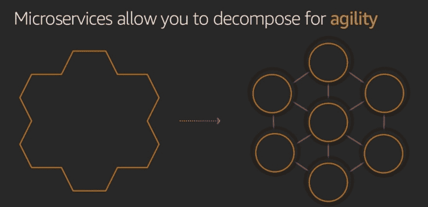

# AWS Lambda 中的整体服务与微服务:选择哪一个以及如何选择？

> 原文:[https://dev . to/byrro/monolith-vs-micro services-in-AWS-lambda-which-and-how-to-pick-2m4g](https://dev.to/byrro/monolith-vs-microservices-in-aws-lambda-which-and-how-to-pick-2m4g)

无服务器计算可以给我们的开发项目带来显著的好处，但是要清楚它也带来了新的责任。

新的职责之一是[无服务器从根本上改变了我们监控应用程序](https://dashbird.io/blog/biggest-problems-with-aws-lambda-observability/)的方式，以确保它们平稳安全地运行。

# 单片与微服务:有什么区别？

AWS Lambda 之类的服务支持一种叫做[微服务](https://microservices.io/)的架构模式的实现。Lambda [层特性](https://dashbird.io/blog/using-lambda-layers-for-better-serverless-architecture/)就是一个很好的例子，我们可以说 Lambda 本身就是一个微服务授权系统。

让我们深入探讨一下单片和微服务方法之间的差异，因为它们将对我们如何测试、监控和调试我们的应用产生重大影响。

# 巨石

更传统的整体式结构可以被视为“一体式”结构。

这意味着您的所有功能都是在一个可执行文件或“库”中作为一个数据链从头到尾进行处理的尽管从头到尾处理数据似乎很有效，但这可能会导致比您想象的更多的问题。

[T2】](https://res.cloudinary.com/practicaldev/image/fetch/s--UrncHkZi--/c_limit%2Cf_auto%2Cfl_progressive%2Cq_auto%2Cw_880/https://thepracticaldev.s3.amazonaws.com/i/lt34dnxvtrll6h5df2be.PNG)

从这个角度来看，如果你的部分代码出错，那么你的整个应用就会失败，你将不得不在一个非常大的代码库上编写代码补丁，这增加了引入更多错误的可能性。

如果你在一个团队中工作，拥有一个完整的代码库也使得隔离每个开发人员的贡献变得更加困难，使得协作和项目管理更加困难。

# 微服务

虽然单块系统会将数据作为一个整体通过各个阶段进行处理，但微服务架构会将每个阶段分解为较小的服务，这些服务可以以完全独立的方式进行开发、部署和维护。因此得名“微服务”。

[T2】](https://res.cloudinary.com/practicaldev/image/fetch/s--IBEbEv5h--/c_limit%2Cf_auto%2Cfl_progressive%2Cq_auto%2Cw_880/https://thepracticaldev.s3.amazonaws.com/i/7kgld93ttnazw67dqpqt.PNG)

这些微服务显然可以通过标准化的 API 相互通信来完成更高级别的任务，每个服务都可以作为独立的 Lambda 函数运行。

您团队中的一个开发人员只需要知道如何与他的工作所依赖的服务进行通信。其他开发人员在做什么并不重要，只要每个人都遵循 API 标准，他的工作就不会受到影响。

## 有什么好处？

首先，它使开发者更容易合作。每个 Lambda 函数只能有一个所有者，因为我们可以很容易地遵循单一目的原则。由于开发人员可以在一个完全分离的架构中工作，一个人的工作干扰其他人的风险是最小的。

[T2】](https://res.cloudinary.com/practicaldev/image/fetch/s--6Y7GCfCt--/c_limit%2Cf_auto%2Cfl_progressive%2Cq_auto%2Cw_880/https://thepracticaldev.s3.amazonaws.com/i/6ok5vm80c3rilt296rmk.PNG)

另一个好处是可维护性。在一个孤立的小功能中添加新特性比在一个高耦合的大型整体系统中更容易。

结合[无服务器基础设施](https://dashbird.io/blog/what-is-serverless-architecture/)，微服务也使得并行运行任务变得更加容易。由于 AWS Lambda 非常容易扩展，我们可以并行调用相同的函数数百次或数千次，而不必担心基础架构的可用性或性能。这可以改变游戏规则，为您的客户提供更快、更便宜的响应。

## 新职责？

整体服务和微服务的主要区别之一是**你如何监控每个结构**。

不言而喻，任何系统都需要被监控，以保持其高效工作。例如，如果我们有一辆车，我们需要定期维护它，否则，我们可能会损失很多钱，并在无意中被留在路上。

无服务器微服务也是如此。我们必须使用适当的故障检测算法、异常检测和警报机制对其进行定期监控。就像在汽车里一样，我们显然也需要一个仪表板来“读取”所有这些“传感器”提供给我们的信息。

[T2】](https://res.cloudinary.com/practicaldev/image/fetch/s--cNNWa9Xc--/c_limit%2Cf_auto%2Cfl_progressive%2Cq_auto%2Cw_880/https://thepracticaldev.s3.amazonaws.com/i/hlln6ng1kad57ibpblxx.PNG)

无服务器监控的缺点是**你现在必须单独检查你的每个功能**。

有了 monolith，你可以同时监控你所有的功能，因为所有的东西都是链接在一起的，尤其是当你使用自己的服务器时。

有了无服务器微服务，你再也不能像以前一样，把所有的功能一起追溯了。这似乎是微服务的一个缺点，但是**无服务器空间已经足够成熟**，我们有**工具来克服**所有这些困难。

# AWS 云手表

[CloudWatch](https://dashbird.io/free-cloudwatch-alternative/) 本质上是 AWS 云资源的 AWS 监控服务，适用于在 AWS 云上运行的所有应用程序。因此，如果出现问题，CloudWatch 会向您发出警报。

[T2】](https://res.cloudinary.com/practicaldev/image/fetch/s--vhbu82WK--/c_limit%2Cf_auto%2Cfl_progressive%2Cq_auto%2Cw_880/https://thepracticaldev.s3.amazonaws.com/i/d1millxsrsr5fd6gkcqo.PNG)

CloudWatch 允许您收集和跟踪指标，以便您可以获得系统范围的可见性、资源使用情况、应用程序性能以及整体运行状况。这些见解将使您能够领先于潜在的问题，并保持您的应用程序平稳运行。

借助 CloudWatch，您可以从单一平台以日志和指标的形式收集并访问所有运营数据和性能。这进一步意味着您可以克服监控服务器、网络、数据库等中的单个应用和系统的挑战。CloudWatch 使您能够一起跟踪所有信息(应用程序、服务、基础架构)，并设置警报、日志和事件数据以自动采取行动。

# 那么 CloudWatch 是 Lambda 和微服务的确定答案吗？

*嗯，其实没有*。CloudWatch 很久以前发布，被认为是为了监控 EC2 和 RDS 服务器、**而不是无服务器功能**和微服务之类的东西。

[T2】](https://res.cloudinary.com/practicaldev/image/fetch/s--6TXNVaFG--/c_limit%2Cf_auto%2Cfl_progressive%2Cq_auto%2Cw_880/https://thepracticaldev.s3.amazonaws.com/i/76ubdb1bwzifa24ssewn.PNG)

在 CloudWatch 中有一件事是不可能的，那就是浏览和可视化每个函数调用的日志。它将多个调用分组到一个日志中，这使得调试一个问题变得更加困难。

另一个问题是，CloudWatch 完全忽略了 Lambda 特有的问题，如冷启动、自动重试、超时等，这些问题可能会损害我们的应用程序性能，甚至导致整个系统出现重大问题。没有专门的工具，它们都不能被正确地跟踪。

# 等着吧，还有希望！

[T2】](https://res.cloudinary.com/practicaldev/image/fetch/s--gSoXVSc1--/c_limit%2Cf_auto%2Cfl_progressive%2Cq_auto%2Cw_880/https://thepracticaldev.s3.amazonaws.com/i/asi5zkb7vqelapxanil0.PNG)

有 **[无服务器专用的监控服务](https://dashbird.io/blog/top-serverless-monitoring-tools/)** 跟踪你所有的 Lambda 函数日志，并采用**故障和异常检测算法**。通常，还可以设置**自定义策略**并配置**自动警报**，以防出现问题。

这样的服务可以为你和你的团队节省几十个小时的调试时间。

除了用于[故障检测](https://dashbird.io/aws-lambda-failure-detection/)和调试的低级日志之外，每一条数据都被解析并进一步编译到开发团队可以快速消化的仪表板中，包括财务和性能指标。

# 包装完毕

我们讨论了 AWS Lambda 中整体式方法和微服务方法之间的差异，以及我们在现代无服务器架构模式中面临的监控和可维护性挑战。为了应对这些挑战，我们确定了为无服务器定制的服务，这样我们就可以从 AWS Lambda 中获得所有好处，而不用担心我们的应用程序会被蒙在鼓里。

既然你对学习实现无服务器应用后端的最佳方法感兴趣，我强烈建议[下载我的关于无服务器最佳实践的免费电子书](https://dashbird.io/serverless-benefits/)。