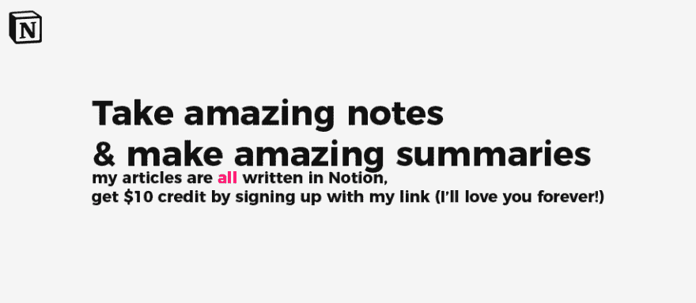

# Vue.js 入门(备忘单)

> 原文：<https://dev.to/lucashogie/getting-started-with-vue-js-cheat-sheet-4lkh>

Vue 是一个很棒的 JavaScript 框架，用来创建交互式光速网络应用。作为 Vue 的新手，我自然倾向于总结我所学到的东西，以便更长时间地记住它。这是我不久前做的一个。当我做总结时，我关注几件事。
1:可读性。如果我们读不好，那还有什么意义？我不喜欢使用太多的 JavaScript 术语，所以我确保尽可能用人性化的语言来写。
2:我喜欢保持简单，但有条理和一致性。

如果你认为有什么可以做得更好的，[请纠正我的想法](https://www.notion.so/lucashogie/Vue-cheatsheet-8d5e1c272e164b49b7995e9b68f56c09)或[在 Twitter 上给我发消息](https://twitter.com/messages/compose?recipient_id=840998537756311554)。

👋*请[在推特上关注我](https://twitter.com/lucashogie)，我们一起聊天吧！*👋

## 安装 Vue🌟

```
<!-- development version, includes helpful console warnings -->
<script src="https://cdn.jsdelivr.net/npm/vue/dist/vue.js"></script> 
```

<svg width="20px" height="20px" viewBox="0 0 24 24" class="highlight-action crayons-icon highlight-action--fullscreen-on"><title>Enter fullscreen mode</title></svg> <svg width="20px" height="20px" viewBox="0 0 24 24" class="highlight-action crayons-icon highlight-action--fullscreen-off"><title>Exit fullscreen mode</title></svg>

安装 Vue 很简单。只需要一行代码就可以将它实现到您的页面中。如果你想制作一个完整的网络应用程序，你应该使用 Vue CLI/UI。教程即将推出！

编辑:你需要把 Vue 脚本和你自己的原始 JS 放在页面的**底部**才能让它工作，请记住！

## 使用 Vue😎

要使用 Vue 的基本功能，您需要两样东西:

*   HTML
    *   要按 ID 装载的元素
*   初始化元素的 Vue 脚本

首先，让我们看一下这段 HTML 代码:

```
 <div id="app">
      Hello, {{ message }}!
    </div> 
```

<svg width="20px" height="20px" viewBox="0 0 24 24" class="highlight-action crayons-icon highlight-action--fullscreen-on"><title>Enter fullscreen mode</title></svg> <svg width="20px" height="20px" viewBox="0 0 24 24" class="highlight-action crayons-icon highlight-action--fullscreen-off"><title>Exit fullscreen mode</title></svg>

现在，假设我们希望在`{{ name }}`选项卡中有一个动态消息。我们该怎么做呢？

注意:双花括号用于向浏览器表明这引用了 JavaScript。任何这样工作的框架都是如此。

让我们为此编写代码并将其拆开:

```
 var app = new Vue({ // initalize the vue instance and include all details in ({})
    el: #app, // almost always detail #1: the element to mount (specificy).
    data: { // if we want to utilize data, we'll need to feed it some.
    name: "Lucas" // This is the {{ name }} we'll utilize
    }
    }) 
```

<svg width="20px" height="20px" viewBox="0 0 24 24" class="highlight-action crayons-icon highlight-action--fullscreen-on"><title>Enter fullscreen mode</title></svg> <svg width="20px" height="20px" viewBox="0 0 24 24" class="highlight-action crayons-icon highlight-action--fullscreen-off"><title>Exit fullscreen mode</title></svg>

Vue 实例是一个有很多细节的对象。我们改写了其中的一些细节，并增加了一些内容。如果您不理解这种符号，请研究 javascript 中的**对象。**

* * *

## 【反应力】🎶

我们正试图制作一个互动的网络应用，所以我们想给我们的网络应用增加反应性。我们可以使用**指令**来做到这一点。

* * *

### `V-if` ⛱

如果数据返回 true，我们可以使用下面的 HTML 来显示一个元素，假设我们已经导入，我们可以使用下面的代码:

```
 <div id="app">
    <span v-if="seen"> Now you see me </span>
    </div> 
```

<svg width="20px" height="20px" viewBox="0 0 24 24" class="highlight-action crayons-icon highlight-action--fullscreen-on"><title>Enter fullscreen mode</title></svg> <svg width="20px" height="20px" viewBox="0 0 24 24" class="highlight-action crayons-icon highlight-action--fullscreen-off"><title>Exit fullscreen mode</title></svg>

现在，如果“seen”为真(现在应该在数据元素中)，这个跨度将会显示。这个的 JS:

```
 var app3 = new Vue({
    el: #app,
    data: {
    seen: true
    }
    )} 
```

<svg width="20px" height="20px" viewBox="0 0 24 24" class="highlight-action crayons-icon highlight-action--fullscreen-on"><title>Enter fullscreen mode</title></svg> <svg width="20px" height="20px" viewBox="0 0 24 24" class="highlight-action crayons-icon highlight-action--fullscreen-off"><title>Exit fullscreen mode</title></svg>

在这种情况下，这个跨度将显示。很简单，对吧？
`v-if`是一个指令。让我们讨论更多的指令。

* * *

### `V-bind` ✨

v-bind 指令用于被动更新一个 **HTML 属性。**V-bind 的简称是`:`。使用速记是最好的做法。这里有一个 v-bind 指令的 HTML 用法的简单例子

```
 <a v-bind:href="url"> Click me! </a> 
```

<svg width="20px" height="20px" viewBox="0 0 24 24" class="highlight-action crayons-icon highlight-action--fullscreen-on"><title>Enter fullscreen mode</title></svg> <svg width="20px" height="20px" viewBox="0 0 24 24" class="highlight-action crayons-icon highlight-action--fullscreen-off"><title>Exit fullscreen mode</title></svg>

让我们把这个拆开:

*   `V-bind:`是基本指令。这总是包括在内的。
*   在冒号`:`之后，我们包含我们想要绑定的属性，在本例中是`href`。
    *   注意:您可以在这里找到 JS 术语[中的可绑定属性列表。](https://developer.mozilla.org/en-US/docs/Web/HTML/Attributes)
*   然后，与任何属性一样，我们使用`=`来输入字符串，该字符串将告诉我们正在绑定什么。在这种情况下`url`。

V-bind 对于创建动态布局、改变 URL 等非常有用。一个用例可以将`backgroundColor`绑定到最上面的`div`，让用户改变他们自己的背景颜色。任何反应式造型的需求都可以在这里得到满足。

* * *

### `V-on`📩

v-on 指令用于将 DOM 事件绑定到 Vue 方法。`v-on`的简写是`@`。让我们举一个简单的例子:

```
 <div id=app> <button @click="trigger"> </button> </div> 
```

<svg width="20px" height="20px" viewBox="0 0 24 24" class="highlight-action crayons-icon highlight-action--fullscreen-on"><title>Enter fullscreen mode</title></svg> <svg width="20px" height="20px" viewBox="0 0 24 24" class="highlight-action crayons-icon highlight-action--fullscreen-off"><title>Exit fullscreen mode</title></svg>

让我们把这个拆开:

*   `@`是`v-on`的简写
*   是我们正在关注的 DOM 事件
*   `="trigger"`告诉 Vue 在检测到 DOM 事件时执行该方法或函数。

请注意，`click`事件必须在元素的上发生**，而不是在元素之外。**

* * *

### `V-for`🔥

V-for 指令用于从数组创建列表。V-for 循环遍历一个数组来创建一个列表。好好看看这个语法，我一开始被它弄糊涂了:

```
 <ul id="example1"> <!-- note that you do NOT need to mount this specific element for this -->
    <li v-for="item in items">
    {{ item.message }}
    </li>
    </ul> 
```

<svg width="20px" height="20px" viewBox="0 0 24 24" class="highlight-action crayons-icon highlight-action--fullscreen-on"><title>Enter fullscreen mode</title></svg> <svg width="20px" height="20px" viewBox="0 0 24 24" class="highlight-action crayons-icon highlight-action--fullscreen-off"><title>Exit fullscreen mode</title></svg>

而这个的 JS:

```
 var arraylist = new Vue({
    el: '#example-1',
    data: {
        items: [
            { message: 'Hello!' },
            { message: 'List item two :)' }
            ]
        }
    }) 
```

<svg width="20px" height="20px" viewBox="0 0 24 24" class="highlight-action crayons-icon highlight-action--fullscreen-on"><title>Enter fullscreen mode</title></svg> <svg width="20px" height="20px" viewBox="0 0 24 24" class="highlight-action crayons-icon highlight-action--fullscreen-off"><title>Exit fullscreen mode</title></svg>

所以让我们把这个拆开:

*   首先，我们再次正确地安装元素。不需要成为`ul`元素。
*   然后，我们添加数据。我们还添加了“items”数组。
*   items 数组由两个未命名的对象组成，这两个对象中都包含一条消息
*   `il`呼唤`item in items`。`item`是我们给数组中任何一项的名字，然后在`il`* * * *元素中引用它。
*   既然 DOM 已经准备好遍历数组，我们可以指定更多:你将遍历什么？
*   在这种情况下，我们将遍历 items 中的每条消息(每隔`item in items`)

* * *

### `V-model`🤯

假设我们希望使用用户的输入作为我们在屏幕上看到的内容的模型...看到我做了什么吗？这正是 v-model 指令所做的。它允许简单的表单输入绑定。我们来看看代码:

```
 <div id="app">
    <input v-model="message" placeholder="edit me">
    <p>Message is: {{ message }}</p>
    </div> 
```

<svg width="20px" height="20px" viewBox="0 0 24 24" class="highlight-action crayons-icon highlight-action--fullscreen-on"><title>Enter fullscreen mode</title></svg> <svg width="20px" height="20px" viewBox="0 0 24 24" class="highlight-action crayons-icon highlight-action--fullscreen-off"><title>Exit fullscreen mode</title></svg>

基本就是这样。不要忘记定义 JS 部分中“消息”的默认值:

```
 var app1 = new Vue({ 
    el: "#app",
    data: {
    message: ""
    }
    }) 
```

<svg width="20px" height="20px" viewBox="0 0 24 24" class="highlight-action crayons-icon highlight-action--fullscreen-on"><title>Enter fullscreen mode</title></svg> <svg width="20px" height="20px" viewBox="0 0 24 24" class="highlight-action crayons-icon highlight-action--fullscreen-off"><title>Exit fullscreen mode</title></svg>

* * *

[](https://www.notion.so/?r=a82570287994452395da52589ea82a9c)

### `V-text`💭

一个用于文本的 v-model，只是它根本不是 v-model，你可以从任何地方动态地将文本值绑定到文本。

```
 <p v-text="Hello!"> </p> // Now the text will display "Hello!" 
```

<svg width="20px" height="20px" viewBox="0 0 24 24" class="highlight-action crayons-icon highlight-action--fullscreen-on"><title>Enter fullscreen mode</title></svg> <svg width="20px" height="20px" viewBox="0 0 24 24" class="highlight-action crayons-icon highlight-action--fullscreen-off"><title>Exit fullscreen mode</title></svg>

* * *

### `V-once`💯

V-once 不需要参数。它告诉 DOM 不要根据 Vue 被动地更新元素中的所有内容。

```
 <span v-once> {{ name }} </span> // will not update reactively 
```

<svg width="20px" height="20px" viewBox="0 0 24 24" class="highlight-action crayons-icon highlight-action--fullscreen-on"><title>Enter fullscreen mode</title></svg> <svg width="20px" height="20px" viewBox="0 0 24 24" class="highlight-action crayons-icon highlight-action--fullscreen-off"><title>Exit fullscreen mode</title></svg>

这将是一个系列！接下来我会更深入，为 Vue 做一些教程。JS，在进入 Vue CLI & Vue UI 之前，如何实现各种事情。

👋*请[在推特上关注我](https://twitter.com/lucashogie)，我们一起聊天吧！*👋

[https://upscri.be/za52nm](https://upscri.be/za52nm)