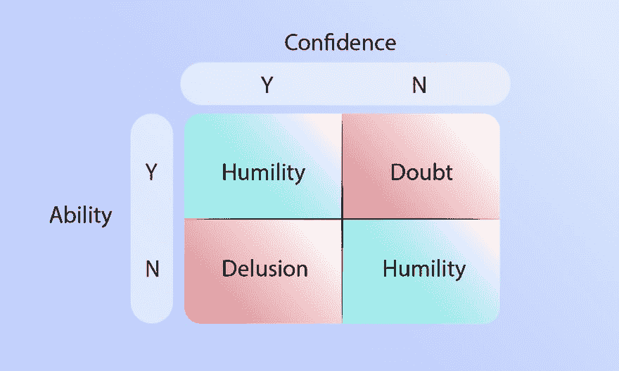
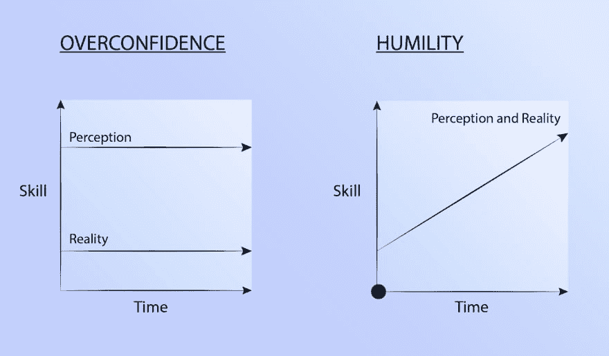
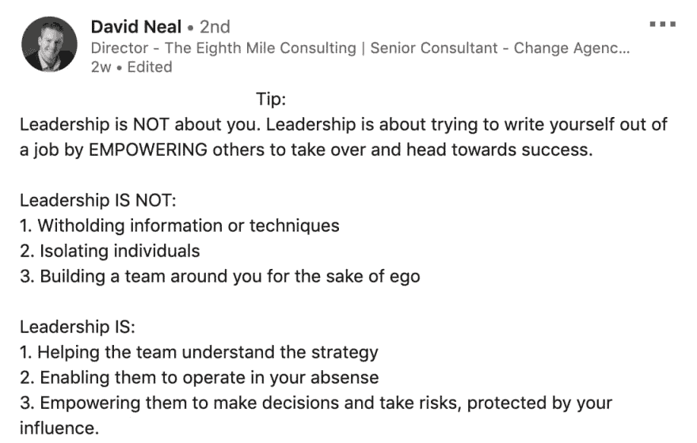

# 放弃议程:有效领导之路

> 原文:[https://dev . to/stephsmithio/a-new-leader-s-thoughts-on-leadership-fp3](https://dev.to/stephsmithio/a-new-leader-s-thoughts-on-leadership-fp3)

这篇文章最初发表在我的博客上，我经常在这里写远程工作、学习编码和技术。

* * *

> 最伟大的领导者不一定是做最伟大事情的人。他能让人们做最伟大的事情。”罗纳德·里根

我最近一觉醒来，意识到我已经领导一个团队一年多了。曾经非常陌生和令人畏惧的东西仍然是一项正在进行的工作，但不知何故感觉是可以管理的。甚至，*熟悉的*。

当我反思我在领导力方面的演变时，我不禁想起了早期的日子；回到我有*“不知道自己在做什么”*的时候。最突出的是我从“当代领袖”(想想马斯克和乔布斯)的模式匹配中提取出来的令人头疼的领导力概念。

我曾错误地将**远见者**与**领导人**混淆。

我现在明白了，当这两个是同义词时，一种不可思议的强大动力被释放出来，但这两个属性也很容易相互排斥。

这种认识让我产生了进一步的疑问，“关于领导力，还会有什么其他的误解吗？”。这篇文章正是我对此的看法。但首先，一个故事:

## 被人递给机会

有些人知道我领导一个出版团队。迄今为止，这是我得到的最棒的机会之一。但许多人不知道的是，我发现自己在 24 岁这个成熟的年龄领导着这个 20 人的团队。当我开始领导这个团队时，我是这个团队中最年轻的。

我的许多新队友比我年长 10 岁(或 20 岁)，尽管我多么想相信年龄只是一个数字，但我能感受到这种担忧。但是我怎么能责怪他们呢？现在我坐在了“驾驶座”上，我也觉得自己是个骗子。

事情是这样的:当你进入一个没有人会认为你知道自己在做什么的职位时，你需要更加努力地工作来证明你知道。所以，我承认，如果我没有所有的答案，我最好找到它们。

我当时没有意识到的是，承认我不是天生的领导者，我需要学习领导能力 ﹣just，就像 life﹣was 的其他技能一样，这是朝着正确方向迈出的一大步。但这本身就把我带到了一个十字路口，或者更确切地说，一个问题:*什么是好的领导者？*

## 怎样才能成为一名优秀的领导者？

互联网上充斥着给像我一样的人的建议，搜索像“怎样成为一个好的领导者”(SV: 3600)，“如何成为一个好的领导者”(SV: 9900)，以及“一个好的领导者的品质”(SV: 10500)。

不幸的是，许多结果很容易处理，但很难付诸行动。比如，一个人究竟如何“成为一个伟大的沟通者”？但我发现这些建议中特别麻烦的是，我认为它们对领导力的描述非常狭隘。

当我回想起我的一些最好的经理时，我从来没有把他们的领导能力等同于脸上总是带着微笑或在主持会议时从不犹豫。同样，他们“快速做出决定”(或不快速做出决定)的能力，在行业中的临界年数(或不)，或信念的强度(或不)，通常与他们的领导能力或潜力不相关。这些常见的约定在互联网上随处可见，但坦率地说，并不总是能加起来。

因此，当我忧心忡忡地开始领导时，我采取了另一种方法。我的目标是**反复学习**如何成为一名优秀的领导者。我看心理学的书。我和同事们进行了讨论。我有意向周围的人寻求反馈。我试图从技能、态度和选择中提炼出让我的前任经理有效的东西。在经历过好经理和坏经理之后，我想至少*尝试*成为前者。

我慢慢地，但肯定地开始明白有两种类型的领导:“通过同意”和“通过武力”。尽管领导力经常被描述为一种很少有人真正掌握的复杂实践，但它实际上只是人类行为和合作的一种表现。如果你错过了这一点，你将不可避免地陷入“武力”的困境，正如拿破仑·希尔在他的书[思考和致富](https://amzn.to/2zaz2hg)、*中提醒我们的那样，“历史充满了武力领导不能持久的证据”*。

经过一年多的时间和几个绊脚石之后，我现在对我们如何达到这种同意的状态有了更清晰的认识。

> 有能力的领导者不需要“头衔”来获得追随者的尊重。——拿破仑·希尔，[思考致富](https://amzn.to/2zaz2hg)T3】

## 学习领导

从本质上讲，我相信好的领导力来自于学习领导。为了学会领导，有三个关键原则需要遵守。这些优秀领导力的支柱不一定是你在网上成百上千的文章中找到的镜像，但它们是基于互动和 connection﹣not power﹣and 的原则，因此我认为应该永远正确。

这些原则也是不可协商的，因此一旦内化，将创造正确的价值体系来指导领导者采取正确的行动。记住[帕累托原则](https://en.wikipedia.org/wiki/Pareto_principle)，我相信你可以通过简单地体现以下行为，让自己成为顶尖的领导者:

1.  保持谦逊
2.  取消任何议程
3.  通过影响来引导

当我回想真正令人惊叹的领导者时，我所遇到的事情中似乎很少是真实的。最终，他们通过真正的关心、谦逊和通过影响力的领导，展现出他人最好的一面，这是他们不可思议的能力。

### 想象一个世界

在开始之前，我想传达为什么我关心好的领导(以及为什么你也应该关心)。

在社会的中心，我们发现人们。在人们生活的核心，我们发现 work﹣and 很多。事实上，普通美国人一生中花在工作上的时间为 9 万小时，然而 80%的人对他们的工作不满意。那是十多年来连续不断的工作。

充实的工作会创造一个更幸福的社会，而不充实或有害的工作会摧毁精神，这并不是一个新概念。虽然有很多因素会让工作变得有压力或消极，但一个糟糕的老板通常会名列榜首。事实上， [75%的员工认为他们的坏老板是他们工作场所最糟糕的部分](https://www.huffpost.com/entry/8-unsettling-facts-about_b_6219958)。

我想想象一个更美好的世界。一个好的领导是标准，而[“拍马屁”是不被容忍的](https://en.wikipedia.org/wiki/Kiss_up_kick_down)。

> “我们需要帮助来创造一个世界，在这个世界里，糟糕的经理是例外，成为一名优秀经理的学习曲线并不那么高。”——[了解你的团队](https://knowyourteam.com/blog/2019/08/08/after-5-years-of-bootstrapping-know-your-team-we-raised-500000-with-indie-vc/)

为了达到这个目标，我认为我们需要一个有效领导的更新观点，这个观点基于不断迭代的思想。领导力从来都不是，也不应该被视为一种与生俱来的技能。

为了进入这个理想的世界，我们的组织需要重新确定优先次序。

我们需要庆祝富有同情心的管理，而不是下一个快速扩张的独角兽，无论代价如何。我们需要认识到，任何组织，无论多么成功，都是由成千上万推动这一愿景的人组成的。我们需要认识到，好的领导者领导**人民**，而不仅仅是一家公司。

我想摒弃那些围绕领导力书籍的华而不实的东西，把它归结为几个简单的原则，我相信这些原则能让我们朝着那个理想前进。

考虑到这个世界，让我们开始吧。

## 1.0 具有谦逊

> *“当我早上醒来时，我总是会想三件事:我的优势是什么，我的劣势是什么，我昨天是否足够努力”——Eric Yuan，Zoom ( [Glassdoor #1 评级 CEO](https://www.glassdoor.com/blog/eric-yuan-zoom/) )*

### 信令信任

当我开始领导时，我的第一反应是流露出自信。如果我不总是自信，我的团队怎么会对我这个领导者有信心呢？

我现在明白了，自信不应该是领导者优化的中心点。反而应该是**谦逊**。

谦逊通常被定义为“对自己重要性的谦虚或低调的看法；卑微。

如果我们剥去负面内涵，那就是客观看待自己的能力；你的优点和缺点都一样。虽然你不常在领导力书籍中找到这种被低估的特质，但我认为谦逊是领导者最大的财富。

这是为什么呢？

让我们从基本原则开始:

1.  成为一名领导者并不意味着你的想法或多或少是正确的。
2.  成为一名领导者并不会让你天生更熟练或更不熟练。

当你成为一名领导者时，实际上变化很小。当然，你可以在你的 LinkedIn 个人资料上获得一个不错的新头衔，或许还有一张公司信用卡。但你知道在那一刻什么不会改变吗？你的技能。你的智慧。你犯错的能力。

不幸的是，当一些人得到提升时，他们的信心暴涨，尽管他们的能力没有发生变化。此外，许多人利用信心作为信号工具；能力水平的代表。

然而，重要的是要明白，自信并不意味着拥有技能。与技能水平不匹配的自信分为两类:怀疑或错觉。当自信和能力之间的差异被他人发现时，这两者都会变得有害。

[T2】](https://res.cloudinary.com/practicaldev/image/fetch/s--2ArFuPF7--/c_limit%2Cf_auto%2Cfl_progressive%2Cq_auto%2Cw_880/https://lh4.googleusercontent.com/QhNkk-fQzhCL0QKWQ_OhJIgPJ6U2bt-YkAoGRe4ZP6p90pJeSIpRQYk_0F6CMB36HHmE2wXKMdHu2uc9r262I7vSfWVGLQmM1kTcbR3N731nqPn-Ir-Ji6SH8cPELPSf4Ej4mEBu)

一个缺乏必要技能的自信的领导者比一个能够坚持到底的卑微的人要糟糕得多。通过假装自信，你打破了团队之间的信任，并暗示他们对你的看法比现实中的关系更重要。由于领导一个团队完全是 influence﹣not 的幻觉，control﹣you 正在破坏这种幻觉的结构。

[T2】](https://res.cloudinary.com/practicaldev/image/fetch/s--Sl7v9jU---/c_limit%2Cf_auto%2Cfl_progressive%2Cq_auto%2Cw_880/https://lh5.googleusercontent.com/WJmJKgafACygCCXZ3CfALzTn69cKdkuKAxu61sYD53ck4E3Hk9Qpj2DMtz4MxCxJ2c1UgUgkRNhbGrVrEiOH9JsbYfkBo6k0OtfrHZayQpamOC91nmkqysUEvwpnYk2kX2X9x6f4)

更重要的是，在这种过度自信的状态下，领导者是在保护自己不被提升。能力的前身是意识和有针对性的努力，然而过度自信甚至会阻碍一个人认识到还有更多需要学习的能力。

> 即使最迟钝的人也能解释最困难的问题，如果他对这些问题还没有任何概念的话；但是，如果一个最聪明的人坚信他已经毫无疑问地知道摆在他面前的是什么，那么最简单的事情也不可能被他弄清楚。”——列夫·托尔斯泰

### 解药

就像自信一样，谦逊也是 tool﹣to 向世界和自己发出的信号。但是，谦逊和自信的最大区别在于，谦逊实际上是和一个人的能力挂钩的。

谦逊是过度自信的解药。有了对自己能力的准确认识，你就打开了真正提高的大门。

当实践有效时，谦逊能让领导者客观地看待自己；承认他们的想法和另一个人的想法一样重要。深刻理解这一点，你就为与团队的融洽关系建立了正确的标准。

谦逊是对你所知道的事情的信心，而不是对你所知道的事情的信心。这不是完全的自信，这是代表 confidence﹣the 唯一基于现实的类型。

[T2】](https://res.cloudinary.com/practicaldev/image/fetch/s--g6uXaf5n--/c_limit%2Cf_auto%2Cfl_progressive%2Cq_auto%2Cw_880/https://lh3.googleusercontent.com/IndYxNgjOHqaGp-jAgtIOSTuvft_pzv7TRxWZY5bvoBWZ7Em8WXSu6jFiO3TGONQQlbfaizRSpCzUhIOV0L0XNR8PbOj7L99kBGhPL7rK6BO4qlQ76pYkjzkOrzS7VD6xjAP0roe)

谦逊的领导者知道他们没有所有的知识或答案，因此他们会积极倾听来学习。他们也知道自己的局限性，自我意识有助于他们变得更好。——[奥利马拉万金](https://www.forbes.com/sites/forbescoachescouncil/2017/08/09/the-paradox-of-leadership-displaying-humility-alongside-confidence/#10e7cdab205b)T3】

### 谦逊自信

所有的领导者都应该努力保持谦逊的自信；对自己真实能力的最敏锐的意识。谦卑的自信实际上是自我实现，当谦卑的真正对立面是自我或骄傲或自大，也许在最糟糕的一端是错觉。

谦逊的美妙之处在于，它对于发展领导者应该具备的所有其他技能或品质是绝对必要的。

### 寻求反馈

如果谦逊是过度自信的解药，那么它在犯罪中的搭档就是反馈。

一旦一个领导者接受了他们不会总是有答案的概念，就更容易变得真实和脆弱。将你的改进愿望作为一种资产，带着你的团队一起前进。

> 寻求建议是一种无能为力的沟通方式，它结合了表达脆弱、提问和试探性的谈话 - [付出与索取](https://amzn.to/31yRZHb)

一些领导者回避强调错误或要求直接反馈，以免损害人们对他们作为领导者的看法。与这种想法相反，向你的团队寻求反馈通常是积极的。

事实上，有一组名为[跌倒效应](https://en.wikipedia.org/wiki/Pratfall_effect)的研究表明，表现出不完美实际上可以增强信任和人际吸引力，只要你相对称职。

所以公开谈论你的错误吧！摆脱总是正确比总是合理更好的污名。拥抱这个透明的、不令人惊讶的、非常人性化的事实，有时你会搞砸，而且你会完全解决它。根据定义，如果你在朝着困难的方向努力，就会犯错误。如果不是，很可能是你没有承担足够的风险。

> @ jenistyping风险可能不明显，但在招聘中起着重要作用。我曾经听说，即使是优秀的招聘经理也会有 30%的误招率。如果一个有经验的人力资源经理声称从未犯过错误，他们很可能过于谨慎，没有建立最好的团队。/62019 年 7 月 23 日下午 14:18687

领导者需要学会接受风险回报的概念，并接受随之而来的错误。通过公开这些错误，人们会更尊重你的坦诚，而不是流露出虚假的自信。

这种公开的反省也让你的团队更有效率，给他们一个席位。理想的情况是，你雇佣了一群聪明、有创造力的人来为这个使命做出贡献，而不仅仅是认同你的想法。最好的团队在思想上是动态的，如果你完全坚持自己的观点，你会阻止这种动态的发展。马尔科姆·格拉德威尔在他的书 [Outliers](https://amzn.to/2Fcnn4K) 中提到了这个概念，他提醒我们*“当最没有经验的飞行员在飞行时，飞机更安全，因为这意味着第二个飞行员不会害怕发言”*。领导力也是如此。如果你的团队不敢说出来，你最好打赌他们不会阻止你潜水。

简而言之，好的领导力来自那些积极投入学习如何做好领导的人，如果不征求你的团队的意见，你永远不会知道你是否在朝着正确的方向前进。这就像没有和你的用户交流就设计了一个产品。虽然这经常发生，但很少成功。

## 2.0 删除议程

> “在你成为领导者之前，成功就是让你自己成长。当你成为一名领导者时，成功就是帮助他人成长。”杰克·韦尔奇

有了谦逊的坚实基础，一个好的领导者需要迈出下一步，放下任何可能曾经存在的议程。作为一名个人贡献者，人们经常努力让自己的作品被人看到，自己的声音被人听到。但是一旦你过渡到领导角色，这就不再是你的事了。你的角色是将你团队的成功置于你个人的之上。这是新领导人最常忽略的一点:你的新角色不仅仅是旧角色的延续。你必须彻底调整你的优先事项。

这正是我所说的取消议程的意思。颠倒你的优先次序，这样你的个人利益就不再处于图腾柱的顶端。如果不这样做，你将永远无法建立你所需要的对团队的信任度。

[T2】](https://res.cloudinary.com/practicaldev/image/fetch/s--Xe2zaWJm--/c_limit%2Cf_auto%2Cfl_progressive%2Cq_auto%2Cw_880/https://lh3.googleusercontent.com/0KV16IhmES8Ym9QSzIsVTEJvol3MdQuagscPwrOKBxOowBU26qvtB9usCgBpU_ECTcdviQDJP8HrT8MqI822T3hV3KbzmtZKp8RC4FSLxUsIw0H4WcE90MgdZe5K8D_Ag40BivfK)

那么问题就变成了，你如何与你的团队建立信任？

你需要确保你的行为符合你的价值观。这是一个简单的说法，但在实践中很容易被忽视。

LinkedIn 首席执行官杰夫·韦纳(Jeff Weiner)表达了这一点，他解释说，在他领导公司度过早期、首次公开募股和随后的收购时，建立信任是基础。对他来说，信任是一致性/时间的函数，这两者在“信任等式”中是不可替代的。

[信任也来源于事物的组合](https://medium.com/swlh/how-to-lead-when-you-have-no-authority-9f22206356d4):

*   相信你心中有某人的最佳利益
*   你有能力帮助那个人的信心
*   展示出**尤其是**在艰难的情况下，你会做正确的事情。

说到底，信任是一种感觉。就领导力而言，信任来自于对某人真心为你着想的信念。这就是为什么不能有反向通道。不要拍马屁和踢人。不要责备。

> 信任不是一个行动或一份简历，而是别人对你的一种感觉——[马特·拉塞尔](https://medium.com/swlh/how-to-lead-when-you-have-no-authority-9f22206356d4)T3】
> 
> 如果一个领导者是一个真正的领导者，他不需要宣传这个事实，除了通过他的行为——他的同情、理解、公平，以及他知道他的工作的证明——[思考致富](https://amzn.to/2zaz2hg)T3】

人们说“领导力始于高层”，这是因为领导者需要让他们的同事能够在一个 360 度信任的地方运作，这意味着信任不是单向的，而是向上、向下和横向的。这就是为什么如果一个领导者在恐惧的地方工作，他们几乎不可能有效地领导，因为这种信任很可能是单向的，如果存在的话。

“抛弃你的议程”和促成信任的一部分是亲自关心(彻底坦诚的基本支柱之一)，直到你不再同情[，而是同情](http://www.lishennair.com/2013/12/empathize-dont-sympathize.html)。你团队的问题变成了你自己的问题。失败也是如此。

> 杰夫向我解释说，同理心就是感受另一个人的感受。同情是移情加上行动。实际上是在做一些事情来帮助另一个人。在工作环境中，这包括退一步成为“你思想的旁观者”，花时间去理解他人。我们天生以自我为中心，这意味着我们从自己的角度看世界。这本身并没有错，但这意味着我们倾向于期望别人的行为和我们一样，当他们的行为不同时，我们会感到沮丧。”——[孙耀威](https://www.linkedin.com/pulse/what-i-learned-from-linkedin-ceo-jeff-weiner-zoomtopia-eric-s-yuan/)袁

虽然这并不总是自然而然的，但领导力就是要学会设身处地为他人着想。任何议程都只是实现目标的障碍，因此必须完全排除在外。

## 3.0 通过影响力领先

### 领导 vs 管理

> “领导力是影响力，而不是控制力。我不是第一个做出这种观察的人，但这值得重复一遍。事实是，控制是一种幻觉。你不能控制任何人，甚至是向你汇报的人。”——[迈克尔凯悦](https://michaelhyatt.com/leadership-control-vs-influence/)T3】

我们经历过具有感染力的领导类型。他们鼓励其他人跟随，因为他们想这样做，而不是因为他们必须这样做。他们不只是有自己团队的同意，还有他们的热情；他们的信仰。

与你的团队建立这种关系的唯一方法是将积极的行为系统化。将积极行为系统化的最好方法就是按照它去生活。例如，激励他人改进的最佳方式是展示自己的持续改进。

这是领导者和管理者之间的关键区别之一。领导有追随他们的人，而经理则有为他们工作的人。很难去钦佩那些不断要求，却从不回报，或者至少证明他们也能做到的人。优秀的领导者认识到他们的激励能力不是基于他们所说的，而是基于他们所做的。通过影响力领导，领导者不仅让他们的团队变得更容易，也让他们自己变得更容易，因为他们的团队会以相互尊重和努力来回报他们的同志情谊。

> 当人们想追随你时，他们总是会给你最好的；然而，如果他们只是因为不得不跟着你，他们总是会给你他们能逃脱的最低限度。”——[马特·拉塞尔](https://medium.com/swlh/how-to-lead-when-you-have-no-authority-9f22206356d4)T3】

### 说话不煮饭

实际上，通过影响力领导意味着花时间了解你的团队到底在做什么。这也意味着加强个人贡献，而不仅仅是分发任务。

这个概念触及到一个跨越所有工作的更重要的要点。正如拿破仑·希尔所说，“这个世界不会因为人们“知道”什么而付给他们报酬。"它为他们所做的事或诱导他人去做的事支付报酬."有些领导者认为他们应该为“上面”发生的事情得到报酬或表扬，这种想法是可笑的。与独立贡献者没有什么不同，领导者有责任推动价值，永远不应该觉得自己凌驾于这样做之上。

你知道什么是“我是老板”吗？真正的老板是你做什么，而不是你说什么。作为一名领导者，你的职责是激励并让你的团队尽可能做到最好。实现这一目标的最佳方式是以身作则；如果你想要某人做某事，先做它。他妈的带路。

> 如果我们能改变自己，世界的趋势也会改变。一个人改变了自己的本性，世界对他的态度也就改变了。”——甘地

### 做出艰难的决定

生活充满了复杂。作为一名领导者，你不能在那里为你的团队做每一个决定。那么，您如何确保他们在最重要的时候做出艰难的决定呢？通过树立榜样。

一个领导者需要做出的最艰难的决定之一是终止。通常，领导者选择雇佣或解雇谁，可以说是他们为组织做出的最重要的决定。如果你真的把你团队的成功看得比你自己的成功更重要，你需要把你的决定建立在什么能推动更好的结果上。

> “在梦之队中，没有‘聪明的混蛋’团队合作的成本太高了。我们的观点是，聪明的人也有能力进行体面的人际交往，我们坚持这一点。”——网飞文化甲板

例如:如果有一个团队成员是一个伟大的个人贡献者，但对团队的其他成员来说是一个混蛋，这是**不好**。除了无形资产，他们对团队其他成员的影响几乎总是超过他们个人的贡献。换句话说，个人的贡献不能被孤立看待，如果你领导团队，你的行动或不行动是一种选择；奖励制度。

> 与好听的价值观相反，真正的公司价值观是由谁得到奖励、晋升或解雇来体现的-网飞文化甲板

如果你选择优先考虑某人的孤立影响，而不是他们的净影响，你就是在暗示什么会得到回报。一旦你认识到一些团队成员是[给予者，而其他人是](https://blog.stephsmith.io/best-practices-managing-remote-teams/)索取者，这一点尤为重要。如果你只考虑每个人的直接产出，你很可能严重低估了给予者对你的团队的影响。

|  | 孤立的贡献 | 团队影响 | 总数 |
| 人 A | +100 | -65 | +35 |
| 人物角色 | +70 | +10 | +80 |
| 人物角色 | +65 | -15 | +60 |
| 人物角色 | +95 | +20 | +115 |
| 人物角色 | +45 | +5 | +50 |

在上面的例子中，你会注意到，当你只考虑孤立贡献时，人 A 可能是最有效的，但是当你考虑团队动态时，他们的总贡献是最低的。在某些情况下，总贡献甚至可能是负的。

> 如果你能认识到竞争是一种破坏性的力量，而不是一种价值的象征，你就已经比大多数人更理智了 - [零比一](https://amzn.to/2XfocUP)

我也听过一些领导者说类似这样的话，“他们每个人都太优秀了。我无法取代他们。”我的答案虽然公认简单，但却是你可以。才华横溢和优秀的队友从来都不是相互排斥的。

> 克里斯汀·塞维斯基@ kr 1573n亲爱的人才招聘 devs，
> 
> 情商可不是什么“好东西”。你在为人们制造工具；理解和关心他们是先决条件。
> 
> 真心，我。2019 年 4 月 30 日下午 12:074542579

> 伟大的领导者会做出艰难的选择，做出自我牺牲，以改善周围人的生活。——布伦特·格里森

总之，如果你想让你的团队咬紧牙关做出正确的决定，特别是当他们困难的时候，你也有责任这样做。

## 设定新的议程

我最近听了一个会议演讲，演讲人要求听众“想象一个没有交通堵塞的世界”。

这个问题起初看起来有些武断，但却唤起了一幅美好未来的生动画面。从这个图像中，你可以回顾过去，概念化世界需要改变什么才能到达那里。

现在我想让你们想象一个没有精明经理的世界。与我们生活的现实形成鲜明对比，但也不是不可能。为了实现这一目标，我们需要采取哪些措施？新一波领导人是什么样子的？我们不能再容忍什么？

当我第一次开始领导之旅时，我没有意识到我从来不需要当家作主。我只需要有正确的核心价值观，剩下的事情会自己解决。谦逊、信任和诚实能为你的团队和公司带来什么，这真的令人惊讶。

我相信这个世界可以存在，但今天的领导者需要不断地照镜子，才能学会成为明天的领导者。

* * *

如果你喜欢这篇文章，我推荐以下几本书:

1.  彻底的坦诚(金·斯科特)
2.  给予和索取(亚当·格兰特)
3.  [原作](https://amzn.to/31ySiBP)(亚当·格兰特)
4.  驱动力:激励我们的惊人真相
5.  思考致富(拿破仑·希尔)

PS:在 Twitter 上加入对话[。](https://twitter.com/stephsmithio/status/1171080894138015745)

> 斯蒂芬·史密斯[@斯蒂芬·史密斯](https://dev.to/stephsmithio)在从事领导工作一年多后，我一直在反思什么是“好的领导者”。
> 
> 下面是我的观点:
> 
> 💡想象新世界
> 🛠*同意* vs 强迫
> ⚖️*谦逊* vs 自信
> 🧲*感同身受* vs 同情
> ⛓*领导* vs 管理
> 
> [blog.stephsmith.io/effective-lead…](https://t.co/HbaqoaVvTH)15:20-09 sep 20198

* * *

你可以在 [Twitter](https://twitter.com/stephsmithio) 上找到我，在这里阅读更多[，或者](https://blog.stephsmith.io)[订阅我的博客](https://mailchi.mp/3e320512ed0b/stephsmith)。