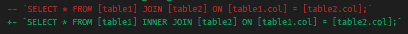

# Git:显示阶段性变化

> 原文：<https://dev.to/miku86/git-show-staged-changes-4aj5>

## Git:显示阶段性变化

我经常使用`git add --patch`。

在 VSCode 的源代码控制选项卡中，
您可以双击暂存文件，
将打开一个分屏，并排显示更改。

[](https://res.cloudinary.com/practicaldev/image/fetch/s--C5TEQNUz--/c_limit%2Cf_auto%2Cfl_progressive%2Cq_auto%2Cw_880/https://thepracticaldev.s3.amazonaws.com/i/m00lpkofqj0x6zh0p64x.png)

但是如何在终端中做到这一点呢？

使用`git diff --staged`。
也可以用`git diff --cached`。

[](https://res.cloudinary.com/practicaldev/image/fetch/s--pWnpbcjc--/c_limit%2Cf_auto%2Cfl_progressive%2Cq_auto%2Cw_880/https://thepracticaldev.s3.amazonaws.com/i/0og5c5rxz41d5hu5asvd.png)

`git diff --help`表示:

```
git diff [<options>] --cached [<commit>] [--] [<path>...]
This form is to view the changes you staged for the next commit relative to the named <commit>. Typically you would want comparison with the latest commit, so if you do not give <commit>, it defaults to HEAD. If HEAD does not exist (e.g. unborn branches) and <commit> is not given, it shows all staged changes. --staged is a synonym of --cached. 
```

Enter fullscreen mode Exit fullscreen mode