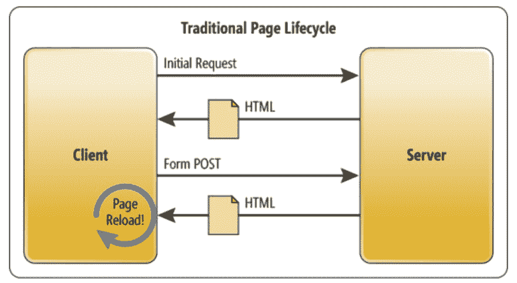
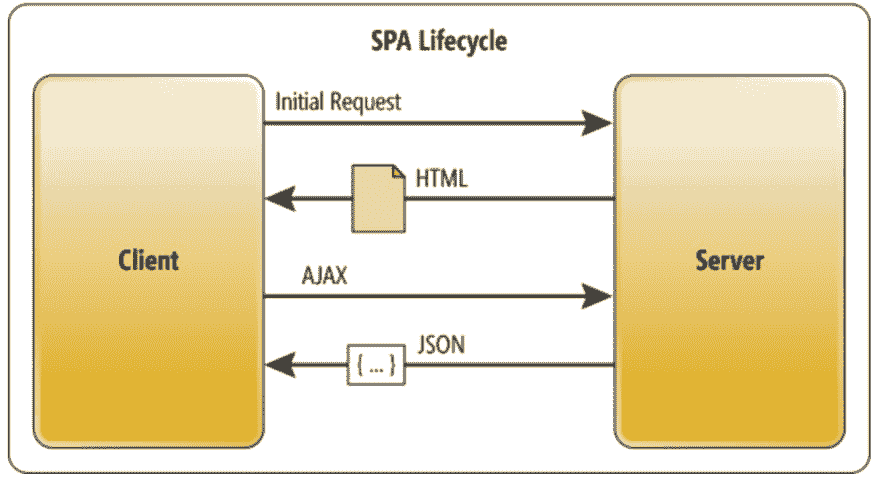

# 什么是单页应用程序(SPA)？

> 原文:[https://dev . to/kendyl 93/what-is-single-page-applications-spa-32bh](https://dev.to/kendyl93/what-are-single-page-applications-spa-32bh)

你听说过一些 JavaScript 框架吗，比如 AngularJS，React 或者 Vue.js？也许你想学习它，但你不知道为什么它如此受欢迎？它们都采用了 SPA 原则。什么是 SPA？让我们从头开始...

# “老”网站

让我们假设你一直在用“旧”的方式开发网站。最终用户在浏览器中打开它并浏览它。

除了图形界面，整个页面都是从服务器上下载的。每次点击都会导致服务器发送一堆文件。此外，如果用户有坏的互联网连接，这种交换可能会导致秒加载页面！这就是它在幕后的运作方式。

|  |
| --- |
| *来源:[微软](https://msdn.microsoft.com/en-us/magazine/dn463786.aspx)T3】* |

让服务器只参与一次页面加载和导航不是很好吗？这就是 SPA 的用武之地。

# SPA 究竟是什么？

维基百科提供了相当清晰的定义，但让我们仔细看看

> 、单页应用程序(SPA)是一种 web 应用程序或网站，它通过动态重写当前页面而不是从服务器加载整个新页面来与用户进行交互。"

让我们潜入更深的地方。

当您通过在浏览器中键入例如`www.myAwesomeSPAWebsite.com`发出请求时，SPA 会首次加载所有捆绑内容。

|  |
| --- |
| *来源:[微软](https://msdn.microsoft.com/en-us/magazine/dn463786.aspx)T3】* |

您可以看到，在来自服务器的初始响应之后，它会发送`JSON`数据。app 里的`requests`大部分都移到了客户端。服务器主要负责认证和与数据库的连接。

在 React、Vue、Angular 等流行的 SPA 框架中，网站的代码被拆分成**个组件**。一般来说，当您浏览页面时，其他组件会替换内容，而不是从服务器下载并重新加载整个页面。

|  |
| --- |
| *来源:[吉菲](https://media.giphy.com/media/b2CD0Qrq2ulwY/giphy.gif)T3】* |

# SPA 优点

*   **使用网站更快** -因为所有东西都是第一次加载的，客户可以立即更改页面上的内容。换句话说，我们的应用程序像桌面应用程序一样工作，因为它不需要再次与服务器通信来正确显示页面。

*   **降低服务器负载** - SPA 与服务器在通信层面的工作方式与传统页面不同。为了更好地理解这一点，我们可以将这一过程与建造房屋进行比较。想象一下，你(*客户端*)不得不一个接一个地搬运砖块(*数据*)浪费你的时间(*就像在传统网站*)或者你可以使用独轮车(*所有数据*)一次装载所有数据(*使用 SPA* )。现在你只需要在开始的时候运输它们一次。从现在起，你不要在意一个砖家让你再带些砖来。你(*服务器*)可以休息了。

*   **用户体验(UX)**——UX 是指用户与产品或服务的任何互动。事实上，你不必等到页面重新加载，给你更多的乐趣使用它。

*   **传输数据量更少** -我已经提到过，所有的数据在开始的时候都是一次加载的。此外，有一些机制允许我们定义哪些数据应该在第一次请求时加载，哪些可以在以后加载。这也增加了应用程序的 UX。

*   **现代解决方案** -由于使用现代解决方案，应用程序的代码可以更加精简。你也可以使用 [*微服务*](https://medium.com/@tomsoderlund/micro-frontends-a-microservice-approach-to-front-end-web-development-f325ebdadc16) 。这让你有可能将你的应用分成提供 API 的服务。

# 水疗弊

*   **开发者付出更多**——SPA 可以简单的写成 *HTML* 、 *JS* 和 *CSS* 但是迟早你会意识到你需要学习即 *Webpack* 、 *Express* 、 *React/Vue/Angular* 以及其他附带的解决方案。这在开始时可能会令人沮丧，但值得学习。

*   **SEO** -搜索引擎[爬虫](https://en.wikipedia.org/wiki/Web_crawler)像 *Googlebot* 和 *Bingbot* 被设计成通过一个被称为*蜘蛛抓取*或*爬行*的过程来索引网页，在那里它们下载网页的 HTML 文件。这就是为什么对基于 HTML 的静态网页进行索引和排名更容易。当涉及到索引基于 JavaScript 的 spa 时，事情变得有点复杂。你必须付出更多的努力来关心搜索引擎优化。

## 总结

您应该在未来的项目中使用 SPA 吗？
嗯，一如既往你应该考虑每一个利弊来选择最好的选择。也许不值得开发 SPA，也许总成本太高。根据开发人员的偏好，可能会有更多的主观利弊。然而，这是值得保持跟踪这个迅速发展的温泉世界。