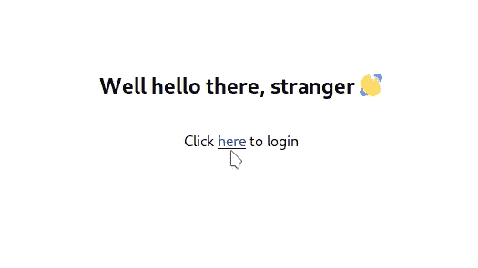

# 像 Redux 一样与 React 的上下文 API 共享状态

> 原文:[https://dev . to/rohanfaiyazkhan/sharing-more-with-react-s-context-API-e52](https://dev.to/rohanfaiyazkhan/sharing-more-with-react-s-context-api-e52)

## [](#the-pains-of-growing-state)成长状态的阵痛

在学习 React 时，我面临的第一个挑战是弄清楚状态管理。状态是任何比简单的博客或小册子站点更复杂的应用程序的重要组成部分。React 有一个很棒的工具集来管理组件级别的状态，包括带钩子的功能组件和基于类的组件。然而，全球状态是一个有点不同的故事。

几乎每一个高级功能，如认证，购物车，书签等。严重依赖于多个组件需要知道状态。这可以通过 props 传递状态来实现，但是随着应用程序的增长，这变得非常复杂。我们最终不得不通过中间组件来管理状态，状态的任何变化都需要在所有这些组件中反映出来。我们最终还会得到一堆与中间组件无关的代码，因此我们学会了忽略它。如果鲍勃叔叔教会了我什么的话，我们忽略的代码就是虫子的藏身之处。

## [](#the-solution-redux)解:Redux

[Redux](https://redux.js.org/) 脱胎于全局状态处理的问题。由[丹·阿布拉莫夫](https://overreacted.io)和他的团队创建的 Redux 提供了一个独立于本地状态的全球商店，单个组件可以访问该商店。此外，它还提供了一些处理状态的高级抽象，比如状态缩减器模式。

*慢着，慢着，现在状态减速器怎么样了？*

是的，我听到了，因为这是我第一次听到这些词放在一起时的确切反应。Redux 之外的 reducer 模式也是一种流行的模式，它实现了一种改变状态的方法。reducer 函数是一个纯粹的*函数(即没有外部状态或副作用),它只是接受先前的状态和动作，并返回新的状态。下面看起来是这样的。* 

```
function reducer(state, action){
    switch(action){
        case "increment":
            return state + 1
        case "decrement":
            return state - 1
        default:
            return state
    }
} 
```

<svg width="20px" height="20px" viewBox="0 0 24 24" class="highlight-action crayons-icon highlight-action--fullscreen-on"><title>Enter fullscreen mode</title></svg> <svg width="20px" height="20px" viewBox="0 0 24 24" class="highlight-action crayons-icon highlight-action--fullscreen-off"><title>Exit fullscreen mode</title></svg>

这种模式允许我们可预测地改变状态，这很重要，因为我们需要知道我们的应用程序如何对状态的变化做出反应。在这种模式下，直接变异状态是很不鼓励的。

Redux 还为我们提供了 action creator 模式，这是一种简单的组织我们如何分派行动的方式。结合状态缩减器模式，这给了我们很好的工具来组织全局状态管理。

### [](#sounds-good-so-whats-the-problem)听起来不错，那么有什么问题呢？

虽然 redux 很棒，我个人也是它的忠实粉丝，但它也有不少批评者。

*   许多人遇到的第一个问题是它非常样板化。当你有一个最初不需要全局状态的应用程序，然后你意识到你需要，然后* ***BOOM*** * 200+行在一次提交中添加时，这一点尤其明显。每次必须为组件获取全局状态时，都必须添加额外的样板文件。

*   Redux 固执己见，强加限制。你的状态必须用对象和数组来表示。改变状态的逻辑必须是纯函数。这些是大多数应用程序没有的限制。

*   Redux 有自己的学习曲线。对我个人来说，这是真的，因为 React 作为一个初学者看起来非常有趣，直到我撞上 Redux 的墙。这些高级模式是初学者不太可能欣赏或理解的。

*   使用 Redux 意味着增加大约 10kb 的包大小，如果可能的话，这是我们都希望避免的。

其他几个状态管理库也撑起了如 MobX 来解决 Redux 的缺点，但各有各的取舍。此外，所有这些仍然是外部依赖，会增加包的大小。

但是如此重要的东西肯定有本地实现吗？对吗？

本来没有，直到...

## [](#all-hail-the-magical-context)一切向魔幻语境致敬！

公平地说，上下文 API 已经存在了一段时间，但是在它成为今天的样子之前，已经经历了重大的变化和改变。它最好的部分是它不需要任何`npm install`或`yarn install`，它内置于 React 中，我个人发现当前的上下文 API 与 Redux 一样强大，尤其是在与 hooks 结合使用时。

但是有一个学习的障碍，那就是作为官方的 React 文档在解释上下文 API 有多强大方面是很糟糕的。结果，我挖通了它，实现了一个简单的登录系统，这样你就不用。

## [](#enough-talk-show-me-how-this-works-already)说够了，告诉我这是如何工作的

我们所要做的就是登录(使用一个包装在承诺中的假认证方法)，并用登录用户的用户名更改标题。如果你想跳过所有的解释，只看代码，请随意。T3】

[T2】](https://res.cloudinary.com/practicaldev/image/fetch/s--xpqwoxBJ--/c_limit%2Cf_auto%2Cfl_progressive%2Cq_66%2Cw_880/https://thepracticaldev.s3.amazonaws.com/i/t03j6bh174z25i8u9q4u.gif)

我们使用上下文需要做的第一件事是`React.createContext(defaultValue)`。这是一个返回包含两个组件的对象的函数:

*   `myContext.Provider` -为其所有子元素提供上下文的组件。如果您以前使用过 Redux，这与 react-redux 包中的`Provider`组件做了完全相同的事情
*   `myContext.Consumer` -用于消费上下文的组件。然而，正如我们将很快看到的，当我们使用`useContext`钩子时，这将不再需要

让我们用这些知识为我们的州创建一个商店。

```
// store.js

import React from 'react';

const authContext = React.createContext({});

export const Provider = authContext.Provider;
export const Consumer = authContext.Consumer;
export default authContext; 
```

<svg width="20px" height="20px" viewBox="0 0 24 24" class="highlight-action crayons-icon highlight-action--fullscreen-on"><title>Enter fullscreen mode</title></svg> <svg width="20px" height="20px" viewBox="0 0 24 24" class="highlight-action crayons-icon highlight-action--fullscreen-off"><title>Exit fullscreen mode</title></svg>

注意下面传递给`createContext`的`defaultValue`参数是一个空对象。这是因为该参数是可选的，并且仅在不使用提供程序时读取。

接下来，我们必须将我们的应用程序包装在`Provider`中，这样我们就可以使用这个全局状态。`Provider`需要一个叫做`value`的道具，这是被共享状态的值。然后我们可以使用子组件中的`useContext`钩子来检索这个值。

```
function App(){
    return (
        <Provider value={someValue}>
            <ChildComponent />
        </Provider>
    )
}

function ChildComponent(){
    const contextValue = useContext(myContext)
    return <div>{contextValue}</div>
} 
```

<svg width="20px" height="20px" viewBox="0 0 24 24" class="highlight-action crayons-icon highlight-action--fullscreen-on"><title>Enter fullscreen mode</title></svg> <svg width="20px" height="20px" viewBox="0 0 24 24" class="highlight-action crayons-icon highlight-action--fullscreen-off"><title>Exit fullscreen mode</title></svg>

但是，您可能会注意到这种方法的一个问题。我们只能更改包含提供者的组件中的状态值。如果我们想从我们的子组件中触发一个状态变化呢？

还记得我上面提到的减速器状态模式吗？我们可以在这里使用它！React 提供了一个方便的`useReducer`钩子，它接受一个`reducer`函数和一个`initialState`值，并返回当前状态和一个调度方法。如果您以前使用过 redux，这就是我们在那里观察到的完全相同的 reducer 模式。然后我们将`useReducer`钩子的返回值作为`<Provider>`内部的值传递。

让我们定义一个减速器。

```
// reducers/authReducer

export const initialAuthState = {
    isLoggedIn: false,
    username: '',
    error: ''
};

export const authReducer = (state, action) => {
    switch (action.type) {
        case 'LOGIN':
            return {
                isLoggedIn: true,
                username: action.payload.username,
                error: ''
            };
        case 'LOGIN_ERROR':
            return {
                isLoggedIn: false,
                username: '',
                error: action.payload.error
            };
        case 'LOGOUT':
            return {
                isLoggedIn: false,
                username: '',
                error: ''
            };
        default:
            return state;
    }
}; 
```

<svg width="20px" height="20px" viewBox="0 0 24 24" class="highlight-action crayons-icon highlight-action--fullscreen-on"><title>Enter fullscreen mode</title></svg> <svg width="20px" height="20px" viewBox="0 0 24 24" class="highlight-action crayons-icon highlight-action--fullscreen-off"><title>Exit fullscreen mode</title></svg>

现在我们可以在`<Provider>`中使用我们的减速器了。

```
// App.js 

import React, { useReducer } from 'react';
import Router from './components/Router';
import { Provider } from './store';
import { authReducer, initialAuthState } from './reducers/authReducer';

function App() {
    const useAuthState = useReducer(authReducer, initialAuthState);
    return (
        <Provider value={useAuthState}>
            <Router />
        </Provider>
    );
}

export default App; 
```

<svg width="20px" height="20px" viewBox="0 0 24 24" class="highlight-action crayons-icon highlight-action--fullscreen-on"><title>Enter fullscreen mode</title></svg> <svg width="20px" height="20px" viewBox="0 0 24 24" class="highlight-action crayons-icon highlight-action--fullscreen-off"><title>Exit fullscreen mode</title></svg>

现在我们应用程序中的所有组件都可以访问由`useReducer`返回的`state`和`dispatch`方法。我们现在可以在登录表单组件中使用这个`dispatch`方法。首先，我们将从上下文中获取状态，这样我们就可以检查用户是否登录，以便我们可以重定向他们，或者我们是否需要呈现一个错误。接下来，我们将尝试登录(使用我们的假身份验证方法),并根据身份验证是否成功来分派操作。

```
// components/LoginForm.jsx

import React, { useState, useContext, Fragment } from 'react';
import { Link, Redirect } from 'react-router-dom';
import authContext from '../store';
import attemptLogin from '../auth/fakeAuth';

const LoginForm = () => {
    const [ state, dispatch ] = useContext(authContext);
        const { isLoggedIn, error } = state;

    const [ fakeFormData, setFormData ] = useState({
            username: "Rohan", 
            password: "rohan123"
        });

    function onSubmit(event) {
        event.preventDefault();
        attemptLogin(fakeFormData)
            .then((username) => {
                dispatch({
                    type: 'LOGIN',
                    payload: {
                        username
                    }
                });
            })
            .catch((error) => {
                dispatch({
                    type: 'LOGIN_ERROR',
                    payload: {
                        error
                    }
                });
            })
            .finally(() => {
                setLoading(false);
            });
    }

    return (
        <Fragment>
            {isLoggedIn ? (
                <Redirect to="/" />
            ) : (
                <Fragment>
                    {error && <p className="error">{error}</p>}
                    <form onSubmit={onSubmit}>
                        <button type="submit">Log In</button>
                    </form>
                </Fragment>
            )}
        </Fragment>
    );
};

export default LoginForm; 
```

<svg width="20px" height="20px" viewBox="0 0 24 24" class="highlight-action crayons-icon highlight-action--fullscreen-on"><title>Enter fullscreen mode</title></svg> <svg width="20px" height="20px" viewBox="0 0 24 24" class="highlight-action crayons-icon highlight-action--fullscreen-off"><title>Exit fullscreen mode</title></svg>

最后，我们将包装登录组件，以显示登录用户的用户名。我们还将切换欢迎消息，根据用户是否已经登录来提示登录或注销，并将创建一个方法来调度注销。

```
// components/Hello.jsx

import React, { Fragment, useContext } from 'react';
import { Link } from 'react-router-dom';
import Header from './Header';
import authContext from '../store';

const Hello = () => {
    const [ { isLoggedIn, username }, dispatch ] = useContext(authContext);
    const logOut = () => {
        dispatch({
            type: 'LOGOUT'
        });
    };
    return (
        <Fragment>
            <Header>{`Well hello there, ${isLoggedIn ? username : 'stranger'}`}</Header>
            {isLoggedIn ? (
                <p>
                    Click <Link to="/" onClick={logOut}>here</Link> to logout
                </p>
            ) : (
                <p>
                    Click <Link to="/login">here</Link> to login
                </p>
            )}
        </Fragment>
    );
};

export default Hello; 
```

<svg width="20px" height="20px" viewBox="0 0 24 24" class="highlight-action crayons-icon highlight-action--fullscreen-on"><title>Enter fullscreen mode</title></svg> <svg width="20px" height="20px" viewBox="0 0 24 24" class="highlight-action crayons-icon highlight-action--fullscreen-off"><title>Exit fullscreen mode</title></svg>

## [](#and-there-you-have-it)好了

我们现在有了一个全功能的基于上下文的状态管理系统。总结一下创建它所需的步骤:

*   我们使用`React.createContext()`创建了一个商店
*   我们使用`useReducer`钩创建了一个减速器
*   我们将应用程序包装在一个`Provider`中，并使用 reducer 作为值
*   我们使用`useContext`来检索状态，并在必要时分派动作

你现在可能会问这是否能完全取代 Redux。嗯，也许吧。您可能会注意到，在使用上下文 API 时，我们必须实现自己的抽象和结构。如果你的团队已经习惯了 Redux 的做事方式，那么我看不出转换有什么价值。但是，如果你或你的团队确实想脱离 Redux，我当然会建议尝试一下。

感谢您的阅读，希望这篇文章对您有用。