# 使用动态端口映射将节点应用程序部署到 AWS ECS

> 原文:[https://dev . to/ryands 17/deploy-a-node-app-to-AWS-ECS-with-dynamic-port-mapping-38gd](https://dev.to/ryands17/deploy-a-node-app-to-aws-ecs-with-dynamic-port-mapping-38gd)

***注意:这需要几个先决条件。*T3】**

1.  [AWS CLI](https://aws.amazon.com/cli/) 将您的 docker 应用程序推送到 AWS 存储库。安装它并使用`aws configure`命令设置您的凭证。
2.  [Docker 社区版](https://docs.docker.com/install/)用于建立您的应用形象。
3.  我使用了 Node，所以需要使用`node`和`npm`，但是你可以使用任何你选择的后端，比如 Python，或者相应地构建你的 Docker 映像。

#### [](#i-personally-love-docker-its-a-beautiful-way-to-deploy-your-app-to-production-and-the-best-part-being-you-can-test-your-production-app-in-the-same-environment-on-your-local-machine-as-well)我个人很爱 Docker。这是将您的应用程序部署到生产环境中的绝佳方式。最棒的是，您还可以在本地机器上的相同环境中测试您的生产应用程序！

这张图总结了这一切:)

[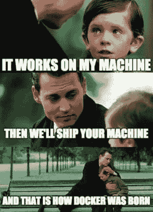T2】](https://res.cloudinary.com/practicaldev/image/fetch/s--_dwdyEDV--/c_limit%2Cf_auto%2Cfl_progressive%2Cq_auto%2Cw_880/https://thepracticaldev.s3.amazonaws.com/i/a78nwcrvau85a63gek34.png)

今天，我将向您展示如何通过 [AWS ECS(弹性容器服务)](https://aws.amazon.com/ecs/)部署捆绑在 Docker 映像中的节点应用程序。

***注意:我建议您在当前生产或工作环境中使用的付费 AWS 帐户上尝试一下。但是如果你是免费的，请边走边读这篇教程，因为创建这些服务会花费你很多钱！！！*T3】**

现在我已经警告过您了，让我们登录 AWS 控制台并选择 ECS。

[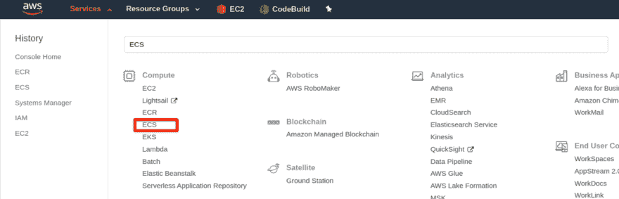T2】](https://res.cloudinary.com/practicaldev/image/fetch/s--p4bV2noA--/c_limit%2Cf_auto%2Cfl_progressive%2Cq_auto%2Cw_880/https://thepracticaldev.s3.amazonaws.com/i/mbm4bn62zpyiwun1msu3.png)

这将带您进入下一页。一定要看入门视频，太棒了！

[T2】](https://res.cloudinary.com/practicaldev/image/fetch/s--XnHzyxEr--/c_limit%2Cf_auto%2Cfl_progressive%2Cq_auto%2Cw_880/https://thepracticaldev.s3.amazonaws.com/i/p14qcafk97a846nh8rsr.png)

我们现在对左边的列表感兴趣。首先，我们需要创建一个存储库。AWS 中的存储库类似于 Docker Hub 中的存储库，这里有各种各样的映像，比如 MongoDB、Node、Python 等。以及它们的具体版本。但是在这里，我们将为我们的节点应用程序构建一个定制的 Docker 映像。

点击`Repositories`,它将带你进入 ECR(弹性容器注册页面),在这里你可以存储你所有的定制 Docker 图片。

点击右上角的`Create repository`,你将会看到这个页面。

[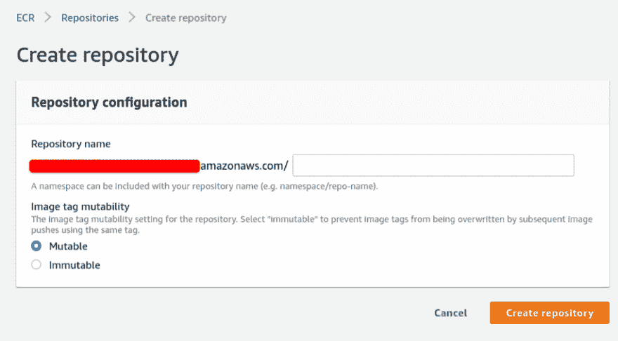T2】](https://res.cloudinary.com/practicaldev/image/fetch/s--46JJe0PU--/c_limit%2Cf_auto%2Cfl_progressive%2Cq_auto%2Cw_880/https://thepracticaldev.s3.amazonaws.com/i/6zlkzahdn5psogty12ez.png)

在输入中，添加您选择的名称，然后点击`Create repository`。现在，您有了自己的存储库，可以将包含应用程序的 Docker 映像推送到这个存储库中。我已经创建了一个存储库，并将其命名为`node-simple`。

[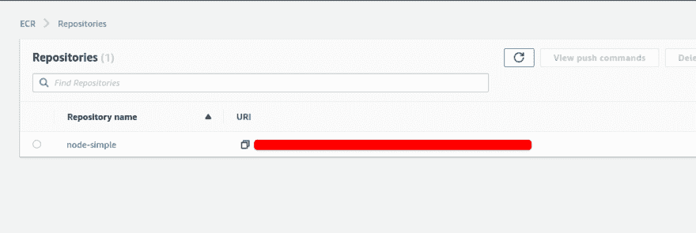T2】](https://res.cloudinary.com/practicaldev/image/fetch/s--HnqDi77s--/c_limit%2Cf_auto%2Cfl_progressive%2Cq_auto%2Cw_880/https://thepracticaldev.s3.amazonaws.com/i/o5zow7uk23sfrkadoajh.png)

注意`URI`字段。这是一个重要的字段，当我们将 Docker 映像从本地机器推送到 ECR 时，我们将需要它。

点击存储库，它会带你到图像列表。在这里，您可以查看我们将很快推送到 docker 的应用程序图像。

现在让我们继续创建简单的节点应用程序。

创建一个新文件夹，在终端中打开该文件夹，然后运行`npm init -y`创建一个`package.json`文件。然后创建一个名为`index.js`的文件，并在其中添加以下内容。

```
const express = require('express')

const PORT = process.env.PORT || 3000

const app = express()

app.get('/', (request, response) => {
  return response.json({
    data: {
      message: `API is functional`,
    },
  })
})

app.listen(PORT, () => console.log(`App running on port ${PORT}`)) 
```

<svg width="20px" height="20px" viewBox="0 0 24 24" class="highlight-action crayons-icon highlight-action--fullscreen-on"><title>Enter fullscreen mode</title></svg> <svg width="20px" height="20px" viewBox="0 0 24 24" class="highlight-action crayons-icon highlight-action--fullscreen-off"><title>Exit fullscreen mode</title></svg>

我们构建了一个简单的 express 服务器，带有一个返回 json 的 GET 路由。

现在运行`npm i express`来安装`express`包。

最后，在您的`package.json`文件的`scripts`字段中添加一个`start`脚本。

```
"scripts":  {  "start":  "node index.js"  } 
```

<svg width="20px" height="20px" viewBox="0 0 24 24" class="highlight-action crayons-icon highlight-action--fullscreen-on"><title>Enter fullscreen mode</title></svg> <svg width="20px" height="20px" viewBox="0 0 24 24" class="highlight-action crayons-icon highlight-action--fullscreen-off"><title>Exit fullscreen mode</title></svg>

现在，在您的终端中运行`npm start`来查看默认情况下在 [http://localhost:3000/](http://localhost:3000/) 上运行的应用程序，如果您没有在您的环境中指定端口的话。您将在浏览器中看到返回的 json 消息`API is functional`。

让我们继续创建我们的`Dockerfile`。这对于建立我们的形象并将其推向 ECR 至关重要。在我们的文件夹中创建一个名为 Dockerfile 的文件，并添加以下内容。

```
FROM mhart/alpine-node:10.16.3

WORKDIR /app

COPY package*.json ./

RUN npm ci

COPY index.js .

CMD ["npm", "start"] 
```

<svg width="20px" height="20px" viewBox="0 0 24 24" class="highlight-action crayons-icon highlight-action--fullscreen-on"><title>Enter fullscreen mode</title></svg> <svg width="20px" height="20px" viewBox="0 0 24 24" class="highlight-action crayons-icon highlight-action--fullscreen-off"><title>Exit fullscreen mode</title></svg>

我们使用[高山节点](https://hub.docker.com/r/mhart/alpine-node/)来缩小图像尺寸。在 Docker 映像中将我们的工作目录设置为`/app`之后，我们将复制我们的`package.json`以及`package-lock.json`文件，用于确定性构建。然后我们运行`npm ci`命令来确保安装了与我们的锁文件中相同的包版本。然后，我们将`index.js`文件复制到我们的映像中，最后，我们将 start 命令添加为要在我们的映像中运行的主命令。

返回 AWS 控制台，单击您已经创建的存储库。你会在右边找到一个名为`View push commands`的按钮。

[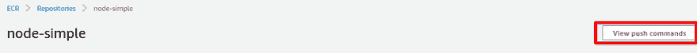T2】](https://res.cloudinary.com/practicaldev/image/fetch/s--yOs8uGzJ--/c_limit%2Cf_auto%2Cfl_progressive%2Cq_auto%2Cw_880/https://thepracticaldev.s3.amazonaws.com/i/5ir99kcc7rafewkxsaii.png)

单击该按钮，您将获得一个命令列表，这些命令将在您的机器上运行，以下面的方式将映像推送到 AWS ECR。

[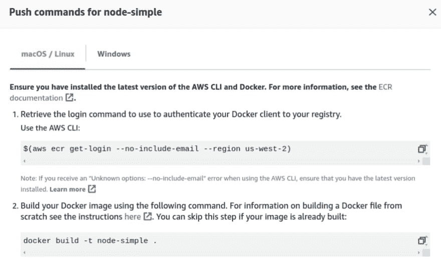T2】](https://res.cloudinary.com/practicaldev/image/fetch/s--Dkp8VXLU--/c_limit%2Cf_auto%2Cfl_progressive%2Cq_auto%2Cw_880/https://thepracticaldev.s3.amazonaws.com/i/auwk5sc3728fqb7egbjv.png)

复制命令，并在节点应用程序文件夹中逐个运行它们。我在`us-west-2`地区，但是你可以使用任何支持 ECS 的地区(大部分都是 btw)。

这些命令按顺序运行时

1.  使用您提供的凭据登录 AWS 服务。
2.  将您的应用程序构建到 Docker 映像中。
3.  根据您创建的存储库标记您的应用程序。
4.  将您的图像推送到存储库。

成功完成上述步骤后，您将能够在存储库中看到您的 Docker 映像，如下所示。

[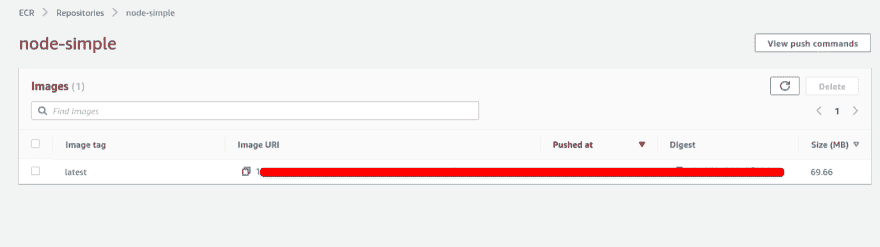T2】](https://res.cloudinary.com/practicaldev/image/fetch/s--84ktM2im--/c_limit%2Cf_auto%2Cfl_progressive%2Cq_auto%2Cw_880/https://thepracticaldev.s3.amazonaws.com/i/zuhhkora3tyv40iqtdnf.png)

这是在创造你的形象。现在让我们继续为我们的应用程序创建一个集群。

选择**亚马逊 ECS** 下的`Clusters`，你将被重定向到集群列表，我们现在没有任何集群。让我们点击`Create Cluster`按钮，然后选择`EC2 Linux + Networking`模板并点击`Next step`。

在此部分中，为您的集群命名，并在`Instance Configuration`部分中选择以下值。

[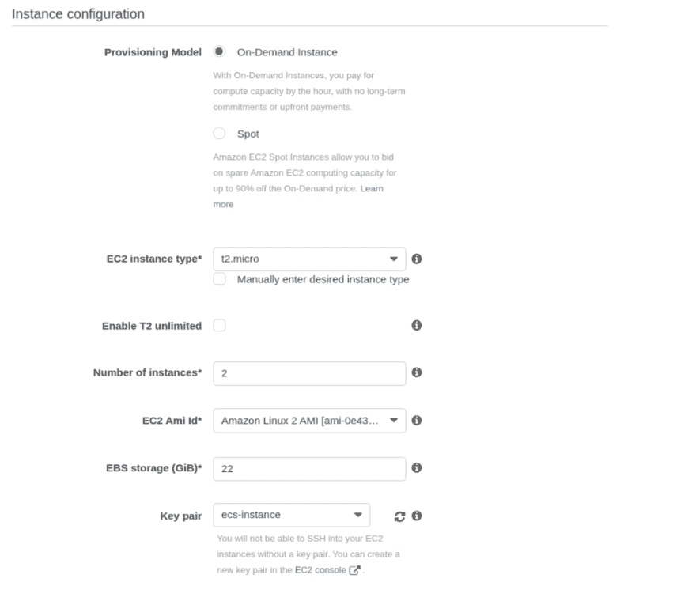T2】](https://res.cloudinary.com/practicaldev/image/fetch/s--Xz-oWUu2--/c_limit%2Cf_auto%2Cfl_progressive%2Cq_auto%2Cw_880/https://thepracticaldev.s3.amazonaws.com/i/w3412gjjq1sab0g7vbgc.png)

***注意:如果您想 SSH 到您的实例中，您需要选择一个密钥对。这对于调试非常有用。*T3】**

保持其他选项不变，它将为您创建一个`VPC`,并为您的 EC2 实例分配 IAM 角色，以便 ECS 可以连接到您的实例并运行您的 docker 映像。

你会看到这样的东西。我已经把我的集群命名为`node-simple`。

[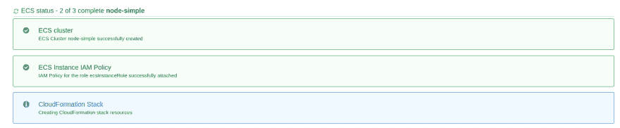T2】](https://res.cloudinary.com/practicaldev/image/fetch/s--h5UYvZCY--/c_limit%2Cf_auto%2Cfl_progressive%2Cq_auto%2Cw_880/https://thepracticaldev.s3.amazonaws.com/i/gtyav1eu9p4gc9mdxp71.png)

完成后，单击`View cluster`，它将带您进入创建集群页面，其状态将显示为**活动**。

您可以从您的 AWS 服务转到`EC2`，您将能够看到已经创建了两个`t2.micro`实例。您可以使用这些实例的公共 IP SSH 进入它们。

[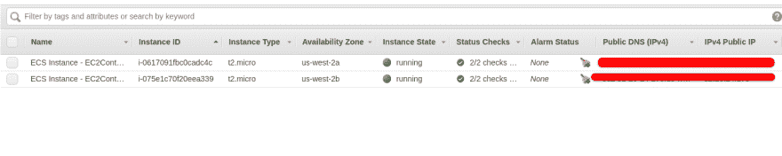T2】](https://res.cloudinary.com/practicaldev/image/fetch/s--lybFJKFd--/c_limit%2Cf_auto%2Cfl_progressive%2Cq_auto%2Cw_880/https://thepracticaldev.s3.amazonaws.com/i/tfck4bg9bzb5651u13rz.png)

回到 ECS，左边会看到一个叫`Task Definitions`的东西。单击该按钮，您将被带到一个页面，在该页面中您可以为集群创建任务定义。

[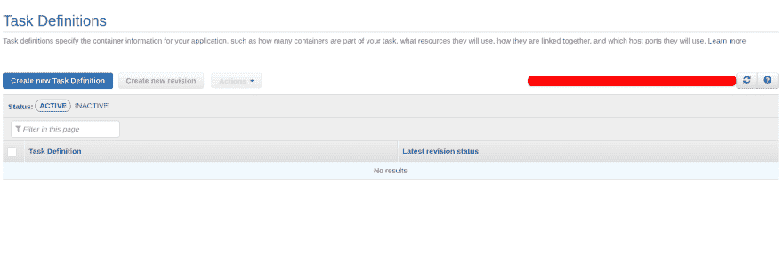T2】](https://res.cloudinary.com/practicaldev/image/fetch/s--swbPfnBu--/c_limit%2Cf_auto%2Cfl_progressive%2Cq_auto%2Cw_880/https://thepracticaldev.s3.amazonaws.com/i/y9h482h7i1bvgasxccp1.png)

简单地说，任务定义是 ECS 集群和 ECR 中的 Docker 映像之间的连接。目前我们没有任何任务定义，所以让我们创建一个。

点击`Create new Task Definition`，你会看到两个选项，`Fargate`和`EC2`。选择`EC2`进入下一步。

为您的任务定义输入一个名称，保留所有内容的默认值，直到您来到这一部分。

[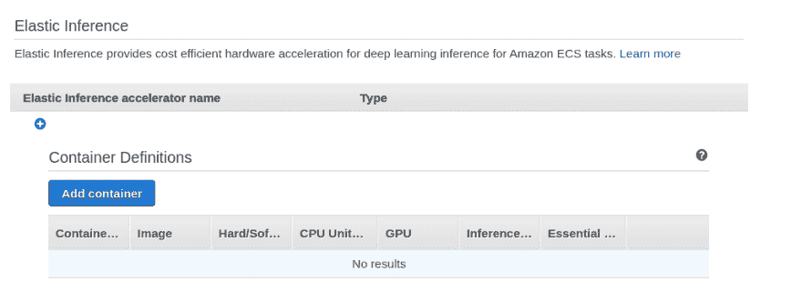T2】](https://res.cloudinary.com/practicaldev/image/fetch/s--uGIMs5B4--/c_limit%2Cf_auto%2Cfl_progressive%2Cq_auto%2Cw_880/https://thepracticaldev.s3.amazonaws.com/i/py35gaxhf8eos2r1kot1.png)

该部分帮助您指定 Docker 映像所需的所有必要值。点击`Add Container`，你会看到这样的东西。

[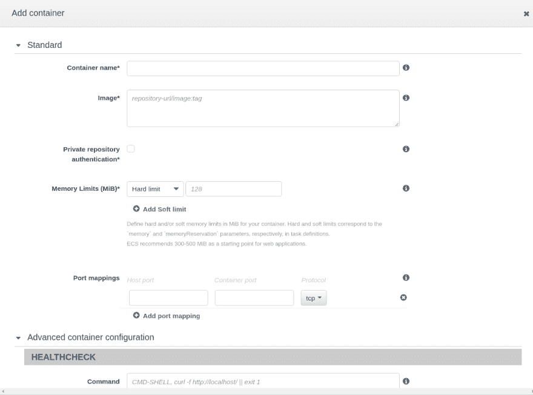T2】](https://res.cloudinary.com/practicaldev/image/fetch/s--5KeJUY8u--/c_limit%2Cf_auto%2Cfl_progressive%2Cq_auto%2Cw_880/https://thepracticaldev.s3.amazonaws.com/i/5kgiz7g3vezushhzgdgn.png)

给你的容器起一个名字，在`Image`字段中，复制你已经推送到 ECR 的 Docker 图像的`URI`并粘贴到这里。

在端口映射字段中，添加 **80** 作为`Container port`和 **0** 作为`Host port`。现在你一定在想，为什么我们把 0 作为主机端口？

这是因为我们需要 EC2 实例的动态端口映射到 Docker 容器的端口 80，这样多个容器就可以在同一个 EC2 实例上运行。 **0** 表示从`32768`到`65535`的任意端口将被分配给 EC2 实例。这些也被称为**短暂的港口**。

此外，我们已经为 Docker 容器指定了端口 80，所以我们必须告诉我们的节点服务器以某种方式在 80 上运行。我们如何实现这一目标...没错，使用**环境变量**！

向下滚动，您会找到`Environnment`部分。以下列方式添加环境变量。

[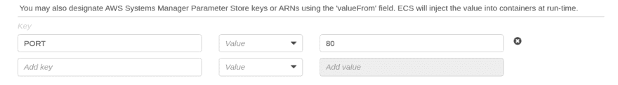T2】](https://res.cloudinary.com/practicaldev/image/fetch/s--TALxu0ak--/c_limit%2Cf_auto%2Cfl_progressive%2Cq_auto%2Cw_880/https://thepracticaldev.s3.amazonaws.com/i/ckvko092wgzxoydmlz73.png)

节点将使用我们在代码中指定的`process.env.PORT`变量读取这个端口。

让一切保持原样，然后点击`Add`。您将看到您的容器与您传递的 ECR 图像 URI 一起被添加。让其余字段保持原样，并点击`Create`。您将被重定向到任务定义页面，您将看到任务定义及其版本，以及我们在上一节中提供的所有选项。

现在让我们添加一个**负载平衡器**，它将平衡我们两个 EC2 实例之间的流量。

转到 EC2 服务，从`LOAD BALANCING`下的左侧部分选择`Load Balancers`。它将把你带到负载平衡器列表。现在，我们没有。所以让我们创建一个。

点击`Create Load Balancer`，您将看到一个选择负载平衡器类型的选项。选择`Application Load Balancer` (ALB ),因为它非常高级，并且支持我们的 EC2 实例中端口的动态映射。

点击`Create`后，您将看到负载平衡器的配置。给你的 ALB 取个名字，除了 VPC，其他都保持原样。选择 ECS 群集为您创建的 VPC，而不是默认的，否则 ALB 将无法正常工作。检查所有可用性区域，因为我们的实例将在所有这些区域中分离出来以获得高可用性。

[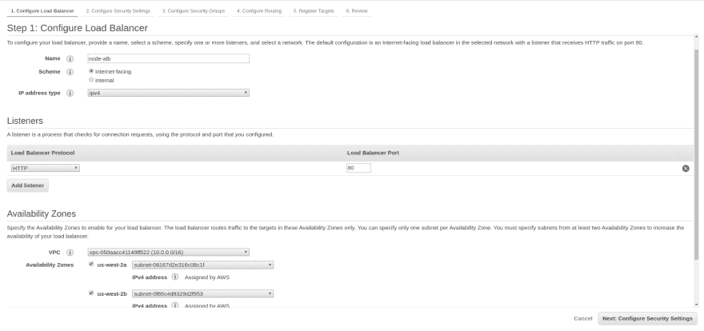T2】](https://res.cloudinary.com/practicaldev/image/fetch/s--W1EiCcuC--/c_limit%2Cf_auto%2Cfl_progressive%2Cq_auto%2Cw_880/https://thepracticaldev.s3.amazonaws.com/i/g0xi4qbo5jfk33tw96wz.png)

点击`Next`。你会得到一个警告，我们正在使用一个不安全的监听器，即端口 80。在生产中，使用 SSL 证书并配置您的 ALB 监听 443 (HTTPS)。现在，让我们忽略这个警告，点击`Next`。

这里你要为你的 ALB 配置一个`Security Group` (SG)。让我们创建一个新的 SG 并向外界开放 HTTP 端口 80，因为用户将使用 ALB 路由来访问我们的节点 API。为我们的 ALB 添加 HTTP 规则。

[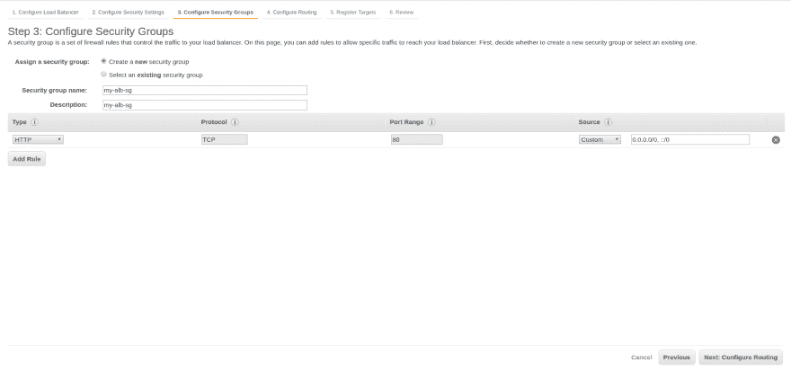T2】](https://res.cloudinary.com/practicaldev/image/fetch/s--a360wmNU--/c_limit%2Cf_auto%2Cfl_progressive%2Cq_auto%2Cw_880/https://thepracticaldev.s3.amazonaws.com/i/usp31ahl5piz5yh6aoj9.png)

点击`Next`。这是一个重要的部分。这里，我们需要创建一个目标组来指定运行状况检查路由和端口，ALB 将把流量路由到我们的 EC2 实例。

[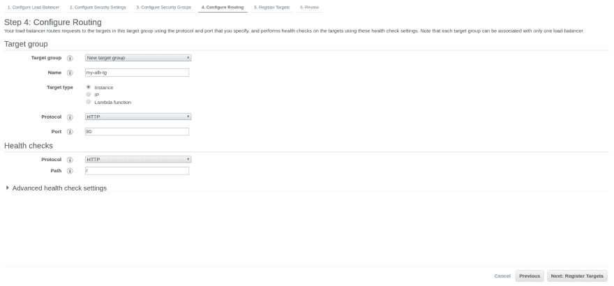T2】](https://res.cloudinary.com/practicaldev/image/fetch/s--gtA6t_KN--/c_limit%2Cf_auto%2Cfl_progressive%2Cq_auto%2Cw_880/https://thepracticaldev.s3.amazonaws.com/i/lgn5kh7j4zz9h1k0oea6.png)

保持一切不变，点击`Next`。您将被带到`Register Targets`页面，在我们在上一页创建的`Target Group`中注册我们的实例。

不要在这里注册任何目标，因为这将在我们创建服务的最后一步中自动完成。

点击`Next`，查看您添加的参数，然后点击`Create`。这将创建负载平衡器，并给它一个 DNS，我们可以从中调用我们的节点 API。

[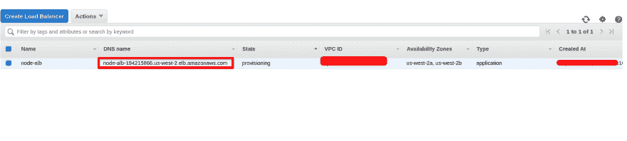T2】](https://res.cloudinary.com/practicaldev/image/fetch/s--eeoYFcXW--/c_limit%2Cf_auto%2Cfl_progressive%2Cq_auto%2Cw_880/https://thepracticaldev.s3.amazonaws.com/i/k4kc96305eaptlyx92w6.png)

接下来，我们需要 EC2 实例与 ALB 通信，以便它可以执行健康检查，并将流量路由到我们的 EC2 实例。为此，我们需要在 EC2 安全组中添加一个规则。

点击`NETWORK & SECURITY`下左侧菜单中的`Security Groups`。您会发现两个安全组。一个用于 EC2 实例，一个用于负载平衡器。单击由我们的集群创建的 EC2 安全组。

[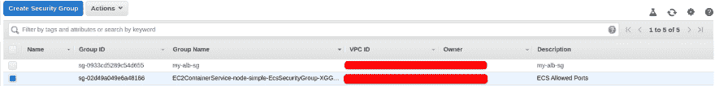T2】](https://res.cloudinary.com/practicaldev/image/fetch/s--UBMkIZ-u--/c_limit%2Cf_auto%2Cfl_progressive%2Cq_auto%2Cw_880/https://thepracticaldev.s3.amazonaws.com/i/vx1pz6nfseez9ronm0lb.png)

下面会打开一个菜单。选择`Inbound`选项卡并点击`Edit`。这将打开一个对话框，用于编辑我们的安全规则。我们将删除现有的规则，并添加我们自己的规则。从下拉列表中选择`Custom TCP rule`，在端口范围中添加`32768-65535`作为我们的端口范围。在源代码中，键入`sg`,您将会看到一个安全组的下拉列表。选择负载平衡器 SG 并添加您选择的描述。

规则看起来会像这样。

[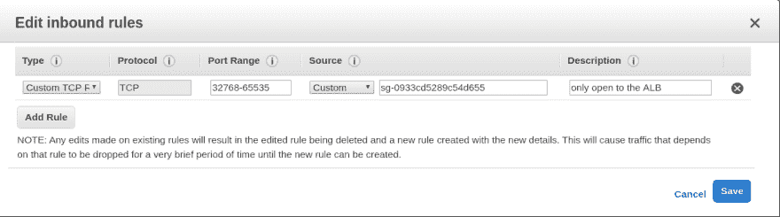T2】](https://res.cloudinary.com/practicaldev/image/fetch/s--ay54uhSm--/c_limit%2Cf_auto%2Cfl_progressive%2Cq_auto%2Cw_880/https://thepracticaldev.s3.amazonaws.com/i/sfuhlm3nl2kxss9y78k5.png)

***注意:如果您想要 SSH 到 EC2 实例中，还需要添加 SSH port 22 规则。*T3】**

点击`Save`。这就完成了负载平衡器的设置，并带我们进入最后一部分。创建服务。

返回 ECS，选择您的群集，您将看到打开的第一个选项卡是“service”选项卡。点击`Create`。

选择`EC2`作为启动类型，并为您的服务命名。您会注意到任务定义是自动选择的。将`Number of Tasks`设置为 **2** 。这将在每个 EC2 实例中启动我们的节点应用程序映像的两个实例。其余值保持不变，点击`Next step`。

这一步是我们配置负载平衡器的地方。选择`Application Load Balancer`作为我们已经创建的类型。您会注意到我们的 LB 在`Load Balancer Name`中被自动选中。在那下面，你会发现负载平衡的容器。

[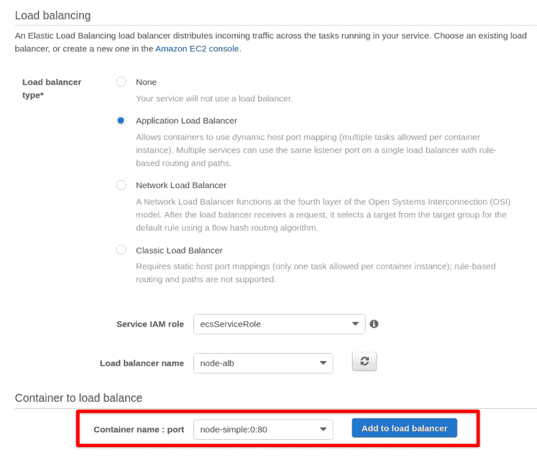T2】](https://res.cloudinary.com/practicaldev/image/fetch/s--VB6Yv999--/c_limit%2Cf_auto%2Cfl_progressive%2Cq_auto%2Cw_880/https://thepracticaldev.s3.amazonaws.com/i/0cj1rwt6mtgvv2494k4b.png)

您将看到我们的容器名称和端口映射已经被选中。点击`Add to load balancer`。将会打开一个新的部分。

在`Production listener port`中，从下拉菜单中选择 **80:HTTP** 。在`Target group name`中，选择我们在创建负载平衡器时创建的目标组。

选择此选项后，它将加载我们在创建 ALB 时在目标组中添加的所有值。

在最后一部分，取消勾选`Enable service discovery integration`，因为不需要它。点击`Next step`。

您将进入自动缩放配置。现在不要自动缩放，让它作为你完成后的一个实验:)

点击`Next step`，您将被带到对您的服务的审查，这将在 EC2 实例上旋转您的节点应用程序映像。

最后点击`Create Service`。这将创建您的服务并运行我们已经创建的任务定义。完成后，点击`View Servie`。您将看到两个处于**待定**状态的任务定义。

[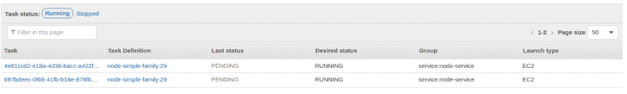T2】](https://res.cloudinary.com/practicaldev/image/fetch/s--bjlkle6l--/c_limit%2Cf_auto%2Cfl_progressive%2Cq_auto%2Cw_880/https://thepracticaldev.s3.amazonaws.com/i/myxiyk7jlcmq1h21c8av.png)

刷新一段时间后，状态将变为**正在运行**。点击`Events`选项卡。您将获得一个将任务添加到我们的 EC2 实例的服务日志。

[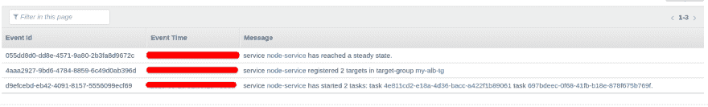T2】](https://res.cloudinary.com/practicaldev/image/fetch/s--E3yA55tS--/c_limit%2Cf_auto%2Cfl_progressive%2Cq_auto%2Cw_880/https://thepracticaldev.s3.amazonaws.com/i/und697pyqn7yo1o5e6ia.png)

一旦您得到这样的结果，服务已经达到就绪状态，您就可以开始工作了！

检查 EC2 服务的**负载平衡**部分的`Target Groups`。您将看到我们创建的服务已经在 ALB 目标组中自动注册了两个目标，并且它们都是健康的。

[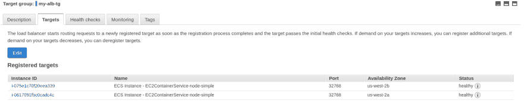T2】](https://res.cloudinary.com/practicaldev/image/fetch/s--Mz55o-jV--/c_limit%2Cf_auto%2Cfl_progressive%2Cq_auto%2Cw_880/https://thepracticaldev.s3.amazonaws.com/i/4a3qx2n85a717lowl1fm.png)

看看这些端口，它们是随机分配的，这就是我们的动态端口映射！

最后但同样重要的是，复制你的 ALB 的`DNS name`并粘贴到浏览器中，你会看到你的 node 应用程序正在运行，你会得到`API is functional`消息。耶！！！

这就是我们如何通过 AWS ECS 将我们的应用程序部署为 Docker 映像。

感谢您的阅读。