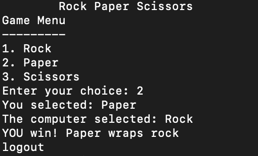
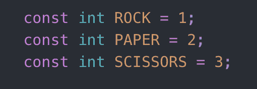
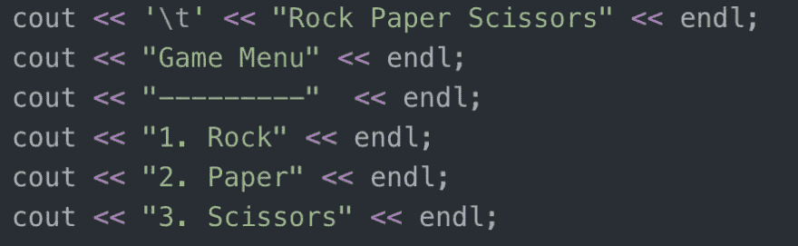
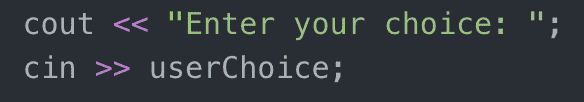
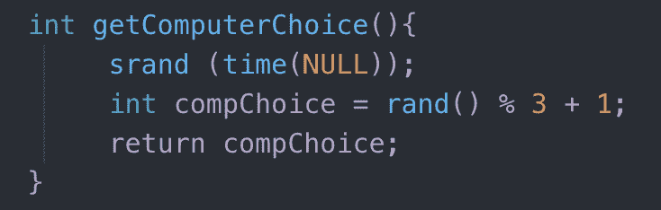
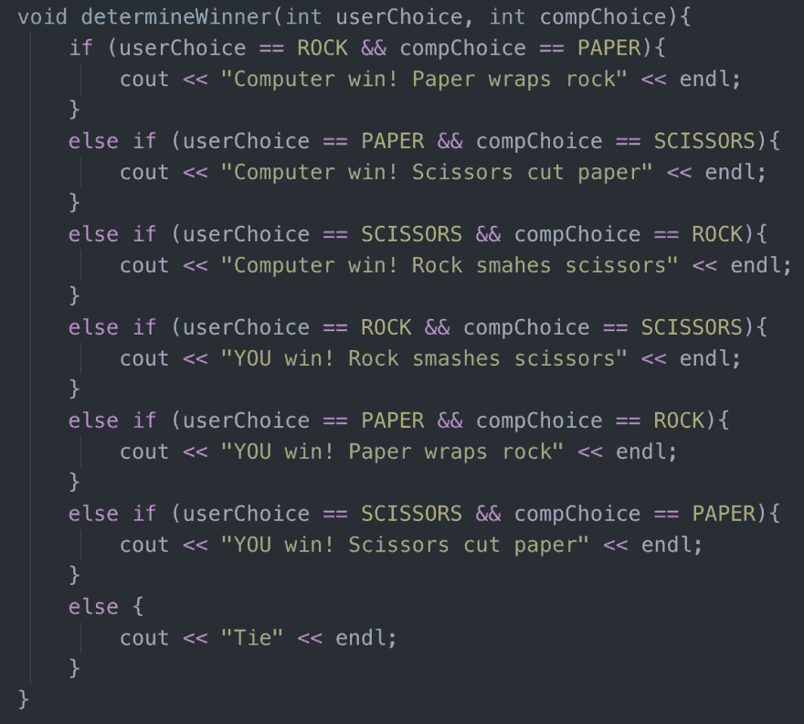
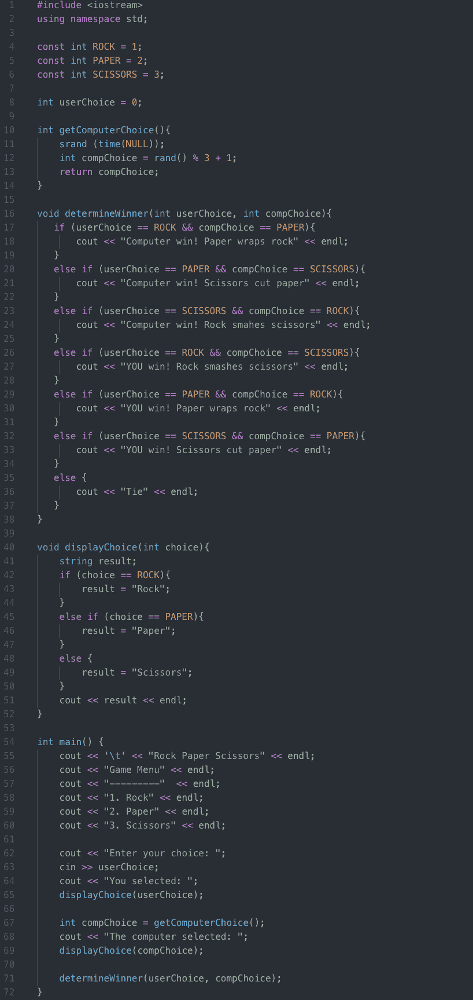

# C++中简单的控制台石头、布、剪刀

> 原文:[https://dev . to/maytd/simple-console-石头剪刀布-in-c-g35](https://dev.to/maytd/simple-console-rock-paper-scissors-in-c-g35)

这个程序是一个简单的石头、布、剪刀游戏，玩家必须从三个选项中选择一个来击败电脑。计算机将通过创建一个数字来表示该选项，从而生成一个随机选项。1 将是“石头”，2 将是“布”，3 将是“剪刀”。预期结果应该是这样的:

在我们开始之前，让我们将石头、布、剪刀的值设置为如下数字: 

现在，让我们做一个选项板。这将允许用户在石头、布或剪刀之间进行选择。打印出可供玩家挑选的选项如下:

接下来，我们必须让用户选择并显示他们的选择。我们通过比较用户值和我们设置的常量值来显示他们的数量。
[T3】](https://res.cloudinary.com/practicaldev/image/fetch/s--w4KxUlaQ--/c_limit%2Cf_auto%2Cfl_progressive%2Cq_auto%2Cw_880/https://thepracticaldev.s3.amazonaws.com/i/awkes1zyt195eo5goh2g.png)

一旦我们有了用户的选择，我们需要得到计算机的选择，看看谁会赢。为此，我们将随机生成一个 1-3 之间的数字，并显示计算机的选择。
[T3】](https://res.cloudinary.com/practicaldev/image/fetch/s---vf8fsbx--/c_limit%2Cf_auto%2Cfl_progressive%2Cq_auto%2Cw_880/https://thepracticaldev.s3.amazonaws.com/i/6z7fvudupg4zioht4fdd.png)

对于这两种选择，我们已经准备好进行比较，看看谁是赢家！做一个决定所有结果的函数。石头会打败剪刀，剪刀会打败布，布会打败石头。如果计算机或用户赢了，我们应该显示结果。如果两个选择都匹配，不要忘记打领带。
[T3】](https://res.cloudinary.com/practicaldev/image/fetch/s--HowuU8kr--/c_limit%2Cf_auto%2Cfl_progressive%2Cq_auto%2Cw_880/https://thepracticaldev.s3.amazonaws.com/i/9oxm4p17a7rql1hx1stm.png)

就是这样！这些是用 C++制作石头、剪子、布游戏的基本步骤。所有用于程序的代码看起来都是这样的:
