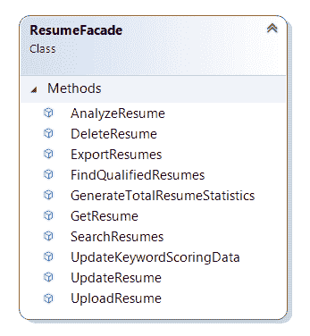

# 外墙不应有工作管道

> 原文:[https://dev . to/integerman/facades-should-not-have-working-plumbing-18ic](https://dev.to/integerman/facades-should-not-have-working-plumbing-18ic)

在这篇短文中，我们讨论了外观在应用程序架构中的作用、遇到的一些常见问题以及这些问题的正确解决方案。

就像电影场景中的假建筑一样，软件中的外观是复杂事物的良好外部表现。就软件而言，这意味着在一个地方包含公共 API 方法的单个类供其他人调用。不幸的是，这经常被滥用。

换句话说，如果立面是建筑物的外墙，则该墙不应包含炉子、空调、保险丝盒和配电系统。这并不是说系统不需要这些东西，只是它们属于它们适当的位置，而不是固定在面向公众的 API 上。

我们将讨论一个已经包含了几个方法的`ResumeFacade`。

[T2】](https://res.cloudinary.com/practicaldev/image/fetch/s--urJ-dAGI--/c_limit%2Cf_auto%2Cfl_progressive%2Cq_auto%2Cw_880/https://thepracticaldev.s3.amazonaws.com/i/mvdh7ij7fzsbtwlq31v7.png)

理想情况下，这个 facade 中的每个方法都应该将责任交给一个专用的对象，使`ResumeFacade`类成为简历相关活动的中央协调者。

不幸的是，在这些类型的类中经常发生的是，有人需要一个新方法添加到 facade 中，而添加该方法的开发人员只是在 facade 内部实现该方法。

因此，举例来说，有人可能会添加以下方法:

```
public IEnumerable<JobInfo> FindJobsMatchingResume(
  ResumeInfo resume, 
  UserInfo user) 
{
  // Create a database connection

  // Do a query against the database

  // Translate results into simple objects

  // Return a list of matching objects
} 
```

<svg width="20px" height="20px" viewBox="0 0 24 24" class="highlight-action crayons-icon highlight-action--fullscreen-on"><title>Enter fullscreen mode</title></svg> <svg width="20px" height="20px" viewBox="0 0 24 24" class="highlight-action crayons-icon highlight-action--fullscreen-off"><title>Exit fullscreen mode</title></svg>

在有效的代码库中，这可能是 5 - 35 行代码。还不算太糟，对吧？

好了，现在我们想添加错误处理和请求验证，所以我们的代码现在看起来像这样:

```
public IEnumerable<JobInfo> FindJobsMatchingResume(
  ResumeInfo resume, 
  UserInfo user) 
{
  try {
    ValidateUser(user);

    // Create a database connection

    // Do a query against the database

    // Translate results into simple objects

    // Return a list of matching objects
  }
  catch (SqlException ex) {
    // Custom handling goes here
  }
  catch (AuthenticationException ex) {
    // Custom handling goes here
  }
  catch (InvalidOperationException ex) {
    // Custom handling goes here
  }
} 
```

<svg width="20px" height="20px" viewBox="0 0 24 24" class="highlight-action crayons-icon highlight-action--fullscreen-on"><title>Enter fullscreen mode</title></svg> <svg width="20px" height="20px" viewBox="0 0 24 24" class="highlight-action crayons-icon highlight-action--fullscreen-off"><title>Exit fullscreen mode</title></svg>

如您所见，事情开始堆积，所以即使您的代码非常高效，它现在也有更多的样板逻辑。也许你可以将这种逻辑向上游移动到调用者那里，但是如果你不能，你的门面就会变得很大。

假设在下一个 sprint 中，一些新的业务逻辑出现在筛选和排序简历的工作匹配上，现在您需要在方法中加入更多的逻辑。你的代码又增长了。

由于一些常见原因，这些类型的课程往往会显著增加，例如:

*   添加新方法来代表提供的新功能
*   需要额外的错误处理
*   附加业务逻辑
*   修复现有逻辑错误所需的更改

在你意识到之前，你的方法有 50 行或者更长，而且你有太多了。你现在离一组非常紧凑的非常短的方法还很远。也许你可以通过为要调用的东西提取私有方法来解决这个问题，而你的方法并不是那么大，但是这使得你的方法计数问题更加糟糕。

一般来说，我喜欢使用不超过 20 行代码的方法和不超过 250 行的类。对于 facades，我的目标是每个方法接近 10 行代码，并接受更多的公共方法。

快速增长的 facade 的解决方案是，facade 只是各种对象之间的协调者，负责将事物链接在一起，并为外部调用方打包适当的响应。

在我们的例子中，重构后的方法可能是这样的:

```
public IEnumerable<JobInfo> FindJobsMatchingResume(
  ResumeInfo resume, 
  UserInfo user) 
{
  try {
    UserRepository.Validate(user);

    var analyzer = new ResumeAnalyzer();
    var keywords = analyzer.Analyze(resume);

    return JobsRepository.FindJobsMatching(keywords, resume.YearsExperience);
  }
  catch (ResumeAnalyzerException ex) {
    // Custom handling goes here
  }
  catch (AuthenticationException ex) {
    // Custom handling goes here
  }
} 
```

<svg width="20px" height="20px" viewBox="0 0 24 24" class="highlight-action crayons-icon highlight-action--fullscreen-on"><title>Enter fullscreen mode</title></svg> <svg width="20px" height="20px" viewBox="0 0 24 24" class="highlight-action crayons-icon highlight-action--fullscreen-off"><title>Exit fullscreen mode</title></svg>

在上面的例子中，我们在 facade 中仍然有很多错误处理逻辑，但是在这种情况下，这是 facade 核心职责的一部分——以外部可接受的方式响应内部错误。

这里的关键是我们将核心逻辑外包给专用类。这使得外观简单，易于阅读，易于维护。它还使得根据需要替换不同业务逻辑的不同实现变得更加容易。

* * *

外观在应用程序开发中有着重要的地位，但这并不意味着它们是跨越数千行代码的上帝对象。保持你的外观简单协调，你的建筑会因此变得更好。