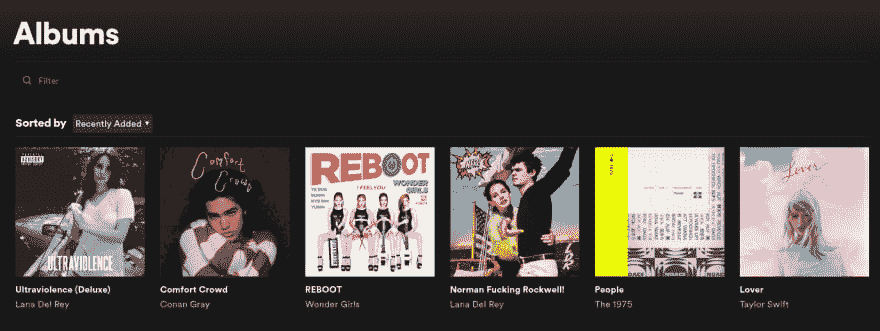
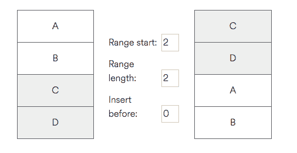
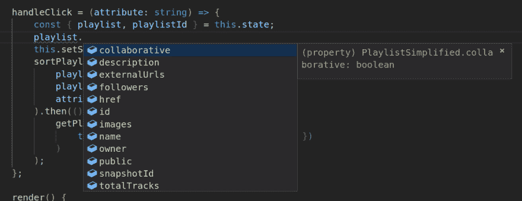
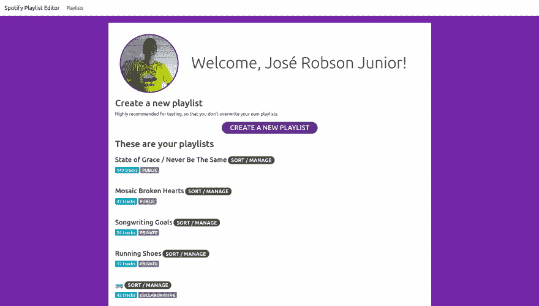

# 使用 spotify-web-sdk 管理 Spotify web API 申请

> [https://dev . to/openevufcg/使用-o-Spotify-web-SDK-to-manage-requisitions coes-a-API-web-do-Spotify-3j3i](https://dev.to/opendevufcg/usando-o-spotify-web-sdk-para-gerenciar-requisicoes-a-api-web-do-spotify-3j3i)进行管理

我和 [Renan](https://dev.to/joserenan) 有一个叫做[的开源组织，在那里我们开发了专注于音乐的应用程序。我们的一个项目是 Spotify web API 的 SDK，我们创建该 API 是为了支持使用此数据的其他应用程序。](https://github.com/calluswhatyouwant)

在这个帖子(这是来自我们公司的 dev.to 的译文))中，我将演示“[spotify-web SDK”](https://github.com/calluswhatyouwant/spotify-web-sdk)如何简化 Spotify 用户数据的检索和管理。我将通过描述一个非常严重的问题*所激发的应用程序开发过程来做到这一点，我作为该流平台的用户面临这个问题。*

 *## [calluswhatyouwant](https://github.com/calluswhatyouwant)/[Spotify-we b-SDK](https://github.com/calluswhatyouwant/spotify-web-sdk)

### Spotify Web API 的 JS SDK。

<article class="markdown-body entry-content container-lg" itemprop="text">

# Spotify Web SDK

Spotify Web API 的 JavaScript SDK 请注意，这个项目仍然是测试版。

## 目录

*   [特性](https://raw.githubusercontent.com/calluswhatyouwant/spotify-web-sdk/master/#features)
*   [安装](https://raw.githubusercontent.com/calluswhatyouwant/spotify-web-sdk/master/#installation)
*   [用途](https://raw.githubusercontent.com/calluswhatyouwant/spotify-web-sdk/master/#usage)
*   [社区](https://raw.githubusercontent.com/calluswhatyouwant/spotify-web-sdk/master/#community)
    *   [建议新功能或报告错误](https://raw.githubusercontent.com/calluswhatyouwant/spotify-web-sdk/master/#suggest-a-new-feature-or-report-a-bug)
    *   [自己动手](https://raw.githubusercontent.com/calluswhatyouwant/spotify-web-sdk/master/#do-it-yourself)
    *   [维护人员](https://raw.githubusercontent.com/calluswhatyouwant/spotify-web-sdk/master/#maintainers)
    *   [名人堂](https://raw.githubusercontent.com/calluswhatyouwant/spotify-web-sdk/master/#hall-of-fame)
*   [执照](https://raw.githubusercontent.com/calluswhatyouwant/spotify-web-sdk/master/#license)

## 特征

### “我为什么要用这个？”

我们希望为您处理困难的工作，即使是提出简单的请求，例如获取赛道信息，您也需要进行一系列设置。在我们的帮助下，您可以在这里做同样的事情:

```
import * as spotify from 'spotify-web-sdk';
spotify.init({ token: 'YOUR SPOTIFY TOKEN HERE!' }); // You should only need to run this once.
spotify.getTrack('3LOpHuEpjkL4T1Zcjhko8w'); // Or any other track id.
```

<svg width="20px" height="20px" viewBox="0 0 24 24" class="highlight-action crayons-icon highlight-action--fullscreen-on"><title>Enter fullscreen mode</title></svg> <svg width="20px" height="20px" viewBox="0 0 24 24" class="highlight-action crayons-icon highlight-action--fullscreen-off"><title>Exit fullscreen mode</title></svg>

对，就这么简单！

### “我还是觉得一点都不辛苦。

…</article>

[View on GitHub](https://github.com/calluswhatyouwant/spotify-web-sdk)

# Um problema do mundo real(*一点动力*

my Spotify library 中的相册部分非常杂乱，但这并不是我的错-在应用程序部署中，每当将单个相册添加到歌曲中时，该相册也会最终显示为相册。因为比起随机播放列表模式，我更喜欢从头到尾播放专辑。

<figure>

[T2】](https://res.cloudinary.com/practicaldev/image/fetch/s--SUpefDiT--/c_limit%2Cf_auto%2Cfl_progressive%2Cq_auto%2Cw_880/https://thepracticaldev.s3.amazonaws.com/i/9m6nxnmakkfwp13kisr3.png)

<figcaption>**Comfort Crowd** and **People** são singles, mas também aparecem na minha biblioteca como álbuns.</figcaption>

</figure>

我想到了一个简单的解决方案:我创建了一个播放列表，其中包含了我听过的每张专辑的第一个曲目。拥有这个播放列表对我也很有用，这样我就可以保留我第一次听到全部作品的那一天的记录(至少在我记得一听到它们就添加它们的时候)。问题解决了-我...。至少有一部分。嗯，为了使事情更有条理，我还是希望能够按发行日期排列专辑的引用顺序，而 Spotify 还不支持这一点(即使用户在五年多前就要求使用此功能。

我寻找能帮我管理这种排序方法的工具，发现了一个叫 [Sort Your Music](http://sortyourmusic.playlistmachinery.com/) 的 web 应用程序。尽管它们的排序方法非常简单且使用效率高，但它会复盖添加轨道的日期。我知道到目前为止，你可能已经在用我的不满翻遍你的眼睛了，但是，知道有可能得到我想要的结果，我决定实施我自己的工具。没什么比"自己动手"更好的了？

<figure>

[T2】](https://res.cloudinary.com/practicaldev/image/fetch/s--0T1LNRwl--/c_limit%2Cf_auto%2Cfl_progressive%2Cq_66%2Cw_880/https://thepracticaldev.s3.amazonaws.com/i/f1co9752rtmcdbm5nqfr.gif)

<figcaption>Perdoe-me caso você não enfrente esse problema no seu dia a dia.</figcaption>

</figure>

# [](#devagar-e-sempre)慢慢地永远

Spotify web API 提供了两个用于管理播放列表的端点:用于复盖所有音轨；[用于移动音轨或音轨块的另一个](https://developer.spotify.com/documentation/web-api/reference/playlists/reorder-playlists-tracks/)。与前者不同，后者不会修改*timestamp*，该时间戳表示将音轨添加到播放列表的时间以及添加音轨的人员的标识符(用于协作播放列表)。

<figure>

[T2】](https://res.cloudinary.com/practicaldev/image/fetch/s--113_b26J--/c_limit%2Cf_auto%2Cfl_progressive%2Cq_auto%2Cw_880/https://thepracticaldev.s3.amazonaws.com/i/lfcnbuvlnmvemungeuyu.png)

<figcaption>Visualização de como funciona o endpoint "reordenação de faixas de uma playlist".
Fonte: [Spotify for Developers](https://developer.spotify.com/documentation/web-api/reference/playlists/reorder-playlists-tracks/)</figcaption>

</figure>

如上所述，此端点的工作方式是，对播放列表进行排序需要多个连续请求(基本上是播放列表中每个范围一个请求)，这也意味着所需的时间远远超过复盖所有请求所需的时间。不得不做出牺牲，但结果恰恰是预期的:这里是‘t0’spotificable playlist editor！

<figure>

[T2】](https://res.cloudinary.com/practicaldev/image/fetch/s--Ih3NqGfw--/c_limit%2Cf_auto%2Cfl_progressive%2Cq_auto%2Cw_880/https://thepracticaldev.s3.amazonaws.com/i/7ookuks66s0203i3s9n3.png)

<figcaption>Quando você tiver feito login, algo assim deve aparecer na tela inicial da aplicação.</figcaption>

</figure>

# [](#detalhando-o-processo-mas-n%C3%A3o-demais)详细说明过程(但不要过分)

我想尽快原型反应应用程序，所以我使用了‘t0’create-reaction-app，节省了我很多初始设置时间。一般来说，我鼓励您尝试从头开始构建 React 应用程序，但这肯定是一只手在轮子上，当您着急的时候。为了保持一切简单起见，**移动播放列表编辑器**是*无服务器】*，但它允许每个人通过实施[隐式授予流](https://developer.spotify.com/documentation/general/guides/authorization-guide/)来访问其移动数据，这是获取访问令牌的简单方法

我添加了一些软件包和工具来简化编码过程(例如，[bootstrap](https://getbootstrap.com)这样我就不用再担心风格了；[假装](https://prettier.io/)有助于保持代码的标准化。我还觉得有趣的是，我用 [Flow](https://flow.org) 进行静态类型检查。我喜欢 JavaScript 具有动态类型，但由于 SDK 处理的模型很多，而这些模型又具有许多属性，Flow 成为一个很好的盟友。

<figure>

[T2】](https://res.cloudinary.com/practicaldev/image/fetch/s--X1y3_tBK--/c_limit%2Cf_auto%2Cfl_progressive%2Cq_auto%2Cw_880/https://thepracticaldev.s3.amazonaws.com/i/jjhcgbimvjazm6wcvcb8.png)

<figcaption>Você pode até odiar o Flow, mas o fato é que React + Flow + [IntelliSense](https://code.visualstudio.com/docs/editor/intellisense) é um verdadeiro dream team.</figcaption>

</figure>

## [](#conhe%C3%A7a-o-melhor-amigo-autoproclamado-da-api-web-do-spotify-o-spotifywebsdk)【认识最好的朋友】~~【自称】~~的 Spotify web API，Spotify-web SDK！

下面是从组件 *UserPage* 中提取的一段代码。你可以看到有些进口直接由 SDK 制成:

```
/* @flow */

import React, { Component } from 'react';
import {
    /* Funções que encapsulam endpoints da API do Spotify */
    init,
    getCurrentUserPlaylists,
    getCurrentUserProfile,
    /* Modelos */
    Page,
    PlaylistSimplified,
    PrivateUser,
} from 'spotify-web-sdk';

type Props = {
    history: any,
};

type State = {
    page: Page<PlaylistSimplified>,
    playlists: PlaylistSimplified[],
    user: PrivateUser,
};

class UserPage extends Component<Props, State> {
    // ...
} 
```

<svg width="20px" height="20px" viewBox="0 0 24 24" class="highlight-action crayons-icon highlight-action--fullscreen-on"><title>Enter fullscreen mode</title></svg> <svg width="20px" height="20px" viewBox="0 0 24 24" class="highlight-action crayons-icon highlight-action--fullscreen-off"><title>Exit fullscreen mode</title></svg>

一旦用户登录 Spotify， *UserPage* 是应用程序的主页。其主要目的是显示用户播放列表，并带有一个按钮，用于选择感兴趣的播放列表。最初检索到五个播放列表:

```
componentDidMount = async () => {
    const page = await getCurrentUserPlaylists({ limit: 5 });
    this.setState({
        page,
        playlists: page.items,
    });
} 
```

<svg width="20px" height="20px" viewBox="0 0 24 24" class="highlight-action crayons-icon highlight-action--fullscreen-on"><title>Enter fullscreen mode</title></svg> <svg width="20px" height="20px" viewBox="0 0 24 24" class="highlight-action crayons-icon highlight-action--fullscreen-off"><title>Exit fullscreen mode</title></svg>

通过将对象 *page* 保持在组件状态，要求更多播放列表就像可能的那样简单。这是因为检索下一个数据的逻辑已经在该类声明中实现了*页*no*Spotify-web-SDK*:

```
class Page<T> {
    // ...
    async getNextPage() {
        if (!this.hasNext()) throw new Error('There are no more pages');
        const params = {
            ...this.queryParams,
            limit: this.limit,
            offset: this.offset + this.limit,
        };
        const response = await this.getAxiosPageInstance().get('/', { params });
            return new Page<T>(response.data, this.t, this.wrapper);
    }
} 
```

<svg width="20px" height="20px" viewBox="0 0 24 24" class="highlight-action crayons-icon highlight-action--fullscreen-on"><title>Enter fullscreen mode</title></svg> <svg width="20px" height="20px" viewBox="0 0 24 24" class="highlight-action crayons-icon highlight-action--fullscreen-off"><title>Exit fullscreen mode</title></svg>

这样，在播放列表编辑器中处理所有这些逻辑只不过是一个简单的函数调用，无需跟踪诸如 limite 和 offset:
之类的值

```
loadMorePlaylists = async () => {
    const { page } = this.state;
    const nextPage = await page.getNextPage(); 
    // Relaxa e deixa o spotify-web-sdk lidar com o trabalho duro!
    this.setState(prevState => {
        const playlists = prevState.playlists.concat(nextPage.items);
        return { playlists, page: nextPage };
    });
}; 
```

<svg width="20px" height="20px" viewBox="0 0 24 24" class="highlight-action crayons-icon highlight-action--fullscreen-on"><title>Enter fullscreen mode</title></svg> <svg width="20px" height="20px" viewBox="0 0 24 24" class="highlight-action crayons-icon highlight-action--fullscreen-off"><title>Exit fullscreen mode</title></svg>

该应用程序的主要目的是允许用户对其播放列表进行排序，所以现在让我们重点关注它。从组件*playslistpage*中，用户可以选择排序方法(包括按发布日期！页:1。下面，我的实施首先确定了音轨的预期最终顺序，然后使用顺序调用重新排列音轨。这就是代码的运作方式:

```
import { reorderPlaylistTracks } from 'spotify-web-sdk';

export const sortPlaylistTracksByAttribute = async (
    playlistId: string,
    attribute: string
) => {
    let insertionOrder = await getInsertionOrder(playlistId, attribute);
    return insertionOrder.reduce(async (previousPromise, current) => {
        await previousPromise;
        return moveTrackToTop(playlistId, current);
    }, Promise.resolve());
};

const getInsertionOrder = async (
    playlistId: string,
    attribute: string
) => { /* Determina a ordem de inserção baseada no atributo escolhido. */ };

const moveTrackToTop = (id: string, oldIndex: number) =>
    reorderPlaylistTracks(id, oldIndex, { rangeLength: 1, insertBefore: 0 }); 
```

<svg width="20px" height="20px" viewBox="0 0 24 24" class="highlight-action crayons-icon highlight-action--fullscreen-on"><title>Enter fullscreen mode</title></svg> <svg width="20px" height="20px" viewBox="0 0 24 24" class="highlight-action crayons-icon highlight-action--fullscreen-off"><title>Exit fullscreen mode</title></svg>

顺便说一句，如果你不熟悉这种使用 *Array.prototype.reduce()* 按顺序解析承诺的方法，你有一篇很好的文章解释了它是如何工作的，更重要的是，**原因何在**。看看那边的[【CSS 把戏】](https://css-tricks.com/why-using-reduce-to-sequentially-resolve-promises-works/)！

如上所述，spotify-web-sdk 的主要目的是为希望访问 Spotify web API 的开发人员节省时间。与其直接调用 API 并担心细节，您的大部分工作应该是导入函数并在代码中调用它。

如果您有兴趣使用 Spotify 数据构建您自己的应用程序，当前版本的“Spotify-web-SDK”驻留在 NPM 中，可以快速添加到包. json 运行`npm add spotify-web-sdk`的项目中。

**移动播放列表编辑器**也在空中[这里](https://calluswhatyouwant.github.io/spotify-playlist-editor/)如果你想玩一点的话。如果您在使用该应用程序时遇到任何意外情况，那只是激发开源精神的培训:在 GitHub 存储库中创建一个问题！PRs 也很受欢迎(有一些未解决的问题，Hacktoberfest 就在那里-我...。页:1。

## 呼叫 whatyouwant / [ spotify 播放列表编辑器](https://github.com/calluswhatyouwant/spotify-playlist-editor)

### 您可以随意对 Spotify 播放列表进行排序。

<article class="markdown-body entry-content container-lg" itemprop="text">

# Spotify 播放列表编辑器

随心所欲地对 Spotify 播放列表进行排序！ <g-emoji class="g-emoji" alias="hammer_and_wrench" fallback-src="https://github.githubassets.cimg/icons/emoji/unicode/1f6e0.png">🛠</g-emoji>

[T2】](https://raw.githubusercontent.com/calluswhatyouwant/spotify-playlist-editor/master/./main-page.png)

## 目录

*   [特性](https://raw.githubusercontent.com/calluswhatyouwant/spotify-playlist-editor/master/#features)
*   [社区](https://raw.githubusercontent.com/calluswhatyouwant/spotify-playlist-editor/master/#community)
    *   [安装和使用](https://raw.githubusercontent.com/calluswhatyouwant/spotify-playlist-editor/master/#installation-and-usage)
    *   [部署](https://raw.githubusercontent.com/calluswhatyouwant/spotify-playlist-editor/master/#deployment)
    *   [建议新功能或报告错误](https://raw.githubusercontent.com/calluswhatyouwant/spotify-playlist-editor/master/#suggest-a-new-feature-or-report-a-bug)
    *   [维护人员](https://raw.githubusercontent.com/calluswhatyouwant/spotify-playlist-editor/master/#maintainers)

## 特征

*   从您最近的 Spotify 曲目或您有史以来的热门曲目中创建新的播放列表；
*   播放列表排序依据
    *   播放列表轨道属性(添加日期)；
    *   曲目属性(名称、长度、人气)；
    *   专辑属性(名称、发行日期)；
    *   艺术家属性(姓名)。

### 当前的限制

*   强烈建议创建您想要编辑的播放列表的副本，或者使用播放列表创建选项之一。(随便玩玩，但是要安全的做！);
*   您只能对不超过 100 首曲目的播放列表进行排序；
*   排序可能需要一段时间(包含 100 首曲目的播放列表可能需要 30 秒到 1 分钟)。在排序完成之前，不要重新加载或关闭播放列表页面。

## 社区

### 安装和使用

只需运行`yarn install`来安装项目的依赖项…

</article>

[View on GitHub](https://github.com/calluswhatyouwant/spotify-playlist-editor)

如果您想加入呼叫项目的新闻，请收听我们的 Twitter 简介！

* * *

非常感谢你的阅读！注意:很快，我们将在 **dev.to** 收到来自 opendevufcg 投稿人的新文章。陪同 openevufcg no[Twitter](https://twitter.com/OpenDevUFCG)、no [Instagram](https://instagram.com/OpenDevUFCG) 当然还有 [GitHub](https://github.com/OpenDevUFCG) 。*