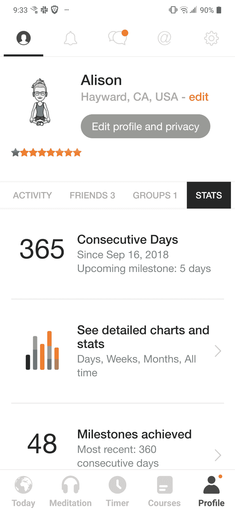

# 365 天的冥想

> 原文:[https://dev.to/alilynne/365-days-of-meditation-2io](https://dev.to/alilynne/365-days-of-meditation-2io)

### 365 天前...

真的，大约是在 350 天前，当我意识到我已经连续两周每天坐下来冥想，我决定看看如果我在接下来的一年里每天冥想会发生什么。

我做到了！截至昨晚。

[T2】](https://res.cloudinary.com/practicaldev/image/fetch/s--qwCSN3C7--/c_limit%2Cf_auto%2Cfl_progressive%2Cq_auto%2Cw_880/https://thepracticaldev.s3.amazonaws.com/i/x2w1qjdyve577380psm8.png)

### 为什么要打坐？

我有创伤后应激障碍。我的一些症状(因人而异)是对与人交谈感到焦虑，夜惊，以及对隐约的大噪音感到普遍的紧张。每当有人热情地说“嗨”时，生活跳跃并不是特别有趣。我在接受治疗，看了很多关于 PTSD 的书和文章，终于吃了一些好的药物，但仍然没有真正享受生活。

几年前，我和丈夫有机会参加我的治疗师推荐的基于正念的减压课程。我推荐它(尽管我觉得它有点儿过时)。我们每周与一群人和一位训练有素的教练会面一次，持续 8 周(包括一整天的静修)。课程的大部分集中在学习冥想上，从[身体扫描](https://www.mindful.org/the-body-scan-practice/)开始。所有的课程对我都很有用，但冥想似乎对我的情绪和心理健康有着特别积极的影响。课程结束后，我坚持冥想，但没有任何固定的时间表，只是每当我想到它的时候。

### 设定目标

我希望我的目标很简单。我知道给自己设置的障碍越少越好。所以我决定“每天坐下来冥想”就是这样。我没有设定时间限制。我没有选择一天中的时间。我想找到自己的节奏。最后发生的是，我每天晚上睡觉前冥想 10 分钟左右。

### 主要好处

在我开始这段旅程之前，我并没有意识到这一点，但很明显，我真的不擅长表达我的身体是如何感受的。经过一年的冥想，我更善于说“我累了”或“我需要休息了”这意味着在过去的一年里，我实际上得到了更多的休息。这意味着在过去的一年里，我变得更有效率，更有条理。

我也睡得更好了。我偶尔还会做噩梦，但我不记得上次做夜惊是什么时候了。睡觉前冥想也帮助我通过睡前惯例获得了更好的睡眠卫生。

由于缺乏更好的方法来解释它，我只是有更多的时间来思考。当有人问我一个问题时，我不再觉得它像一列尖叫的货运列车一样向我袭来，我必须躲开。

### 次要效果

我可以和医生交谈，告诉他们需要知道什么来帮助我。不知道自己的身体感觉意味着当我去看医生时，除了说“我感觉不舒服”之外，我很难说更多的话。事实证明这并不是特别有用。

我也很喜欢再次和人们交谈。在很长一段时间里，每次谈话都像是一场战斗，我只是想活下来。这真的很难去关注人们，无关痛痒的评论就像刀子一样，五分钟后我就准备跑了。

### 未来

我没有计划短期内停止冥想。肯定会有更多关于我冥想细节的帖子。但是具体来说，我想在我晚上的练习之外开始一个早上的练习。

虽然我的睡眠有所改善，我的日子也好多了，但我希望晨练能帮助我以更有规律的方式开始我的一天。

我也在找工作。全职，兼职，合同。-看我的网站。——[www.alilynne.com](http://www.alilynne.com)