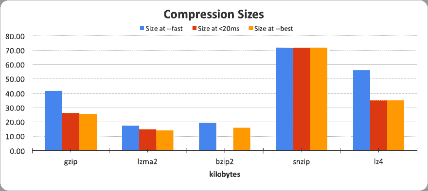
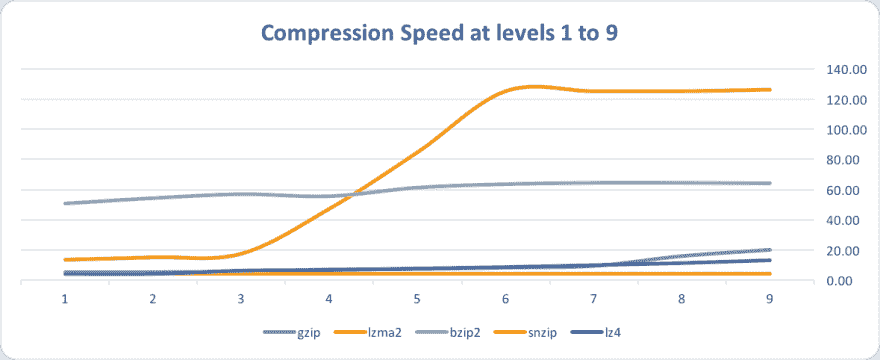

# 关于 REST 服务的压缩和二进制格式的案例研究

> 原文:[https://dev . to/juliano Julio/a-case-study-about-compression-and-binary-formats-for-a-rest-service-3235](https://dev.to/julianojulio/a-case-study-about-compression-and-binary-formats-for-a-rest-service-3235)

*深入研究对 API 进行的优化，将有效负载从大约 50mb 减少到大约 15kb，将响应时间从几秒钟缩短到<20 毫秒。*

* * *

几年前，当我在 Expedia 工作的时候，我遇到了一个非常奇怪的项目。它有很大的请求，很小的响应，响应时间应该非常快。

如果你曾经去过 Expedia 的网站寻找航班和酒店套餐，你可能间接使用过这项服务。该服务负责根据与客户相关的一些秘密信息，从所选路线的所有可用选项中选择航班。

 航班一旦选定，就与目的地所有可用酒店捆绑销售。每个捆绑包都使用另一种秘制酱来定价，然后宣传飞行成本的成本包含在价格中。

对该服务的每个请求都必须提供一些关于客户的信息以及一个航班列表，这些信息可能从数百到数千不等。这项服务还需要速度快，以保持引人入胜的用户体验。理想情况下，响应时间应该低于 300 毫秒。

最初的数据表示非常冗长，大小从几百千字节到 50 兆字节不等。在 1Gbps 的网络上，50mb 的文件大约需要 400 毫秒，这使得目标响应时间无法实现。

网络延迟也是我们决策中的一个复杂因素。这项服务本来是托管在云上的，而它的消费者运行在位于美国凤凰城的数据中心。仅云提供商和数据中心之间的延迟就约为 150 毫秒。

我们优化了请求负载，将发送给服务的数据量减少到最低限度。此外，还应用了额外的内容标准化技术，减少了冗余。最后，我们用 JSON 替换了原来的 XML，并实施了 GZIP 压缩以减少传输的数据量。

在实现 GZIP 压缩时，我们问自己是否有其他格式可以提供更好的性能。我们以 JSON 中的一个平均请求为例，有一千个航班，并使用不同的算法对其进行压缩。

我们认为理想的压缩时间不应该超过 20 毫秒，也就是说，不超过我们目标时间的 5%。然后，我们将每种压缩算法执行三次，每次都使用不同的配置。第一次执行的目标是使用最快的压缩速度，第二次执行的时间不到 20 毫秒；最后，最后一个目标是最佳压缩。下图显示了这个实验的结果。

[T2】](https://res.cloudinary.com/practicaldev/image/fetch/s--BgVpo5tz--/c_limit%2Cf_auto%2Cfl_progressive%2Cq_auto%2Cw_880/https://thepracticaldev.s3.amazonaws.com/i/cmr5fwqfipb0d9cbet2e.png)

然后是时候看看压缩速度了。下一张图展示了单位压缩率下的压缩速度。

[T2】](https://res.cloudinary.com/practicaldev/image/fetch/s--_nRUS2sG--/c_limit%2Cf_auto%2Cfl_progressive%2Cq_auto%2Cw_880/https://thepracticaldev.s3.amazonaws.com/i/12aj0ewnphvce7ewbiof.png)

比较这两个图，我们观察到最佳点将是使用压缩级别 3 的 LZMA2。它比 Gzip 压缩得更好，并且在可接受的 20 毫秒压缩时间的公差范围内。

因为我们在挑战最初的 XML 格式，所以我们决定看看其他格式，至少评估三个方面:速度；尺寸；和较小的 CPU 占用空间。不幸的是，我们没有足够的时间进行全面调查，所以我们的结论来自原型和本地测试。

*   XML+FastInfoset:比其他格式更大的有效负载。低延迟网络上更快的反序列化
*   MessagePack:比其他二进制格式慢，但比原始 JSON 快
*   Google Protobuf:快速、小巧、性能稳定
*   Kryo:非常快，小，稳定。然而，它是一个 Java 序列化协议，这意味着它只适用于 Java

Google Protobuf 似乎是我们在这个实验中寻找的格式，因为它在速度、大小和 CPU 使用率之间提供了正确的平衡。我们决定比较 Protobuf 和 JSON。

| 格式 | 大小 |
| --- | --- |
| JSON | 329KB |
| JSON+Gzip 组合键 | 22KB |
| JSON+lz2 | 15KB |
| 原蟾蜍 | 154KB |
| Protobuf+Gzip | 18KB |
| Protobuf+LZMA2 | 13KB |

我们的性能测试在每个场景下运行了六个小时，每秒钟持续 80 个事务。我们的目标是比较数据中心和云提供商的平均延迟和 TP95 延迟。以下是数字:

数据中心到云的延迟

| 格式 | TP50 | TP95 | 最快的组 |
| --- | --- | --- | --- |
| JSON+Gzip 组合键 | 107.11 毫秒 | 536.94 毫秒 | 50 毫秒和 100 毫秒:14% |
| JSON+lz2 | 104.20 毫秒 | 411.87 毫秒 | 50 毫秒和 100 毫秒:40% |
| Protobuf+LZMA2 | 61.17 毫秒 | 293.15 毫秒 | 50 毫秒和 100 毫秒:65% |

云到云的延迟

| 格式 | TP50 | TP95 | 最快的组 |
| --- | --- | --- | --- |
| JSON+lz2 | 16.36 毫秒 | 17.94 毫秒 | 15 毫秒和 20 毫秒:98% |
| Protobuf+LZMA2 | 15.05 毫秒 | 16.55 毫秒 | 10 毫秒和 15 毫秒:45% |

正如您所看到的，当查看 TP50 和 TP95 时，Protobuf 提供了比 JSON 稍好的性能。但是，在低延迟网络上，这将对性能产生重大影响。

正如你可能注意到的，我们没有用 Gzip 版本完成测试。我对这一决定感到遗憾，因为与其他结果进行比较是有价值的。我们当时的理由是关注 LZMA2，因为 JSON + LZMA2 比 JSON + Gzip 有更好的性能。

有了这些数字，我们有信心在生产中使用 Protobuf + LZMA2 来启用服务，并使用真实流量的子集。然而，这并不是这个实验的结束。服务运行良好，但是我们看不到与测试中相同的吞吐量。出于某种原因，客户端 CPU 的运行负载比我们预期的要高。

在我们的容量测试中，我们使用了预先构建的请求。同一组文件已经压缩，准备发送到航班选择服务。当整个编排就绪后，我们了解到，与该平台中的原生 Gzip 相比，我们使用的 LZMA2 算法的实现存在性能问题。我们运行了一个实验，比较使用 Gzip 和 LZMA2 算法时的实际流量性能，最终胜出的是 Gzip！

这项服务的实施是一次极好的体验。我们收集的结果在类似的场景中再次被观察到。还有许多其他二进制格式和压缩算法，我们还没有探索。我邀请读者进行实验，并与我们的结果进行比较。

我们在 2015 年中期编写了航班选择服务。据我所知，它仍然在运行和服务 Expedia 网站的几十个变种，并为客户决定最佳航班。