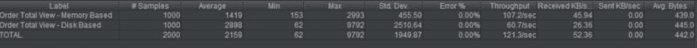

# 如何在 SQL Server 中使用内存优化对象

> 原文：<https://dev.to/erikwhiting88/how-to-work-with-memory-optimized-objects-in-sql-server-2eig>

*最初发布于[http://erikscode . space/index . PHP/2019/07/20/how-to-work-with-memory-optimized-objects-in-SQL-server/](http://erikscode.space/index.php/2019/07/20/how-to-work-with-memory-optimized-objects-in-sql-server/)*

大家早上好，今天我将向大家展示如何制作内存优化表和本机编译存储过程。首先，我将谈谈为什么你可能想使用这些东西，然后我们将直接进入如何做。

### 相关视频

如果你不想读所有这些，我用同样的脚本和同样的信息做了一个视频:
[https://www.youtube.com/embed/aaAb_rVY9WY](https://www.youtube.com/embed/aaAb_rVY9WY)

### 为什么要内存优化表？

那么，为什么您不想使用基于磁盘的表，而选择那些花哨的内存表呢？答案真的只有一个:速度。

正如我将在后面演示的，内存中的表的写入和选择比基于磁盘的表要快得多。当然，这是意料之中的，因为内存总是比从文件中检索数据要快。但是为什么不是每个表都要进行内存优化呢？

大致来说，基于磁盘的表会“更安全”首先，您无法控制内存分配，所以谁知道您的服务器将为其操作留出多少内存？

此外，数据库的内存比磁盘空间少得多。在数据库服务器的硬盘空间耗尽之前，很久就会出现溢出。

以我最浅显的观点来看，内存中的表和本机编译的存储过程最适合在客户或用户不得不耐心等待漫长的编写或选择过程时使用。我认为最好由优化的表来处理这些操作，然后卸载到一个不影响用户体验的基于磁盘的存储中。

不过，我肯定不是软件或数据库架构师，所以让我们跳过理论，直接进入**我们如何**制造这些东西！

### 我们要做的事情:

我们将创建一个包含六个表的 FlowerStore 数据库。实际上，它实际上是三个表，但我们将制作基于磁盘和基于内存的表来进行比较。这是我们将要采取的步骤—

*   创建数据库并将其配置为能够使用内存优化对象
*   创建相同的基于磁盘的表和内存表
*   创建相同的视图，稍后用于显示查询速度的差异
*   创建存储过程——一个正常，一个本机编译
*   用 SSMS 演示存储过程的不同速度
*   使用 jMeter 演示查询速度的差异

### 如果你想要我的样本代码:

对于这个演示，我已经将脚本上传到 GitHub:

[https://github . com/Erik-whiting/SQL server tutorial-memory 优化](https://github.com/erik-whiting/SQLServerTutorial-MemoryOptimization)

你可以选择 git 拉或者只是下载和解压。我们将按照脚本在 repo 中出现的顺序运行它们，尽管其中一些可以互换。

### 创建数据库

首先，我们必须实际创建我们的 FlowerStore 数据库，并告诉它预期会有内存优化数据。看一下存储库中的 01-CreateDB.sql。第 1–21 行是普通的基于磁盘的内容，所以让我们看看第 23 到 32 行:

```
-- Make Database compatible with memory optimized objects
ALTER DATABASE FlowerStore SET COMPATIBILITY_LEVEL = 130;
ALTER DATABASE FlowerStore SET MEMORY_OPTIMIZED_ELEVATE_TO_SNAPSHOT = ON;

-- Add filegroup for memory optimized data
ALTER DATABASE FlowerStore ADD FILEGROUP fs_mem CONTAINS MEMORY_OPTIMIZED_DATA;
ALTER DATABASE FlowerStore ADD FILE (
    NAME = fs_mem_file, 
    FILENAME = 'C:\Program Files\Microsoft SQL Server\MSSQL13.MSSQLSERVER\MSSQL\DATA\fs_mem'
) TO FILEGROUP fs_mem 
```

<svg width="20px" height="20px" viewBox="0 0 24 24" class="highlight-action crayons-icon highlight-action--fullscreen-on"><title>Enter fullscreen mode</title></svg> <svg width="20px" height="20px" viewBox="0 0 24 24" class="highlight-action crayons-icon highlight-action--fullscreen-off"><title>Exit fullscreen mode</title></svg>

我们要做的第一件事是将数据库的兼容级别设置为 130。这是什么意思？我不知道，但这是微软说需要发生的。

接下来，我们用 lien 25 设置快照的隔离级别。这基本上是使用一个隔离级别，将内存对象使用的数据复制到 tempdb 中。在任何事务中，所有基于内存的对象都可以访问相同的数据副本，这意味着任何基于磁盘的行都不会被锁定。

接下来，我们添加带有`CONTAINS MEMORY_OPTIMIZED_DATA`属性的文件组。我们必须添加一个具有该属性的文件组，以便有一个可以包含该数据的数据文件，这是我们在第 29 行创建的。

### 创建表格

在脚本 02 中，真的没有什么要学的，因为这是基本的表格构建。请运行它，因为我们将使用基于磁盘的表来查看内存表的速度有多快。

查看脚本 03，我们在其中创建了相同的表，但是在内存中，有一些事情需要注意:

*   在第 6 行，我们必须指定非聚集索引。这与这样一个事实有关，即只为内存表存储索引定义，而不是实际的索引页(内存表根本没有页)。
*   每个表都有`MEMORY_OPTIMIZED = ON`和`DURABILITY = SCHEMA_AND DATA`。内存优化子句是一个显而易见的问题，这基本上就是你所说的“不要做一个基于磁盘的表”持久性部分与数据的持久化方式有关。
    *   模式指的是表的结构，就像列名一样。
    *   数据是指插入到这些表中的实际数据。
    *   耐久性选项告诉 SQL Server 应该持久保存这些内容中的哪一个，但是如果您试图只在该脚本中持久保存架构，该脚本将会失败。

### 创建视图

脚本 04 和 05 中的视图将用于显示内存表查询的速度有多快，从这些脚本中真的没有什么可以学习的(除非您想了解如何创建视图)。

脚本 04 创建一个对订单中的行项目进行合计的视图，脚本 05 创建获取每个订单的总计的视图。

### 创建存储过程

这可能是最有趣的部分。如果你不能分辨，这两个存储过程都将从用户那里获取一个数字，并编造一些关于销售和行项目的虚假数据。除了我向您展示写操作会有多快之外，这些真的没有实际意义。

注意，在第一个存储过程中，一切如常。我们声明变量并编写插入。原生编译的有点不同。

`NATIVE_COMPILATION`告诉数据库将它保存为存储过程，这很简单。那么`SCHEMABINDING`选项是怎么回事呢？

这基本上就是说，这个过程使用的表在这个过程被删除之前不能被删除，并且您**必须**将这个设置为 true 以进行本地编译。

您还必须在`AS`语句后使用`BEGIN ATOMIC`。它必须在这里使用，这很奇怪，因为它不能在非编译过程中使用。我不完全确定这个标志是做什么的，但是我知道它暗示了`BEGIN`和`COMMIT`或者`ROLLBACK`行，所以你不需要写它们。

同样，您必须使用`ISOLATION LEVEL = SNAPSHOT`,因为这是您可以对内存中的对象使用的唯一隔离级别。

最后，您必须指定语言。参见第 34 行`LANGUAGE = N’us-english’`。这是需要的另一件事，但我不能告诉你为什么。现在，只需要知道在创建编译的存储过程时必须指定使用的语言。

### 来测试一下吧！

好吧！让我们实际运行这些东西，看看会发生什么。首先，让我们使用存储过程用一些随机数据填充数据库。首先，使用 T-SQL 解释过程的基于磁盘的表:

```
EXECUTE makeLotsOfRecords @Iterations = 100000 
```

<svg width="20px" height="20px" viewBox="0 0 24 24" class="highlight-action crayons-icon highlight-action--fullscreen-on"><title>Enter fullscreen mode</title></svg> <svg width="20px" height="20px" viewBox="0 0 24 24" class="highlight-action crayons-icon highlight-action--fullscreen-off"><title>Exit fullscreen mode</title></svg>

所以我们生产了 10 万个系列产品。您的架构可能会有所不同，但当我运行这个程序时，运行时间为 40 秒。

接下来是写入内存表的编译程序:

```
EXECUTE makeLotsOfRecordsMEM @Iterations = 100000 
```

<svg width="20px" height="20px" viewBox="0 0 24 24" class="highlight-action crayons-icon highlight-action--fullscreen-on"><title>Enter fullscreen mode</title></svg> <svg width="20px" height="20px" viewBox="0 0 24 24" class="highlight-action crayons-icon highlight-action--fullscreen-off"><title>Exit fullscreen mode</title></svg>

同样，根据你的个人电脑有多少能量，你的结果可能会有所不同，但当我运行这个程序时，它不到一秒钟就完成了。哇！

### 测试查询速度

因为我厌倦了盯着 SSMS，所以我在 Apache JMeter 测试计划中编写了查询测试。我不会深入讨论如何设置它，因为这超出了本文的范围，但是我将描述结果。

我做的是创建两个线程组，一个查询基于磁盘的表的求和视图，另一个查询内存中的表视图。每组有 200 个线程，循环 5 次，每次 1000 个查询。以下是总结结果:

[](https://res.cloudinary.com/practicaldev/image/fetch/s--nbQMT7r7--/c_limit%2Cf_auto%2Cfl_progressive%2Cq_auto%2Cw_880/https://i1.wp.com/erikscode.space/wp-content/uploads/2019/07/image.png%3Fresize%3D1024%252C71)

我认为有趣的一点是标准差。如果你不知道，这基本上就是响应时间的可变性。对于内存表，标准偏差略大于平均值的三分之一，而对于磁盘表，偏差几乎等于平均值。疯狂。

### 结论

今天，我们讨论了如何配置数据库以使用内存优化对象，如何创建内存中的表，以及如何编写本机编译的存储过程。然后我们测试了每一项，看看我们得到了什么样的性能差异。