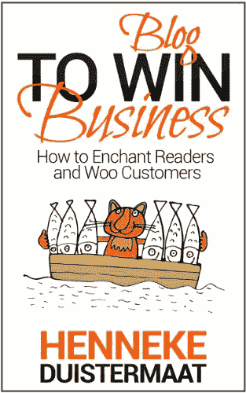
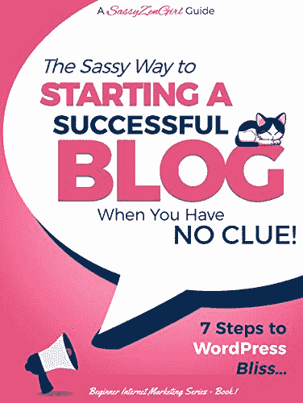
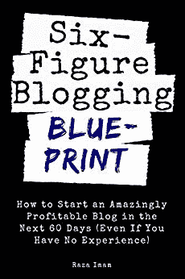

# 如何入门做博主赚钱...捷径

> 原文:[https://dev . to/Hussein _ cheay to/how-to-get-started-as-a-blogger-and-make-money-shortcut-105n](https://dev.to/hussein_cheayto/how-to-get-started-as-a-blogger-and-make-money-shortcut-1o5n)

想尽快成为一个著名的专业博主？然后继续读下去，从我的错误中吸取教训。这会节省你很多时间和金钱。

正如我在我的[上一篇文章](https://dev.to/hussein_cheayto/10-hobbies-you-don-t-know-that-can-make-you-rich-fast-from-home-1hgb)中提到的，这篇文章将教你如何开始写博客。

以及如何从中赚钱。

我会教你如何避免我写第一篇博客以来犯的错误。因此，读完这篇文章后，你将可以立即发表你的第一篇文章。

这也将是一个伟大的时刻！！

如果你真的想写博客，我向你推荐这些畅销书:

a- [博客赢生意:如何迷倒读者，拉拢客户](https://www.amazon.com/gp/product/B00ILE2O4W/ref=as_li_qf_asin_il_tl?ie=UTF8&tag=husseincheayt-20&creative=9325&linkCode=as2&creativeASIN=B00ILE2O4W&linkId=16ff2411888a81438379cb4e8764f777)

b- [【博客】在毫无头绪的时候开始一个成功的博客！(2019):WordPress 幸福的 7 个步骤....(网络营销入门系列丛书 1)](https://www.amazon.com/gp/product/B07JCJC45L/ref=as_li_qf_asin_il_tl?ie=UTF8&tag=husseincheayt-20&creative=9325&linkCode=as2&creativeASIN=B07JCJC45L&linkId=30673b5c38828d47322c190f307eb038)

c- [六位数博客蓝图:如何在未来 60 天内开始一个惊人盈利的博客(即使你没有经验)(数字营销精通书 3)](https://www.amazon.com/gp/product/B07R7Z2H69/ref=as_li_qf_asin_il_tl?ie=UTF8&tag=husseincheayt-20&creative=9325&linkCode=as2&creativeASIN=B07R7Z2H69&linkId=856c7d9f5cf3940abfaa3b11eb9ceff4)

博客到底是什么？

博客是一个平台，一个作家甚至一群作家在这里分享他们对某个特定话题的看法。

博客的目的是什么？

创建个人博客的原因有很多:

1-增加你的知名度。

2-联系相关受众。

提高你的流量，给你的网站发送高质量的信息。

4-展示你的权威，建立品牌。

5-分享你自己的经验来帮助别人。

**那么，我是如何开始写博客的，你也可以这样做**

2019 年 1 月，我决定创建我的博客，并开始分享我的经验和知识。我的目的是帮助至少一个人引导他/她的职业生涯。当我高中毕业的时候，我不知道我应该选择哪个专业。我花了一年时间试图找到我未来 30 到 40 年喜欢做的事情。

长话短说，我是一名电子和电信工程师、游戏开发者、网站开发者和博客作者。点击了解更多

大多数人从头到尾什么都做不了。

大多数人开始做某事；他们对此很兴奋。然后他们再也不会做任何事情。

不要成为那种人。

 **想成为博主，就要投入，要坚持。

你只需要时间。只要你每周发表一到两次内容丰富的文章，你就会成功。跟踪你的进度，找出你的观众喜欢什么。

此外，你可能会说，既然没人看我的文章，我就想停下来。我也经历过这种情况。

**如何？简单的继续写。**

此外，我还读过一些关于如何提供优秀内容的文章。我已经考虑了这些建议。因此，我的博客获得了更多的浏览和积极的评论。这样的评论总是让我有动力去做更多。

如果你不能承诺并开始找借口，停止阅读和浪费时间。关闭标签页，寻找另一个你热爱的爱好。博客不是你的。

如果你还在这里，那么你 100%的投入，准备开始你的博客之旅。恭喜你！！[把你的博客进度和文章发给我](mailto:cheayto.hussein@hotmail.com?Subject=Check%20My%20Blog)。我有兴趣看你的文章，帮助你。

有很多文章可以指导你如何成为一名博客作者，其中他们提到了许多提供免费博客托管的网站。我相信这样的指南会让你感到困惑和不知所措，因为它们推荐了大量的网站。因此，你会在每个网站上创建一个账户，并开始测试每个网站的受众参与度。

这是一条捷径。继续读...

我将分享我的秘密和我写博客的方式。

### **1-在开发商处创建账户**

我已经搜索了免费的网站，在那里我可以托管我的博客。通过经验，我发现 Dev.to 是最好的。我尝试过 Medium，但没有得到 Dev 那么多的观点、喜欢和评论。例如，[这篇文章](https://dev.to/hussein_cheayto/top-5-web-developers-you-should-follow-to-succeed-without-a-degree-25lg)在 Dev 上有超过 28000 的浏览量，而在 Medium 上只有几个浏览量。请注意，我仍在获得对那篇文章的赞和评论。

### **2-语法用法**

[Grammarly](https://grammarly.go2cloud.org/SH20Y) 是一款可以流畅轻松地纠正你语法的 app。它将帮助你写作，绝对没有语法错误。因此，领先一步交付专业内容。

我用的是 [Grammarly premium](https://grammarly.go2cloud.org/SH20Y) ，强烈推荐。

语法上确保你输入的所有内容都是有效的，没有错误的。

从语法上扫描你的文本，找出常见的语法错误(比如误用的逗号)和复杂的错误(比如错放的修饰语)。充满信心地写作，即使是在手机上。

语法不仅仅是一个安全网。你会得到所有错误的详细解释，以帮助你避免将来再犯同样的错误。

这是一个很好的自我投资，每月只需 12 美元。你要花钱才能赚钱。不要想你会付多少钱，而要想你会省多少钱。有了这样的心态，你终将成功。事实上，有了 Grammarly premium，你在学习英语的同时，也节省了雇佣专业作家的时间和金钱。后者，根据他/她的经验，可能每个字要花你几十块钱。

### **3-链接**

这个真的很重要！当我有一些文章达到 1000，5000，10000 或 30000 次浏览时，我后悔没有链接。

链接意味着在你的页面或文章中创建超链接。链接是你的文章链接到与当前主题相关的其他文章的过程，这样读者可以点击并重定向他/她到另一个网站。

首先，你可以链接到另一个博主的文章。一旦你有了一堆相关的帖子，确保至少包括一个链接。这就像建立一个链条。

这是获得更多流量和更多浏览量的重要途径。

### **4-使用谷歌获取灵感**

因为我承诺每周至少发一篇文章，所以我每周至少花 2 到 4 个小时来写。

但是，如果我想不出具体的话题呢？？？？

为了解决这个问题，我使用谷歌和 Youtube 来获取一些内容。这些巨头有一个很棒的建议工具。我过去常常在谷歌上写“如何成为”或“如何做”，会出现一大串建议。我挑了一个，让它更具体。比如查一下这篇文章的标题。

一旦你选择了要写的主题，你就已经完成了一半。

我比较喜欢先写标题，再开始写文章。这可能不是一个完美的方法。

### **5-订阅其他博主的列表**

有很多有才华的博客写手。他们刚刚通过了。

我对编程感兴趣；这就是为什么我会关注那些提供编码技巧和窍门的博客。

此外，您还可以订阅其他列表。这些是我最喜欢的博客作者:
a- [劳伦斯·布拉德福德](https://learntocodewith.me/)

莱拉·布洛克

阿里·斯皮特尔

### **6-追踪发布的最佳时间**

你可能想知道为什么你发表的一些激动人心的文章没有得到很高的浏览量。为什么？时机。

我追踪了发表文章的最佳时机。周日到周三的晚上 10:30 到早上 5:00(黎巴嫩时间+3GMT)。

有时候，我会写完一篇文章，而不是等到那段时间，我会提前发表它。然后，我对低浏览量感到失望😂

保持冷静和耐心。

### **7-创建你的网站**

一旦你写了一堆文章，如果你有一些现金，创建你的博客。怎么会？

我个人使用 [TMDHosting](https://www.tmdhosting.com) 托管我的[作品集](https://www.husseincheayto.com)和[网站](https://www.codinstyle.pro)

我读过很多文章，在这些文章中，人们抱怨糟糕的托管服务。这些网站声称他们有 24/7 的支持，然而，一旦你付钱给他们，他们会在几个小时或一天后提供支持。TMDHosting 就不是这样了

TMDHosting 的支持非常专业，响应速度快，而且很友好。

我完全不知道 Wordpress 是如何工作的。我曾经开过票请求支持的帮助。在我的信息中，我提到我没有经验，我需要具体的帮助。有了这样的支持，从 A-Z 开始创建和管理我的网站就很简单了。TMDHosting 的神奇之处在于，你可以跟踪你的门票状态。放松点，让他们来解决你的问题。

为什么要创建自己的网站？简短的回答:建立一个电子邮件列表

详细回答:电子邮件列表是企业从访问者/客户那里收集的电子邮件列表，这些访问者/客户希望以数字格式接收关于您企业的信息、更新、折扣和其他详细信息，并将其发送到他们的电子邮件收件箱。

电子邮件列表是必不可少的，因为电子邮件营销是联系客户的最佳方式，而不是社交媒体。事实上，通过电子邮件获得更高点击率的可能性是通过推特的 6 倍。此外，在获取新客户方面，电子邮件的效率是脸书或 Twitter 的 40 倍。

为了利用通过你编辑的电子邮件列表与客户联系的优势，你需要建立电子邮件列表。

**如何建立邮件列表？**

如前所述，您希望为访问者提供更多订阅您的电子邮件的机会。有几种方法可以做到这一点，包括:

a-在你网站的每个登录页面上订阅的 CTA 按钮
b-在你的所有登录页面上弹出或滑动的图像
c-在访问者浏览时定时弹出的调查
d-在社交媒体帐户上发布关于你的电子邮件简讯
e-描述访问者订阅你的电子邮件会得到什么(这是我的最爱)你可以查看 [mine](https://www.codinstyle.pro/subscribe-codinstyle) 获得一些想法。

我后悔我没有买这本书:[《WordPress for 初学者 2019:掌握 WordPress 的可视化分步指南》](https://www.amazon.com/gp/product/B0799KGY14/ref=as_li_qf_asin_il_tl?ie=UTF8&tag=husseincheayt-20&creative=9325&linkCode=as2&creativeASIN=B0799KGY14&linkId=be21ed1fa08c9fbefe395e494d418cdd)我 kickstarted 我的网站的时候。我已经失去了大量的金钱，购买无用的模板和软件包。

避免我的错误，开始阅读这本书来节省你的金钱和时间。

### **8-销售产品**

Now that you have your email list, you can get some cash. I recommend two ways, the first is to sell your products, the second is to become an affiliate. It depends on your niche, in my case, I've joined Udemy, Amazon and Grammarly's affiliate programs.
I believe that the first path doesn't need much explanation. You have a product, let's say an online course or ebook, and you send coupons for it to your email list. If you have loyal subscribers, then most of them will buy it. Here, your copywriting skills play the most significant role to close them.

说到代销商产品，就是通过推销别人(或公司)的产品来赚取佣金的过程。你找到一个你喜欢的产品，把它推销给其他人，并从每笔销售中获得一份利润。

### **结论**

This is my story in how I got started as a blogger. It's working for me like a charm. I hope it helps you to learn from my mistakes. Therefore, when you start your journey, you won't start from zero.

总结一下如何开始成为一名专业博主并从中赚钱:
1-在 Dev.to 上创建一个帐户
2-使用语法
3-链接
4-使用谷歌获得灵感
5-订阅其他博主的列表
6-跟踪发布的最佳时间
7-创建你的网站
8-销售产品

### **离别的思念...**

如果你刚刚开始或者想谈论成为一名博客作者或程序员，请给我发一封电子邮件。我很乐意与更多的博客和程序员联系！

迫不及待想看其他人的帖子！**