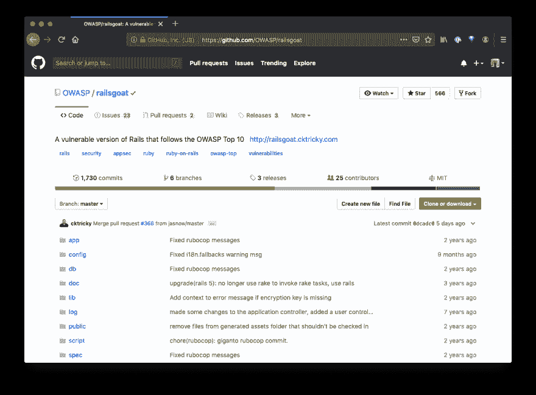

# OWASP 利用漏洞攻击 Rails

> 原文:[https://dev.to/dukaev/hack-rails-app-13i4](https://dev.to/dukaev/hack-rails-app-13i4)

[T2】](https://res.cloudinary.com/practicaldev/image/fetch/s--aObGF_DY--/c_limit%2Cf_auto%2Cfl_progressive%2Cq_auto%2Cw_880/https://thepracticaldev.s3.amazonaws.com/i/1o2y3c6dop0e64k3hgpl.png)

我发现 [rails 应用](https://github.com/OWASP/railsgoat)包含
XSS、CSRF、SQL 注入漏洞

## Docker 入门

```
git clone https://github.com/OWASP/railsgoat
cd railsgoat

docker-compose build
docker-compose run web rails db:setup
docker-compose up 
```

打开[本地主机:3000](http://localhost:3000)

分析源代码，尝试寻找漏洞。使用[维基](https://github.com/OWASP/railsgoat/wiki)和[布雷克曼](https://github.com/presidentbeef/brakeman)获得提示

黑客快乐！

在 [GitHub](https://github.com/dukaev) 上关注我