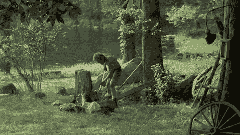
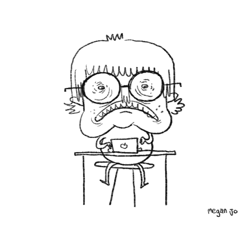
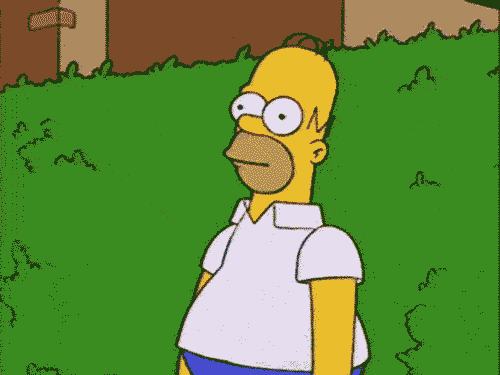
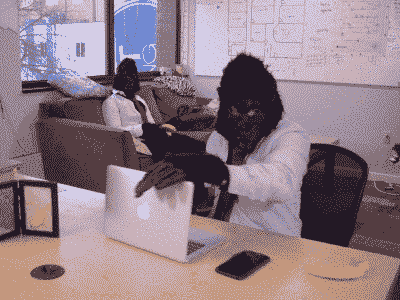
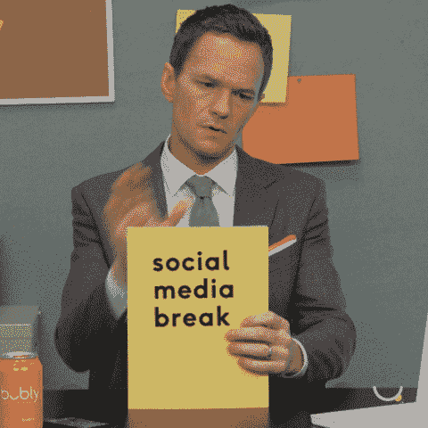
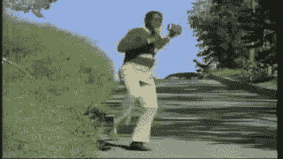

# 保持你的斧头锋利

> 原文:[https://dev.to/ahrke/keep-your-axe-sharp-3p0f](https://dev.to/ahrke/keep-your-axe-sharp-3p0f)

# 作为开发人员，休息的重要性(保持你的斧子锋利)

## 简介

从前，两个伐木工人之间有一场激烈的竞争。为了解决这一宿怨，一场比赛被提出来，以确定更好的木材切碎机。给他们 24 小时的时间，这两名木材技师将尽可能多地砍伐原木。他们将根据排骨的质量、浪费和数量进行评分。

到了中午，两个人在圆木上相当平等。一个伐木工人，让我们称他们为山姆，决定停下来，并前往他们的帐篷。

“啊哈！我的对手是一个懒惰的伐木工！我将毫无疑问地战胜这样一个意志薄弱的人。另一个伐木工人想，我要砍一整天，而且一定会赢，我们就把它们命名为拉普。于是拉普继续努力工作，不停地砍。

[T2】](https://res.cloudinary.com/practicaldev/image/fetch/s--Hg7ewKge--/c_limit%2Cf_auto%2Cfl_progressive%2Cq_66%2Cw_880/https://media3.giphy.com/media/xT9KVonN0PEqGHXpqU/giphy.gif%3Fcid%3D790b7611c38fbdd9dfd2a6af846ef125b334ecf95a76c80b%26rid%3Dgiphy.gif)

随着时间的推移，山姆开始超越单圈。萨姆的圆木数量开始超过拉普。然而，萨姆已经去第二次休息了。在这场激烈的比赛中，萨姆已经离开了两次，而拉普仍然在不知疲倦地工作，对胜利充满信心。

最后，萨姆的原木数量至少是拉普的两倍。

“这怎么可能呢？!"拉普汗流浃背地叫道，并感到沮丧。"当我不知疲倦地工作时，你这个懒惰的伐木工人走开了，休息一会儿去吃午饭或做其他事情"。山姆是如何在单圈比赛中胜出的？

萨姆回答说:“我去磨我的剑了。享用了一顿丰盛的午餐

很明显，谁的日志是干净的，一致的，和丰富的。最终，即使 Lap 连续努力，没有中断，Lap 的原木质量也不一致，只有 Sam 能够生产的一半。

这个故事的寓意是什么？保持你的斧头锋利。

## 问题

软件工程师的生活包括长时间的测试、调试、计划、制定战略、构建、解决问题、技术交换、重构...这样的例子不胜枚举。作为一名开发人员意味着每天 12 小时不间断的“高效”工作，这已经成为一种刻板印象。有无数关于筋疲力尽的人离开这个领域的故事。

问题不在于时间本身，而在于这些时间是如何度过的。别误会，12 小时太长了。我们人类需要一些可变性来保持我们的理智。然而，有时我们无法逃避在实验室呆上 12 个小时的需要。关键是要注意这些时间是如何度过的。它可以决定一个高质量的产品和一个满是 bug 的烂摊子。

[T2】](https://res.cloudinary.com/practicaldev/image/fetch/s--XGqXWWVS--/c_limit%2Cf_auto%2Cfl_progressive%2Cq_66%2Cw_880/https://media0.giphy.com/media/3ohzdZOLUGUsjws0OA/giphy.gif%3Fcid%3D790b7611ab64ffc0bd13fc2c4f6870568d06eb46dcb60f47%26rid%3Dgiphy.gif)

#### 表现质量下降

作为人类，我们总是把注意力放在某些事情上。在给定的时刻某样东西是什么并不总是清楚的。除非你已经发展了正念。问题是我们的注意力相对容易转移。它可以从为这个`class`形成与它的外部环境交互的接口转移到‘瑞克是如何形成将自己变成泡菜瑞克的技术的？’。然后它可能会想到坐在角落里的小可爱。等等，不，我的接口！。

最近的研究认为，我们的注意力并不是“警惕性下降”的受害者，而是因为“刺激盲”。我这么说是什么意思？亚历杭德罗·列拉斯说，“如果刺激随着时间的推移保持不变，大脑会逐渐停止记录视觉、声音或感觉”。随着时间的推移，专注于某种兴奋剂会降低它对我们的影响。这种现象类似于长时间盯着一棵树，最终这棵树将不复存在，尽管它就在你的眼前。

[T2】](https://res.cloudinary.com/practicaldev/image/fetch/s--4Sh5OOGn--/c_limit%2Cf_auto%2Cfl_progressive%2Cq_66%2Cw_880/https://media3.giphy.com/media/jUwpNzg9IcyrK/giphy.gif%3Fcid%3D790b76117f5cb99073d4aef5fe9d25ef775a0af97acbf066%26rid%3Dgiphy.gif)

这可以解释为什么性能会随着时间的推移而下降。长时间专注于一个问题，我们的大脑最终会对重要的部分视而不见。我们欺骗自己认为我们需要更加努力地工作，更加警惕，然而，这种信念的谬误在于我们的身体并不是那样工作的。提高效率和生产力变得越来越具有挑战性。我们的大脑已经到了精疲力竭的地步。

再打个比方，我们的注意力就像一块肌肉。当你锻炼的时候，你会用最大重量做 36 次卧推，然后是 36 次深蹲，然后是下一次，再下一次...？不，在继续下一组之前，你需要休息，让你的肌肉得到休息。这就是你如何在健身房里最大化你的潜在收益。激烈，紧张的行动，然后休息一段时间，然后回到激烈的斗争，等等。你的身体需要时间让氧气进入它的血细胞，否则它会耗尽“空气”，导致过度疲劳和盘子落到你的头上。你的注意力也是如此。它需要时间来放松，喘口气，让工作酝酿一段时间。

在一项[研究](https://www.sciencedaily.com/releases/2011/02/110208131529.htm)中，84 名参与者被分成 4 组，并执行一项 50 分钟的计算机化任务。最后的发现是，没有休息的那组表现很差，而有休息的那组(总共两次)在 50 分钟的间隔内表现一致。这一发现证明了休息对生产力的影响。

## 解

#### 休息一下！

就生产力而言，休息有多重要，这一点现在应该相对清楚了。我们生活在一个“忙碌”是骄傲的标志的世界里。问题是，忙碌并不意味着高效。它只是在紧张的状态下，用你可能感兴趣也可能不感兴趣的任务来占据时间。生产力是有效和高效花费的时间。这意味着人们在“忙得没时间做任何事”时，通常会感到不知所措，这种压力会减少。

[T2】](https://i.giphy.com/media/8YBm95B5JNIXTWp5on/giphy.gif)

有几种不同类型的休息，并且有太多的方式来度过你的休息时间。有不好的方式度过你的休息时间，也有很好的方式。常见的休息类型有长休息和短休息。Long 由几天、几周或一个月组成。当你已经在一个项目上工作了几个星期或几个月时，这些是很有用的。然而，我们都应该在日常生活中采纳的重要的一点是短暂的休息。

#### 与爱因斯坦的短暂散步

短暂的休息包括 5-15 分钟的放松。一些专业人士将此作为反思和回顾的时机。我们稍后会谈到这一点。这些短暂的休息应该由一些活动组成，这些活动将你从过去的世界中抽离出来。

作为软件工程师，我们每天大部分时间都在电脑屏幕前度过。它发出的光会使我们的眼睛疲劳，长时间地对某些神经造成压力。屏幕也是我们集体睡眠模式最近被打乱的一个重要原因。然而，这是另一篇文章的主题。在我们休息的时候，如果可能的话，我们应该努力离开我们的区域和环境。花时间看一些不是屏幕的东西，和一个复杂的有机体互动。就我个人而言，我喜欢去公园散步，在那里我可以敬畏地看着高大的树木。你可以去饮水机旁和同事交流，闭上眼睛在某个地方听音乐，冥想，给朋友打电话，等等。

无论你做什么，试着远离社交媒体。这不是一个突破。它甚至可能是一个更大的压力源。研究发现，使用社交媒体的人比不使用社交媒体的人压力更大。原因在于社会压力和自我产生的不安全感。尽管这个问题涉及大量心理学知识，我们不会在这里深究。重点是，避免社交媒体，转而与自然、身边真实的人或者一个非虚拟的爱好互动。

[T2】](https://res.cloudinary.com/practicaldev/image/fetch/s--f3fczh_p--/c_limit%2Cf_auto%2Cfl_progressive%2Cq_66%2Cw_880/https://media3.giphy.com/media/ZvxQnleiL7eKTKpkEt/giphy.gif%3Fcid%3D790b76118d480746dcd2c340ccf293fe5e9bdfa2350245ca%26rid%3Dgiphy.gif)

#### 建议短暂休息

##### 沉思

冥想带来很多好处。不管是 5 分钟还是 30 分钟，你都可以帮助自己重新集中注意力，清除精神毒素。这是一种练习，你花越多的时间练习，就会产生越大的好处。如果可能的话，让这成为每天的练习。每天 10 分钟会让你的生活充满奇迹。

##### 运动

锻炼是另一项非常有益的活动。显而易见的好处是对你的身体有益。然而，运动对大脑的好处却鲜为人知。锻炼有一种内在的能力，可以减少焦虑，增强冷静、清晰、有逻辑的思维。Holly Phillips 博士声称“即使在运动后 24 小时，你也不容易出现焦虑症状。每周四次、每次 30 分钟的锻炼足以显著减轻大多数人的压力。”

##### 保送

虽然这可能与锻炼有相似的好处，但我觉得它值得一提。我们这个时代最伟大的人物之一，爱因斯坦，将他的成功归功于走路。无论是在普林斯顿大学还是在米兰，爱因斯坦每天都会散步。在许多这样的散步中会有启示。我相信这要归功于[集中和分散思维](https://www.brainscape.com/blog/2016/08/better-learning-focused-vs-diffuse-thinking/)的结合。达尔文每天散步三次，每次 45 分钟。现在你不需要走这么远的路，但是 5-10 分钟的户外散步可能会让你精神焕发，甚至可能帮你找到解决办法。

[T2】](https://res.cloudinary.com/practicaldev/image/fetch/s--ISeraW71--/c_limit%2Cf_auto%2Cfl_progressive%2Cq_66%2Cw_880/https://media2.giphy.com/media/rDDv72OIYB39K/giphy.gif%3Fcid%3D790b76119d90b77f97dee6b22419dcb8de26028c856aa7a0%26rid%3Dgiphy.gif)

##### 番茄工作法

这种流行的技术在《专业人员手册》中占有重要地位。要点是，你有两个计时器，一个用来记录专注工作的时间，另一个用来记录完全逃避工作的时间。最受欢迎的比例是 25/5，这意味着 25 分钟的专注工作——意味着排除所有干扰——然后休息 5 分钟。另一个流行的方法是五五分成。一些专业人士可能会增加 5 分钟的回顾和思考时间来回顾他们在休息前一直在做的事情。

## 总结

我们的生产力会随着时间的推移而下降。随着时间的推移，我们的工作质量会下降。压力因过度工作而增加。休息可以缓解这些症状。我们的头脑需要时间来呼吸和休息，没有时间，它会感到紧张和窒息，增加出错的可能性。散步，谈话，举拉，无论是什么，只要确保它远离你的屏幕。关键的东西拿走，保持你的斧头锋利！

[T2】](https://res.cloudinary.com/practicaldev/image/fetch/s--JLoGte4a--/c_limit%2Cf_auto%2Cfl_progressive%2Cq_66%2Cw_880/https://media1.giphy.com/media/3o8doOlGO3pjQa5h28/giphy.gif%3Fcid%3D790b7611eab250ee3c46ddc04c5c5a2f1da6a4328ccad520%26rid%3Dgiphy.gif)

##### 资源

[多休息会如何提高你的生产力-简单程序员](https://simpleprogrammer.com/taking-breaks-will-boost-productivity/)
[BBC -未来-你能从爱因斯坦古怪的习惯中学到什么](http://www.bbc.com/future/story/20170612-what-you-can-learn-from-einsteins-quirky-habits)
[如何在编码时休息-开发社区👩‍💻👨‍💻](https://dev.to/karan/how-to-take-breaks-while-coding-2ccp)
[休息的科学| OnlineSchools.org](https://www.onlineschools.org/science-of-study-breaks/)
[短暂的休息极大地提高了注意力，研究人员发现-科学日报](https://www.sciencedaily.com/releases/2011/02/110208131529.htm)
[工作休息如何帮助你的大脑？5 个令人惊讶的答案|今日加拿大心理学](https://www.psychologytoday.com/ca/blog/changepower/201704/how-do-work-breaks-help-your-brain-5-surprising-answers)
图片来源:[杰森·阿卜迪拉](https://unsplash.com/@jabdilla_creative)在 Unsplash 上