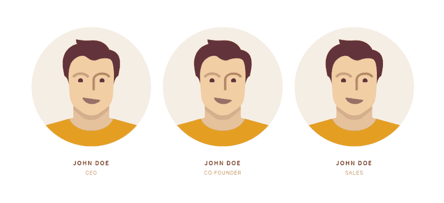

# 如何编写高效的代码

> 原文：<https://dev.to/masihtak/how-to-write-efficient-code-5h95>

本文来自全栈开发人员和校友的研究和经验 [Masih Abjadi](https://twitter.com/masihtak)
虽然本文主要关注 web 技术，但是相同的概念可以应用于任何编程语言。

## 干

[](https://res.cloudinary.com/practicaldev/image/fetch/s--vlLXeWhb--/c_limit%2Cf_auto%2Cfl_progressive%2Cq_auto%2Cw_880/https://images.unsplash.com/photo-1480506132288-68f7705954bd%3Fixlib%3Drb-1.2.1%26ixid%3DeyJhcHBfaWQiOjEyMDd9%26auto%3Dformat%26fit%3Dcrop%26w%3D1393%26q%3D80) 
(图片鸣谢:Anas Alshanti)

根据维基百科，不要重复你自己(DRY)，是软件开发的一个原则，旨在通过用抽象代替或使用数据规范化来避免冗余，从而减少软件模式的重复。

经常在 web 开发中，我看到很多开发者重复自己，最常见的是在使用 Bootstrap、Foundation 等 UI 库的时候。在这种情况下，开发人员最终会使用完整的库(而不是定制版本)，而不是他们需要的选定部分。例如，不幸的是，许多开发人员只会使用网格系统或该库的某些组件，当他们开始定制 UI 时，他们开始编写自己的样式表，而他们中的许多已经存在了！他们所做的就是复制代码，增加文件大小和加载时间。

让我们看一个将`div`元素水平和垂直居中的例子。

`index.html` :

```
<!DOCTYPE html>
<html lang="en">
  <head>
    <meta charset="utf-8" />
    <meta name="viewport" content="width=device-width, initial-scale=1" />
    <title>Center the div</title>
    <!-- Styles -->
    <link
      href="https://cdnjs.cloudflare.com/ajax/libs/twitter-bootstrap/4.2.1/css/bootstrap.min.css"
      rel="stylesheet"
    />
    <link href="style.css" rel="stylesheet" />
  </head>
  <body>
    <div class="container">
      <div class="row">
        <div class="card">
          <h5 class="card-header">Featured</h5>
          <div class="card-body">
            <h5 class="card-title">Special title treatment</h5>
            <p class="card-text">
              With supporting text below as a natural lead-in to additional
              content.
            </p>
            <a href="#" class="btn btn-primary">Go somewhere</a>
          </div>
        </div>
      </div>
    </div>
  </body>
</html> 
```

`style.css` :

```
html,
body {
  height: 100%;
}

.card {
  width: 400px;
} 
```

这些是初始设置文件。

现在我们想要将`div`元素居中，有很多方法可以实现。你可能已经注意到我们正在使用 Bootstrap 4 库，这意味着我们可以使用一个实用程序类来完成这项工作:

```
<!DOCTYPE html>
<html lang="en">
  <head>
    <meta charset="utf-8" />
    <meta name="viewport" content="width=device-width, initial-scale=1" />
    <title>Center the div</title>
    <!-- Styles -->
    <link
      href="https://cdnjs.cloudflare.com/ajax/libs/twitter-bootstrap/4.2.1/css/bootstrap.min.css"
      rel="stylesheet"
    />
    <link href="style.css" rel="stylesheet" />
  </head>
  <body>
    <div class="container h-100">
      <div class="row h-100 justify-content-center align-items-center">
        <div class="col-md-6">
          <div class="card">
            <h5 class="card-header">Featured</h5>
            <div class="card-body">
              <h5 class="card-title">Special title treatment</h5>
              <p class="card-text">
                With supporting text below as a natural lead-in to additional
                content.
              </p>
              <a href="#" class="btn btn-primary">Go somewhere</a>
            </div>
          </div>
        </div>
      </div>
    </div>
  </body>
</html> 
```

上面的例子显示了这有多简单，我们需要做的就是利用一些内置的实用程序类。

开发人员在使用 UI 框架时犯的主要错误是没有使用所有的功能，这是 Bootstrap 4 的一个被低估的功能的例子。通过使用实用程序类，我们不必编写自己的 CSS，减少了应用程序所需的代码。

### 优点干

**可维护性:**
使用 DRY 最大的好处就是可维护性。如果检查权限的逻辑在整个代码库中重复，那么修复重复代码中出现的问题就变得很困难。

**可读性:**
通常情况下，干代码更具可读性。这不是因为 DRY 原则本身，而是因为开发人员在代码中投入了额外的努力来实现它。

**重用:**
DRY 本质上促进了代码的重用，因为我们将两个或更多重复代码的实例合并到一个块中。可重用代码从长远来看是有回报的，因为它加快了开发时间。

**成本:**
如果需要说服管理层在提高代码质量上花更多的时间，这就是了。代码越多成本越高。更多的代码需要更多的人花更多的时间来维护和解决 bug。更多的开发时间和更多的错误导致客户非常不高兴。说够了！

**测试:**
我们这里说的是单元测试和集成测试，不是手工测试。使用测试需要覆盖的路径和函数越多，需要为测试编写的代码就越多。如果代码没有重复，你只需要测试一个主路径。当然，不同的行为还是需要测试的。

你的代码是干的还是湿的？- DZone DevOps

* * *

## 编写语义代码

谈到 HTML 中的语义代码，许多开发人员认为这仅仅意味着使用 HTML5 语义元素(标题、导航、部分、文章、旁白、页脚)而不是`div`元素，但事实并非如此！语义代码意味着编写描述内容的代码，而不是描述内容应该是什么样子。

[](https://res.cloudinary.com/practicaldev/image/fetch/s--T5FQsojH--/c_limit%2Cf_auto%2Cfl_progressive%2Cq_auto%2Cw_880/https://i.postimg.cc/3RkRFwq4/team.png) 
我从一个真实的网站上得到这张图片，但出于隐私原因，我更改了名字和图片。
各队代码为:

```
<div class="col-md-4 bottommargin">
  <div class="team">
    <div class="team-image">
      
      <div class="team-overlay">
        ..........
      </div>
    </div>
    <div class="team-desc team-desc-bg">
      <div class="team-title">
        <h4>JOHN DOE</h4>
        <span>Co-Founder</span>
      </div>
    </div>
  </div>
</div> 
```

很多`div`吧？

我们可以通过使用[图形标签](http://www.w3schools.com/tags/tag_figure.asp)达到同样的结果，为了更好地理解这个概念，我将向你展示我的一个项目:
[](https://res.cloudinary.com/practicaldev/image/fetch/s--iTwgo4XO--/c_limit%2Cf_auto%2Cfl_progressive%2Cq_auto%2Cw_880/https://i.postimg.cc/KjtX7xNY/Annotation-2019-04-16-053851.png) 

```
<div class="col-sm-4">
  <figure class="event">
    
    <figcaption>
      <time datetime="2017-11-12">12 November 2017</time>
      <p class="lead">Moscow Never Slip Party</p>
      <a href="#">Read more</a>
    </figcaption>
  </figure>
</div> 
```

在这个例子中，我使用了语义代码，它非常简洁，只看标记就很容易理解。

### 为什么语义代码很重要

**可访问性:**

*   许多视障人士依赖文本到语音浏览器来为他们朗读页面。这些程序不能很好地解释页面，除非用语义标记清楚地解释它们。

**SEO:**

*   搜索引擎需要理解你的内容是关于什么的，以便在搜索引擎上对你进行适当的排名。语义代码有助于提高你在搜索引擎上的排名，因为“搜索引擎蜘蛛”更容易理解。

**可维护性:**

*   语义代码使站点更新更容易，因为你可以在整个站点的标题上应用设计风格，而不是在每个页面上。

**团队合作:**

*   语义代码更有表现力，也更容易被人们理解，所以如果一个新的网页设计师学会了这些代码，他们就能更快地理解。

**设计:**

*   因为语义代码不包含设计元素，所以不用重新编码所有的 HTML 就可以改变站点的外观和感觉。
*   再说一次，因为设计与内容是分开的，语义代码允许任何人添加或编辑页面，而不需要对设计有很好的眼光。您只需描述内容，级联样式表定义内容的外观。

“任何傻瓜都能写出计算机能理解的代码。优秀的程序员编写人类能够理解的代码”——马丁·福勒

* * *

## 可达性

[](https://res.cloudinary.com/practicaldev/image/fetch/s--0CTn_PBA--/c_limit%2Cf_auto%2Cfl_progressive%2Cq_auto%2Cw_880/https://www.newtarget.com/sites/default/files/styles/hero-image/public/webaccessibility2.jpg%3Fitok%3DRKiSkBoW) 
(图片鸣谢:“newtarget”)

“网络的力量在于它的普遍性。无论是否残疾，每个人都能获得是一个重要方面。”万维网的发明者、W3C 主管蒂姆·伯纳斯·李

可访问性本身是一个很大的话题，我不打算一一介绍。

即使你的网站编码和设计都很好，你的目标用户仍然是有限的。

有多少残疾网络用户？

对于希望创建高质量网站和 web 工具的开发人员和组织来说，可访问性是必不可少的，并且不排除人们使用他们的产品和服务。

网络基本上是为所有人而设计的，不管他们的硬件、软件、语言、位置或能力如何。当网络满足这一目标时，具有不同听觉、运动、视觉和认知能力的人都可以访问它。

不幸的是，当我们谈论无障碍时，我们会想到残疾人，但这并不完全是这个意思！例如，颜色组合选择在大屏幕上和室内可能很好，但在较小的屏幕上或在阳光耀眼的室外，或者在白天和晚上的颜色对比中就很难看到。

在这里，我只是指出了可访问性的一小部分，我强烈建议您使用下面的链接，并获得更多关于这方面的信息。

[网页内容无障碍指南(WCAG)2.0](https://www.w3.org/TR/WCAG20/)
T3】https://developers . Google . com/Web/fundamentals/Accessibility/
[网页无障碍介绍|网页无障碍倡议(WAI) | W3C](https://www.w3.org/WAI/fundamentals/accessibility-intro/)

## 结论

“你越早开始编码，程序运行的时间就越长”——罗伊·卡尔森
“知道如何编码和理解它之间有很大的区别！”-马西·阿布贾迪

在编写代码之前，总是试着想一想，我不是说在你开始编码之前做一个设计或线框，我的意思是当你准备好编码阶段的时候，花一些时间想想你想要构建的元素。

如果你想使用一个框架，确保你花一点时间阅读文档，然后看看你是否能使用语义代码或关于可访问性的更好的方式来构建该元素，即使它是一个简单的项目，也要养成编写高效代码的习惯！