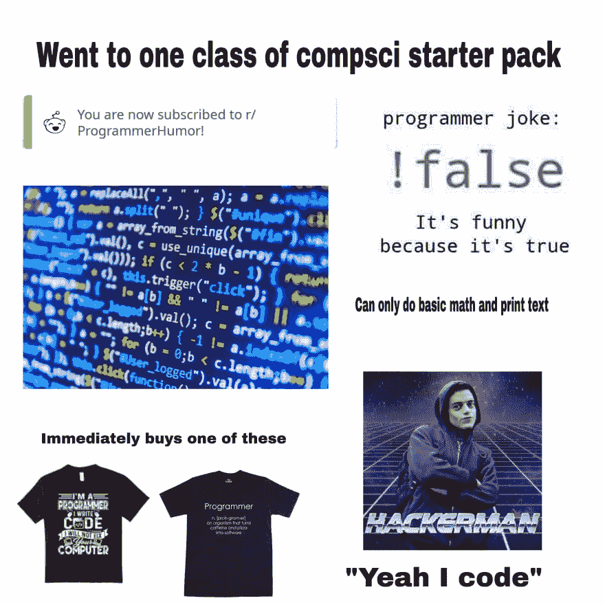

# 作为程序员的第一年的建议

> [https://dev . to/rolandesc/早期提示-作为程序员-2-67](https://dev.to/rolandoesc/consejos-para-tus-primeros-anos-como-programador-2a67)

编程是我们都听过的东西，我们相信它是给那些有天赋的人的，他们做的事情我们永远做不到。但是，我想通过我的经验来分享，作为一个例子，你也可以成为其中的一个，而且实际上，任何人都可以编程。

*注:很可能在过程中服用了很多咖啡因，事先很抱歉。*

在开始之前，我想让你多了解我一点。我是委内瑞拉人，两年来作为前端开发者编程，我在我国研究了一个与技术有关的职业，事实是 Java 和 C++使我相信这是行不通的。我在国外生活了几年，在哥伦比亚担任英语教师，在墨西哥担任客户服务成员，两者都工作了一年，生活促使我再次尝试编程，这次是在网络开发中，现在成功了。尽管如此，我想分享过去几年的经验:

#### 1。你开始编程的方式

目前，有多种方式进入编程领域，几年前，编程是为少数人设计的，这些人认识编程领域的人，他们正在把书交给他们学习，或者他们已经进入了一个由力量最终编程的职业领域。由此产生了这样的想法，即程序员是一个具有某些特性的人，只有少数人能够达到这些特性，离现实只有一步之遥。

[T2】](https://res.cloudinary.com/practicaldev/image/fetch/s--e9IAAQh4--/c_limit%2Cf_auto%2Cfl_progressive%2Cq_auto%2Cw_880/https://i.pinimg.com/originals/38/f3/fd/38f3fd3bb6368e63185601a1166dcd82.jpg)

今天你可以参加 bootcamps，在那里你将在几周内掌握基本的编程知识，并创建你的作者的项目。也有像[【freecode camp】](https://www.freecodecamp.org)这样节奏比较慢的人参加的课程，可以按照自己的节奏去看活动。其他网上课程如、[【udemi】](https://www.udemy.com)，大学也是一个很好的起点，就像在 YouTube 上看书或观看视频教程一样，或者像这样的代码学校，但所有这些都到达了一个结论

之后你已经开始进入这个世界(∞了！)，我将重点讲述 web 开发。你可能认为一个人既做了看不见的动作部分(称为后端开发者)，又做了视觉部分(或称为前端开发者)，这并不是完全错误的想法，因为这些程序员被称为完整堆栈开发者。与我们在 web 开发中的所有人一样，他们从两个分支中的一个开始，然后专业化，迁移到另一个分支以完成周期。我亲自挑选了前线，非常喜欢，希望能成为专家，然后更深入地了解后方的一面。

[我跟你分享这个链接，在那里你可以看到最深入的路线](https://www.freecodecamp.org/news/2019-web-developer-roadmap/)，试试你最舒服的开始和享受哪一条。

#### 2。编程堆栈

堆栈是一组常用且“简单”*的工具、语言和技术，在 web 开发世界中，我们可以听到 MEAN (MongoDB，Express，Angular，Node)、Merr(mong odb，Express，React，Node)。这些堆栈有一些共同点，它们使用 Javascript 作为基础，但您也可以将前端(可视部分)与 Php、Ruby、Python、Java 等工具结合起来。自信地尝试一下，如果不了解第一个就不要担心，一开始就很难。
**编程人员之间可能会有不同的困难，你不觉得你应该先了解一下。*

#### 3。复制粘贴前读取

[【stack overflow】](https://www.stackoverflow.com)是任何程序员的圣人和信号，不管积累了多少年，程序员从来都不知道所有的事情，更不用说所有的时间，所以求助于这种强大的工具来解决当前的问题是很正常的。但是，重要的是要读一读那个人遇到了什么问题，以便知道情况是相似还是变化。除了阅读结果及其解释以了解代码的原因、如何执行以及为什么执行。复制待复制的代码可以解决问题，但分析问题和答案将使您更好地了解它所解决的问题，并使您能够更好地解决冲突。

#### 4。一次成功

不是所有编程都是粉红色的，事实上几乎从来都不是，所以你经常想放弃，把它搁置一边，怀疑自己是否真的走上了正确的道路。我们每个人都有这种情况，这是非常正常的，还有一种叫做"骗子综合症" * "的东西，我们认为我们在那里说谎，说我们知道在"事实并非如此，我撒谎"的时候做些什么，这就是"复原力"一词的作用所在。

复原力是克服逆境，尽管你遇到了种种困难，但认识到我们面临的大多数问题都是暂时的，有解决这些问题的办法。几个月前，我的老板对我进行了评估，告诉我他有几个机会领域，在这些领域里他没有我想象的那么明确的发展逻辑。当他告诉我所有这些时，我对自己感到失望，怀疑自己能否成长为一名程序员。我请我的老板就这些可能增长的问题向我提出建议，试图接受它不会像我想象的那样糟糕。几个月过去了，我改进了我在算法、函数命名和编写干净代码(甚至不重复)方面的逻辑。

这可能是相反的，我没有寻求他的帮助，我肯定会离开公司到那时，但我知道这是一个阶段，我们很可能在我们的职业生涯中发生几次。

[我跟你分享这篇关于冒名顶替综合症的文章](https://www.muyinteresante.es/salud/preguntas-respuestas/que-es-el-sindrome-del-impostor-481477651136)

#### 5。试着多了解一下这个发展中的世界

我认为在你早年寻找一个能帮助你了解该地区基本情况的人，可能是一个编程的朋友、导师、社区等，这是至关重要的。我可以证明，有一些人和地方愿意让你的早年尽可能有所收获。

回到一个更私人的案例，我有一些朋友，他们从小就开始编程，而且我在客户服务工作时还和各种 web 开发人员交了朋友。反过来，我不时地试图与墨西哥的 JavaScript 社区、[【event loopjs】](https://twitter.com/eventloopmx)和开发爱好者接触，就像委内瑞拉的自由代码营一样，后者是用电报以数字方式进行的。

我并不一定每天都积极参与其中，但在那里，我可以更多地了解他人的经验，分享我的经验，并学习新技术和新趋势，以免迷失方向。我强烈建议你。

为了结束这份简短的出版物，我想说，在开始编程时还有很多东西要学。但是，我认为，这五项建议对于良好的开端具有一定的相关性。并不是每个人都以同样的速度前进，好吧，不要因为想以不适合自己的学习速度而挣扎，最终你会达到自己的目的和目标。

感谢你抽空读给我听，如果你想向我提建议，请写信给我。[你可以请我喝杯咖啡！](https://www.buymeacoffee.com/rolandoesc)