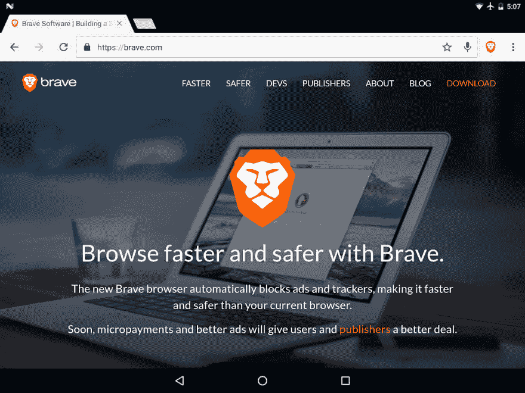

# 使用 Python 获取 BAT 价格

> 原文:[https://dev.to/codesharedot/get-bat-price-with-python-4622](https://dev.to/codesharedot/get-bat-price-with-python-4622)

BAT(基本注意力令牌)是建立在以太坊平台上的去中心化广告交换平台。

令牌旨在对平台内的用户注意力进行正确定价。广告商为了吸引用户的注意力，向网站出版商支付 BAT。

BAT 生态系统包括 Brave，这是一个开源的、以隐私为中心的浏览器，旨在阻止追踪器和恶意软件。它利用区块链技术来匿名和安全地跟踪用户的注意力，并相应地奖励发布者。

## [](#earning-bat)赚蝙蝠

这个时间点只能收 BAT，似乎没有办法提现到其他加密货币。但是你可以收集蝙蝠，等待将来收回支持。

编辑:你现在可以收集球棒代币，[收回球棒](https://old.reddit.com/r/BATProject/comments/chbr90/brave_browser_added_ability_to_withdraw_bat/)

[T2】](https://res.cloudinary.com/practicaldev/image/fetch/s--CM3zNEuU--/c_limit%2Cf_auto%2Cfl_progressive%2Cq_auto%2Cw_880/https://proxy.duckduckgo.com/iu/%3Fu%3Dhttps%253A%252F%252Flh3.googleusercontent.com%252FRCxdR3ZH7vEcys_jWSVjXHM_78Bi5q0p95F4Ev0pYtOw9wT11ofMVGvTeITuMImKbgU%253Dh900%26f%3D1%26nofb%3D1)

## [](#exchange)交换

英美烟草可以兑换成其他加密货币，或者你可以兑换成另一种加密货币，然后再兑换成法定货币。

可以用 Python 获取 BAT 的当前价格:

```
#!/usr/bin/python3
import requests
import json
from forex_python.converter import CurrencyRates
import os

c = CurrencyRates()
rate = c.get_rate('USD', 'EUR') 
print(rate)

basic_attention_token_api_url = 'https://api.coinmarketcap.com/v1/ticker/basic-attention-token/'
response = requests.get(basic_attention_token_api_url)
response_json = response.json()
print(response_json)

for coin in response.json():
    price = coin.get("price_usd", "U$S Price not provided")
    coin_price = float(("{0:.2f}").format(float(price)))
    print("$ " + str(coin_price))
    coin_price_eur = float(("{0:.2f}").format(float(price)*rate))   
    print("E " + str(coin_price_eur)) 
```

ref:[https://github . com/codesharedot/basic-attention-token-price/](https://github.com/codesharedot/basic-attention-token-price/)

阅读更多信息:

*   [基本注意力令牌](https://basicattentiontoken.org/)
*   [勇敢的浏览器](https://brave.com/)
*   [学习 Python](https://pythonbasics.org)