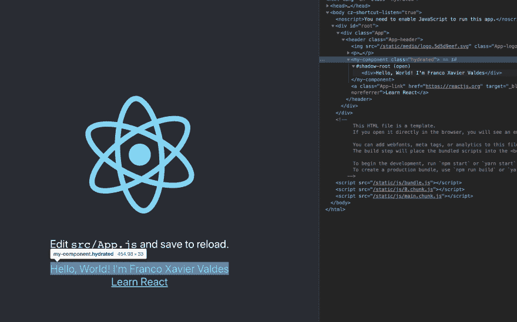

# 用模板和反应创建设计系统

> 原文:[https://dev . to/fvaldes 33/creating-a-design-system-with-stencil-and-react-2 nmj](https://dev.to/fvaldes33/creating-a-design-system-with-stencil-and-react-2nmj)

首先，我想说这不是一个“为什么你需要一个设计系统”的帖子。有足够多的人在谈论为什么设计系统很重要，有什么好处，为什么你需要实现它们。这篇文章是关于如何，更具体地说，我如何在我的公司尝试它。

* * *

## [](#dont-want-to-read-this-and-just-get-the-code)不想看这个就去取代码？

没关系，我有时也这样做。查看这篇博文的回购[点击这里](https://github.com/fvaldes33/devto-design-system-blog)。

* * *

## [](#tools-and-libraries)工具和库

在进入代码之前，我想回顾一下我使用的工具和库。

> 模板
> 模板是一个工具链，用于构建可重用、可扩展的设计系统。生成运行在每个浏览器上的小型、超快的、100%基于标准的 Web 组件。
> 
> 一个用于构建用户界面的 JavaScript 库。
> 
> TypeScript——可伸缩的 JavaScript。
> TypeScript 是编译成普通 JavaScript 的 JavaScript 的类型化超集。任何浏览器。任何主机。任何操作系统。开源。
> 
> Storybook 是一款开源工具，用于开发独立于 React、Vue 和 Angular 的 UI 组件。它使构建令人惊叹的 ui 变得有条理和高效。
> 
> ***我会在第二部讲讲故事书***

我真的相信 web 组件是未来的发展方向，并且喜欢 Ionic 的团队所做的工作。他们是 stencil 和混合 ionic 框架背后的团队，你可以用它们来构建令人敬畏的网络和混合移动应用。

## [](#getting-started)入门

所有这些都解决了，让我们开始吧。在您的终端中创建一个新目录，命名为您希望组件系统被称为的任何名称。张贴在这里，所以我将使用 devto 作为我的示例组件库。

```
mkdir devto 
```

<svg width="20px" height="20px" viewBox="0 0 24 24" class="highlight-action crayons-icon highlight-action--fullscreen-on"><title>Enter fullscreen mode</title></svg> <svg width="20px" height="20px" viewBox="0 0 24 24" class="highlight-action crayons-icon highlight-action--fullscreen-off"><title>Exit fullscreen mode</title></svg>

这个新目录将是与这个设计系统相关的所有东西都将存在的地方，包括模板、故事书和任何像我们将要建立的 react 桥这样的子包。

在这个目录中运行`npm init stencil`并选择`component` starter 应用程序并将其命名为`core`。这应该是你开始使用模板和构建 web 组件所需要的全部内容。我为我的风格使用了 sass，如果你想使用 sass，你需要安装`@stencil/sass`包并更新你的`stencil.config.js`T5

```
npm install @stencil/sass sass clean-css-cli -D 
```

<svg width="20px" height="20px" viewBox="0 0 24 24" class="highlight-action crayons-icon highlight-action--fullscreen-on"><title>Enter fullscreen mode</title></svg> <svg width="20px" height="20px" viewBox="0 0 24 24" class="highlight-action crayons-icon highlight-action--fullscreen-off"><title>Exit fullscreen mode</title></svg>

```
import { Config } from '@stencil/core';
import { sass } from '@stencil/sass';

export const config: Config = {
  namespace: 'devto',
  plugins: [
    sass()
  ],
  outputTargets: [
    {
      type: 'dist',
      esmLoaderPath: '../loader'
    },
    {
      type: 'docs-readme'
    },
    {
      type: 'dist',
      esmLoaderPath: '../loader',
      copy: [
        { src: '**/*.scss' }
      ]
    },
    {
      type: 'www',
      serviceWorker: null // disable service workers
    }
  ]
}; 
```

<svg width="20px" height="20px" viewBox="0 0 24 24" class="highlight-action crayons-icon highlight-action--fullscreen-on"><title>Enter fullscreen mode</title></svg> <svg width="20px" height="20px" viewBox="0 0 24 24" class="highlight-action crayons-icon highlight-action--fullscreen-off"><title>Exit fullscreen mode</title></svg>

接下来的几个步骤是可选的，但是很有用。我设置了一些通用的全局样式，一些有用的 mixins 和 sass 函数。它们中的大部分直接来自离子框架，所以我会把你和它联系起来。这里的想法是创建一个初始主题和一些工具，帮助您不仅维护组件中的一些约束，还允许系统中的一些灵活性。在核心包中创建两个新目录。

```
mkdir css theme 
```

<svg width="20px" height="20px" viewBox="0 0 24 24" class="highlight-action crayons-icon highlight-action--fullscreen-on"><title>Enter fullscreen mode</title></svg> <svg width="20px" height="20px" viewBox="0 0 24 24" class="highlight-action crayons-icon highlight-action--fullscreen-off"><title>Exit fullscreen mode</title></svg>

复制文件(如下)并快速查找和替换从`ion`到`devto`或任何你命名的系统。这样，系统中的所有内容都有了前缀，并且不会与之前集成的 css 冲突。

*   [主 ionic-team/ionic GitHub 上的 ionic/core/src/CSS](https://github.com/ionic-team/ionic/tree/master/core/src/css)
*   [主 ionic-team/ionic GitHub 上的 ionic/core/src/themes](https://github.com/ionic-team/ionic/tree/master/core/src/themes)

同样在你的`pacakage.json`中添加新的`css/`文件夹到`files`数组中。此时应该是这样的

```
{  "name":  "core",  "version":  "0.0.1",  "description":  "Stencil Component Starter",  "main":  "dist/index.js",  "module":  "dist/index.mjs",  "es2015":  "dist/esm/index.mjs",  "es2017":  "dist/esm/index.mjs",  "types":  "dist/types/index.d.ts",  "collection":  "dist/collection/collection-manifest.json",  "collection:main":  "dist/collection/index.js",  "unpkg":  "dist/core/core.js",  "files":  [  "dist/",  "loader/",  "css/"  ],  "scripts":  {  "start":  "npm run build.css && stencil build --dev --watch --serve",  "build.all":  "npm run clean && npm run build.css && npm run build.stencil && npm run build.stencil -- --docs",  "build.css":  "npm run css.sass && npm run css.minify",  "build.stencil":  "stencil build --docs",  "clean":  "node scripts/clean.js",  "css.minify":  "cleancss -O2 -o ./css/devto.bundle.css ./css/devto.bundle.css",  "css.sass":  "sass src/css:./css",  "test":  "stencil test --spec --e2e",  "test.watch":  "stencil test --spec --e2e --watchAll",  "generate":  "stencil generate"  },  "devDependencies":  {  "@stencil/core":  "^1.3.3",  "@stencil/sass":  "^1.0.1",  "clean-css-cli":  "^4.3.0",  "fs-extra":  "^8.1.0",  "sass":  "^1.23.0-module.beta.1"  },  "license":  "MIT",  "dependencies":  {}  } 
```

<svg width="20px" height="20px" viewBox="0 0 24 24" class="highlight-action crayons-icon highlight-action--fullscreen-on"><title>Enter fullscreen mode</title></svg> <svg width="20px" height="20px" viewBox="0 0 24 24" class="highlight-action crayons-icon highlight-action--fullscreen-off"><title>Exit fullscreen mode</title></svg>

您可能已经注意到了对其他一些脚本的引用，不用担心它们是非常简单的实用程序。

```
npm install fs-extra -D 
```

<svg width="20px" height="20px" viewBox="0 0 24 24" class="highlight-action crayons-icon highlight-action--fullscreen-on"><title>Enter fullscreen mode</title></svg> <svg width="20px" height="20px" viewBox="0 0 24 24" class="highlight-action crayons-icon highlight-action--fullscreen-off"><title>Exit fullscreen mode</title></svg>

`$ devto/core/scripts/clean.js`

```
const fs = require('fs-extra');
const path = require('path');

const cleanDirs = [
  'dist',
  'css'
];

cleanDirs.forEach(dir => {
  const cleanDir = path.join(__dirname, '../', dir);
  fs.removeSync(cleanDir);
}); 
```

<svg width="20px" height="20px" viewBox="0 0 24 24" class="highlight-action crayons-icon highlight-action--fullscreen-on"><title>Enter fullscreen mode</title></svg> <svg width="20px" height="20px" viewBox="0 0 24 24" class="highlight-action crayons-icon highlight-action--fullscreen-off"><title>Exit fullscreen mode</title></svg>

好吧，我认为这是一个很好的停止点，以确保所做的工作是有效的。在核心包目录中，运行`npm install && npm start`。这个*应该*打开一个浏览器，浏览器的主要组件是样板文件项目附带的。给自己一个鼓励，你现在有了 web 组件，一些默认的主题和一个构建设计系统的强大工具箱。

> **快速注意:**
> 在继续之前，创建一个模板的生产版本。通过在核心包目录中运行`npm run build.all`来实现这一点。这不是必需的，但是我在过去的新版本中遇到过一些问题。

## [](#introducing-react)引入 React

现在我们有了*一个* web 组件，让我们来讨论如何将这个 web 组件转换成 react 组件。备份到您的顶层文件夹(核心之外),并为此子包创建一个文件夹。

```
mkdir packages packages/react 
```

<svg width="20px" height="20px" viewBox="0 0 24 24" class="highlight-action crayons-icon highlight-action--fullscreen-on"><title>Enter fullscreen mode</title></svg> <svg width="20px" height="20px" viewBox="0 0 24 24" class="highlight-action crayons-icon highlight-action--fullscreen-off"><title>Exit fullscreen mode</title></svg>

我们将在这里使用 rollup 来帮助桥接和编译这些组件。在新的 react 目录中，让我们安装一些东西并设置好一切。首先，运行`npm init -y`。我们将需要安装本地核心包和一些开发依赖。

```
npm install /path/to/core/package
npm install tslib 
```

<svg width="20px" height="20px" viewBox="0 0 24 24" class="highlight-action crayons-icon highlight-action--fullscreen-on"><title>Enter fullscreen mode</title></svg> <svg width="20px" height="20px" viewBox="0 0 24 24" class="highlight-action crayons-icon highlight-action--fullscreen-off"><title>Exit fullscreen mode</title></svg>

最后，你的`package.json`应该看起来像这样。请随意复制这个，这样可以节省一些打字的时间。

`$ devto/packages/react/package.json`

```
{  "name":  "devto-react",  "version":  "0.0.1",  "description":  "React specific wrapper",  "keywords":  [  "stenciljs",  "react",  "design system"  ],  "license":  "MIT",  "scripts":  {  "build":  "npm run clean && npm run copy && npm run compile",  "clean":  "rm -rf dist && rm -rf dist-transpiled",  "compile":  "npm run tsc && rollup -c",  "lint":  "tslint --project .",  "lint.fix":  "tslint --project . --fix",  "tsc":  "tsc -p .",  "copy":  "node scripts/copy.js",  },  "main":  "dist/index.js",  "module":  "dist/index.esm.js",  "types":  "dist/types/index.d.ts",  "files":  [  "dist/",  "css/"  ],  "dependencies":  {  "devto-core":  "0.0.1",  "tslib":  "*"  },  "peerDependencies":  {  "react":  "^16.8.6",  "react-dom":  "^16.8.6"  },  "devDependencies":  {  "@types/node":  "10.12.9",  "@types/react":  "^16.9.1",  "@types/react-dom":  "^16.8.5",  "fs-extra":  "^8.1.0",  "jest-dom":  "^3.4.0",  "np":  "^5.0.1",  "react":  "^16.9.0",  "react-dom":  "^16.9.0",  "react-testing-library":  "^7.0.0",  "rollup":  "^1.18.0",  "rollup-plugin-node-resolve":  "^5.2.0",  "rollup-plugin-sourcemaps":  "^0.4.2",  "rollup-plugin-virtual":  "^1.0.1",  "tslint":  "^5.18.0",  "tslint-ionic-rules":  "0.0.21",  "tslint-react":  "^4.0.0",  "typescript":  "3.5.3"  }  } 
```

<svg width="20px" height="20px" viewBox="0 0 24 24" class="highlight-action crayons-icon highlight-action--fullscreen-on"><title>Enter fullscreen mode</title></svg> <svg width="20px" height="20px" viewBox="0 0 24 24" class="highlight-action crayons-icon highlight-action--fullscreen-off"><title>Exit fullscreen mode</title></svg>

接下来，让我们创建一个 tsconfig 文件`touch tsconfig.json`,看起来应该是这样的:

`$ devto/packages/react/tsconfig.json`

```
{  "compilerOptions":  {  "strict":  true,  "allowUnreachableCode":  false,  "allowSyntheticDefaultImports":  true,  "declaration":  true,  "emitDecoratorMetadata":  true,  "experimentalDecorators":  true,  "esModuleInterop":  true,  "lib":  ["dom",  "es2015"],  "importHelpers":  true,  "module":  "es2015",  "moduleResolution":  "node",  "noImplicitAny":  true,  "noImplicitReturns":  true,  "noUnusedLocals":  true,  "noUnusedParameters":  true,  "outDir":  "dist-transpiled",  "declarationDir":  "dist/types",  "removeComments":  false,  "inlineSources":  true,  "sourceMap":  true,  "jsx":  "react",  "target":  "es2017"  },  "include":  [  "src/**/*.ts",  "src/**/*.tsx"  ],  "exclude":  [  "node_modules",  "**/__tests__/**"  ],  "compileOnSave":  false,  "buildOnSave":  false  } 
```

<svg width="20px" height="20px" viewBox="0 0 24 24" class="highlight-action crayons-icon highlight-action--fullscreen-on"><title>Enter fullscreen mode</title></svg> <svg width="20px" height="20px" viewBox="0 0 24 24" class="highlight-action crayons-icon highlight-action--fullscreen-off"><title>Exit fullscreen mode</title></svg>

看起来像这样的一个`rollup.config.js`文件:

`$ devto/packages/react/rollup.config.js`

```
import resolve from 'rollup-plugin-node-resolve';
import sourcemaps from 'rollup-plugin-sourcemaps';

export default {
  input: 'dist-transpiled/index.js',
  output: [
    {
      file: 'dist/index.esm.js',
      format: 'es',
      sourcemap: true
    },
    {
      file: 'dist/index.js',
      format: 'commonjs',
      preferConst: true,
      sourcemap: true
    }
  ],
  external: (id) => !/^(\.|\/)/.test(id),
  plugins: [
    resolve(),
    sourcemaps()
  ]
}; 
```

<svg width="20px" height="20px" viewBox="0 0 24 24" class="highlight-action crayons-icon highlight-action--fullscreen-on"><title>Enter fullscreen mode</title></svg> <svg width="20px" height="20px" viewBox="0 0 24 24" class="highlight-action crayons-icon highlight-action--fullscreen-off"><title>Exit fullscreen mode</title></svg>

看起来是这样的:

`$ devto/packages/react/tslint.json`

```
{  "extends":  ["tslint-ionic-rules/strict",  "tslint-react"],  "linterOptions":  {  "exclude":  [  "**/*.spec.ts",  "**/*.spec.tsx"  ]  },  "rules":  {  "no-conditional-assignment":  false,  "no-non-null-assertion":  false,  "no-unnecessary-type-assertion":  false,  "no-import-side-effect":  false,  "trailing-comma":  false,  "no-null-keyword":  false,  "no-console":  false,  "no-unbound-method":  true,  "no-floating-promises":  false,  "no-invalid-template-strings":  true,  "ban-export-const-enum":  true,  "only-arrow-functions":  true,  "jsx-key":  false,  "jsx-self-close":  false,  "jsx-curly-spacing":  [true,  "never"],  "jsx-boolean-value":  [true,  "never"],  "jsx-no-bind":  false,  "jsx-no-lambda":  false,  "jsx-no-multiline-js":  false,  "jsx-wrap-multiline":  false  }  } 
```

<svg width="20px" height="20px" viewBox="0 0 24 24" class="highlight-action crayons-icon highlight-action--fullscreen-on"><title>Enter fullscreen mode</title></svg> <svg width="20px" height="20px" viewBox="0 0 24 24" class="highlight-action crayons-icon highlight-action--fullscreen-off"><title>Exit fullscreen mode</title></svg>

最后，一个快速文件复制工具将帮助我们从核心包中转移一些文件。这样，我们只需要从一个包中导入东西，而不是将来同时安装 stencil 和 react 包。

`$ devto/packages/react/scripts/copy.js`

```
const fs = require('fs-extra');
const path = require('path');

function copyCSS() {
  const src = path.join(__dirname, '..', '..', '..', 'core', 'css');
  const dst = path.join(__dirname, '..', 'css');

  fs.removeSync(dst);
  fs.copySync(src, dst);
}

function main() {
  copyCSS();
}

main(); 
```

<svg width="20px" height="20px" viewBox="0 0 24 24" class="highlight-action crayons-icon highlight-action--fullscreen-on"><title>Enter fullscreen mode</title></svg> <svg width="20px" height="20px" viewBox="0 0 24 24" class="highlight-action crayons-icon highlight-action--fullscreen-off"><title>Exit fullscreen mode</title></svg>

现在是时候开始构建东西了。在 react pacakage 中创建一个`src`目录，然后开始编码。这个包的主要目标是在模板中构建的 web 组件和 react 生态系统之间架起一座桥梁。幸运的是，stencil 提供了一些额外的内置库来帮助加载这些组件。

> **快速提示**
> 这里所有的荣誉再次归于爱奥尼亚车队，这就是他们如何建立他们的爱奥尼亚反应包。通过能够复制别人写的代码并真正理解我写的东西，我学到了很多。

`$ devto/packages/react/src/index.ts`

```
import { JSX } from 'devto-core';
import { defineCustomElements } from 'devto-core/loader';

/** We'll talk about this one in a minute **/
import { createReactComponent } from './createComponent';

export const MyComponent = /*@__PURE__*/createReactComponent<JSX.MyComponent, HTMLMyComponentElement>('my-component');

defineCustomElements(window); 
```

<svg width="20px" height="20px" viewBox="0 0 24 24" class="highlight-action crayons-icon highlight-action--fullscreen-on"><title>Enter fullscreen mode</title></svg> <svg width="20px" height="20px" viewBox="0 0 24 24" class="highlight-action crayons-icon highlight-action--fullscreen-off"><title>Exit fullscreen mode</title></svg>

助手是魔法发生的地方。在这里，我们将从惟一的参数中提供的 web 组件动态地创建一个 react 组件。你可以直接从这篇博文附带的 ionic react 包或 repo 中找到其他一些实用工具。

`$ devto/packages/react/src/createComponent.tsx`

```
import React from 'react';
import ReactDom from 'react-dom';

import { attachEventProps, createForwardRef, dashToPascalCase, isCoveredByReact } from './utils';

export interface ReactProps {
  className?: string;
}

interface DevToReactInternalProps<ElementType> {
  forwardedRef?: React.Ref<ElementType>;
  children?: React.ReactNode;
  href?: string;
  target?: string;
  style?: string;
  ref?: React.Ref<any>;
  className?: string;
}

export const createReactComponent = <PropType, ElementType>(
  tagName: string,
) => {
  const displayName = dashToPascalCase(tagName);
  const ReactComponent = class extends React.Component<DevToReactInternalProps<ElementType>> {

    constructor(props: DevToReactInternalProps<ElementType>) {
      super(props);
    }

    componentDidMount() {
      this.componentDidUpdate(this.props);
    }

    componentDidUpdate(prevProps: DevToReactInternalProps<ElementType>) {
      const node = ReactDom.findDOMNode(this) as HTMLElement;
      attachEventProps(node, this.props, prevProps);
    }

    render() {
      const { children, forwardedRef, style, className, ref, ...cProps } = this.props;

      const propsToPass = Object.keys(cProps).reduce((acc, name) => {
        if (name.indexOf('on') === 0 && name[2] === name[2].toUpperCase()) {
          const eventName = name.substring(2).toLowerCase();
          if (isCoveredByReact(eventName)) {
            (acc as any)[name] = (cProps as any)[name];
          }
        }
        return acc;
      }, {});

      const newProps: any = {
        ...propsToPass,
        ref: forwardedRef,
        style
      };

      return React.createElement(
        tagName,
        newProps,
        children
      );
    }

    static get displayName() {
      return displayName;
    }
  };
  return createForwardRef<PropType & ReactProps, ElementType>(ReactComponent, displayName);
}; 
```

<svg width="20px" height="20px" viewBox="0 0 24 24" class="highlight-action crayons-icon highlight-action--fullscreen-on"><title>Enter fullscreen mode</title></svg> <svg width="20px" height="20px" viewBox="0 0 24 24" class="highlight-action crayons-icon highlight-action--fullscreen-off"><title>Exit fullscreen mode</title></svg>

* * *

# [](#did-it-work)成功了吗？

有两种方法可以测试它是否全部工作。在这篇博文中，我将向您展示一种快速而肮脏的方法，即使用 CreateReactApp 创建一个快速反应应用程序。在主目录中，运行

```
npx create-react-app devto-test-app 
```

<svg width="20px" height="20px" viewBox="0 0 24 24" class="highlight-action crayons-icon highlight-action--fullscreen-on"><title>Enter fullscreen mode</title></svg> <svg width="20px" height="20px" viewBox="0 0 24 24" class="highlight-action crayons-icon highlight-action--fullscreen-off"><title>Exit fullscreen mode</title></svg>

cd 到您新创建的应用程序中，并安装您的本地 react 包

```
npm install ../core/packages/react 
```

<svg width="20px" height="20px" viewBox="0 0 24 24" class="highlight-action crayons-icon highlight-action--fullscreen-on"><title>Enter fullscreen mode</title></svg> <svg width="20px" height="20px" viewBox="0 0 24 24" class="highlight-action crayons-icon highlight-action--fullscreen-off"><title>Exit fullscreen mode</title></svg>

把你的`App.js`改成这样:

```
import React from 'react';
import logo from './logo.svg';
import './App.css';

import { MyComponent } from 'devto-react';

/* Core CSS required for Ionic components to work properly */
import 'devto-react/css/core.css';

/* Basic CSS for apps built with Ionic */
import 'devto-react/css/normalize.css';
import 'devto-react/css/structure.css';
import 'devto-react/css/typography.css';

/* Optional CSS utils that can be commented out */
import 'devto-react/css/padding.css';
import 'devto-react/css/text-alignment.css';
import 'devto-react/css/text-transformation.css';
import 'devto-react/css/flex-utils.css';
import 'devto-react/css/display.css';

function App() {
  return (
    <div className="App">
      <header className="App-header">
        
        <p>
          Edit <code>src/App.js</code> and save to reload.
        </p>
        <MyComponent first="First Name" middle="Middle Name" last="Last Name" />
        <a
          className="App-link"
          href="https://reactjs.org"
          target="_blank"
          rel="noopener noreferrer"
        >
          Learn React
        </a>
      </header>
    </div>
  );
}

export default App; 
```

<svg width="20px" height="20px" viewBox="0 0 24 24" class="highlight-action crayons-icon highlight-action--fullscreen-on"><title>Enter fullscreen mode</title></svg> <svg width="20px" height="20px" viewBox="0 0 24 24" class="highlight-action crayons-icon highlight-action--fullscreen-off"><title>Exit fullscreen mode</title></svg>

就这样，你从你的 react 包中导入了`MyComponent`，这对模板很重要。

开始运行你的应用程序，`npm run start`你会在那里看到一切。检查一下，它是 react 应用程序中的模板组件！

* * *

[T2】](https://res.cloudinary.com/practicaldev/image/fetch/s--VDgpIfp1--/c_limit%2Cf_auto%2Cfl_progressive%2Cq_auto%2Cw_880/https://thepracticaldev.s3.amazonaws.com/i/nycaxt5hj8ymdcm6s6xq.png)

* * *

## [](#on-the-the-next-one)上一个下一个

我将会写另一篇关于如何将故事书整合到你的设计系统包中的文章。希望下周我能把那个弄上来。希望这篇文章是有帮助的，可以帮助你建立你的设计系统。

干杯